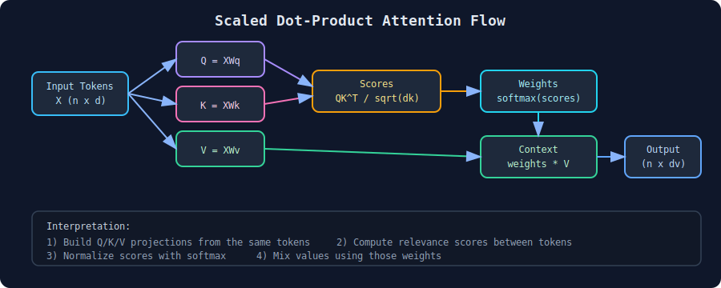
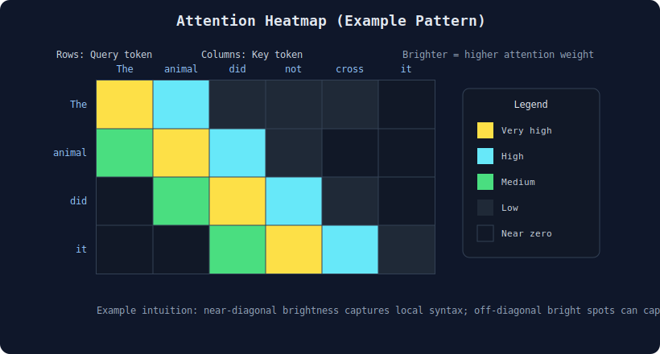

# Attention Intuition

> **Core idea:** Attention lets a model decide which parts of the input matter most for the current prediction, instead of treating all tokens equally.
> **Why it matters:** It gives the model dynamic, context-dependent focus, which is the key reason Transformers work so well on language, vision, and multimodal tasks.
> **Mental model:** For each token, ask: *"Who should I listen to right now?"* and then take a weighted average of the most relevant tokens.

---

## 1. Why We Need Attention

In sequence modeling, not every word is equally useful at every step.

Example sentence:

`The animal did not cross the street because it was too tired.`

To understand what `it` refers to, the model should focus on `animal`, not `street`.

A fixed-size summary vector (older encoder-decoder style) compresses the whole sentence into one bottleneck representation. Attention removes this bottleneck by allowing direct access to all tokens and weighting them by relevance.

---

## 2. Attention as Weighted Retrieval

Attention is easiest to understand as a retrieval operation over memory.

- Memory entries: token representations.
- Query: what the current token is looking for.
- Score: how relevant each memory entry is to the query.
- Output: weighted sum of memory values.

If scores are high for a few tokens, output focuses on those tokens. If scores are spread out, output mixes broader context.

Mathematically:

$$
\text{Output} = \sum_i \alpha_i \mathbf{v}_i
$$

where $\alpha_i \in [0,1]$ and $\sum_i \alpha_i = 1$.

So attention is not selecting one token. It is a soft, differentiable lookup.

---

## 3. Query, Key, Value Intuition

Each token is projected into three vectors:

- **Query (Q):** what this token wants.
- **Key (K):** what this token offers.
- **Value (V):** the actual information this token contributes.

For token $t$, attention score to token $i$ is based on similarity between $\mathbf{q}_t$ and $\mathbf{k}_i$.

High similarity means token $i$ is relevant to token $t$.

Then token $t$ collects information from all value vectors $\mathbf{v}_i$, weighted by those similarities.

---

## 4. Scaled Dot-Product Attention

For matrices $Q, K, V$:

$$
	ext{Attention}(Q,K,V) = \text{softmax}\!\left(\frac{QK^\top}{\sqrt{d_k}}\right)V
$$

### Why dot product?

It is a fast similarity function between query and key.

### Why divide by $\sqrt{d_k}$?

When dimension $d_k$ is large, dot products can become large in magnitude, making softmax overly peaky and gradients unstable. Scaling keeps logits in a healthier range.

### Why softmax?

Softmax turns similarity scores into a probability-like weight distribution:

- non-negative,
- sums to 1,
- differentiable for gradient learning.

---

## 5. Tiny Numerical Example

Suppose one query compares against three keys and produces raw scores:

$$
s = [2.0,\ 1.0,\ 0.1]
$$

Softmax gives attention weights approximately:

$$
\alpha = [0.659,\ 0.242,\ 0.099]
$$

Interpretation:

- token 1 gets most focus,
- token 2 contributes moderately,
- token 3 contributes a little.

If corresponding values are $\mathbf{v}_1, \mathbf{v}_2, \mathbf{v}_3$, then:

$$
\text{Output} = 0.659\mathbf{v}_1 + 0.242\mathbf{v}_2 + 0.099\mathbf{v}_3
$$

This is the core computation repeated for every token.

---

## 6. Visualizing Attention Patterns

### 6.1 Q-K-V Computation Pipeline

This diagram shows the end-to-end data path: project input tokens into $Q, K, V$, compute pairwise relevance with $QK^\top / \sqrt{d_k}$, normalize with softmax, and mix values to produce context-aware outputs.

### 6.2 Attention Heatmap

Read each row as "for this query token, where does attention go?" Bright near-diagonal cells often indicate local syntax, while bright off-diagonal cells can indicate long-range dependency (for example entity reference).

---

## 7. What Attention Buys You

1. **Dynamic context selection**
At each layer and token, focus changes based on current need.

2. **Long-range dependency modeling**
Any token can directly attend to any other token in one hop.

3. **Parallel computation**
Unlike RNN recurrence, all token-token interactions can be computed in matrix form.

4. **Interpretability signals**
Attention maps can reveal where the model is focusing (with caveats).

---

## 8. Limitations and Practical Notes

- **Quadratic cost:** full attention is $O(n^2)$ in sequence length due to all pairwise interactions.
- **Not perfect explanation:** high attention weights do not always equal causal importance.
- **Position awareness needed:** self-attention alone is permutation-invariant; positional encoding is required.

These limitations motivated efficient variants (sparse attention, linear attention, chunking, retrieval augmentation).

---

## 9. One-Sentence Summary

Attention is a learned, differentiable lookup mechanism where each token asks all other tokens "how relevant are you to me?" and then builds its representation as a weighted mixture of the most relevant information.

---

## 10. References

- Bahdanau, D., Cho, K., & Bengio, Y. (2015). *Neural Machine Translation by Jointly Learning to Align and Translate*.
- Vaswani, A., et al. (2017). *Attention Is All You Need*.
- Illustrated Transformer resources and standard deep learning lecture notes for intuition.
