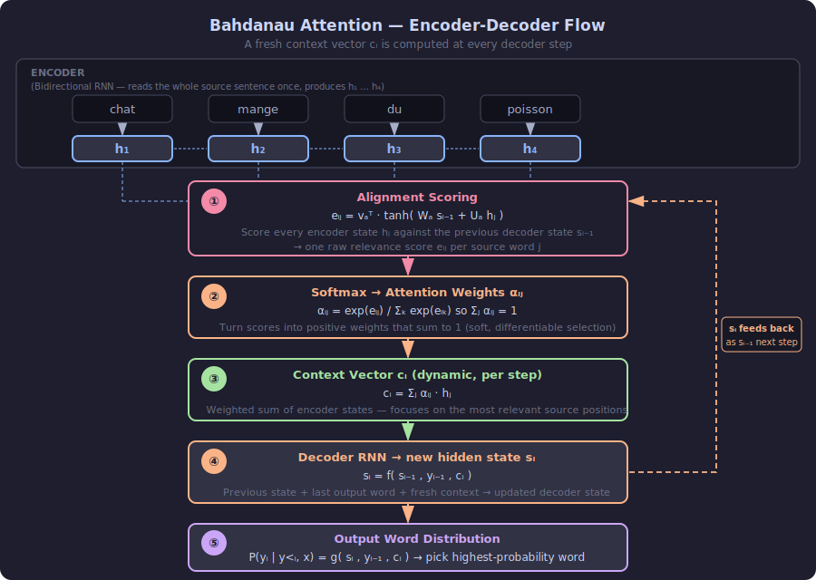
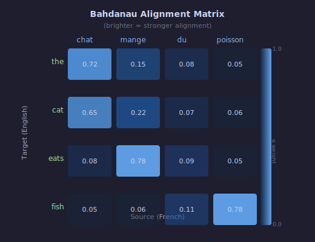

# Bahdanau Attention

> **Core idea:** Instead of compressing an entire source sentence into one fixed vector, let the decoder look back at all encoder hidden states at every decoding step and pick the most relevant ones.
> **Why it matters:** It was the first practical attention mechanism for sequence-to-sequence models, breaking the fixed-size bottleneck and substantially improving neural machine translation quality.
> **Mental model:** At each decoding step, the decoder asks *"which source words matter most right now?"* and builds a fresh context vector as a weighted sum of encoder states.

---

## 1. Background: The Bottleneck Problem

Classic encoder-decoder RNNs compress the entire input sequence into one fixed-size vector $\mathbf{c}$, then the decoder generates from that single vector.

Problems:

- Long sentences lose information — later tokens overwrite earlier ones in the hidden state.
- All decoding steps share the same compressed context, even when different output words need different parts of the input.
- Performance degrades sharply beyond ~20 tokens.

Bahdanau et al. (2015) proposed a solution: let the decoder dynamically select a different context at every time step.

---

## 2. Core Idea

Instead of one fixed context vector, compute a **step-specific context vector** $\mathbf{c}_i$ for each decoder step $i$.

At each step, the decoder scores every encoder hidden state $\mathbf{h}_j$ for relevance to the current decoder state $\mathbf{s}_{i-1}$, converts scores to weights, and takes a weighted sum.

$$
\mathbf{c}_i = \sum_{j=1}^{T_x} \alpha_{ij}\, \mathbf{h}_j
$$

where $\alpha_{ij}$ is the attention weight for encoder position $j$ at decoder step $i$.

---

## 3. The Alignment Model (Scoring Function)

The alignment score $e_{ij}$ measures how well source position $j$ matches decoder step $i$.

Bahdanau uses an **additive (concat) scoring function**:

$$
e_{ij} = \mathbf{v}_a^\top \tanh\!\bigl(W_a\,\mathbf{s}_{i-1} + U_a\,\mathbf{h}_j\bigr)
$$

where:

| Symbol | Shape | Role |
|---|---|---|
| $\mathbf{s}_{i-1}$ | $d_s$ | previous decoder hidden state |
| $\mathbf{h}_j$ | $d_h$ | encoder hidden state at position $j$ |
| $W_a$ | $d_a \times d_s$ | learned weight for decoder state |
| $U_a$ | $d_a \times d_h$ | learned weight for encoder state |
| $\mathbf{v}_a$ | $d_a$ | learned projection to scalar |

The $\tanh$ non-linearity lets the model learn complex interactions between source and target. All three matrices are jointly trained with the rest of the network.

### Attention weights

Scores are normalized with softmax over all source positions:

$$
\alpha_{ij} = \frac{\exp(e_{ij})}{\displaystyle\sum_{k=1}^{T_x} \exp(e_{ik})}
$$

So $\alpha_{ij} \in (0,1)$ and $\sum_j \alpha_{ij} = 1$ for each decoder step $i$.

---

## 4. Computing the Context Vector

Once weights are known, the context vector is a weighted mixture of encoder states:

$$
\mathbf{c}_i = \sum_{j=1}^{T_x} \alpha_{ij}\, \mathbf{h}_j
$$

High $\alpha_{ij}$ means position $j$ contributes heavily to the output at step $i$.

This is a **soft alignment**: every encoder position contributes a little, rather than hard-selecting exactly one source word.

---

## 5. Full Encoder-Decoder with Bahdanau Attention

### Encoder

A bidirectional RNN reads the source sequence and produces hidden states at every position:

$$
\mathbf{h}_j = \bigl[\overrightarrow{\mathbf{h}}_j\,;\,\overleftarrow{\mathbf{h}}_j\bigr]
$$

Concatenating both directions gives each position context from the full sentence, not just the left.

### Decoder (one step)

At decoding step $i$:

1. **Score** every encoder state against the previous decoder state $\mathbf{s}_{i-1}$:

$$
e_{ij} = \mathbf{v}_a^\top \tanh(W_a\,\mathbf{s}_{i-1} + U_a\,\mathbf{h}_j)
$$

2. **Normalize** to get attention weights $\alpha_{ij}$.

3. **Aggregate** encoder states into context vector $\mathbf{c}_i$.

4. **Update** the decoder state:

$$
\mathbf{s}_i = f\!\left(\mathbf{s}_{i-1},\, y_{i-1},\, \mathbf{c}_i\right)
$$

5. **Output** a distribution over the target vocabulary:

$$
P(y_i \mid y_{<i}, \mathbf{x}) = g\!\left(\mathbf{s}_i,\, y_{i-1},\, \mathbf{c}_i\right)
$$

This repeats for every target token.

---

## 6. Worked Example

**Setting:** Translate a 4-word source into English. Suppose the decoder is generating the second output word.

**Source:** `[chat, mange, du, poisson]` → encoder produces $\mathbf{h}_1, \mathbf{h}_2, \mathbf{h}_3, \mathbf{h}_4$.

**Decoder state before this step:** $\mathbf{s}_1$ (after generating "cat").

**Step 1 — raw alignment scores** (computed by the alignment model):

$$
e_{2,1} = 0.9,\quad e_{2,2} = 2.3,\quad e_{2,3} = 0.4,\quad e_{2,4} = -0.5
$$

**Step 2 — softmax normalization:**

$$
\alpha_{2,j} = \text{softmax}([0.9,\ 2.3,\ 0.4,\ -0.5])
$$

$$
\approx [0.18,\ 0.73,\ 0.11,\ 0.04]
$$

Interpretation: the decoder is mostly focused on `mange` (source word 2) when generating the English word "eats".

**Step 3 — context vector:**

$$
\mathbf{c}_2 = 0.18\,\mathbf{h}_1 + 0.73\,\mathbf{h}_2 + 0.11\,\mathbf{h}_3 + 0.04\,\mathbf{h}_4
$$

The decoder state is updated using $\mathbf{c}_2$, and the model predicts "eats" with high probability.

**Alignment matrix visualization** — across all decoder steps:

The diagonal pattern reflects monotonic alignment in translation, but the model can learn any non-monotonic pattern (reordering) when necessary.

---

## 7. What Bahdanau Attention Solves

| Problem | Fixed encoder-decoder | Bahdanau attention |
|---|---|---|
| Long-sentence degradation | Severe | Much reduced |
| All steps share same context | Yes | No — $\mathbf{c}_i$ changes every step |
| Interpretability | None | Alignment matrix is inspectable |
| Arbitrary reordering | Hard | Handled naturally |

---

## 8. Limitations

- **Sequential decoder:** each step depends on the previous, so decoding cannot be parallelized.
- **Quadratic cost:** $O(T_x \cdot T_y)$ alignment scores must be computed.
- **Additive scoring:** slower than dot-product scoring at large scale (Luong attention uses dot products for efficiency).
- **RNN backbone:** Bahdanau attention predates Transformers; the underlying recurrence is still a bottleneck for very long sequences.

---

## 9. One-Sentence Summary

Bahdanau attention allows the decoder to compute a fresh, weighted mixture of all encoder hidden states at every generation step, replacing the fixed-context bottleneck with a learned, dynamic alignment between source and target.

---

## 10. References

- Bahdanau, D., Cho, K., & Bengio, Y. (2015). *Neural Machine Translation by Jointly Learning to Align and Translate*. ICLR 2015.
- Cho, K., et al. (2014). *Learning Phrase Representations using RNN Encoder-Decoder for Statistical Machine Translation*.
- Luong, M., Pham, H., & Manning, C. D. (2015). *Effective Approaches to Attention-based Neural Machine Translation*.
