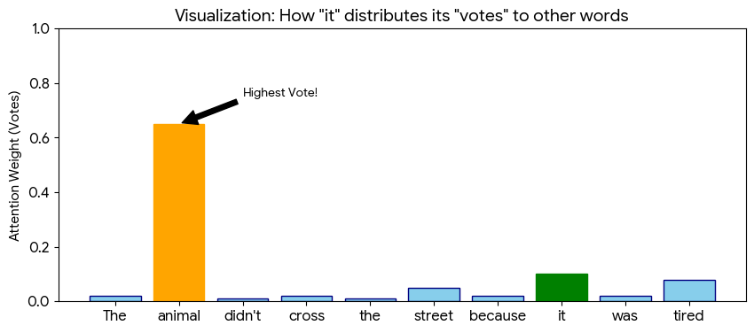

# Self-Attention

> **Core idea:** In self-attention, every token builds a new representation by looking at other tokens in the same sequence and weighting them by relevance.
> **Why it matters:** It lets the model capture both nearby and long-range relationships without recurrence, which is a core reason Transformers scale well.
> **Mental model:** Each token asks, *"Which other tokens in this sequence should influence me right now?"*

---

## 1. What Self-Attention Means

Self-attention is an attention mechanism where the query, key, and value all come from the same input sequence.

If the input sequence is:

`The cat sat on the mat`

then when computing the representation for `sat`, the model can look at `The`, `cat`, `on`, `the`, and `mat`, and decide how much each token should contribute.

This is called *self*-attention because the sequence attends to itself.

---

## 2. Why We Need Self-Attention

Language and many other sequential signals contain dependencies that are not purely local.

Example:

`The book on the table near the window was old.`

To understand the word `was`, the model should connect it to `book`, even though several words appear in between.

Traditional RNN-based models can, in principle, learn such dependencies, but information must pass through many sequential steps. Self-attention creates a direct path between any pair of tokens in one layer.

This gives three major advantages:

1. It models long-range interactions more easily.
2. It allows parallel computation across all tokens.
3. It adapts dynamically depending on the current token and context.

---

## 3. Query, Key, and Value Inside One Sequence

Suppose the input embeddings are stacked into a matrix $X \in \mathbb{R}^{n \times d}$, where:

- $n$ is sequence length,
- $d$ is embedding dimension.

Self-attention first produces three learned projections:

$$
Q = XW_Q, \qquad K = XW_K, \qquad V = XW_V
$$

where:

- $Q$ contains queries,
- $K$ contains keys,
- $V$ contains values.

Even though all three come from the same input $X$, they serve different roles:

- **Query:** what this token is looking for.
- **Key:** what this token makes available to others.
- **Value:** the information this token contributes if selected.

---

## 4. Core Computation

For a single token $i$, we compare its query $q_i$ with every key $k_j$ in the sequence.

The raw compatibility score is often a dot product:

$$
s_{ij} = q_i \cdot k_j
$$

For all tokens together, this becomes:

$$
S = QK^\top
$$

Then we scale and normalize:

$$
A = \text{softmax}\!\left(\frac{QK^\top}{\sqrt{d_k}}\right)
$$

Finally, we mix values using these attention weights:

$$
\text{SelfAttention}(X) = AV
$$

or equivalently:

$$
\text{SelfAttention}(Q,K,V) = \text{softmax}\!\left(\frac{QK^\top}{\sqrt{d_k}}\right)V
$$

Each row of $A$ tells us how one token distributes its attention over all tokens in the sequence.

---

## 5. Intuition Behind the Attention Matrix

If the input has $n$ tokens, then the attention matrix has shape $n \times n$.

- Row $i$: where token $i$ looks.
- Column $j$: how much other tokens look at token $j$.
- Entry $A_{ij}$: how strongly token $i$ attends to token $j$.

This makes self-attention a content-based interaction map over the whole sequence.

For example, in:

`The animal did not cross the street because it was tired.`

the token `it` may assign large weight to `animal`, because that token best matches the information needed to resolve the reference.

---

## 6. Why the Scaling Factor Appears

The factor $\sqrt{d_k}$ prevents dot products from growing too large when key and query dimensions increase.

Without scaling, the logits entering softmax can become very large in magnitude. That makes softmax distributions overly sharp and gradients less stable.

So the scaled form:

$$
\frac{QK^\top}{\sqrt{d_k}}
$$

is mainly a numerical stability trick that improves optimization.

---

## 7. Tiny Numerical Example

Assume one token compares itself against three tokens and gets raw scores:

$$
[2.2,\ 0.8,\ 0.0]
$$

After softmax, the weights are approximately:

$$
[0.723,\ 0.177,\ 0.100]
$$

This means:

- the first token contributes most,
- the second contributes a little,
- the third contributes least.

If the value vectors are $v_1, v_2, v_3$, then the new representation is:

$$
0.723v_1 + 0.177v_2 + 0.100v_3
$$

So the output token is a learned weighted mixture of the whole sequence.

---

## 8. Self-Attention vs Cross-Attention

The key difference is where $Q$, $K$, and $V$ come from.

### Self-attention

- $Q$, $K$, and $V$ all come from the same sequence.
- Used to model internal relationships inside one sequence.

### Cross-attention

- Queries come from one sequence.
- Keys and values come from another sequence.
- Used when one representation needs to retrieve information from a different source.

In Transformers, encoder layers commonly use self-attention, and encoder-decoder models use cross-attention so the decoder can attend to encoder outputs.

---

## 9. Bidirectional vs Causal Self-Attention

Self-attention can be used in two common ways.

### Bidirectional self-attention

Each token can attend to tokens on both the left and the right.

This is useful when the full sequence is visible, such as in encoders like BERT.

### Causal self-attention

Each token can only attend to itself and earlier tokens.

This is required for autoregressive language modeling, where token $t$ must not see future tokens $t+1, t+2, \dots$ during prediction.

This restriction is implemented using a mask over the attention scores.

---

## 10. Attention Masking

Before softmax, we can modify the score matrix to block illegal positions.

For causal masking:

- positions in the future are assigned $-\infty$,
- softmax then turns those entries into zero probability.

Conceptually:

$$
A = \text{softmax}\!\left(\frac{QK^\top + M}{\sqrt{d_k}}\right)
$$

where $M$ is the mask matrix.

Masks are also used for:

- padding tokens,
- task-specific constraints,
- structured attention patterns.

---

## 11. Multi-Head Self-Attention

A single attention map may focus on only one kind of relationship. Multi-head self-attention solves this by running several self-attention operations in parallel with different learned projections.

For head $h$:

$$
\text{head}_h = \text{Attention}(XW_Q^{(h)}, XW_K^{(h)}, XW_V^{(h)})
$$

Then the heads are concatenated and projected again:

$$
\text{MultiHead}(X) = \text{Concat}(\text{head}_1, \dots, \text{head}_H)W_O
$$

Different heads can capture different patterns, such as:

- local syntax,
- subject-verb agreement,
- coreference,
- positional or structural relations.

---

## 12. What Self-Attention Buys Us

1. **Global receptive field in one layer**  
Any token can directly incorporate information from any other token.

2. **Dynamic context selection**  
The relevant context changes depending on the token and sentence.

3. **Parallelization**  
All pairwise token interactions can be computed as matrix operations on modern hardware.

4. **Flexible representation learning**  
A token representation is no longer fixed after embedding; it becomes context-aware.

---

## 13. Limitations

Self-attention is powerful, but not free.

### Quadratic cost

For sequence length $n$, the attention matrix is $n \times n$, so compute and memory cost are typically $O(n^2)$.

### No built-in order awareness

Self-attention by itself is permutation-invariant. Without positional encoding, the model would not know whether a token came first or last.

### Attention is not perfect explanation

Attention maps can be informative, but high attention weight does not automatically mean true causal importance.

These issues motivated efficient attention variants and better positional encoding methods.

---

## 14. Self-Attention in the Transformer Block

Inside a Transformer block, self-attention is usually followed by:

1. residual connection,
2. layer normalization,
3. feed-forward network,
4. another residual and normalization step.

So self-attention is not the whole model. It is the mechanism that mixes information across tokens before additional nonlinear transformation.

---

## 15. One-Sentence Summary

Self-attention lets each token look across the entire sequence, score which tokens matter most, and update itself as a weighted combination of the most relevant contextual information.

---

## 16. Q&A From Your Thread

### Q1. What changed from cross-attention to self-attention?

**A:** In cross-attention, one sequence queries another sequence (for example, decoder queries encoder outputs). In self-attention, one sequence queries itself, so each token can directly gather information from all other tokens in the same sequence.

### Q2. Why is self-attention called an all-pairs interaction mechanism?

**A:** For a sequence of length $n$, each token compares itself with all $n$ tokens (including itself), producing $n^2$ pairwise interactions. This gives direct token-to-token connectivity in one layer.

### Q3. What does the section "Why Self-Attention Works for Representation Learning" mean?

**A:** In the section "Why Self-Attention Works for Representation Learning," the author primarily explains why self-attention is a game-changer for improving model comprehension.

Simply put, the core argument of this section is that self-attention allows words to move beyond rigid, fixed meanings, achieving true contextualization.

The following is a breakdown of this section:

##### 1. From "Static" to "Dynamic": Contextualized Embeddings

* Previous Approaches (Static): Older models like Word2Vec or GloVe assigned a fixed vector to each word. Whether "bank" refers to a "bank" or a "riverbank," its vector was the same.

* Self-Attention Approach (Contextualization): Each word, during processing, "inquires" about information from all surrounding words. The resulting vector is no longer isolated but a "hybrid" incorporating information from surrounding words.

##### 2. What Specific Language Challenges Does It Solve?

The authors list four key capabilities that self-attention provides to the model:

* **Word Sense Disambiguation:** For example, in "river bank," "bank" assigns a high weight to "river," shifting its vector towards a "natural/geographical" direction; while in "bank account," it shifts towards a "financial" direction due to the influence of "account."

* **Coreference Resolution:** It can identify which preceding noun "it" in a sentence refers to (e.g., "animal" or "street").

* **Syntactic Awareness:** Even when the verb and subject are far apart, self-attention can skip intermediate modifiers and directly associate them.

* **Semantic Composition:** It understands the new meaning created by combining words. For example, in "not happy," "not" strongly influences the expression of "happy," helping the model understand that it means "unhappy."

##### 3. A Vivid Metaphor: Every Word "Votes"

The author compares this process to a vote:

* When understanding a word, all other words in the sentence vote based on their relevance.

* Example: Processing the sentence "The animal didn't cross the street because it was too tired."

* To understand "it," the model finds that "tired" fits "animal" better than "street."

* Therefore, "animal" receives a higher vote weight, helping the model determine that "it" refers to the animal.

##### Summary

The main point of this section is to illustrate that self-attention is essentially a "dynamic, input-dependent aggregation method." It allows the model to move beyond simply memorizing words and instead learn to accurately capture the true meaning of each word in a specific context based on the surrounding environment while reading.

Would you like to delve deeper into how QKV (query, key, value) mentioned later in the article mathematically implements this "voting"?

### Q4. What is the three-stage computational pattern?

**A:**

1. Compute similarity scores (dot products).
2. Apply softmax to convert scores into attention weights.
3. Compute weighted sums of value vectors.

In matrix form:

$$
\operatorname{Attention}(Q,K,V)=\operatorname{softmax}\!\left(\frac{QK^\top}{\sqrt{d_k}}\right)V
$$

### Q5. Why does self-attention help with long-range dependencies better than RNNs?

**A:** RNN information flow from position $i$ to $j$ requires about $|i-j|$ recurrent steps. In self-attention, the path length is 1 because positions connect directly. Shorter paths usually improve both information flow and gradient flow.

### Q6. Why is self-attention faster in practice even with $O(n^2)$ interactions?

**A:** Although pairwise interactions are quadratic, they are highly parallelizable as matrix multiplications on GPUs/TPUs. RNNs are $O(n)$ per sequence but inherently sequential, which limits hardware utilization.

### Q7. Why do we still need positional encoding?

**A:** Pure self-attention is permutation-equivariant. Without added position signals, it cannot distinguish order-sensitive cases, so positional encoding (sinusoidal, learned, RoPE, etc.) is required.

### Q8. What role does self-attention play inside a Transformer block?

**A:** Self-attention mixes information across token positions. Feed-forward layers then transform each position nonlinearly. Residual connections and layer normalization stabilize optimization and preserve gradient flow.

### Q9. Are attention maps always reliable explanations?

**A:** They provide useful interpretability signals, but high attention weight is not a strict proof of causal importance. Attention should be treated as evidence, not definitive explanation.

### Q10. What are the main limitations discussed in that thread?

**A:**

1. Quadratic compute and memory with sequence length.
2. Need for explicit positional information.
3. Streaming/very long-context efficiency challenges.

These limitations motivate efficient attention methods (for example, sparse or memory-efficient variants).

### Q11. Q: To delve deeper into how the QKV (query, key, value) model, mentioned later in the article, specifically implements this "voting" through mathematical means, please see below.

**A:**
To understand how QKV (query, key, value) achieves "voting" mathematically, we can break down this process into four key steps.

In the Transformer model, each token is transformed into three different vectors, each playing a different role: [1, 2]

* Query (Q) - "Questioner": Describes "What kind of information am I looking for?"

* Key (K) - "Tag": Describes "What kind of information can I provide?"

* Value (V) - "Content": Describes "What semantic information do I actually contain?" [3]

The following is the mathematical "voting" process:

##### 1. Calculate similarity (dot product): Who is related to me?

When the model processes word A, it uses A's Query ($q_A$) to perform a dot product with the Key ($k_i$) of all words in the sentence (including itself). $$\text{Score}_{i} = q_A \cdot k_i$$

* Mathematical meaning: The dot product measures how well two vectors are "aligned" in space. If the query is looking for the "subject," and a word's key happens to claim to be the "subject," then their dot product score will be high. [4, 5]

##### 2. Scaling and Normalization (Softmax): Calculating "Votes"

To prevent the dot product values ​​from becoming too large and causing gradient explosion, the model first scales (divide by $\sqrt{d_k}$), and then uses the Softmax function to convert these scores into a probability distribution.

$$\text{Weight}_{i} = \text{softmax}\left(\frac{q_A \cdot k_i}{\sqrt{d_k}}\right)$$

* Mathematical meaning: This is the real "voting weight." Softmax ensures that all weights add up to 1 (100%). The higher the score of a word, the greater the proportion of "votes" it receives. [6, 7]

##### 3. Weighted Summation: Extracting Information Based on Votes

Finally, the model multiplies these calculated weights by the corresponding Value ($v_i$) and sums them all together.

$$\text{Output}_A = \sum_{i} \text{Weight}_i \cdot v_i$$

* Mathematical Meaning: The final generated vector is no longer the initial vector of word A, but a weighted average. If the voting weight of "it" for "animal" is 0.8 and for "street" it is 0.1, then 80% of the content in the output vector will come from the semantics of "animal". [8, 9]

##### Summary Formula

The well-known Transformer attention formula concisely summarizes this process:

$$\text{Attention}(Q, K, V) = \text{softmax}\left(\frac{QK^T}{\sqrt{d_k}}\right)V$$

Through this mathematical mechanism, the model can achieve "contextualization": each word searches for relevant information based on the query, matches the key through dot product, and finally extracts and synthesizes the meaning that best fits the current context through the V vector. [1, 10, 11]

Would you like to see how these matrix multiplications work in Python through specific code examples?

[1] [https://mbrenndoerfer.com](https://mbrenndoerfer.com/writing/query-key-value-attention-mechanism)
[2] [https://mbrenndoerfer.com](https://mbrenndoerfer.com/writing/query-key-value-attention-mechanism)
[3] [https://medium.com](https://medium.com/@wasowski.jarek/s01e04-three-matrix-multiplications-that-gave-machines-context-self-attention-b7266afbe730)
[4] [https://www.codecademy.com](https://www.codecademy.com/article/transformer-architecture-self-attention-mechanism)
[5] [https://kunrenzhilu.medium.com](https://kunrenzhilu.medium.com/transformer-bd83274566c0)
[6] [https://uvadlc-notebooks.readthedocs.io](https://uvadlc-notebooks.readthedocs.io/en/latest/tutorial_notebooks/tutorial6/Transformers_and_MHAttention.html)
[7] [https://dev.to](https://dev.to/lewis_won/creating-the-self-attention-mechanism-from-scratch-3769)
[8] [https://medium.com](https://medium.com/analytics-vidhya/understanding-q-k-v-in-transformer-self-attention-9a5eddaa5960)
[9] [https://medium.com](https://medium.com/@prabhatsingh_59053/list-of-open-source-llms-8d22b34475cc)
[10] [https://www.codecademy.com](https://www.codecademy.com/article/transformer-architecture-self-attention-mechanism)
[11] [https://medium.com](https://medium.com/@24y.harsha/self-attention-in-transformers-part-1-1cef1fa9cfa2)

---

## 17. References

- Vaswani, A., et al. (2017). *Attention Is All You Need*.
- Devlin, J., Chang, M.-W., Lee, K., & Toutanova, K. (2019). *BERT: Pre-training of Deep Bidirectional Transformers for Language Understanding*.
- Standard Transformer lecture notes and visual explainers for intuition and implementation details.
