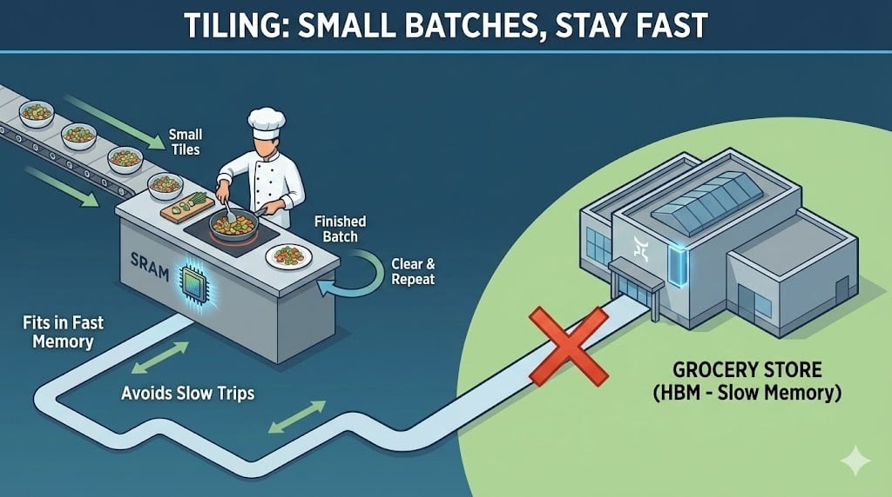
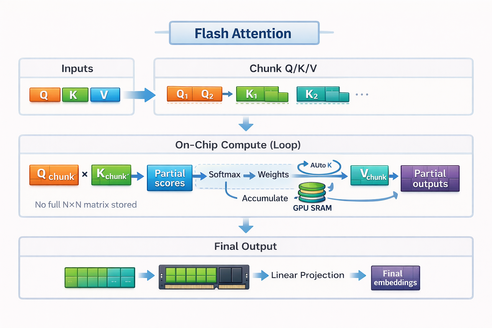
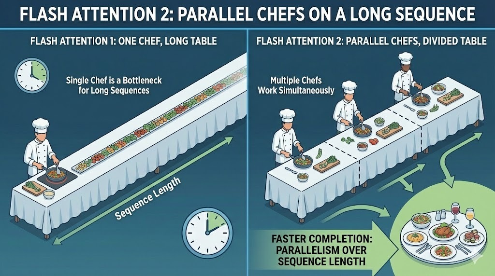
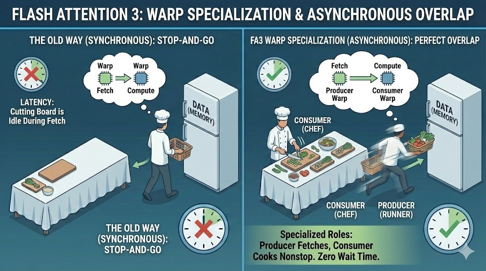
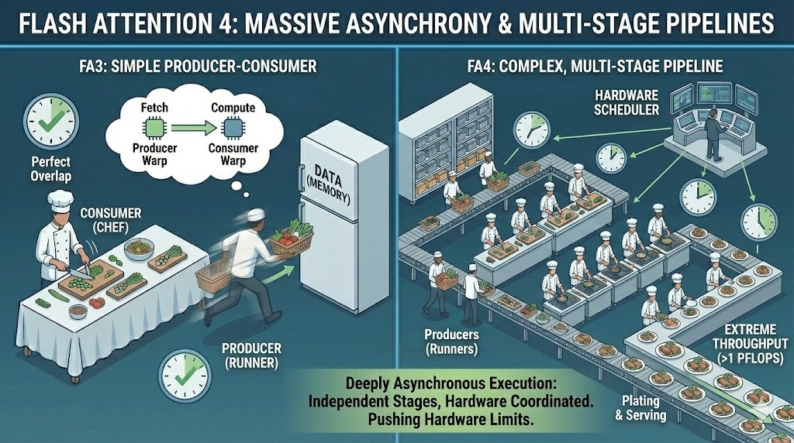

# FlashAttention

Reference page: https://www.datacamp.com/blog/flash-attention

## 1) What Is FlashAttention?

FlashAttention is an IO-aware implementation of scaled dot-product attention that keeps computation in fast on-chip GPU memory (SRAM) as much as possible. The key idea is simple:

- standard attention often writes and reads large intermediate tensors (especially the full attention matrix) from slower HBM,
- FlashAttention computes attention in tiles and avoids materializing the full $n\times n$ matrix in HBM,
- the output is mathematically exact (not a sparse/linear approximation of attention).

This makes attention significantly faster and more memory-efficient in practical transformer training and inference.

## 2) Why Standard Attention Becomes a Bottleneck

For sequence length $n$, head dimension $d_k$, and value dimension $d_v$:

$$
\mathrm{Attention}(Q,K,V)=\mathrm{softmax}\left(\frac{QK^T}{\sqrt{d_k}}\right)V
$$

The expensive part is the all-pairs interaction in $QK^T$:

$$
QK^T\in\mathbb{R}^{n\times n}
$$

Standard implementations typically materialize this $n\times n$ score matrix (or equivalent intermediates) in global memory, producing high memory traffic and quadratic memory pressure with sequence length.

## 3) Core FlashAttention Ideas

### 3.1 Tiling (Blockwise Computation)

Split $Q, K, V$ into blocks that fit SRAM. For each query block, iterate over key/value blocks and accumulate the result incrementally.

Benefits:

- much less HBM traffic,
- better cache locality,
- no need to store full attention matrix.

### 3.2 Online Softmax

Because we process blocks, we cannot compute row softmax in one shot over all keys. FlashAttention uses numerically stable online updates per row:

If previous running stats are $(m_{old}, l_{old})$ and new block scores are $s_{blk}$:

$$
m_{new}=\max\big(m_{old},\max(s_{blk})\big)
$$

$$
l_{new}=e^{m_{old}-m_{new}}l_{old}+\sum_j e^{s_{blk,j}-m_{new}}
$$

Then normalize the accumulated output with $l_{new}$. This reproduces exact softmax while streaming through blocks.

### 3.3 Recomputation in Backward Pass

Instead of storing every large intermediate for backprop, FlashAttention recomputes small pieces when needed. On modern GPUs, extra compute can be cheaper than extra memory movement.

## 4) Complexity and Memory Intuition

Attention arithmetic complexity remains quadratic in sequence length:

$$
\mathrm{FLOPs}_{attn}=O(n^2 d)
$$

FlashAttention mainly optimizes memory movement (IO complexity), which is often the real runtime bottleneck on GPU.

Practical effect:

- standard attention: high HBM reads/writes + large intermediates,
- FlashAttention: blockwise SRAM-centric execution, much lower memory traffic,
- effective memory scaling in implementations behaves much closer to linear in $n$ (for fixed head dims) compared with naive materialization.

## 5) FlashAttention Generations

### FlashAttention v1

- Introduced IO-aware exact attention with tiling and online softmax.
- Major speed/memory gains over standard kernels.

### FlashAttention v2

- Better parallelization (including across sequence dimension),
- Reduced non-matmul overhead,
- Better support for larger head dimensions.

### FlashAttention v3

- Hopper-focused optimizations,
- warp specialization (producer/consumer style),
- stronger overlap of memory transfer and compute,
- native FP8 support on suitable hardware.

### FlashAttention v4 (experimental direction)

- pushes asynchronous execution further,
- targets next-gen hardware and extreme throughput.

## 6) FlashAttention vs Standard Attention

### Speed

FlashAttention often gives large speedups, especially for long sequences where IO dominates.

### Memory

By avoiding full matrix materialization, FlashAttention significantly reduces memory pressure.

### Context Length

Lower memory overhead enables longer contexts on the same hardware budget.

## 7) Implementation Notes (PyTorch / HF)

In modern PyTorch, `scaled_dot_product_attention` can dispatch to an optimized backend automatically. In Hugging Face, many models can enable FlashAttention 2 through an attention implementation option.

Always verify:

- GPU architecture support,
- dtype compatibility (fp16/bf16/fp8 depending on kernel and hardware),
- model/head-dim constraints.

## 8) Math Summary (Quick Sheet)

Standard attention:

$$
S=\frac{QK^T}{\sqrt{d_k}},\quad P=\mathrm{softmax}(S),\quad O=PV
$$

Online softmax update (row-wise concept):

$$
m\leftarrow \max(m,\max(S_{blk})),\qquad
l\leftarrow e^{m_{old}-m}l+\sum_j e^{S_{blk,j}-m}
$$

Accumulated output (conceptual):

$$
o\leftarrow e^{m_{old}-m}o+\sum_j e^{S_{blk,j}-m}V_{blk,j},
\qquad
	ext{final } o=o/l
$$

These equations explain how FlashAttention computes exact softmax attention without storing the full $n\times n$ matrix.

## 9) Practical Takeaways

1. FlashAttention is exact attention with better GPU execution, not an approximation method.
2. It accelerates transformers by reducing expensive memory traffic, not by changing core attention math.
3. It is most beneficial for long sequences and large models where IO is the bottleneck.
4. Newer versions (v2/v3) improve parallelism and hardware utilization further.

## 10) Source Citation

- DataCamp, "Flash Attention Explained: A Comprehensive Guide" (reference page used for this note):
	https://www.datacamp.com/blog/flash-attention