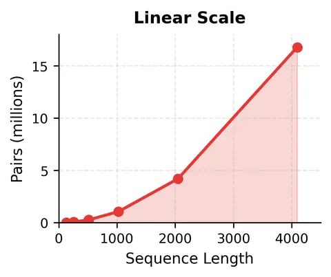
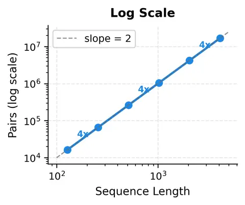
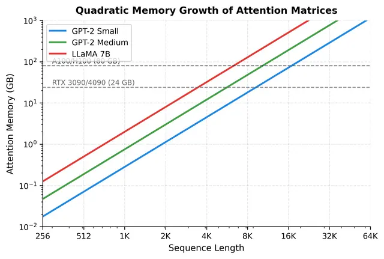
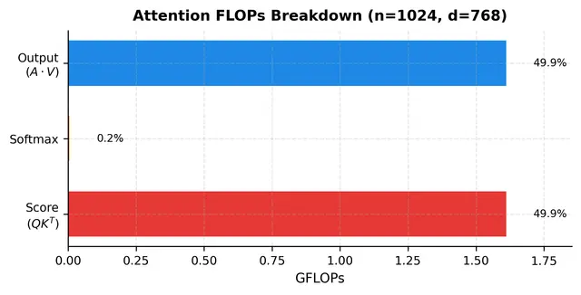
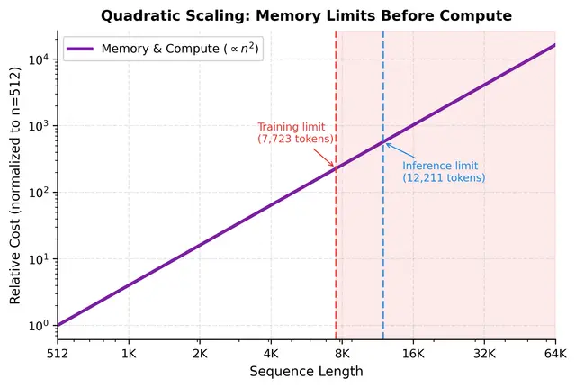
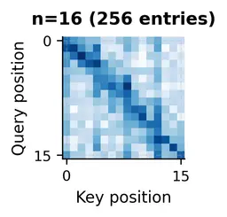
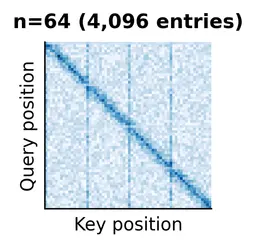
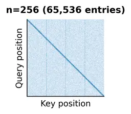
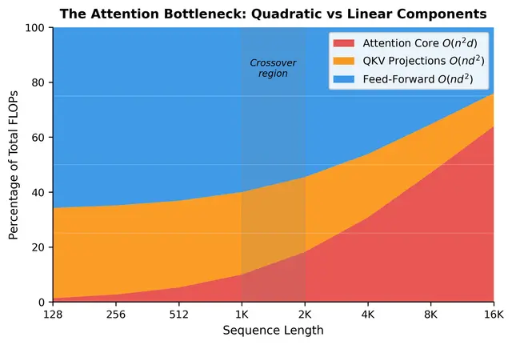
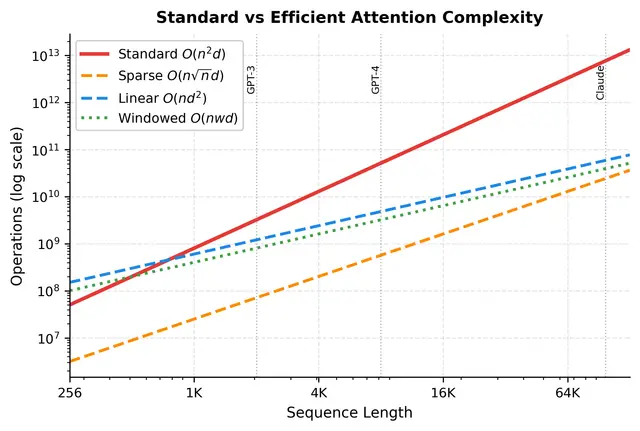

# Quadratic Attention Bottleneck

Reference article: https://mbrenndoerfer.com/writing/quadratic-attention-bottleneck-transformers-long-sequences

## Key Equations (Cheat Sheet)

Scaled dot-product attention:

$$
\mathrm{Attention}(Q,K,V)=\mathrm{softmax}\left(\frac{QK^T}{\sqrt{d_k}}\right)V
$$

All-pairs interaction count:

$$
	ext{pairs}=n^2
$$

Attention-matrix memory across all heads/layers:

$$
M_{attn}=h\cdot n^2\cdot b\cdot L
$$

where $h$ = heads, $n$ = sequence length, $b$ = bytes/element, $L$ = layers.

Approx attention FLOPs per layer:

$$
\mathrm{FLOPs}\approx 2n^2d_k + 5n^2 + 2n^2d_v = O(n^2d)
$$

---

## 1) Why the Bottleneck Exists

Self-attention compares every token with every other token. For sequence length $n$, this creates an $n\times n$ score matrix.

- At 512 tokens: manageable.
- At 8K-32K tokens: score matrix and compute explode.
- The issue is not just speed; memory is often the first hard wall.

Intuition: doubling sequence length roughly quadruples pairwise interactions.

## 2) The All-Pairs Problem in Detail

In attention, each query row must evaluate relevance against all keys. This gives direct long-range connectivity (a major transformer strength), but requires computing all pair scores.

Critical operation:

$$
QK^T\in\mathbb{R}^{n\times n}
$$

Every entry $(i,j)$ is needed to know how token $i$ weights token $j$. This is why exact standard attention is fundamentally quadratic in sequence length.

## 3) Memory Analysis: The Real Wall

Attention matrices are stored per head and per layer (especially important during training/backprop), so memory grows rapidly:

$$
M_{attn}=h\cdot n^2\cdot b\cdot L
$$

Worked interpretation:

- Increasing $n$ by 4x increases matrix memory by 16x.
- Increasing model depth or number of heads increases memory linearly, but sequence length dominates because it is squared.

Practical outcome:

- Long context often fails due to GPU memory before compute throughput is fully used.

## 4) Compute Analysis: Where FLOPs Go

Attention has three main compute stages:

1. Score computation: $QK^T$ (quadratic, expensive)
2. Softmax normalization (quadratic but smaller constant)
3. Weighted sum: $AV$ (quadratic, expensive)

Approximate decomposition:

$$
	ext{Score FLOPs}\approx2n^2d_k,
\quad
	ext{Softmax FLOPs}\approx5n^2,
\quad
	ext{Output FLOPs}\approx2n^2d_v
$$

Key point: matrix multiplications dominate; softmax is usually a small fraction of total FLOPs.

## 5) Why Sequence Length Hurts More Than Width

From $O(n^2d)$:

- doubling $n$ => ~4x compute/memory growth in the quadratic terms.
- doubling $d$ => ~2x growth.

So for long-context workloads, sequence length is typically the first and strongest scaling bottleneck.

## 6) Practical Sequence Length Limits

Training is more constrained than inference:

- training retains more tensors for backward pass,
- inference avoids gradient storage but still hits KV-cache and activation limits at very long contexts.

This is why standard attention alone is often insufficient for 100K+ context workflows in production.

## 7) Visualizing Attention Matrices

As $n$ increases, attention maps become much larger and more expensive to materialize.

- $n=16$: structure easy to inspect.
- $n=64$: richer patterns, larger matrix area.
- $n=256$: already dense and heavy for repeated use per layer/head.

These visual patterns motivate efficient methods that exploit structure (locality, sparsity, low-rank/kernel tricks, and tiling).

## 8) The Crossover Phenomenon

At short sequences, FFN/projection costs can dominate total layer compute.

As $n$ grows, the quadratic attention core takes over and becomes the dominant expense.

This dynamic explains why long-document/codebase/chat-history models prioritize attention-efficiency optimizations.

## 9) Worked Layer-Level Interpretation

For a concrete layer (for example $n=2048$, $d=1024$, $h=16$), attention-score matrices alone can take a large fraction of working memory.

Output decomposition by stage typically shows:

- QKV projections significant,
- QK^T and AV dominating attention core,
- softmax comparatively small in FLOPs.

The exact balance shifts with $n$, and at larger $n$ the quadratic terms dominate aggressively.

## 10) Motivation for Efficient Attention Families

Three broad directions:

1. Sparse/windowed attention: compute selected interactions only.
2. Linear attention: kernelized reformulations to avoid explicit $n\times n$ materialization.
3. Memory-efficient exact attention (for example tiled kernels): preserve exactness while reducing memory footprint.

No free lunch: each choice trades off exactness, implementation complexity, hardware fit, or quality on specific tasks.

## 11) Limitations of Standard Attention (Nuanced)

- Standard dense attention is exact and often strongest quality baseline at short/medium lengths.
- Its main weakness is scaling behavior, especially memory.
- KV-cache pressure in autoregressive inference is another practical long-context limit.

So the problem is not that standard attention is "wrong"; it is that its asymptotic cost is too high for very long contexts.

## 12) Final Takeaways

1. The quadratic bottleneck comes directly from all-pairs token interaction.
2. Memory usually becomes the first hard constraint in long-context settings.
3. Compute is also quadratic in core attention stages and dominates at long $n$.
4. Long-context transformer engineering is mostly about moving or reducing this bottleneck.
5. Efficient attention methods exist because the $n^2$ wall is a real system limit, not just theory.

