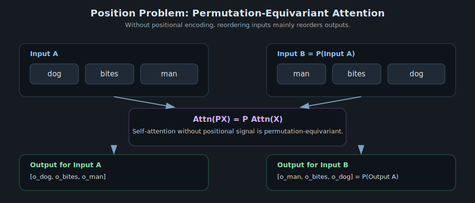

# The Position Problem

> Core question: if attention treats input as a set, how can a model know token order?
> This page is Part 1 of a 3-part sequence:
> 1) Position Problem -> 2) Sinusoidal Position Encoding -> 3) Rotary Position Embedding (RoPE)

---

## 1. Why This Problem Exists

Self-attention computes token-token interaction by similarity, but without any positional signal, it cannot distinguish:

- `dog bites man`
- `man bites dog`

Both contain the same token set. If the architecture is permutation-equivariant, changing token order only permutes outputs, rather than changing meaning in the right way.

---

## 2. Mathematical Setup

Let input tokens be a matrix:

$$
X \in \mathbb{R}^{n \times d}
$$

Single-head self-attention without positional encoding:

$$
Q = XW_Q, \quad K = XW_K, \quad V = XW_V
$$

$$
A = \text{softmax}\!\left(\frac{QK^\top}{\sqrt{d_k}}\right)
$$

$$
\text{Attn}(X) = AV
$$

where softmax is applied row-wise.

---

## 3. Proof: Attention Is Permutation-Equivariant (Without Position)

Let $P \in \mathbb{R}^{n \times n}$ be a permutation matrix (reorders tokens). Consider permuted input:

$$
X' = PX
$$

Then:

$$
Q' = X'W_Q = PXW_Q = PQ
$$

$$
K' = PK, \quad V' = PV
$$

Score matrix:

$$
S' = \frac{Q'K'^\top}{\sqrt{d_k}}
= \frac{(PQ)(PK)^\top}{\sqrt{d_k}}
= \frac{P QK^\top P^\top}{\sqrt{d_k}}
= P S P^\top
$$

For permutation matrices, row-wise softmax satisfies:

$$
\text{softmax}(PSP^\top) = P\,\text{softmax}(S)\,P^\top
$$

So:

$$
A' = PAP^\top
$$

Final output:

$$
\text{Attn}(X') = A'V' = (PAP^\top)(PV) = PAV = P\,\text{Attn}(X)
$$

Therefore, without positional information, self-attention is permutation-equivariant. It cannot infer absolute or relative order by itself.

---

## 4. Practical Consequence

Without positional encoding, the model has no native concept of:

- first vs last token,
- left vs right neighbor,
- local n-gram order,
- long-range relative distance.

That is why all Transformer-like models inject position information.

---

## 5. Progression to Next Articles

This article gives the failure mode.

Next two articles provide solutions:

1. **Sinusoidal Position Encoding**: add a deterministic vector to each token embedding so absolute position is available.
2. **RoPE**: rotate query/key vectors by position-dependent angles so attention scores encode relative position directly.

---

## 6. Visual Intuition

---

## 7. One-Sentence Summary

The position problem is that vanilla self-attention is permutation-equivariant, so sequence order must be injected explicitly through positional encoding.

