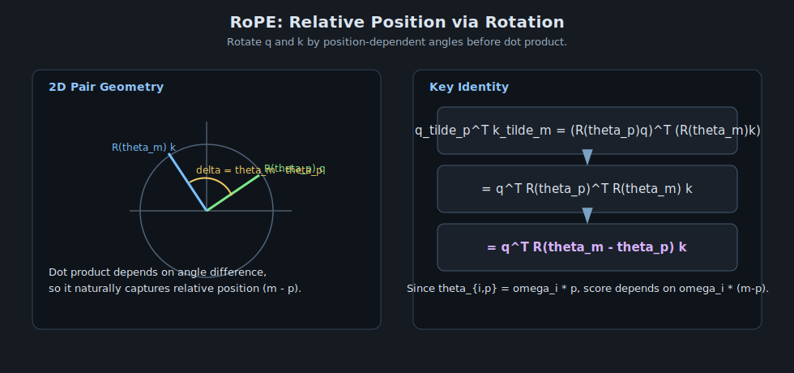

# Rotary Position Embedding (RoPE)

> Part 3 in the sequence: Position Problem -> Sinusoidal Position Encoding -> RoPE.
> Key idea: encode position by rotating query/key vectors, so relative position appears directly inside attention scores.

---

## 1. Motivation from Part 2

Sinusoidal encoding adds $PE(pos)$ to token embeddings:

$$
z_{pos} = x_{pos} + PE(pos)
$$

RoPE instead applies position-dependent rotation to query and key vectors before dot product.

This puts position into the attention geometry itself.

---

## 2. RoPE Definition

Split each head vector into 2D pairs. For one pair with angle $\theta$, define:

$$
R(\theta)=
\begin{bmatrix}
\cos\theta & -\sin\theta \\
\sin\theta & \cos\theta
\end{bmatrix}
$$

For frequency $\omega_i$ and position $p$, angle is $\theta_{i,p}=\omega_i p$.

Then for each pair $i$:

$$
\widetilde{q}_{p,i} = R(\theta_{i,p}) q_{p,i},
\qquad
\widetilde{k}_{m,i} = R(\theta_{i,m}) k_{m,i}
$$

Concatenate all rotated pairs to form $\widetilde{q}_p, \widetilde{k}_m$.

Attention score uses rotated vectors:

$$
s_{p,m} = \widetilde{q}_p^\top \widetilde{k}_m
$$

---

## 3. Core Proof: Relative Position Emerges Naturally

For one 2D pair:

$$
\widetilde{q}_p^\top \widetilde{k}_m=
\left(R(\theta_p)q\right)^\top\left(R(\theta_m)k\right)
$$

$$
= q^\top R(\theta_p)^\top R(\theta_m)k
$$

Since $R(\theta)^\top = R(-\theta)$ and rotations compose additively:

$$
R(\theta_p)^\top R(\theta_m) = R(-\theta_p)R(\theta_m) = R(\theta_m-\theta_p)
$$

Therefore:

$$
\widetilde{q}_p^\top \widetilde{k}_m = q^\top R(\theta_m-\theta_p)k
$$

Because $\theta_{i,p}=\omega_i p$, we get dependence on $(m-p)$ for each frequency:

$$
\omega_i m - \omega_i p = \omega_i(m-p)
$$

So RoPE makes score contributions explicitly relative-position aware.

---

## 4. Why This Helps in Practice

- Relative distance is encoded directly in $QK^\top$.
- Works well with long contexts in many LLMs.
- No learned absolute position table is required.
- Compatible with multi-head attention and common Transformer implementations.

---

## 5. Minimal Attention Pipeline with RoPE

1. Compute $Q,K,V$ from token states.
2. Apply RoPE to $Q,K$ only (not $V$).
3. Compute attention weights with rotated $Q,K$:

$$
A = \text{softmax}\!\left(\frac{\tilde{Q}\tilde{K}^\top}{\sqrt{d_k}}\right)
$$

4. Output:

$$
\text{Attn} = AV
$$

---

## 6. Relation to Previous Two Articles

Progression recap:

1. **Position Problem**: no positional signal => permutation-equivariant attention.
2. **Sinusoidal**: inject absolute position additively into embeddings.
3. **RoPE**: inject position multiplicatively via rotation in query/key space so relative offsets affect similarity directly.

---

## 7. Visual Intuition

---

## 8. One-Sentence Summary

RoPE encodes position by rotating query/key vector pairs, yielding attention scores that naturally depend on relative token distance.

