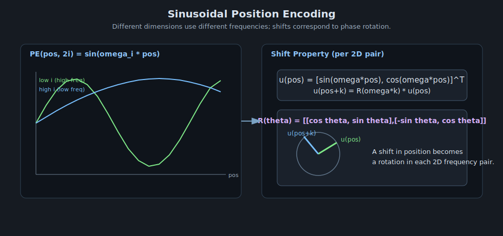

# Sinusoidal Position Encoding

> Part 2 in the sequence: Position Problem -> Sinusoidal Position Encoding -> RoPE.
> Goal: inject position information without adding learned position parameters.

---

## 1. From Problem to First Solution

From Part 1, we know attention without position is permutation-equivariant.

A direct fix is to add a position vector to each token embedding:

$$
z_{pos} = x_{pos} + PE(pos)
$$

Sinusoidal encoding defines $PE(pos)$ using fixed sine/cosine frequencies.

---

## 2. Formula

For model dimension $d_{model}$ and index $i = 0,1,\dots,\frac{d_{model}}{2}-1$:

$$
PE(pos, 2i) = \sin\!\left(\frac{pos}{10000^{2i/d_{model}}}\right)
$$

$$
PE(pos, 2i+1) = \cos\!\left(\frac{pos}{10000^{2i/d_{model}}}\right)
$$

Low-index dimensions vary quickly, high-index dimensions vary slowly.

---

## 3. Why Sine and Cosine?

Each pair $(2i,2i+1)$ forms a 2D phase representation with angular frequency:

$$
\omega_i = 10000^{-2i/d_{model}}
$$

Then:

$$
\left[
\begin{array}{c}
PE(pos,2i) \\
PE(pos,2i+1)
\end{array}
\right] =
\left[
\begin{array}{c}
\sin(\omega_i pos) \\
\cos(\omega_i pos)
\end{array}
\right]
$$

This gives multi-scale position signatures and smooth extrapolation to longer lengths.

---

## 4. Proof of Relative Shift Property

For shift $k$, define:

$$
u(pos) =
\left[
\begin{array}{c}
\sin(\omega pos) \\
\cos(\omega pos)
\end{array}
\right]
$$

Using angle-addition identities:

$$
\sin(\omega(pos+k)) = \sin(\omega pos)\cos(\omega k) + \cos(\omega pos)\sin(\omega k)
$$

$$
\cos(\omega(pos+k)) = \cos(\omega pos)\cos(\omega k) - \sin(\omega pos)\sin(\omega k)
$$

So:

$$
u(pos+k)=
R(\omega k)\,u(pos)
$$

$$R(\omega k)=
\left[
\begin{array}{cc}
\cos(\omega k) & \sin(\omega k) \\
-\sin(\omega k) & \cos(\omega k)
\end{array}
\right]
$$

Hence each 2D sinusoidal pair transforms linearly under position shift. For full $PE$, this is block-diagonal across all frequencies.

This property is one reason sinusoidal encoding was attractive: relative offsets can be represented through linear transforms.

---

## 5. Strengths and Limitations

Strengths:

- no extra learned positional parameters,
- deterministic for any position index,
- smooth extrapolation behavior in many settings.

Limitations:

- position is added to embeddings, not baked directly into $QK^\top$ geometry,
- absolute and content information are mixed additively,
- long-context behavior may still degrade in large modern models.

These limitations motivate RoPE, which injects position directly into query/key interactions.

---

## 6. Visual Intuition

---

## 7. Progression to RoPE

Sinusoidal encoding solves the core order problem, but RoPE goes further by making attention scores depend naturally on relative position through rotations in query/key space.

That is the focus of Part 3.
