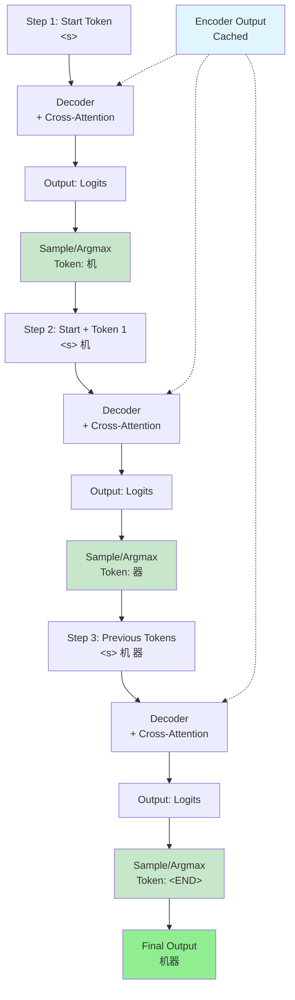

# Autoregressive Generation Process

```mermaid
graph TD
    A["Encoder Output<br/>Cached"] 
    
    B["Step 1: Start Token<br/>&lt;s&gt;"]
    B --> C["Decoder<br/>+ Cross-Attention"]
    C --> D["Output: Logits"]
    D --> E["Sample/Argmax<br/>Token: 机"]
    
    F["Step 2: Start + Token 1<br/>&lt;s&gt; 机"]
    E --> F
    F --> G["Decoder<br/>+ Cross-Attention"]
    G --> H["Output: Logits"]
    H --> I["Sample/Argmax<br/>Token: 器"]
    
    J["Step 3: Previous Tokens<br/>&lt;s&gt; 机 器"]
    I --> J
    J --> K["Decoder<br/>+ Cross-Attention"]
    K --> L["Output: Logits"]
    L --> M["Sample/Argmax<br/>Token: &lt;END&gt;"]
    
    A -.-> C
    A -.-> G
    A -.-> K
    
    M --> N["Final Output<br/>机器"]
    
    style A fill:#e1f5ff
    style E fill:#c8e6c9
    style I fill:#c8e6c9
    style M fill:#c8e6c9
    style N fill:#90ee90
```
