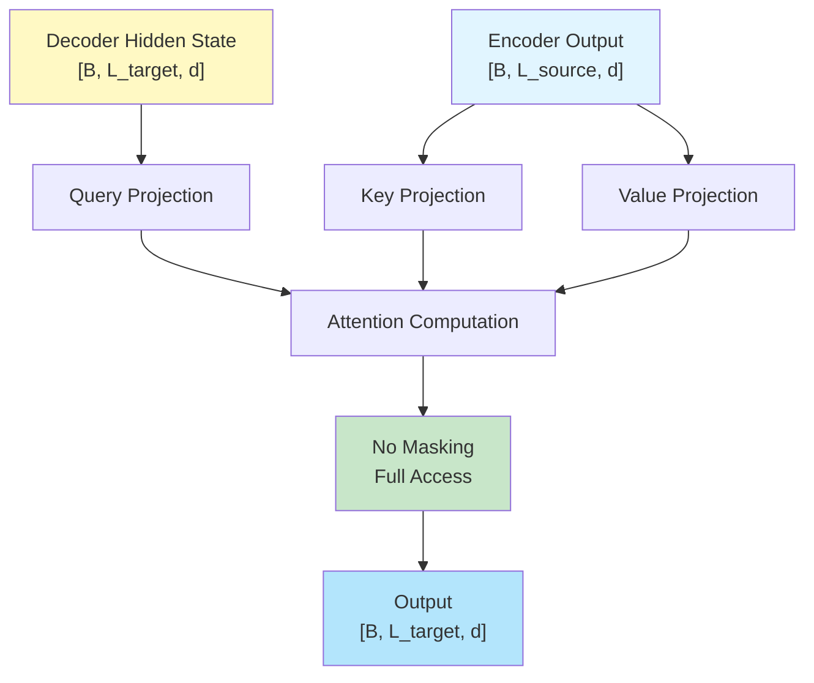

# Cross-Attention Mechanism

```mermaid
graph TD
    A["Decoder Hidden State<br/>[B, L_target, d]"] --> B["Query Projection"]
    C["Encoder Output<br/>[B, L_source, d]"] --> D["Key Projection"]
    C --> E["Value Projection"]
    
    B --> F["Attention Computation"]
    D --> F
    E --> F
    
    F --> G["No Masking<br/>Full Access"]
    G --> H["Output<br/>[B, L_target, d]"]
    
    style A fill:#fff9c4
    style C fill:#e1f5ff
    style G fill:#c8e6c9
    style H fill:#b3e5fc
```
