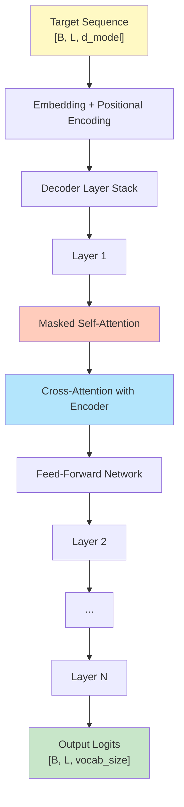

# Decoder Block Structure Diagram

```mermaid
graph TD
    A["Target Sequence<br/>[B, L, d_model]"] --> B["Embedding + Positional Encoding"]
    B --> C["Decoder Layer Stack"]
    C --> D["Layer 1"]
    D --> E["Masked Self-Attention"]
    E --> F["Cross-Attention with Encoder"]
    F --> G["Feed-Forward Network"]
    G --> H["Layer 2"]
    H --> I["..."]
    I --> J["Layer N"]
    J --> K["Output Logits<br/>[B, L, vocab_size]"]
    
    style A fill:#fff9c4
    style K fill:#c8e6c9
    style E fill:#ffccbc
    style F fill:#b3e5fc
```
