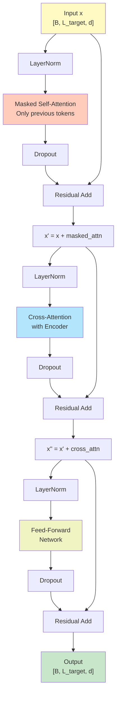

# Decoder Layer Detail

```mermaid
graph TD
    A["Input x<br/>[B, L_target, d]"] --> B["LayerNorm"]
    B --> C["Masked Self-Attention<br/>Only previous tokens"]
    C --> D["Dropout"]
    D --> E["Residual Add"]
    A --> E
    
    E --> F["x' = x + masked_attn"]
    F --> G["LayerNorm"]
    G --> H["Cross-Attention<br/>with Encoder"]
    H --> I["Dropout"]
    I --> J["Residual Add"]
    F --> J
    
    J --> K["x'' = x' + cross_attn"]
    K --> L["LayerNorm"]
    L --> M["Feed-Forward<br/>Network"]
    M --> N["Dropout"]
    N --> O["Residual Add"]
    K --> O
    
    O --> P["Output<br/>[B, L_target, d]"]
    
    style A fill:#fff9c4
    style P fill:#c8e6c9
    style C fill:#ffccbc
    style H fill:#b3e5fc
    style M fill:#f0f4c3
```
