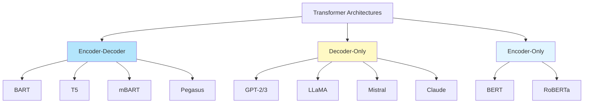

# Decoder Architecture Types

```mermaid
graph TD
    A["Transformer Architectures"]
    
    A --> B["Encoder-Decoder"]
    A --> C["Decoder-Only"]
    A --> D["Encoder-Only"]
    
    B --> B1["BART"]
    B --> B2["T5"]
    B --> B3["mBART"]
    B --> B4["Pegasus"]
    
    C --> C1["GPT-2/3"]
    C --> C2["LLaMA"]
    C --> C3["Mistral"]
    C --> C4["Claude"]
    
    D --> D1["BERT"]
    D --> D2["RoBERTa"]
    
    style B fill:#b3e5fc
    style C fill:#fff9c4
    style D fill:#e1f5ff
```
