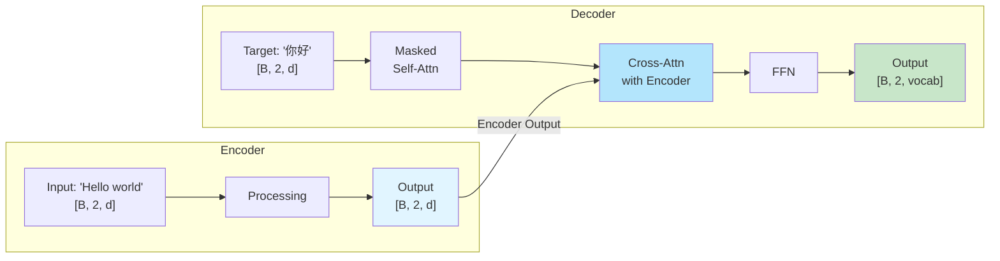

# Encoder-Decoder Interaction

```mermaid
graph LR
    subgraph Encoder["Encoder"]
        A["Input: 'Hello world'<br/>[B, 2, d]"]
        B["Processing"]
        C["Output<br/>[B, 2, d]"]
        A --> B --> C
    end
    
    subgraph Decoder["Decoder"]
        D["Target: '你好'<br/>[B, 2, d]"]
        E["Masked<br/>Self-Attn"]
        F["Cross-Attn<br/>with Encoder"]
        G["FFN"]
        H["Output<br/>[B, 2, vocab]"]
        D --> E --> F --> G --> H
    end
    
    C -->|"Encoder Output"| F
    
    style C fill:#e1f5ff
    style F fill:#b3e5fc
    style H fill:#c8e6c9
```
