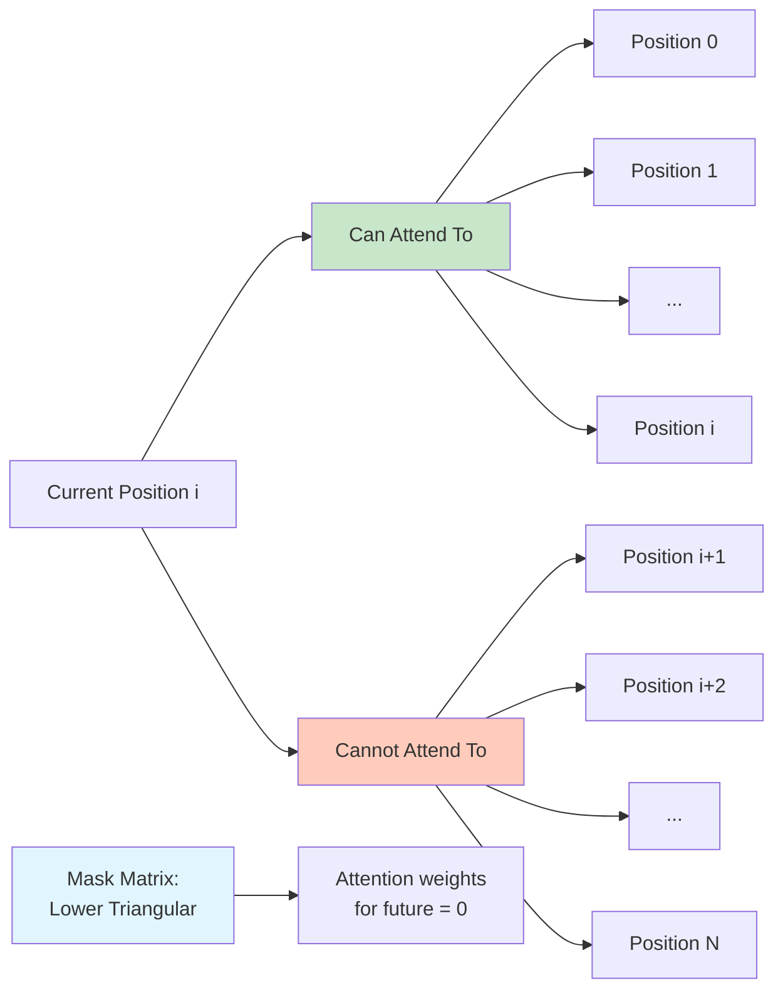

# Masked Self-Attention (Causal)

```mermaid
graph LR
    A["Current Position i"] --> B["Can Attend To"]
    B --> C["Position 0"]
    B --> D["Position 1"]
    B --> E["..."]
    B --> F["Position i"]
    
    A --> G["Cannot Attend To"]
    G --> H["Position i+1"]
    G --> I["Position i+2"]
    G --> J["..."]
    G --> K["Position N"]
    
    M["Mask Matrix:<br/>Lower Triangular"] --> L["Attention weights<br/>for future = 0"]
    
    style B fill:#c8e6c9
    style G fill:#ffccbc
    style M fill:#e1f5ff
```
