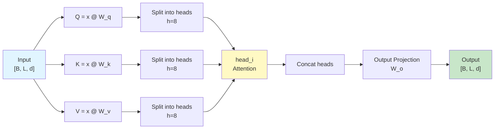

# Multi-Head Attention Mechanism

```mermaid
graph LR
    A["Input<br/>[B, L, d]"] --> B["Q = x @ W_q"]
    A --> C["K = x @ W_k"]
    A --> D["V = x @ W_v"]
    
    B --> E["Split into heads<br/>h=8"]
    C --> F["Split into heads<br/>h=8"]
    D --> G["Split into heads<br/>h=8"]
    
    E --> H["head_i<br/>Attention"]
    F --> H
    G --> H
    
    H --> I["Concat heads"]
    I --> J["Output Projection<br/>W_o"]
    J --> K["Output<br/>[B, L, d]"]
    
    style A fill:#e1f5ff
    style K fill:#c8e6c9
    style H fill:#fff9c4
```
