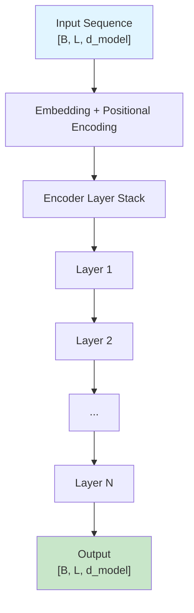

# Encoder Block Structure Diagram

```mermaid
graph TD
    A["Input Sequence<br/>[B, L, d_model]"] --> B["Embedding + Positional Encoding"]
    B --> C["Encoder Layer Stack"]
    C --> D["Layer 1"]
    D --> E["Layer 2"]
    E --> F["..."]
    F --> G["Layer N"]
    G --> H["Output<br/>[B, L, d_model]"]
    
    style A fill:#e1f5ff
    style H fill:#c8e6c9
```
