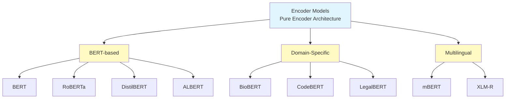

# Encoder Types Comparison

```mermaid
graph TD
    A["Encoder Models<br/>Pure Encoder Architecture"]
    
    A --> B["BERT-based"]
    A --> C["Domain-Specific"]
    A --> D["Multilingual"]
    
    B --> B1["BERT"]
    B --> B2["RoBERTa"]
    B --> B3["DistilBERT"]
    B --> B4["ALBERT"]
    
    C --> C1["BioBERT"]
    C --> C2["CodeBERT"]
    C --> C3["LegalBERT"]
    
    D --> D1["mBERT"]
    D --> D2["XLM-R"]
    
    style A fill:#e1f5ff
    style B fill:#fff9c4
    style C fill:#fff9c4
    style D fill:#fff9c4
```
