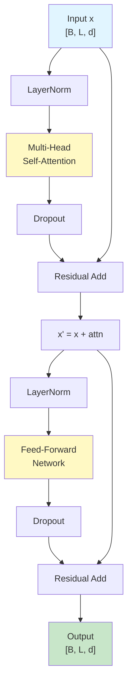

# Encoder Layer Detail

```mermaid
graph TD
    A["Input x<br/>[B, L, d]"] --> B["LayerNorm"]
    B --> C["Multi-Head<br/>Self-Attention"]
    C --> D["Dropout"]
    D --> E["Residual Add"]
    A --> E
    
    E --> F["x' = x + attn"]
    F --> G["LayerNorm"]
    G --> H["Feed-Forward<br/>Network"]
    H --> I["Dropout"]
    I --> J["Residual Add"]
    F --> J
    
    J --> K["Output<br/>[B, L, d]"]
    
    style A fill:#e1f5ff
    style K fill:#c8e6c9
    style C fill:#fff9c4
    style H fill:#fff9c4
```
