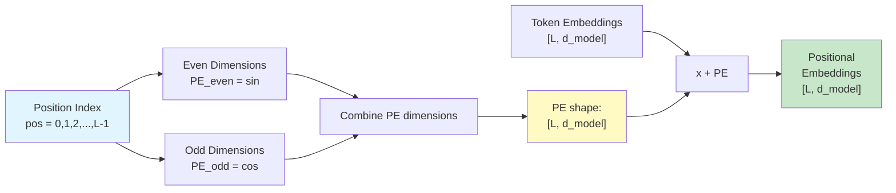

# Positional Encoding

```mermaid
graph LR
    A["Position Index<br/>pos = 0,1,2,...,L-1"] --> B["Even Dimensions<br/>PE_even = sin"]
    A --> C["Odd Dimensions<br/>PE_odd = cos"]
    
    B --> D["Combine PE dimensions"]
    C --> D
    
    D --> E["PE shape:<br/>[L, d_model]"]
    F["Token Embeddings<br/>[L, d_model]"] --> G["x + PE"]
    E --> G
    
    G --> H["Positional<br/>Embeddings<br/>[L, d_model]"]
    
    style A fill:#e1f5ff
    style H fill:#c8e6c9
    style E fill:#fff9c4
```
