# FFN Activation Functions: ReLU, GELU, and SiLU for Transformer Models

Reference article: https://mbrenndoerfer.com/writing/ffn-activation-functions

## Key Equations (Cheat Sheet)

FFN core:

$$
\mathrm{FFN}(x)=W_2\,\mathrm{act}(W_1x+b_1)+b_2
$$

ReLU:

$$
\mathrm{ReLU}(x)=\max(0,x),\quad
\mathrm{ReLU}'(x)=\begin{cases}
1,&x>0\\
0,&x\le 0
\end{cases}
$$

GELU (exact):

$$
\mathrm{GELU}(x)=x\,\Phi(x),\quad
\Phi(x)=\frac{1}{2}\left(1+\mathrm{erf}\left(\frac{x}{\sqrt{2}}\right)\right)
$$

GELU derivative:

$$
\mathrm{GELU}'(x)=\Phi(x)+x\,\phi(x),\quad
\phi(x)=\frac{1}{\sqrt{2\pi}}e^{-x^2/2}
$$

GELU (fast tanh approx):

$$
\mathrm{GELU}_{\text{approx}}(x)=0.5x\left(1+\tanh\left(\sqrt{\frac{2}{\pi}}(x+0.044715x^3)\right)\right)
$$

SiLU/Swish:

$$
\mathrm{SiLU}(x)=x\,\sigma(x)=\frac{x}{1+e^{-x}},\quad
\sigma(x)=\frac{1}{1+e^{-x}}
$$

SiLU derivative:

$$
\mathrm{SiLU}'(x)=\sigma(x)+x\sigma(x)(1-\sigma(x))
$$

At-a-glance defaults:
- Encoder-family models: GELU.
- Decoder-family models: SiLU.
- Speed-first baseline: ReLU.

## Why FFN Activation Matters

In a Transformer block, the feed-forward network (FFN) is usually:

$$
\mathrm{FFN}(x)=W_2\cdot \mathrm{act}(W_1x+b_1)+b_2
$$

If $\mathrm{act}(\cdot)$ is linear (or identity), the whole FFN collapses into a single linear map:

$$
W_2(W_1x+b_1)+b_2=(W_2W_1)x+(W_2b_1+b_2)
$$

So nonlinearity is non-negotiable. It gives FFNs expressive power and changes gradient flow behavior during backpropagation.

Core intuition:
- Attention mixes information across tokens.
- FFN transforms each token independently.
- Activation function determines how selective, smooth, and stable that token-wise transformation is.

## ReLU: Simple and Fast, but Can Die

Definition:

$$
\mathrm{ReLU}(x)=\max(0,x)
$$

Derivative:

$$
\mathrm{ReLU}'(x)=\begin{cases}
1,&x>0\\
0,&x\le 0
\end{cases}
$$

Strengths:
- Extremely cheap to compute.
- Non-saturating on positive side (helps gradients pass for positive activations).
- Produces sparse activations (often around 50% near-zero for normal inputs).

Weakness (dead ReLU):
- If a neuron's pre-activation stays negative, output is always 0.
- Gradient through that neuron is 0, so it may never recover.
- Effective model capacity silently shrinks.

Practical notes:
- This issue is worse with aggressive learning rates or poor initialization.
- Variants like Leaky ReLU/PReLU reduce the problem but are less common in modern large Transformers than GELU/SiLU.

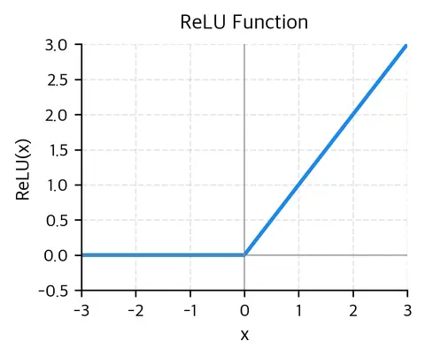
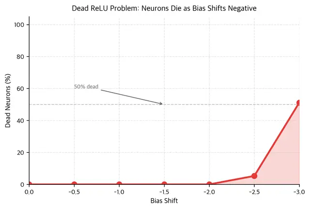

## GELU: Smooth Probabilistic Gating

Exact GELU:

$$
\mathrm{GELU}(x)=x\,\Phi(x)
$$

where $\Phi(x)$ is the standard normal CDF:

$$
\Phi(x)=\frac{1}{2}\left(1+\mathrm{erf}\left(\frac{x}{\sqrt{2}}\right)\right)
$$

Interpretation:
- ReLU is a hard gate.
- GELU is a soft probabilistic gate.
- Values near zero are partially passed; large positive values pass mostly unchanged; large negative values are strongly attenuated.

Derivative:

$$
\mathrm{GELU}'(x)=\Phi(x)+x\,\phi(x)
$$

with $\phi(x)$ the standard normal PDF.

Key training effect:
- Gradient is smooth and usually nonzero for finite inputs.
- Avoids the hard kink/discontinuity at 0 from ReLU.
- Typically improves optimization stability in large models.

Why common in encoders:
- BERT and many encoder-family models adopted GELU.
- Ecosystem convention and pretrained-weight compatibility made GELU the default for encoder stacks.

Common fast approximation:

$$
\mathrm{GELU}_{\text{approx}}(x)=0.5x\left(1+\tanh\left(\sqrt{\frac{2}{\pi}}(x+0.044715x^3)\right)\right)
$$

In practice, approximation error is tiny and speed is better than exact erf-based evaluation.

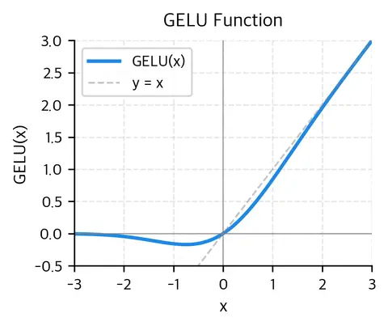
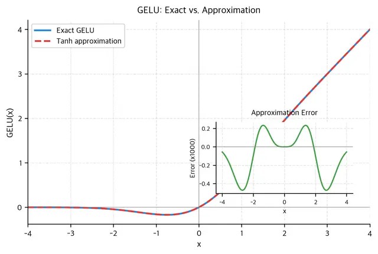

## SiLU/Swish: Modern Decoder Default

Definition:

$$
\mathrm{SiLU}(x)=x\,\sigma(x)=\frac{x}{1+e^{-x}}
$$

Derivative:

$$
\mathrm{SiLU}'(x)=\sigma(x)+x\sigma(x)(1-\sigma(x))
$$

Behavior:
- Smooth like GELU.
- Non-monotonic with a deeper negative dip than GELU.
- Derivative can exceed 1 in a moderate positive region, which may slightly help gradient propagation in deep stacks.

Why common in decoders:
- LLaMA-style families and many open decoder LLMs use SiLU (often inside SwiGLU blocks).
- Good empirical behavior, hardware-friendly implementations, and ecosystem momentum.

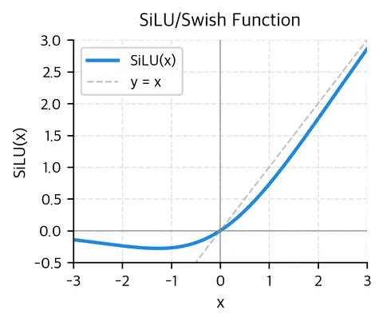
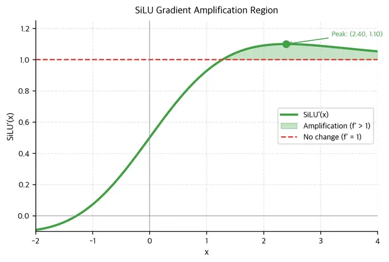

## Direct Comparison: ReLU vs GELU vs SiLU

Shared properties:
- Nearly linear for large positive inputs.
- Suppress large negative inputs.

Main differences near zero:
- ReLU: hard threshold and discontinuous derivative at 0.
- GELU: smooth transition, mild negative dip.
- SiLU: smooth transition, deeper negative dip.

Practical consequences:
- ReLU gives highest sparsity and speed, but risk of dead neurons.
- GELU/SiLU provide denser hidden states and smoother optimization.
- At very large scale, training stability usually matters more than tiny extra activation cost.

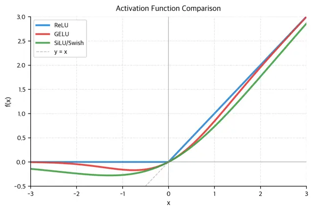
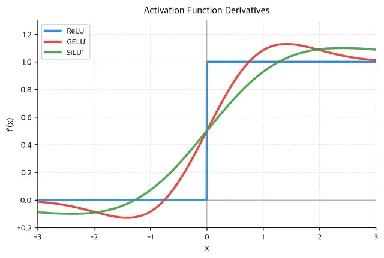
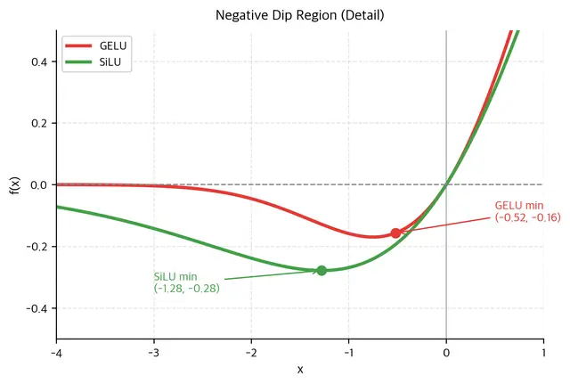

## FFN Distribution and Compute Insights

When simulating a BERT-size FFN (for example $d_{model}=768$, $d_{ff}=3072$):
- ReLU tends to create a large zero spike (high sparsity).
- GELU/SiLU retain more graded information (lower sparsity, small negative tails).

Compute-side summary:
- ReLU is usually fastest.
- SiLU is often next.
- GELU approximation is close and often acceptable.
- Exact GELU is most expensive in naive implementations.

In real training/inference stacks, kernel fusion can reduce these differences.

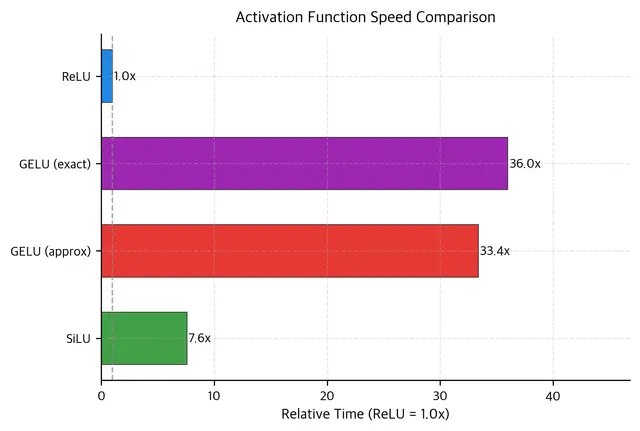
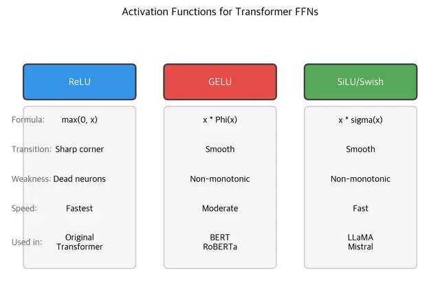

## Which Activation Should You Use?

Use ReLU when:
- You need maximum simplicity/speed.
- Model is smaller or you want a baseline.

Use GELU when:
- Building encoder-style Transformer models.
- Matching BERT/RoBERTa-like pretrained setups.

Use SiLU when:
- Building decoder-style LLMs.
- Using GLU variants such as SwiGLU.

Critical rule for fine-tuning:
- Do not swap activation function in a pretrained model unless you are prepared for substantial retraining.

## Limitations and Trade-offs

- Numerical stability: GELU (erf) and SiLU (exp) need robust implementations at extreme values.
- Initialization interaction: assumptions behind init schemes (for example ReLU-oriented He init) do not perfectly transfer to GELU/SiLU.
- Theory gap: smooth activations empirically win at scale, but the full causal explanation is still not fully settled.

## Quick Takeaways

- FFN nonlinearity is essential for Transformer expressiveness.
- ReLU: fast, sparse, but dead-neuron risk.
- GELU: smooth probabilistic gating, encoder default.
- SiLU: smooth and practical, decoder default in modern open LLMs.
- In production, compatibility with pretrained architecture usually dominates the choice.

