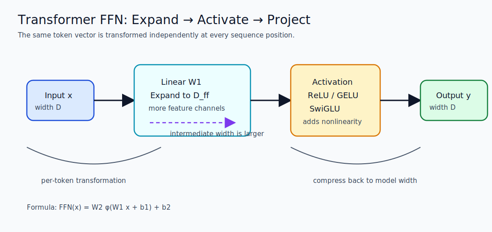
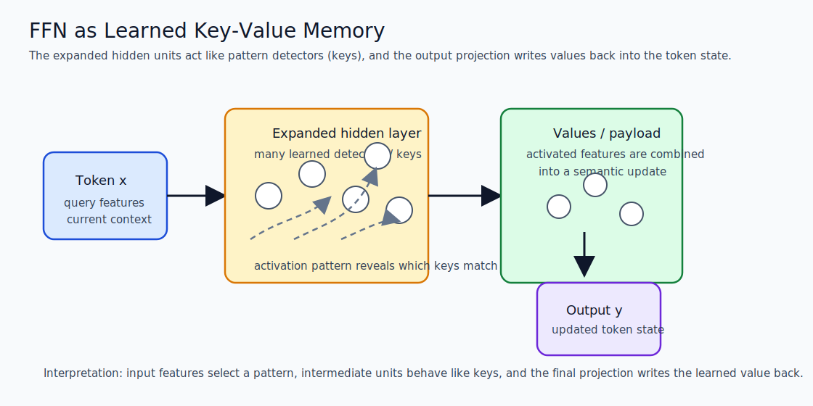
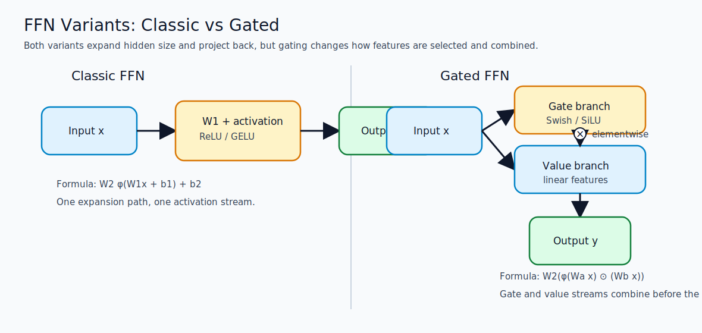
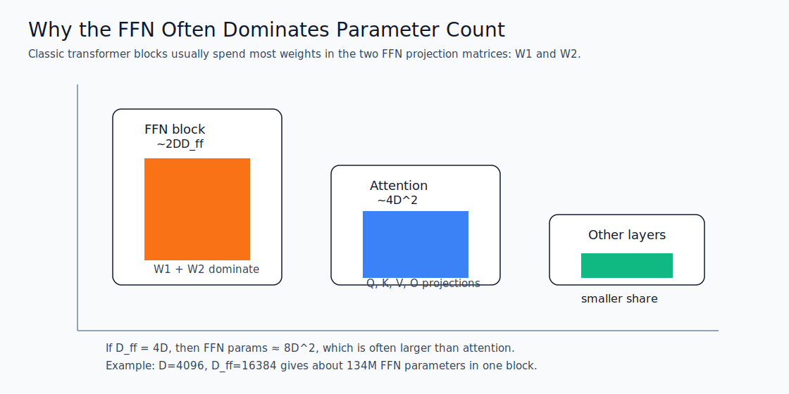

# Feed-Forward Network (FFN) in Transformers

The feed-forward network, often called the FFN or MLP block, is the second major sublayer inside a transformer block after attention. While attention mixes information across tokens, the FFN transforms each token independently in feature space. This makes the FFN a crucial part of how transformers build richer representations and store learned patterns.

---

## 1) FFN in the transformer block

In a standard transformer layer, the computation is often written as:

$$
h' = h + \mathrm{Attention}(\mathrm{Norm}(h))
$$

$$
h'' = h' + \mathrm{FFN}(\mathrm{Norm}(h'))
$$

The attention layer decides how tokens communicate with one another. The FFN then processes each token representation independently, using the same parameters for every position in the sequence.

This separation is important:

- attention handles token-to-token interaction,
- FFN handles per-token feature transformation,
- both together give transformers their expressive power.

---

## 2) Position independence

One of the most important properties of the FFN is that it is position independent. The same FFN weights are applied to every token embedding, regardless of whether the token is at the beginning, middle, or end of the sequence.

If the input is shaped as:

$$
X \in \mathbb{R}^{B \times T \times D}
$$

then the FFN is applied to each vector $x_{b,t} \in \mathbb{R}^{D}$ separately:

$$
\mathrm{FFN}(X) = [\mathrm{FFN}(x_{1,1}), \mathrm{FFN}(x_{1,2}), \ldots, \mathrm{FFN}(x_{b,t}), \ldots]
$$

This means the FFN does not directly mix information across sequence positions. That mixing is the job of attention. The FFN instead learns feature-wise transformations such as detecting patterns, sharpening distinctions, and combining subfeatures inside each token state.

Why this matters:

- it preserves the token-wise structure learned by attention,
- it makes the block easy to parallelize,
- it keeps the same transformation available to every position in the sequence.

---

## 3) The hidden dimension expansion

The FFN is usually not just a single linear layer. It expands the hidden size into a larger intermediate dimension and then projects it back.

The common formulation is:

$$
\mathrm{FFN}(x) = W_2\,\phi(W_1 x + b_1) + b_2
$$

Where:

- $x \in \mathbb{R}^{D}$ is the token representation,
- $W_1 \in \mathbb{R}^{D_{ff} \times D}$,
- $W_2 \in \mathbb{R}^{D \times D_{ff}}$,
- $D_{ff}$ is the hidden expansion size,
- $\phi$ is an activation such as ReLU, GELU, or SwiGLU.

The expansion ratio is often about 4x in classic transformers:

$$
D_{ff} \approx 4D
$$

This expansion gives the model more representational capacity. The token embedding is lifted into a larger space where the network can separate and recombine features more flexibly, then compressed back to the model dimension.

Intuition:

- the first linear layer creates a larger workspace,
- the nonlinearity creates feature interactions,
- the second linear layer distills the useful result back into model width.



---

## 4) FFN as key-value memory

The FFN can be interpreted as a kind of stored memory.

One useful view is:

- the first linear layer creates many internal detectors or keys,
- the activation decides which detectors are active,
- the second linear layer writes the corresponding values back to the output space.

In this view, the FFN behaves like a key-value memory store.

### Key idea

Each hidden neuron in the expanded layer can act like a key that responds to a pattern in the input representation. When a pattern is present, that neuron activates strongly. The output projection then combines these activations into a value vector that contributes to the final token representation.

This is not memory in the literal database sense. It is learned associative memory:

- input features act as a query,
- intermediate neurons act like keys,
- output channels act like values.

This perspective helps explain why FFNs are so powerful. Attention routes information between tokens, but FFNs store and retrieve feature associations inside each token representation.



---

## 5) A language example for the role of FFN

Consider the sentence:

> The animal did not cross the road because it was tired.

After attention has gathered context, the token representation for "it" may contain a mixture of candidate referents and surrounding cues. The FFN helps transform that mixed representation into a more useful feature state.

Another example:

> Paris is the capital of France.

Attention helps connect "Paris" with "France" and "capital" across tokens. The FFN then strengthens the internal representation of the token state by pushing features that correspond to semantic facts, syntax, and task-specific signals into a better separated space.

In practical language terms, the FFN can be thought of as doing tasks like these:

- strengthening a recognized phrase pattern,
- suppressing irrelevant features,
- turning attention output into a sharper semantic representation,
- supporting the model's stored knowledge about language regularities.

So, if attention is the mechanism that lets tokens talk to one another, the FFN is the mechanism that helps each token think privately after it has heard the conversation.

---

## 6) Mathematical formula of the FFN

The standard transformer FFN is written as:

$$
\mathrm{FFN}(x) = W_2\,\phi(W_1 x + b_1) + b_2
$$

Where:

- $x \in \mathbb{R}^{D}$,
- $W_1 \in \mathbb{R}^{D_{ff} \times D}$,
- $W_2 \in \mathbb{R}^{D \times D_{ff}}$,
- $b_1 \in \mathbb{R}^{D_{ff}}$,
- $b_2 \in \mathbb{R}^{D}$.

For a whole sequence input:

$$
X \in \mathbb{R}^{B \times T \times D}
$$

the FFN is applied independently to each token vector along the last dimension.

Some modern LLMs use gated variants such as SwiGLU:

$$
\mathrm{FFN}(x) = W_2\big(\phi(W_a x) \odot (W_b x)\big)
$$

This gated design often improves quality at similar or better efficiency.

### Common FFN variants

| Variant | Formula shape | Main idea | Typical use |
|---|---|---|---|
| ReLU FFN | $W_2\,\mathrm{ReLU}(W_1x+b_1)+b_2$ | Simple nonlinearity with sparse activations | Older transformer designs |
| GELU FFN | $W_2\,\mathrm{GELU}(W_1x+b_1)+b_2$ | Smoother activation, often better optimization | BERT-style and many modern transformers |
| SwiGLU FFN | $W_2(\mathrm{Swish}(W_a x) \odot (W_b x))$ | Gated expansion improves expressiveness | Many modern LLMs |

In practice, the choice of activation changes how the FFN trades off simplicity, stability, and quality. ReLU is easy to understand, GELU is smoother and often performs better, and SwiGLU introduces gating that usually improves the capacity of large language models.



---

## 7) Parameter count analysis

The FFN usually contains most of the parameters in a transformer block.

For the classic two-layer FFN:

$$
\#\mathrm{params} = D_{ff}D + D D_{ff} + D_{ff} + D
$$

Ignoring biases for a rough estimate:

$$
\#\mathrm{params} \approx 2DD_{ff}
$$

If the expansion ratio is 4x, then $D_{ff} = 4D$ and:

$$
\#\mathrm{params} \approx 8D^2
$$

### Example

If $D = 4096$ and $D_{ff} = 16384$:

$$
\#\mathrm{params} \approx 2 \cdot 4096 \cdot 16384 = 134{,}217{,}728
$$

That is about 134 million parameters just for one FFN block, before adding biases.

This explains why FFNs are often the largest parameter contributor in a transformer layer. Attention is important for communication, but the FFN is where a large share of the model's capacity lives.



---

## 8) Why the FFN is so important

The FFN is not just a simple linear layer after attention. It is the part of the transformer that converts attended information into richer internal features.

It helps the model:

- store feature associations,
- separate semantic patterns,
- increase expressive power through the expansion layer,
- apply the same learned transformation to every token position.

In many transformer models, attention and FFN play complementary roles:

- attention decides what information to gather,
- FFN decides how to transform that information locally.

---

## 9) Short implementation sketch

```python
import torch
import torch.nn as nn


class FFN(nn.Module):
	def __init__(self, d_model: int, d_ff: int):
		super().__init__()
		self.fc1 = nn.Linear(d_model, d_ff)
		self.act = nn.GELU()
		self.fc2 = nn.Linear(d_ff, d_model)

	def forward(self, x: torch.Tensor) -> torch.Tensor:
		return self.fc2(self.act(self.fc1(x)))
```

This code shows the core idea clearly:

- expand from $D$ to $D_{ff}$,
- apply a nonlinearity,
- project back to $D$.

---

## 10) Short takeaway

The FFN in a transformer is a position-independent, token-wise nonlinear transformation that expands hidden size, applies feature mixing, and compresses the result back to model width. It can be viewed as a key-value style memory that stores learned feature associations inside the token representation. Attention moves information across tokens; the FFN transforms that information inside each token.
