# Gated Linear Units (GLU): The FFN Architecture Behind Modern LLMs

Reference article: https://mbrenndoerfer.com/writing/gated-linear-units-swiglu-transformer-ffn

## Key Equations (Cheat Sheet)

Standard FFN:

$$
\mathrm{FFN}(x)=\sigma(xW_1+b_1)W_2+b_2
$$

Original GLU:

$$
\mathrm{GLU}(x)=(xW+b)\otimes\sigma(xV+c)
$$

GLU-FFN:

$$
\mathrm{FFN}_{\mathrm{GLU}}(x)=\left[(xW+b)\otimes\sigma(xV+c)\right]W_2+b_2
$$

SwiGLU:

$$
\mathrm{SwiGLU}(x)=\mathrm{Swish}(xW)\otimes(xV),\quad \mathrm{Swish}(z)=z\,\sigma(z)
$$

GeGLU:

$$
\mathrm{GeGLU}(x)=\mathrm{GELU}(xW)\otimes(xV)
$$

Parameter counts (ignore biases):

$$
\mathrm{Params}_{\mathrm{standard}}=2\,d_{model}d_{ff},\quad
\mathrm{Params}_{\mathrm{GLU}}=3\,d_{model}d_{ff}
$$

To match standard FFN parameter count:

$$
d_{ff}^{\prime}=\frac{2}{3}d_{ff}
$$

---

## 1. Why GLU Matters in Transformer FFN

Classic Transformer FFN uses one nonlinear activation after expansion. GLU replaces this with a two-pathway multiplicative interaction:

- one pathway provides content/value
- another pathway provides gates
- element-wise multiplication decides how much information passes per hidden dimension

This is more expressive than purely additive transformations because multiplication introduces feature interactions (second-order effects).

In modern LLMs, this design is now dominant (especially SwiGLU).

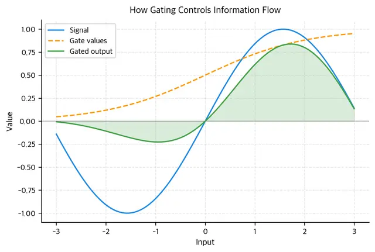

## 2. Intuition: Additive vs Multiplicative Expressiveness

In standard FFN, hidden features are transformed then added/mixed linearly. In GLU, hidden features are conditionally modulated by gates.

Intuitively, each hidden dimension gets a learned "volume knob":

- gate close to 0: suppress that channel
- gate close to 1: pass it through
- in-between: partial attenuation

This conditional modulation makes FFN behavior input-dependent in a richer way than a single fixed nonlinearity.

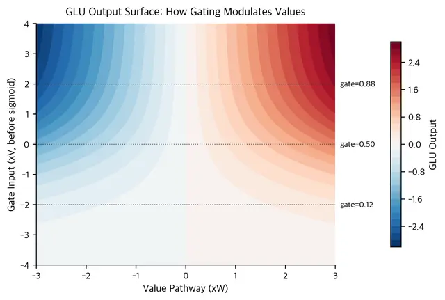

## 3. Original GLU Formulation

### Mathematical decomposition

Given input $x \in \mathbb{R}^{d_{model}}$:

- value path: $xW+b$
- gate path: $\sigma(xV+c)$
- output: element-wise product of both

$$
\mathrm{GLU}(x)=(xW+b)\otimes\sigma(xV+c)
$$

The sigmoid gate is bounded in $(0,1)$:

$$
\sigma(z)=\frac{1}{1+e^{-z}}
$$

So the gate is interpretable as "how open" each channel is.

### Integration in FFN block

$$
\mathrm{FFN}_{\mathrm{GLU}}(x)=\left[(xW+b)\otimes\sigma(xV+c)\right]W_2+b_2
$$

Compared to standard FFN, GLU adds one more projection matrix (three instead of two).

## 4. Why SwiGLU Became the Modern Standard

Original GLU uses sigmoid gate directly, but sigmoid saturates strongly near 0/1 for large magnitudes, which can reduce effective gradient flow.

SwiGLU replaces sigmoid-gated branch with Swish-activated branch:

$$
\mathrm{SwiGLU}(x)=\mathrm{Swish}(xW)\otimes(xV),\quad \mathrm{Swish}(z)=z\,\sigma(z)
$$

Key benefits discussed in practice:

- smoother gradients than hard-threshold behavior
- unbounded positive outputs on activated branch
- strong empirical training stability in deep decoder-only LLMs
- consistently good perplexity/quality in modern scaling regimes

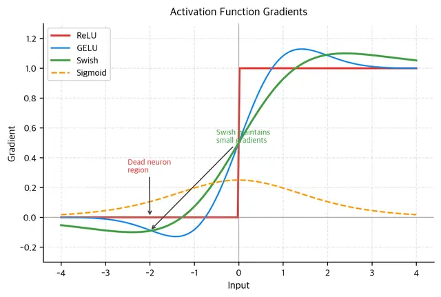
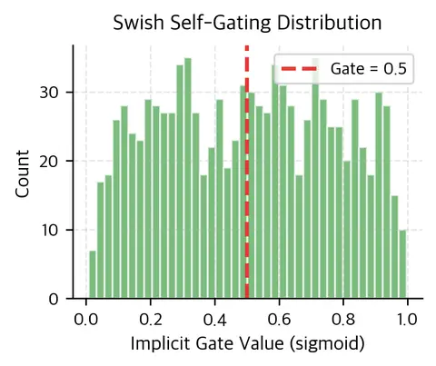

## 5. GeGLU Variant

GeGLU uses GELU instead of Swish on one branch:

$$
\mathrm{GeGLU}(x)=\mathrm{GELU}(xW)\otimes(xV)
$$

Common pattern:

- GeGLU is often seen as a natural fit when GELU-centric ecosystems are preferred
- SwiGLU is more common in modern decoder-only open LLM families

In many settings, both work well; final choice is usually architecture convention + empirical validation.

## 6. Parameter Efficiency Trade-off

For same hidden width $d_{ff}$:

- standard FFN parameters: $2d_{model}d_{ff}$
- GLU-family parameters: $3d_{model}d_{ff}$

So GLU has +50% parameters at equal $d_{ff}$.

To keep parameter count matched, reduce hidden width:

$$
d_{ff}^{\prime}=\frac{2}{3}d_{ff}
$$

This is why many modern SwiGLU models choose smaller expansion ratios than classic 4x FFN expansion.

Example idea:

- Standard FFN: $d_{ff}=4d_{model}$
- Matched SwiGLU roughly: $d_{ff}\approx\frac{8}{3}d_{model}\approx2.67d_{model}$

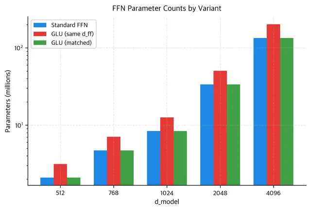
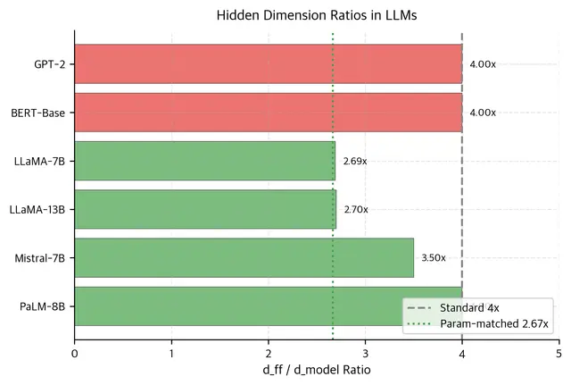

## 7. Representation Behavior vs ReLU FFN

Compared with ReLU FFN hidden activations, SwiGLU hidden states are typically:

- less hard-sparse (fewer exact zeros)
- smoother in distribution
- more continuous around zero

This can help optimization and provide richer intermediate representations.

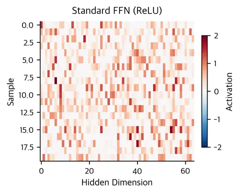
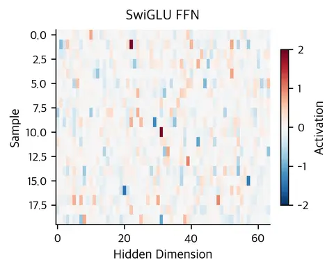
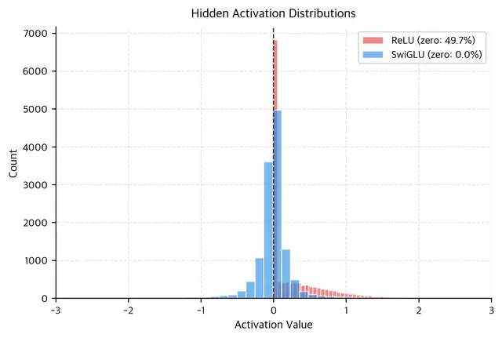
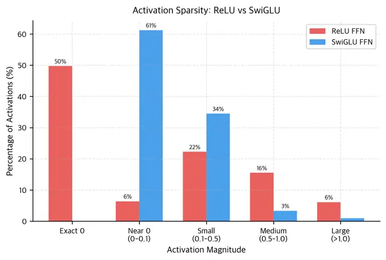

## 8. Practical Implementation Notes

### Typical modern pattern

- Use SwiGLU in FFN for decoder-only LLMs
- Often remove FFN biases
- Choose $d_{ff}$ based on parameter budget and hardware efficiency constraints
- Round dimensions (for example to multiples like 256) for kernel/hardware alignment

### Minimal pseudocode

```python
def swish(x):
	return x * sigmoid(x)

def swiglu_ffn(x, W, V, W2):
	hidden = swish(x @ W) * (x @ V)
	return hidden @ W2
```

## 9. Model-Level Adoption Pattern

State-of-the-art models after 2022 widely shifted toward gated FFN variants.

- LLaMA family: SwiGLU, no FFN bias, tuned hidden ratio
- Mistral family: SwiGLU with architecture-specific ratio choices
- PaLM and related large models: gated FFN variants became mainstream

The trend is consistent: gating gives better quality/efficiency trade-offs than plain FFN activations under modern scaling.

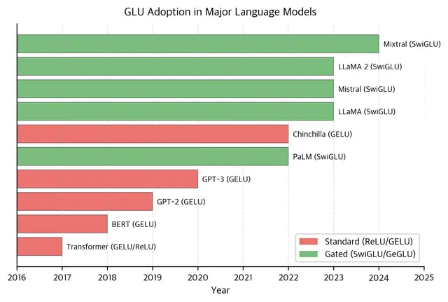

## 10. Limitations and Trade-offs

- More complex FFN compute graph than plain FFN
- One extra projection matrix at same hidden width
- Careful hidden ratio choice is required for parameter/latency targets
- Benefits are empirical and architecture-dependent, so validation on target tasks is still necessary

## 11. Final Takeaways

1. GLU introduces multiplicative gating, which increases FFN expressiveness.
2. SwiGLU is the dominant modern variant for decoder-only LLMs.
3. GLU-family FFNs have 3 projections vs 2 in standard FFN, so hidden-size calibration is crucial.
4. Parameter-matched designs usually reduce $d_{ff}$ to about $\frac{2}{3}$ of standard FFN hidden size.
5. In modern LLM practice, SwiGLU is a core ingredient of the quality/scaling recipe.

