# Layer Normalization in Transformers (Detailed Notes)

**Reference article**: [Layer Normalization: Stabilizing Transformer Training](https://mbrenndoerfer.com/writing/layer-normalization-transformers-implementation)  
**Focus section requested**: [Layer Normalization with Different Normalized Shapes](https://mbrenndoerfer.com/writing/layer-normalization-transformers-implementation#layer-normalization-with-different-normalized-shapes)

---

## 1) Why LayerNorm is used in Transformers

Transformers process token representations with shape:

$$x \in \mathbb{R}^{B \times T \times D}$$

Where:
- $B$: batch size
- $T$: sequence length
- $D$: hidden dimension (feature size)

Without normalization, activation scale can drift across layers, which destabilizes optimization (exploding or vanishing gradient behavior and noisy updates).  
LayerNorm fixes this by normalizing each token representation using statistics computed from that token's own features.

---

## 2) Core LayerNorm formula

For one token vector $x = [x_1, ..., x_D]$:

$$
\mu = \frac{1}{D}\sum_{i=1}^{D}x_i,
\qquad
\sigma^2 = \frac{1}{D}\sum_{i=1}^{D}(x_i - \mu)^2
$$

$$
\hat{x}_i = \frac{x_i - \mu}{\sqrt{\sigma^2 + \epsilon}},
\qquad
y_i = \gamma_i\hat{x}_i + \beta_i
$$

Interpretation:
- Centering: subtract mean to make token features zero-centered.
- Scaling: divide by standard deviation to control spread.
- Affine recovery: learnable $\gamma, \beta$ restore useful per-feature scale/shift if needed.

Important implementation detail:
- Use population variance (`unbiased=False` in PyTorch) for deterministic normalization over the current feature vector.

---

## 3) The key section: `normalized_shape` in PyTorch

`nn.LayerNorm(normalized_shape=...)` normalizes over the **last N dimensions** where N is `len(normalized_shape)`.

Given input shape `(B, T, D)`:

### A. Standard transformer setting

```python
nn.LayerNorm(D)           # same as nn.LayerNorm((D,))
```

- Normalizes over last dimension only (`D`).
- Each token `(b, t, :)` is normalized independently.
- This is the default and correct choice for most LLM/Transformer blocks.

Consequence:
- Token-level independence is preserved.
- Works naturally for autoregressive generation (you can normalize one token at a time).

### B. Normalize over sequence + feature

```python
nn.LayerNorm((T, D))
```

- Normalizes over both sequence and feature dimensions for each sample.
- Statistics are computed over all `T * D` values of one sample.

Consequence:
- Individual token means are not guaranteed to be zero.
- Entire sample has normalized aggregate statistics.
- Usually not used in causal language modeling because it couples tokens across time positions.

### C. Practical rule

For transformer language modeling:
- Use `normalized_shape = d_model` (feature-only normalization).
- Avoid normalizing across sequence dimension in decoder-only autoregressive settings.

---

## 4) Why this dimension choice matters

If you normalize across features only (`D`):
- You stabilize each token's representation.
- You do not mix statistics across tokens in the sequence.
- Training and inference behavior remain aligned.

If you normalize across (`T`, `D`):
- You inject cross-token coupling into normalization.
- Sequence-length dependence becomes stronger.
- Streaming/step-wise decoding assumptions break more easily.

In short: **feature-wise normalization matches how transformer blocks are designed to process token states.**

---

## 5) BatchNorm vs LayerNorm (transformer context)

BatchNorm normalizes across batch statistics and depends on batch composition/size.  
LayerNorm uses per-sample per-token statistics and has no running averages.

Why LayerNorm wins for NLP transformers:
- Handles variable sequence lengths better.
- Stable with small batch sizes and gradient accumulation.
- Same computation at training and inference.

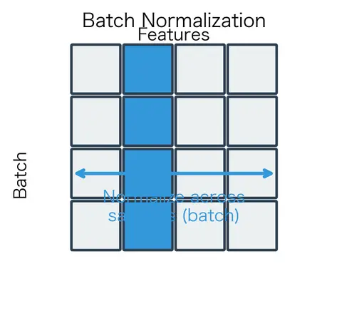
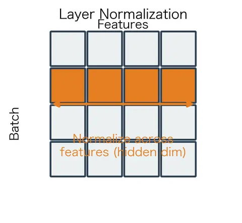

---

## 6) Pre-Norm vs Post-Norm (architecture placement)

### Post-Norm (original transformer)

$$y = \mathrm{LayerNorm}(x + F(x))$$

### Pre-Norm (modern default)

$$y = x + F(\mathrm{LayerNorm}(x))$$

Why pre-norm is dominant in deep LLMs:
- Cleaner gradient highway through residual stream.
- Better training stability for deep stacks.
- Less fragile warmup requirements.

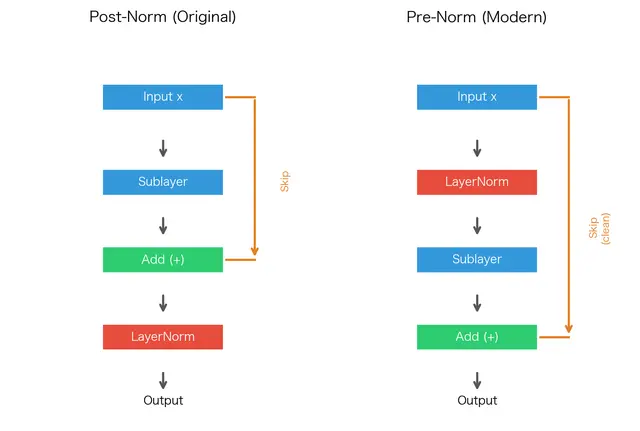

---

## 7) Epsilon and numerical stability

LayerNorm uses:

$$\sqrt{\sigma^2 + \epsilon}$$

- Prevents divide-by-zero when variance is tiny.
- Default is often `1e-5`.
- In mixed precision (especially FP16), larger values like `1e-4` may improve stability.

Guideline:
- Start with framework default.
- Increase only if you observe NaNs/Inf or unstable loss spikes related to normalization.

---

## 8) From-scratch implementation sketch

```python
def layer_norm_forward(x, gamma, beta, eps=1e-5):
	# x: (B, T, D)
	mu = x.mean(dim=-1, keepdim=True)
	var = x.var(dim=-1, keepdim=True, unbiased=False)
	x_hat = (x - mu) / torch.sqrt(var + eps)
	y = gamma * x_hat + beta
	return y
```

Key points:
- `dim=-1` enforces feature-wise normalization.
- `keepdim=True` keeps broadcast-safe shapes.
- `gamma`, `beta` are length-`D` learnable vectors.

---

## 9) Visual intuition and diagnostics

Before/after feature distribution:

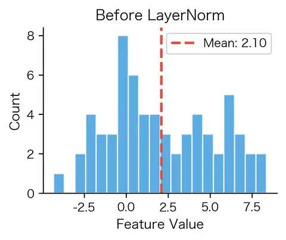
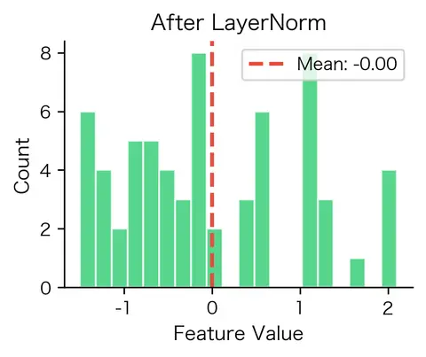

Across depth with/without LayerNorm:

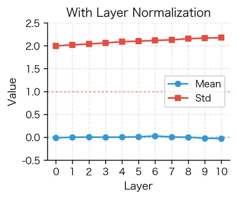
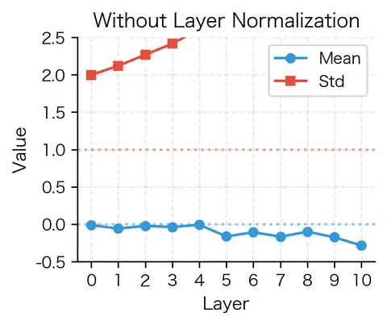

Learnable affine effect ($\gamma,\beta$):

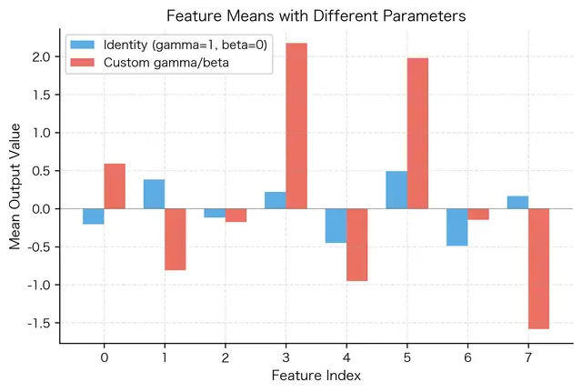

Training behavior example:

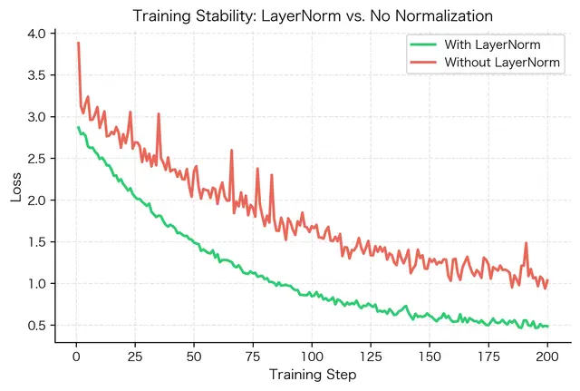

---

## 10) Practical checklist

- Use `nn.LayerNorm(d_model)` in transformer blocks.
- Prefer pre-norm for deep models.
- Exclude LayerNorm parameters from weight decay in optimizer parameter groups.
- Watch for numeric issues in FP16 and tune `eps` if needed.
- Add final LayerNorm before output head in pre-norm stacks when appropriate.

---

## 11) Short takeaway

LayerNorm stabilizes transformer training by normalizing token features rather than batch statistics. The most important practical choice is `normalized_shape`: for standard transformers it should target the hidden dimension only, so each token is normalized independently and autoregressive behavior is preserved.

---

## Citation

Michael Brenndoerfer (2025). *Layer Normalization: Stabilizing Transformer Training*.  
URL: https://mbrenndoerfer.com/writing/layer-normalization-transformers-implementation

---

## 12) Quick Revision Sheet (Exam Style)

### One-line definition

LayerNorm normalizes each token representation across feature dimensions, then applies learnable scale and shift.

### Must-remember formulas

$$
\mu = \frac{1}{D}\sum_{i=1}^{D}x_i,
\quad
\sigma^2 = \frac{1}{D}\sum_{i=1}^{D}(x_i-\mu)^2,
\quad
\hat{x}_i = \frac{x_i-\mu}{\sqrt{\sigma^2+\epsilon}},
\quad
y_i=\gamma_i\hat{x}_i+\beta_i
$$

### High-yield facts

- Transformer default: normalize over hidden dimension only.
- In PyTorch with input `(B,T,D)`, use `nn.LayerNorm(D)`.
- `nn.LayerNorm((T,D))` normalizes token+feature jointly per sample (rare in causal LMs).
- LayerNorm has no running mean/variance; train and inference behavior are consistent.
- Pre-norm is more stable than post-norm for deep models.
- `eps` prevents divide-by-zero; may need larger value for FP16.

### Common mistakes

- Wrong normalization axis: accidentally normalizing over sequence dimension.
- Applying weight decay to LayerNorm gamma/beta (usually excluded).
- Using too small `eps` in mixed precision, causing NaN/Inf.
- Assuming token-wise mean is zero when `normalized_shape=(T,D)`.

### Quick compare table

| Setting | What is normalized? | Typical use |
|---|---|---|
| `nn.LayerNorm(D)` | Each token over features | Standard transformers |
| `nn.LayerNorm((T,D))` | Whole sample over seq+features | Special cases only |

### 30-second self-test

1. For `(B,T,D)`, which `normalized_shape` is standard in LLM blocks?  
	Answer: `D`.

2. Why is LayerNorm preferred over BatchNorm in transformers?  
	Answer: independent of batch statistics, stable for variable length/small batch, same train/infer behavior.

3. Pre-norm or post-norm for very deep models?  
	Answer: pre-norm (cleaner gradient path).

4. What do gamma and beta do?  
	Answer: restore learnable per-feature scale and shift after normalization.

## 13) Q&A

### Q1. Normalization和gradient descent 数学关系？

Normalization（归一化）和 Gradient Descent（梯度下降）之间，其实有非常深的数学关系。

很多教程会把它们分开讲：

* Gradient Descent：优化参数
* Normalization：稳定数据

但从数学本质上：

> Normalization 本质是在“重塑优化空间（optimization landscape）”，
> 从而让 Gradient Descent 更容易、更稳定地找到最优解。

这是深度学习里非常核心的思想。

---

#### 一、先理解 Gradient Descent 真正在做什么

梯度下降：
$$
\theta_{t+1}=\theta_t-\eta\nabla L(\theta_t)
$$

其中：

* $\theta$：参数
* $\eta$：学习率
* $\nabla L$：损失函数梯度

本质：

> 沿着损失函数下降最快方向移动。

---

#### 二、问题：为什么 Gradient Descent 经常不好优化？

因为：

##### Loss Surface（损失曲面）通常非常扭曲

例如：

---

##### 理想情况（圆形）

$$
L(w_1,w_2)=w_1^2+w_2^2
$$

等高线：
圆形。
梯度下降：
直接冲向最低点。

---

##### 糟糕情况（狭长椭圆）

$$
L(w_1,w_2)=100w_1^2+w_2^2
$$

这时：

* $w_1$ 方向特别陡
* $w_2$ 方向特别平

结果：

梯度下降会：

* 左右震荡
* 非常慢
* 学习率难选

---

#### 三、Normalization 的本质：改变坐标尺度

Normalization 做的事情：

> 把不同维度调整到相近尺度。

例如：
原始数据：

* 年龄：20~60
* 收入：1000~1000000

如果直接训练：
收入维度会主导梯度。
因为：

$$
\frac{\partial L}{\partial w_{\text{income}}}
$$

会特别大。

---

归一化后：

$$
x'=\frac{x-\mu}{\sigma}
$$

所有维度：

* mean ≈ 0
* variance ≈ 1

于是：
loss surface 从狭长椭圆：
变成接近圆形。

---

#### 四、Normalization 如何影响梯度？

这是核心。

---

假设线性模型：

$$
y=wx
$$

loss：

$$
L=\frac12(y-t)^2
$$

梯度：

$$
\frac{\partial L}{\partial w}
=(y-t)x
$$

注意：

##### 梯度直接依赖输入 (x)

---

如果：

$$
x=100000
$$

梯度巨大。
更新：

$$w_{t+1}=w_t-\eta\cdot巨大值$$

容易：

* 爆炸
* 震荡
* 发散

---

如果：

$$
x=0.0001
$$

梯度极小。
训练：
极慢。

---

所以：

##### 输入尺度直接决定梯度尺度。

这就是 normalization 与 gradient descent 的直接数学联系。

---

#### 五、为什么 LayerNorm 能稳定 Transformer？

Transformer 最大问题：

每层 residual：

$$
x_{l+1}=x_l+F(x_l)
$$

随着层数加深：
activation scale 会漂移。
例如：

* 第1层 variance = 1
* 第20层 variance = 200
* 第50层 variance = 10000

那么：
梯度也会同步爆炸。

---

LayerNorm：
强制：

$$
Var(x)\approx1
$$

于是：
梯度规模也保持稳定。

---

#### 六、从 Jacobian 看更深数学关系

深度网络：
本质是函数复合：

$$
f(x)=f_n(f_{n-1}(...f_1(x)))
$$

反向传播：
梯度是 Jacobian 连乘：

$$
\frac{\partial L}{\partial x}=\prod_i \frac{\partial f_i}{\partial x_i}
$$

---

如果某层尺度特别大：
Jacobian 特征值：

> 大于 1

则：
梯度指数爆炸。

---

如果尺度特别小：
Jacobian 特征值：

> 小于 1

则：
梯度指数消失。

---

Normalization 的作用：

#### 让 Jacobian 的谱（spectrum）更稳定。

也就是：
尽量让：

$$
\lambda \approx 1
$$

这样：
梯度能稳定传播。

---

#### 七、BatchNorm 为什么能加速训练？

经典论文发现：

BatchNorm 可以：

* 用更大学习率
* 更快收敛
* 更深网络

本质原因：

---

##### 它改变了 Hessian 条件数

这是优化理论里的核心。

---

如果 loss 曲面：
条件数（condition number）很大：

$$
\kappa=\frac{\lambda_{\max}}{\lambda_{\min}}
$$

梯度下降会非常慢。

---

Normalization：
会让 Hessian 更接近 isotropic（各向同性）。
即：

$$
\lambda_{\max}\approx\lambda_{\min}
$$

于是：
优化容易很多。

---

#### 八、一个非常深层的理解

很多人以为：
Normalization 是“数据预处理”。
实际上：

##### 它是优化器的一部分。

因为：
它直接改变：

* 梯度大小
* Hessian 曲率
* Jacobian 谱
* 参数更新轨迹

---

#### 九、为什么现代 Transformer 离不开 Normalization？

因为：
Transformer：

##### 本身没有 CNN 那种天然稳定结构。

CNN：
* 局部连接
* 权重共享

天然较稳定。

---

但 Transformer：

* 全连接 attention
* residual 累加
* 深层矩阵乘法

极易：

* activation 爆炸
* 梯度爆炸

所以：

LayerNorm 实际上是：
> Transformer 的“稳定器”。

没有它：
深层 Transformer 基本训不动。

---

#### 十、最终一句话总结

Normalization 与 Gradient Descent 的核心数学关系是：

> Normalization 通过控制输入与激活的统计尺度，
> 改变 loss surface 的几何形状与 Jacobian/Hessian 的谱性质，
> 从而让 Gradient Descent 的优化路径更稳定、更快速、更可训练。

或者更直白：

#### Normalization 不是“辅助功能”。

它本质上是在：

##### “帮梯度下降修路”。

### Q2: Hessian 曲率？

**Hessian曲率**本质是用**Hessian矩阵**（二阶偏导数方阵）刻画多元函数/曲面的**局部弯曲程度**，是一元函数二阶导数向高维的推广。下面从定义、几何意义、核心性质与应用四方面说明。

---

#### 一、定义（Hessian矩阵）

对n元光滑函数 $f(\boldsymbol{x})=f(x_1,x_2,\dots,x_n)$，其Hessian矩阵 $\boldsymbol{H}$ 为n×n对称矩阵（混合偏导连续时）：
$$
\boldsymbol{H}(f)=\begin{bmatrix}
\frac{\partial^2f}{\partial x_1^2} & \frac{\partial^2f}{\partial x_1\partial x_2} & \dots & \frac{\partial^2f}{\partial x_1\partial x_n}\\
\frac{\partial^2f}{\partial x_2\partial x_1} & \frac{\partial^2f}{\partial x_2^2} & \dots & \frac{\partial^2f}{\partial x_2\partial x_n}\\
\vdots & \vdots & \ddots & \vdots\\
\frac{\partial^2f}{\partial x_n\partial x_1} & \frac{\partial^2f}{\partial x_n\partial x_2} & \dots & \frac{\partial^2f}{\partial x_n^2}
\end{bmatrix}
$$

- **二元函数特例**（曲面 $z=f(x,y)$）：
  $$
  \boldsymbol{H}=\begin{bmatrix}f_{xx} & f_{xy}\\ f_{xy} & f_{yy}\end{bmatrix}
  $$

---

#### 二、几何意义：曲率与凹凸性

Hessian矩阵是**曲率的代数载体**，其特征值/行列式直接对应曲面局部曲率：

1. **主曲率（特征值）**
   实对称矩阵可正交对角化：$\boldsymbol{H}\boldsymbol{v}_i=\lambda_i\boldsymbol{v}_i$
   - $\lambda_i$：**主曲率**（沿主方向 $\boldsymbol{v}_i$ 的弯曲程度）
   - $\boldsymbol{v}_i$：**主方向**（曲率极值方向）

2. **二元曲面的曲率量**
   - **高斯曲率**（全局弯曲）：$K=\det(\boldsymbol{H})=f_{xx}f_{yy}-f_{xy}^2$
   - **平均曲率**（平均弯曲）：$H=\frac{1}{2}\text{tr}(\boldsymbol{H})=\frac{f_{xx}+f_{yy}}{2}$

3. **凹凸性判据（临界点 $\nabla f=0$ 时）**
   - $\lambda_1,\lambda_2>0$（$\boldsymbol{H}$ 正定）：**局部极小值**（碗状）
   - $\lambda_1,\lambda_2<0$（$\boldsymbol{H}$ 负定）：**局部极大值**（倒扣碗状）
   - $\lambda_1\lambda_2<0$（$\boldsymbol{H}$ 不定）：**鞍点**（马鞍面）

<table>
  <tr>
    <td>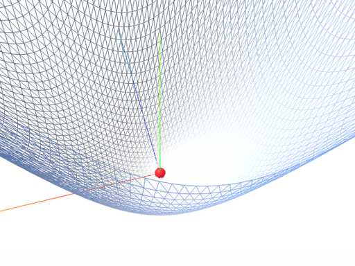</td>
    <td>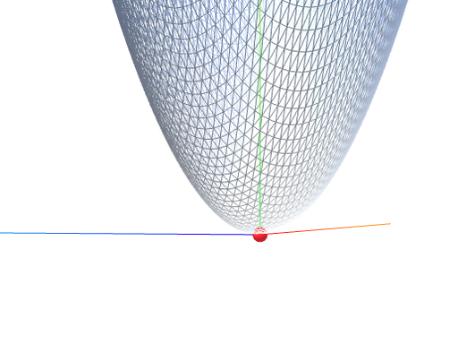</td>
    <td>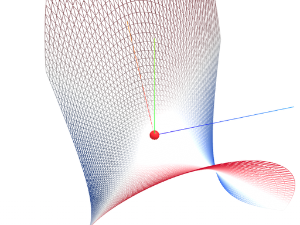</td>
    <td>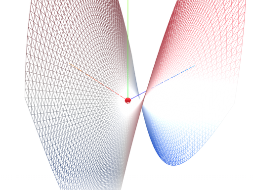</td>
  </tr>
</table>

---

#### 三、核心性质

- **对称性**：$f_{xy}=f_{yx}$，故 $\boldsymbol{H}^T=\boldsymbol{H}$，保证可特征分解。
- **坐标不变性**：正交变换下特征值（主曲率）不变，是**内禀几何量**。
- **与梯度的关系**：梯度 $\nabla f$ 描述**坡度方向/大小**，Hessian描述**坡度的变化率（曲率）**。

---

#### 四、典型应用

1. **优化（机器学习/数值计算）**
   - 牛顿法：用 $\boldsymbol{H}^{-1}$ 校正搜索方向，**二阶收敛**（比梯度下降快）
   - 临界点分类：判断极小/极大/鞍点，避免鞍点停滞

2. **图像处理**
   - 边缘检测：Hessian特征值大的方向对应边缘走向
   - 角点检测：$\det(\boldsymbol{H})$ 大且 $\text{tr}(\boldsymbol{H})$ 大的点为角点

3. **微分几何**
   - 曲面论：主曲率/高斯曲率/平均曲率的计算基础
   - 黎曼流形：Hessian度量诱导截面曲率

---

#### 五、通俗类比

- 一元函数：$f''(x)$ 是**曲线的曲率**（弯得有多急）
- 多元函数：Hessian矩阵是**曲面的曲率仪**，同时给出所有方向的弯曲程度

### Q3: Jacobian 谱？

**Jacobian谱（雅可比谱）**，指多元可微函数 $f: \mathbb{R}^n \to \mathbb{R}^m$ 在某点的**雅可比矩阵 $J$** 的**特征值谱（特征值集合）或奇异值谱（奇异值集合）** 用于刻画局部线性映射的伸缩、旋转与稳定性，在深度学习、动力系统、数值分析中广泛应用。

---

#### 一、基础定义

1. **雅可比矩阵**
   对 $f(x)=(f_1(x),\dots,f_m(x))^\top$，在 $x$ 处的雅可比矩阵为： $$ J(x)=\frac{\partial(f_1,\dots,f_m)}{\partial(x_1,\dots,x_n)}= \begin{bmatrix} \frac{\partial f_1}{\partial x_1}&\cdots&\frac{\partial f_1}{\partial x_n}\\ \vdots&\ddots&\vdots\\ \frac{\partial f_m}{\partial x_1}&\cdots&\frac{\partial f_m}{\partial x_n} \end{bmatrix}\in\mathbb{R}^{m\times n} $$
2. **特征值谱（方阵，$m=n$）** 
	若 $J$ 为方阵，其**特征值** $\lambda\in\mathbb{C}$ 满足 $Jv=\lambda v$，全体特征值 $\{\lambda_1,\dots,\lambda_n\}$ 构成**特征值谱**；**谱半径** $\rho(J)=\max_i|\lambda_i|$，决定动力系统稳定性。 
	
3. **奇异值谱（一般矩阵）** 
	对任意 $J\in\mathbb{R}^{m\times n}$，$J^\top J$（或 $JJ^\top$）的**特征值的平方根**为**奇异值** $\sigma_1\ge\sigma_2\ge\cdots\ge0$，全体奇异值构成**奇异值谱**；**谱范数** $\|J\|_2=\sigma_1$，刻画最大伸缩比。

---

#### 二、核心性质与几何意义

- **伸缩与方向**：奇异值 $\sigma_i$ 表示沿第 $i$ 个奇异方向的伸缩因子；$\sigma_i>1$ 拉伸，$\sigma_i<1$ 压缩，$\sigma_i=0$ 降维。 

- **体积变化**：行列式 $|\det J|=\prod_{i=1}^n\sigma_i$（方阵），描述局部体积缩放倍率。 

- **稳定性（动力系统）**：
  - $\rho(J)<1$：稳定（梯度不爆炸/消失）；
  - $\rho(J)>1$：不稳定（梯度爆炸）；
  - $\rho(J)=1$：临界稳定。

---

#### 三、深度学习中的关键应用

1. **梯度消失/爆炸**
   深度网络 $F=f^{(L)}\circ\cdots\circ f^{(1)}$ 的端到端雅可比为 $J_F=J_{f^{(L)}}\cdots J_{f^{(1)}}$，其谱半径随深度指数变化： $$ \rho(J_F)\approx\exp\left(\sum_{k=1}^L\log\sigma_{\max}(J_{f^{(k)}})\right) $$ 每层 $\sigma_{\max}<1$ → 梯度消失；$\sigma_{\max}>1$ → 梯度爆炸。

2. **低秩性与谱分离**
   训练中雅可比奇异值常呈**幂律分布**：少数大奇异值主导（高灵敏度方向），多数趋近于0（低灵敏度方向），即**谱分离**，对应模型**有效低秩**与**泛化能力**。

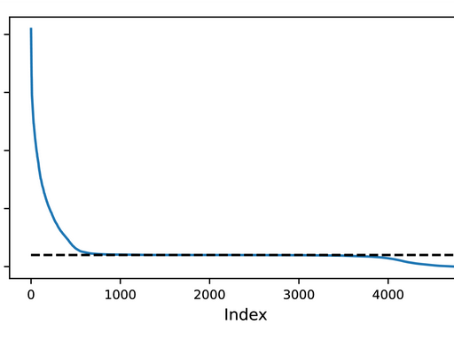

3. **模型优化与剪枝**
   - 初始化：控制权重方差使 $\sigma_{\max}(J)\approx1$（如He初始化），避免梯度异常；
   - 剪枝：保留对应大奇异值的参数/神经元，压缩模型同时维持性能。

---

#### 四、与相关概念的区别

- **Jacobian谱 vs  Hessian谱**：Jacobian是一阶导数矩阵（刻画梯度与映射），Hessian是二阶导数矩阵（刻画曲率与极值）；
- **特征值谱 vs 奇异值谱**：特征值仅对方阵有定义，含旋转/反射信息；奇异值对任意矩阵有定义，仅刻画伸缩与降维，更稳定。

---

#### 五、总结

Jacobian谱是**局部线性化的“指纹”**，通过特征值/奇异值定量描述映射的伸缩、稳定性与秩结构。在深度学习中，它是理解**梯度流动、模型表达能力与优化行为**的核心工具，指导初始化、正则化与模型设计。
