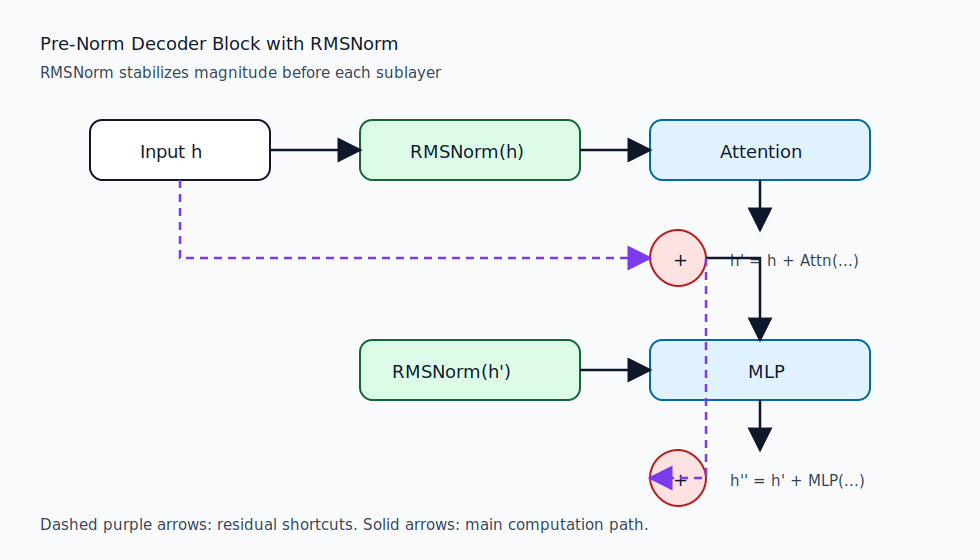
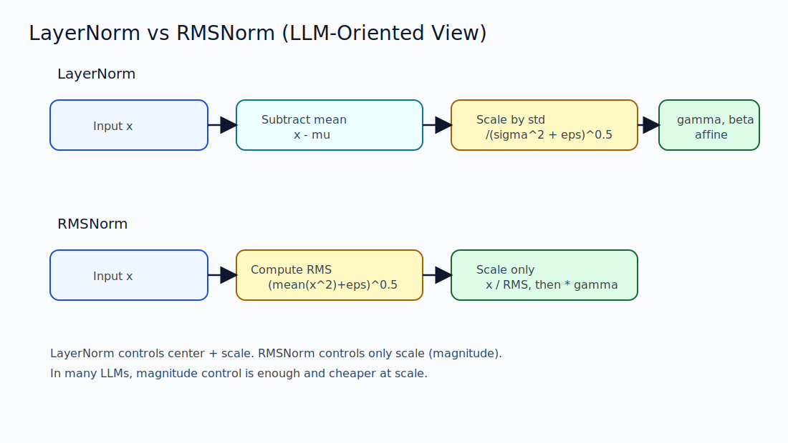
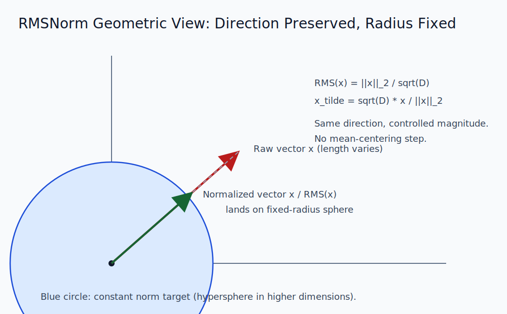

# RMSNorm in LLMs (Detailed Notes)

---

## 1) Why RMSNorm appears in modern LLMs

Large language models stack many transformer blocks. As depth increases, hidden-state scale can drift, making optimization unstable and slower.

RMSNorm (Root Mean Square Normalization) is a lightweight normalization method used in many modern LLMs because it:

- stabilizes hidden-state magnitude,
- is cheaper than LayerNorm,
- works well with pre-norm transformer designs,
- keeps strong empirical quality in autoregressive language modeling.

Common examples include decoder-only LLM variants that replace LayerNorm with RMSNorm for speed and simplicity.

---

## 2) RMSNorm formula

For one token vector $x \in \mathbb{R}^{D}$:

$$
\mathrm{RMS}(x) = \sqrt{\frac{1}{D}\sum_{i=1}^{D}x_i^2 + \epsilon}
$$

$$
y_i = \gamma_i \cdot \frac{x_i}{\mathrm{RMS}(x)}
$$

Where:

- $\gamma \in \mathbb{R}^{D}$ is a learnable scale vector,
- $\epsilon$ is for numerical stability,
- there is usually no bias term $\beta$ in standard RMSNorm implementations.

Key difference from LayerNorm: RMSNorm does not subtract the mean.

---

## 3) RMSNorm in transformer blocks

In a pre-norm decoder block, RMSNorm is typically applied before attention and before the MLP:

$$
h' = h + \mathrm{Attention}(\mathrm{RMSNorm}(h))
$$

$$
h'' = h' + \mathrm{MLP}(\mathrm{RMSNorm}(h'))
$$

Why this helps in LLM training:

- Residual stream keeps a clean additive path.
- Normalized magnitude prevents exploding activation scale.
- Lower normalization overhead improves throughput at scale.



---

## 4) LayerNorm vs RMSNorm

### Core equations

LayerNorm:

$$
\mu = \frac{1}{D}\sum_{i=1}^{D}x_i,
\quad
\sigma^2 = \frac{1}{D}\sum_{i=1}^{D}(x_i-\mu)^2
$$

$$
y_i = \gamma_i \cdot \frac{x_i-\mu}{\sqrt{\sigma^2+\epsilon}} + \beta_i
$$

RMSNorm:

$$
y_i = \gamma_i \cdot \frac{x_i}{\sqrt{\frac{1}{D}\sum_{j=1}^{D}x_j^2+\epsilon}}
$$

### Practical comparison for LLMs

| Aspect | LayerNorm | RMSNorm |
|---|---|---|
| Centering (subtract mean) | Yes | No |
| Scale normalization | Yes | Yes |
| Learnable parameters | $\gamma, \beta$ | typically $\gamma$ only |
| Computation | Higher | Lower |
| Memory/bandwidth cost | Higher | Lower |
| Typical modern LLM usage | Still used | Very common |

Interpretation:

- LayerNorm controls both mean and variance-like spread.
- RMSNorm controls overall magnitude only.
- In deep autoregressive transformers, controlling magnitude is often sufficient, so RMSNorm gives a better efficiency-quality tradeoff.



---

## 5) Geometric Interpretation

RMSNorm has a clean geometric view.

For token vector $x$:

$$
\|x\|_2 = \sqrt{\sum_{i=1}^{D}x_i^2},
\quad
\mathrm{RMS}(x) = \frac{\|x\|_2}{\sqrt{D}}
$$

So normalized output (ignoring $\epsilon$ and $\gamma$) is:

$$
\widetilde{x} = \frac{x}{\mathrm{RMS}(x)} = \sqrt{D}\,\frac{x}{\|x\|_2}
$$

This means:

- Direction is preserved: $\tilde{x}$ points in the same direction as $x$.
- Radius is fixed: all vectors are projected to a hypersphere of radius $\sqrt{D}$.
- Only magnitude is standardized; feature mean is not explicitly forced to zero.

Geometric contrast with LayerNorm:

- LayerNorm first recenters vectors by subtracting their mean (projection toward a zero-mean hyperplane), then rescales.
- RMSNorm skips recentering and only performs radial rescaling.

Intuition for LLMs:

- The model keeps semantic direction information in hidden space.
- RMSNorm makes step-to-step scale more predictable for optimization.
- Residual additions remain numerically stable because vector lengths are controlled.



---

## 6) Complexity intuition

Both methods are $O(D)$ per token, but RMSNorm has fewer operations:

- no mean subtraction,
- no variance around mean,
- usually no bias add.

At LLM scale (huge token counts and deep stacks), this constant-factor reduction is meaningful for latency and training cost.

---

## 7) Minimal PyTorch-style implementation

```python
import torch
import torch.nn as nn


class RMSNorm(nn.Module):
	def __init__(self, dim: int, eps: float = 1e-6):
		super().__init__()
		self.eps = eps
		self.weight = nn.Parameter(torch.ones(dim))

	def forward(self, x: torch.Tensor) -> torch.Tensor:
		# x: (..., D)
		rms = torch.sqrt(x.pow(2).mean(dim=-1, keepdim=True) + self.eps)
		x_norm = x / rms
		return self.weight * x_norm
```

Notes:

- `dim=-1` matches transformer hidden dimension normalization.
- `eps` may need tuning for mixed precision stability.
- Many production implementations fuse RMSNorm kernels for additional speed.

---

## 8) When to prefer LayerNorm vs RMSNorm

Use RMSNorm when:

- building decoder-only LLMs where throughput is critical,
- pre-norm architecture is used,
- you want a simpler normalization with strong empirical results.

Use LayerNorm when:

- exact centering behavior is important for a specific architecture,
- compatibility with existing checkpoints/designs is required,
- you are reproducing models that were tuned with LayerNorm.

---

## 9) Short takeaway

RMSNorm is a magnitude-only normalization that preserves hidden-state direction while stabilizing scale. In modern LLMs, this often provides nearly the same modeling quality as LayerNorm with lower compute overhead, which is why RMSNorm is now widely adopted in large-scale transformer training and inference.
