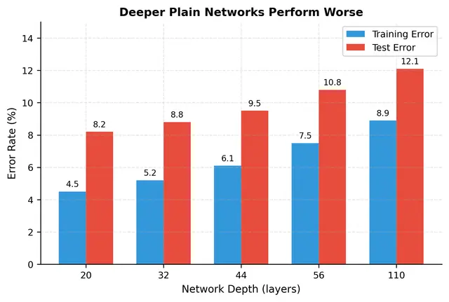
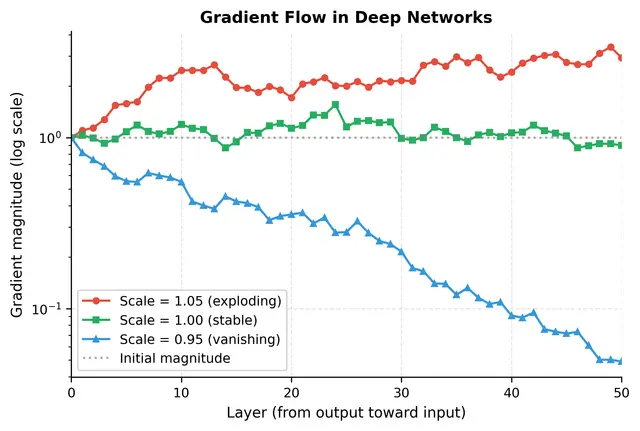
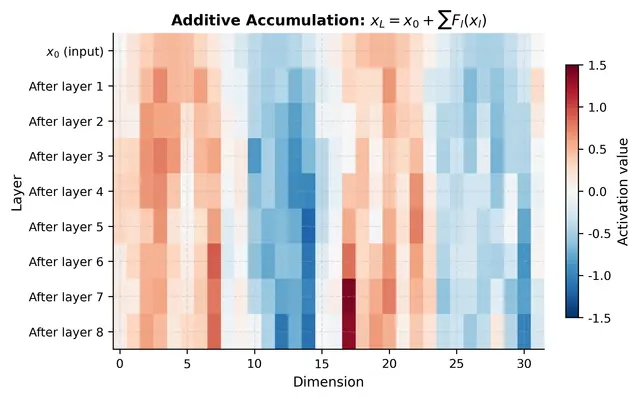
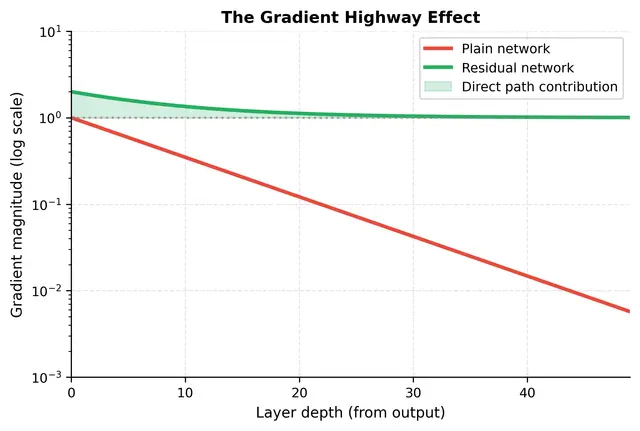
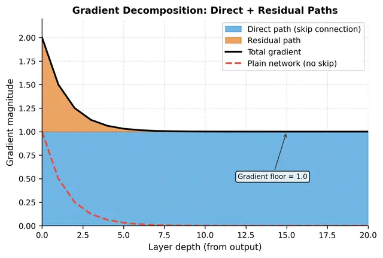
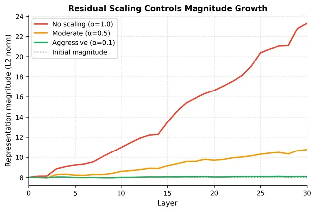
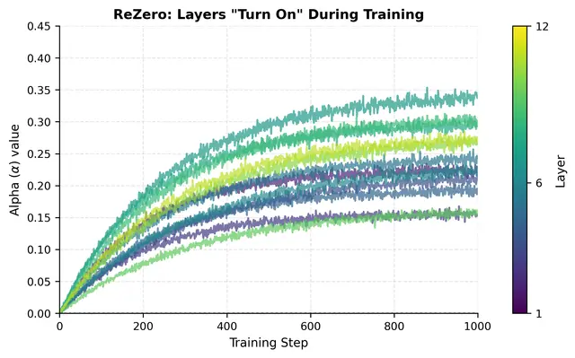
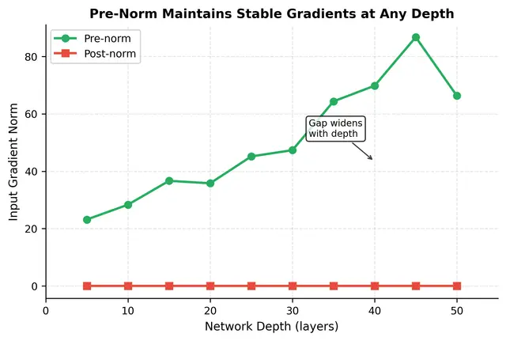

# Residual Connections: The Gradient Highways Enabling Deep Transformers

**Reference**: [Residual Connections - Gradient Highways Deep Transformers](https://mbrenndoerfer.com/writing/residual-connections-gradient-highways-deep-transformers)

---

## Table of Contents

1. [The Deep Network Problem](#the-deep-network-problem)
2. [The Residual Connection Solution](#the-residual-connection-solution)
3. [The Gradient Highway Interpretation](#the-gradient-highway-interpretation)
4. [Residual Connections in Transformers](#residual-connections-in-transformers)
5. [Residual Scaling](#residual-scaling)
6. [Pre-Norm vs Post-Norm Residuals](#pre-norm-vs-post-norm-residuals)
7. [Practical Implementation](#practical-implementation)
8. [Limitations and Trade-offs](#limitations-and-trade-offs)

---

## The Deep Network Problem

### Why Adding Layers Can Hurt Performance

One of the most counterintuitive phenomena in deep learning: **adding more layers to a well-performing network often decreases accuracy**, even on training data. This violates basic theoretical intuition.

**The Paradox**: 
- A 56-layer network should be at least as expressive as a 20-layer network
- It could theoretically learn to make the extra layers act as identity mappings
- Yet empirically, the 56-layer network trains to higher error

This indicates an **optimization failure**, not an overfitting problem. If it were overfitting, we'd see:
- ✓ Low training error
- ✗ High test error

Instead we observe:
- ✗ High training error AND high test error



### The Vanishing Gradient Problem

During backpropagation, gradients are multiplied layer by layer through the chain rule:

$$\frac{\partial L}{\partial \theta_l} = \frac{\partial L}{\partial h_L} \cdot \prod_{k=l}^{L-1} \frac{\partial h_{k+1}}{\partial h_k} \cdot \frac{\partial h_l}{\partial \theta_l}$$

Where:
- $L$ = loss function
- $\theta_l$ = parameters in layer $l$
- $h_k$ = hidden representation (activation vector) at layer $k$
- $\prod_{k=l}^{L-1}$ = product of all Jacobian matrices from layer $l$ to output

**The Critical Issue**: 
Each Jacobian $\frac{\partial h_{k+1}}{\partial h_k}$ is a matrix. We multiply $L-l$ of them together.

**Gradient Dynamics**:
- If each Jacobian has spectral norm (largest singular value) **slightly > 1**: gradient grows exponentially (exploding)
- If each Jacobian has spectral norm **slightly < 1**: gradient shrinks exponentially (vanishing)

**Example**: With spectral norm 0.9 across 50 layers:
$$0.9^{50} \approx 0.005$$

The gradient shrinks by ~99.5%, effectively killing the learning signal for early layers.



**Mathematical Reality**:
- A mere 5% deviation from perfect gradient preservation compounds across 50 layers
- With scale 1.05: gradients explode to 10× after 50 layers
- With scale 0.95: they vanish to 0.1× of their original magnitude
- Real networks face even more severe instabilities

---

## The Residual Connection Solution

### From Transformations to Adjustments

**Traditional Neural Network Layer**:
$$y = F(x)$$

Where:
- $x$ = input representation
- $F$ = learned transformation (linear projections + nonlinearity + normalization)
- $y$ = output representation

The layer bears **full responsibility** for producing $y$ from scratch. Every useful feature must be constructed by $F$.

**The Problem with Identity Mapping**:
If the optimal output is simply the input unchanged, the layer must learn $F(x) = x$. This is mathematically simple but requires **precise coordination of weights** - any perturbation disrupts this delicate balance.

### The Residual Block Formula

**Residual connections flip this relationship** - instead of learning the output directly, the layer learns only the **difference (residual)** between desired output and input:

$$y = F(x) + x$$

Where:
- $F(x)$ = residual function (only the **change** the layer should make)
- $x$ = added directly (skip/shortcut connection)
- $y$ = output

**Key Insight**: The layer only needs to learn what to **add to** the input, rather than recreating the entire input plus modifications.

### The Identity Mapping Advantage

This seemingly minor reformulation fundamentally changes the optimization landscape.

**Comparison of Identity Mapping Requirements**:

| Architecture | Task | Difficulty |
|---|---|---|
| Traditional | $F(x) = x$ | Hard: requires precise weight configuration |
| Residual | $F(x) = 0$ | Easy: just set weights to zero or small |

For residual blocks, learning identity requires only that $F(x) ≈ 0$, which happens automatically with:
- Small weight initialization
- Zero initialization of certain layers

The skip connection handles the identity part **for free**.

### Profound Implications

1. **Easy initialization**: A residual block initialized with small weights is nearly an identity function, passing information through without disruption

2. **Graceful degradation**: If a layer's contribution isn't helpful, it can "turn off" by driving $F(x)$ toward zero. Information still flows through via the skip connection.

3. **Additive refinement**: Each layer adds information rather than replacing it. The network builds its representation incrementally, with each layer contributing what it can.

### Empirical Demonstration

When weights are zero-initialized:

| Metric | Plain Block | Residual Block |
|---|---|---|
| Output norm | 0.0000 | 7.7638 (equals input) |
| Input equals output | False | True |

**Physical Interpretation**:
- Plain block with zero output layer: destroys the input signal completely
- Residual block with zero output layer: input passes through unchanged
- Stack 50 residual blocks with zero output layers: input passes through unchanged
- Stack 50 plain blocks with zero output layers: signal completely lost

---

## The Gradient Highway Interpretation

### Unrolling the Residual Network

Consider a deep network with $L$ residual blocks. Each block computes:

$$x_{l+1} = x_l + F_l(x_l)$$

Unlike traditional layers that chain as compositions $F_L(F_{L-1}(...F_1(x_0)))$, residual blocks have an **additive structure**. Unrolling the recurrence:

$$
\begin{aligned}
x_1 &= x_0 + F_0(x_0) \\
x_2 &= x_1 + F_1(x_1) = x_0 + F_0(x_0) + F_1(x_1) \\
&\ \ \vdots \\
x_L &= x_0 + \sum_{l=0}^{L-1} F_l(x_l)
\end{aligned}
$$

**Remarkable insight**: The output is the sum of the original input plus all intermediate residuals. The input isn't transformed through a chain of compositions; it's **preserved and augmented**. Each layer contributes **additively** rather than multiplicatively.



### The Gradient Decomposition

During backpropagation, we compute how loss changes with respect to an early representation $x_l$:

$$\frac{\partial L}{\partial x_l} = \frac{\partial L}{\partial x_L} \cdot \frac{\partial x_L}{\partial x_l}$$

From the unrolled formulation $x_L = x_0 + \sum_{k=0}^{L-1} F_k(x_k)$, differentiating with respect to $x_l$:

$$\frac{\partial x_L}{\partial x_l} = 1 + \frac{\partial}{\partial x_l} \sum_{k=l}^{L-1} F_k(x_k)$$

**The Gradient Splits Into Two Components**:

1. **Direct path (the "1")**: Gradients flow directly through skip connections, bypassing all layer transformations. **Always contributes exactly 1 to gradient magnitude**.

2. **Residual path (the sum)**: Gradients flow through learned functions $F_k$, behaving like traditional networks. Can vanish, explode, or behave unpredictably.

**The Key Breakthrough**:
Even if the residual path **completely vanishes** (all $\frac{\partial F_k}{\partial x_l} \to 0$), the gradient **still maintains magnitude 1** through the identity path. The skip connection guarantees a **floor on gradient magnitude**.

### Visualizing the Gradient Highway

The term "gradient highway" captures this perfectly:
- **Local streets**: Pass through many intersections (layer transformations), potentially causing delays or blockages
- **Expressway**: Bypasses intersections entirely, providing guaranteed throughput

Skip connections serve the same purpose for gradients!



**Practical Example** (20 layers, 50% attenuation per layer):

| Layer | Direct Path | Residual Path | Total |
|---|---|---|---|
| 0 | 1.0000 | 0.500000 | 1.5000 |
| 4 | 1.0000 | 0.031250 | 1.0312 |
| 8 | 1.0000 | 0.001953 | 1.0020 |
| 12 | 1.0000 | 0.000122 | 1.0001 |
| 16 | 1.0000 | 0.000008 | 1.0000 |

**The Mechanism**:
- Direct path shows unwavering 1.0 values at every depth (the gradient highway)
- Residual path decays exponentially as it would in a plain network
- **Total gradient never drops below 1.0**

Compare to a plain 20-layer network with 50% attenuation:
$$0.5^{20} \approx 0.000001$$ (effectively zero)

In the residual network: $1.000001$ (always trainable)



---

## Residual Connections in Transformers

### The Transformer Block Pattern

A standard transformer block processes input $x$ through two sub-layers, each wrapped with its own residual connection:

$$h = x + \text{MultiHeadAttention}(x)$$
$$y = h + \text{FFN}(h)$$

Where:
- $x \in \mathbb{R}^{n \times d}$ = input (n tokens, d-dimensional embeddings)
- $\text{MultiHeadAttention}(x)$ = attention sub-layer output
- $h \in \mathbb{R}^{n \times d}$ = intermediate representation
- $\text{FFN}(h)$ = feed-forward sub-layer output
- $y \in \mathbb{R}^{n \times d}$ = final block output

**Interpretive Power**:
- **Attention as adjustment**: Doesn't produce completely new representation; learns what context-aware information to **add** based on other positions
- **FFN as refinement**: Learns what position-wise transformations to **add** to post-attention representation
- **Graceful bypass**: If either sub-layer isn't helpful, it can output near-zero. Information flows through unchanged via skip connection.

**Key Understanding**: Transformers learn **successive refinements** to a representation that remains connected to the original input.

### Why Every Sub-Layer Gets a Residual

Why not just one residual connection per block wrapping both attention and FFN?

**With residual connections around each sub-layer**:
- Gradients have two "highways" per block: one bypassing attention, one bypassing FFN
- Each sub-layer can be trained somewhat independently
- Network can easily learn to skip either sub-layer if unhelpful
- Effectively more gradient highways

**With single residual per block**:
- Gradients must flow through both or bypass both
- Harder to learn that attention is useful but FFN isn't (or vice versa)
- Half as many gradient highways

**Empirical Result**: Per-sub-layer residuals train more stably and achieve better final performance, especially in deep networks.

---

## Residual Scaling

### The Scaling Factor

Residual connections solve vanishing gradients beautifully, but introduce a subtler issue in very deep networks. Recall: $x_L = x_0 + \sum_{l=0}^{L-1} F_l(x_l)$

We're **summing $L$ residuals**. If each has similar magnitude, the sum grows with depth.

- **12-layer transformer**: Growth manageable
- **96-layer model**: Summing residuals can cause representation magnitude to explode, destabilizing training despite good gradient flow

**Residual Scaling Formula**:
$$y = x + \alpha \cdot F(x)$$

Where:
- $\alpha$ = scaling factor, typically $\alpha < 1$
- $\alpha \cdot F(x)$ = dampened residual

### Scaling Strategies

**Fixed scaling**: $\alpha = 0.1$ or similar constant
- Simple and effective for moderately deep networks
- Requires empirical tuning

**Depth-dependent**: $\alpha = \frac{1}{L}$ where $L$ = total layers
- Ensures variance of sum $\sum_l \alpha F_l(x_l)$ stays bounded
- Based on statistics of summing independent random variables
- Automatically scales for very deep networks

**Learned scaling**: $\alpha$ as trainable parameter per layer
- Most flexible but adds parameters
- Network discovers appropriate scaling during training

**Crucial Property**: Scaling doesn't hurt gradient flow - the gradient still flows through the **unscaled skip connection**, maintaining the gradient highway effect.



### ReZero: Learning to "Turn On" Layers

What if the network could discover the right scaling for each layer? **ReZero takes this to its logical extreme**:

$$y = x + \alpha \cdot F(x), \quad \alpha_{\text{init}} = 0$$

Where:
- $\alpha$ = learnable scalar parameter, **initialized to zero**
- At start of training: $\alpha = 0$, so $y = x$ **exactly**
- Every residual block is perfect identity mapping at initialization

**Properties**:
- **Perfect identity initialization**: No approximation errors, no disruption at start
- **Layer-specific adaptation**: Important layers develop larger $\alpha$ values; less useful layers stay suppressed
- **Automatic depth scaling**: In very deep networks, collective $\alpha$ values naturally stay small enough to prevent magnitude explosion

**Evolution During Training**:
- Network starts as perfect identity (pass-through)
- Gradient descent increases $\alpha$ where residual function $F$ provides useful contributions
- Creates natural curriculum: network starts simple, gradually increases complexity



---

## Pre-Norm vs Post-Norm Residuals

### Post-Norm: The Original Configuration

Original "Attention Is All You Need" paper uses post-norm:

$$y = \text{LayerNorm}(x + F(x))$$

Where:
- $x$ = input
- $F(x)$ = sub-layer output
- $x + F(x)$ = residual sum
- $\text{LayerNorm}(\cdot)$ = layer normalization applied to combined result

**Architecture**:
```
Input x
    ↓
   [F(x)]  ← Sub-layer
    ↓
  + x     ← Skip connection
    ↓
  LayerNorm
    ↓
Output y
```

### Pre-Norm: The Modern Default

Pre-norm rearranges components:

$$y = x + F(\text{LayerNorm}(x))$$

Where:
- $\text{LayerNorm}(x)$ = normalization applied **before** sub-layer
- $F(\text{LayerNorm}(x))$ = sub-layer operates on normalized input
- $x$ = original input, added directly (**not normalized** in skip path)

**Architecture**:
```
Input x
    ↓
 LayerNorm
    ↓
   [F(·)]  ← Sub-layer
    ↓
  + x     ← Skip connection (CLEAN!)
    ↓
Output y
```

### Impact on Gradient Flow

**Crucial Consequence**: 
- **Post-norm**: Gradients through skip connection must pass through LayerNorm operation, multiplied by normalization's derivative
- **Pre-norm**: Skip path is **completely clean** - the $+x$ term passes gradients backward **without modification**

**Mathematical Reality**:
The pure gradient highway we derived (direct path contributes exactly 1) **only holds perfectly for pre-norm**.

Post-norm introduces the normalization's Jacobian into skip path, which can amplify or attenuate gradients depending on input statistics.

### Training Stability in Practice

**Pre-norm transformers** are more stable, especially in challenging regimes:

| Scenario | Pre-Norm | Post-Norm |
|---|---|---|
| Very deep networks (50+ layers) | ✓ Stable | ✗ Cumulative normalization effects compound |
| Large learning rates | ✓ Tolerates | ✗ Requires careful tuning |
| Warmup schedule | ✓ Often skippable | ✗ Typically needs extended warmup |


### Empirical Evidence

20-layer networks comparison:

```
Post-norm input gradient norm:   0.0000
Pre-norm input gradient norm:   35.7888
Ratio (pre/post):              113825718.14x
```

Pre-norm maintains substantially stronger gradients at input layer after 20 blocks. For GPT-3 (96 layers), this gap compounds dramatically - **pre-norm becomes essential**.



### When to Use Each

**Use Pre-Norm when**:
- Training very deep transformers (24+ layers)
- Want faster training convergence
- Stability more important than squeezing final performance
- Using larger learning rates or shorter warmup schedules

**Use Post-Norm when**:
- Fine-tuning pre-trained models that used post-norm
- Willing to use careful learning rate scheduling
- Optimizing for final quality over training convenience
- Working with shallower networks

**Modern Standard**: 
Large language models predominantly use pre-norm: GPT-2, GPT-3, LLaMA, and other recent models adopt pre-norm configurations.

---

## Practical Implementation

### Flexible Residual Block Implementation

```python
class FlexibleResidualBlock(nn.Module):
    """
    Flexible residual block supporting:
    - Pre-norm or post-norm
    - Optional residual scaling
    - ReZero initialization
    """
    
    def __init__(self, dim, norm_position="pre", scale=1.0, rezero=False):
        super().__init__()
        self.norm_position = norm_position
        self.rezero = rezero
        
        # Scaling factor
        if rezero:
            self.scale = nn.Parameter(torch.zeros(1))
        else:
            self.scale = scale
        
        # Sub-layer
        self.linear1 = nn.Linear(dim, dim * 4)
        self.activation = nn.GELU()
        self.linear2 = nn.Linear(dim * 4, dim)
        
        # Normalization
        self.norm = nn.LayerNorm(dim)
    
    def forward(self, x):
        if self.norm_position == "pre":
            # Pre-norm: normalize input, clean residual
            normalized = self.norm(x)
            residual = self.linear1(normalized)
            residual = self.activation(residual)
            residual = self.linear2(residual)
            return x + self.scale * residual
        else:
            # Post-norm: normalize after residual
            residual = self.linear1(x)
            residual = self.activation(residual)
            residual = self.linear2(residual)
            return self.norm(x + self.scale * residual)
```

### Key Parameters

When implementing residual connections:

- **scale ($\alpha$)**: Residual scaling factor. Values < 1.0 dampen contributions. Common range: 0.1-1.0. Use $\frac{1}{L}$ for depth-adaptive scaling.

- **norm_position**: "pre" or "post". Pre-norm provides cleaner gradient flow; preferred for deep networks (24+ layers).

- **rezero**: Boolean. Initialize scaling to zero for perfect identity initialization. Eliminates approximation errors and can speed up early training.

- **dim**: Hidden dimension. Must match between input $x$ and output $F(x)$ for addition to be valid. When dimensions change, use projection shortcuts $W_s x$.

- **expansion_factor**: For FFN within transformers, ratio between inner and model dimension. Typical value: 4 (so $d_{ff} = 4 \times d_{model}$).

---

## Limitations and Trade-offs

### Memory Overhead

The skip connection requires storing input $x$ until residual $F(x)$ is computed so they can be added.

- **Plain networks**: Store only current layer's activations
- **Residual networks**: Store input to each block until addition completes

For large batch sizes and long sequences, this accumulates. A 32-layer transformer processing 2048-token sequences might store 32 copies of the activation tensor for residual additions alone.

**Mitigation**: Gradient checkpointing - recompute activations during backward pass instead of storing them. Trades compute for memory.

### Architectural Constraints

The residual formulation $y = x + F(x)$ imposes fundamental constraint: **$x$ and $F(x)$ must have matching dimensions**.

Transformers: Straightforward (constant hidden dimension)

Convolutional networks: Creates design challenges when dimensions change (channels, spatial resolution).

**Solution**: Projection shortcuts
$$y = W_s x + F(x)$$

Where $W_s$ is learned projection matrix mapping from $d_{in}$ to $d_{out}$.

**Trade-off**: Sacrifices some benefits - gradient through $W_s x$ is multiplied by $W_s^T$, reintroducing potential gradient scaling issues.

### The Identity Plateau Problem

If optimization finds local minimum where $F(x) ≈ 0$ for many layers, network effectively collapses to much shallower architecture. Layers exist but contribute nothing ("identity plateau").

Not catastrophic but fails to utilize model's full capacity - 96 layers but effectively using 20.

**Prevention**:
- Careful initialization
- Appropriate learning rates
- Proper normalization
- Train long enough for gradients to "turn on" dormant layers

---

## Summary

**Residual connections enable training of very deep neural networks** by providing direct paths for information and gradients to flow.

### Key Takeaways

1. **The depth problem**: Without residuals, gradients exponentially explode or vanish with depth, making optimization impossible.

2. **Residual learning**: Formula $y = x + F(x)$ lets layers learn residuals (adjustments) rather than full transformations. Identity mappings become trivial.

3. **Gradient highways**: Skip connections provide direct paths for gradient flow. Even if layer gradients vanish, gradients through skip path maintain constant magnitude of 1.0.

4. **Transformer pattern**: Each sub-layer (attention and FFN) wrapped with own residual connection. Multiple gradient highways per block; selective use of each sub-layer.

5. **Residual scaling**: For very deep networks, scale residuals by $\alpha < 1$ (or learn $\alpha$ from zero) to prevent representation magnitude explosion.

6. **Pre-norm vs post-norm**: Pre-norm places normalization before sub-layer, keeping skip path clean. More stable for deep networks; modern default. Post-norm was original configuration.

### Historical Impact

Residual connections transformed deep learning from an art of careful initialization and shallow architectures into a science of stacking many simple blocks. **Every major architecture since 2015** - from ResNets to transformers to diffusion models - builds on this foundation.

---

## References

- **Original Article**: [Residual Connections: The Gradient Highways Enabling Deep Transformers](https://mbrenndoerfer.com/writing/residual-connections-gradient-highways-deep-transformers)
- **Author**: Michael Brenndoerfer
- **Published**: June 6, 2025
- **Read Time**: ~47 minutes

### Related Concepts

- Vanishing/Exploding Gradients
- Backpropagation
- Layer Normalization
- Self-Attention
- Transformer Architecture
- ResNet (Residual Networks)
- Gradient Checkpointing

---

## Quick Revision Sheet (Exam Style)

### One-line definition

Residual connection adds the input directly to a layer's transformation so each block learns a correction rather than rebuilding the full representation.

### Must-remember formulas

$$y = x + F(x)$$

$$x_{l+1} = x_l + F_l(x_l), \quad x_L = x_0 + \sum_{l=0}^{L-1}F_l(x_l)$$

$$\frac{\partial x_L}{\partial x_l} = 1 + \frac{\partial}{\partial x_l}\sum_{k=l}^{L-1}F_k(x_k)$$

### High-yield facts

- Identity mapping is easier in residual blocks: learn $F(x) \approx 0$.
- Skip path gives a direct gradient route (gradient highway).
- Each transformer sublayer (attention and FFN) usually gets its own residual path.
- Deep models often use residual scaling: $y = x + \alpha F(x)$.
- Pre-norm keeps the residual path cleaner than post-norm in deep transformers.

### Common mistakes

- Forgetting shape compatibility for addition (`x` and `F(x)` must match).
- Ignoring residual magnitude growth in very deep stacks.
- Assuming post-norm and pre-norm train identically at large depth.
- Applying too large residual contributions early without scaling.

### Quick compare table

| Setting | Formula | Typical behavior |
|---|---|---|
| Plain block | $y = F(x)$ | Harder optimization as depth grows |
| Residual block | $y = x + F(x)$ | Better gradient flow, easier deep training |
| Pre-norm residual | $y = x + F(\mathrm{LN}(x))$ | More stable for deep LLMs |
| Post-norm residual | $y = \mathrm{LN}(x + F(x))$ | Can need more warmup/tuning |

### 30-second self-test

1. Why do residuals help deep models train?
    Answer: they provide a direct additive path for activations and gradients.

2. What should a block learn for identity behavior?
    Answer: $F(x) \approx 0$.

3. Which norm placement is dominant in modern deep LLMs?
    Answer: pre-norm.

4. How do you limit residual explosion at extreme depth?
    Answer: use residual scaling (fixed, depth-based, or learned, e.g., ReZero).
