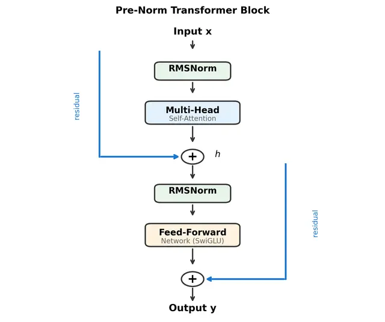
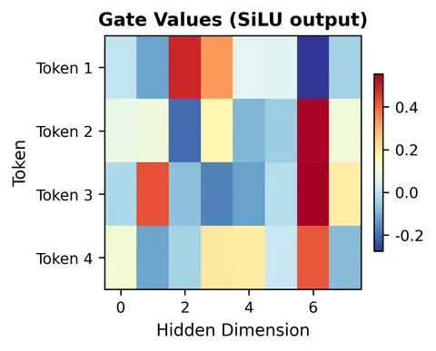
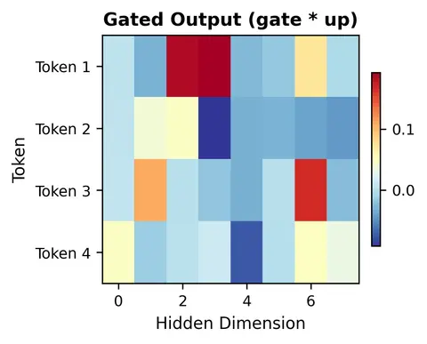
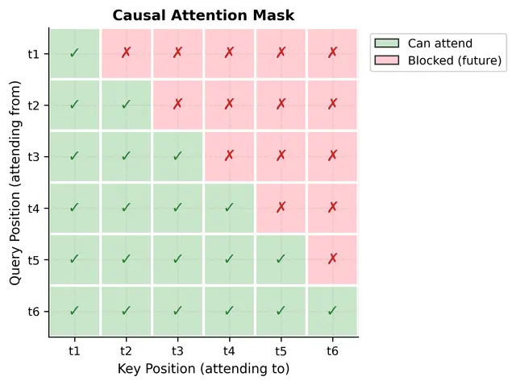
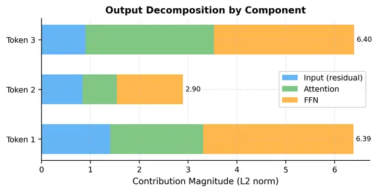
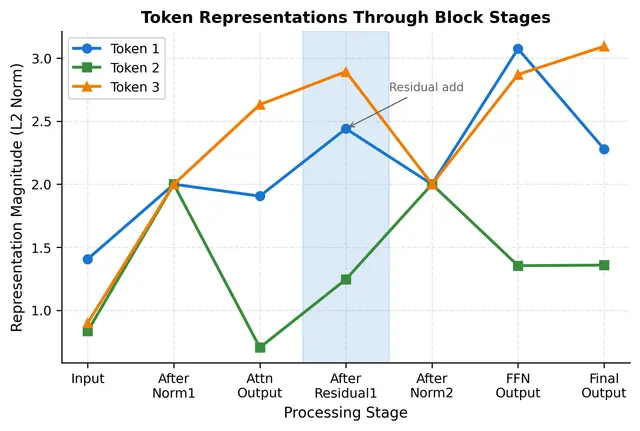
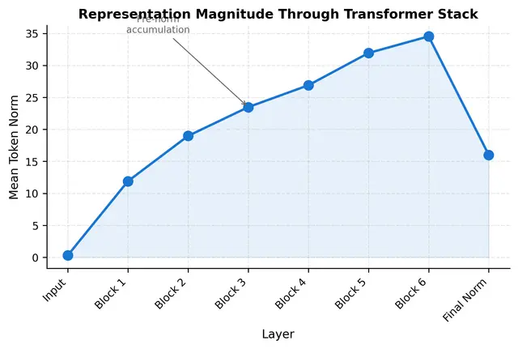
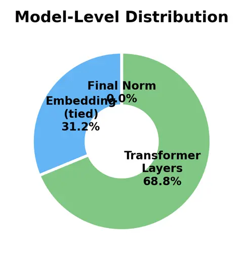
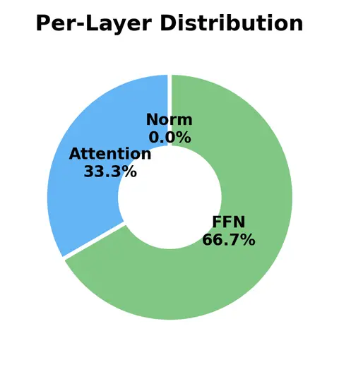
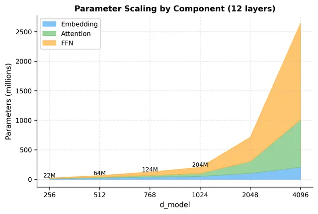

# Transformer Block Assembly: Building Complete Encoder & Decoder Blocks

Reference article: https://mbrenndoerfer.com/writing/transformer-block-assembly

## Key Equations (Cheat Sheet)

Pre-norm Transformer block:

$$
h = x + \mathrm{Attention}(\mathrm{Norm}(x)),\qquad
y = h + \mathrm{FFN}(\mathrm{Norm}(h))
$$

RMSNorm:

$$
\mathrm{RMSNorm}(x)=\gamma\odot\frac{x}{\mathrm{RMS}(x)},\qquad
\mathrm{RMS}(x)=\sqrt{\frac{1}{d}\sum_{i=1}^{d}x_i^2+\epsilon}
$$

SwiGLU FFN:

$$
\mathrm{SwiGLU}(x)=\big(\mathrm{SiLU}(xW_{gate})\odot(xW_{up})\big)W_{down}
$$

Parameter counts (ignoring bias):

$$
\mathrm{Attention}: 4d_{model}^2,
\quad
\mathrm{Standard\ FFN}:2d_{model}d_{ff},
\quad
\mathrm{SwiGLU\ FFN}:3d_{model}d_{ff}
$$

Causal masking in decoder attention:

$$
	ilde{s}_{ij}=s_{ij}+M_{ij},\quad
M_{ij}=\begin{cases}
0,&j\le i\\
-\infty,&j>i
\end{cases}
$$

---

## 1) The Two-Sublayer Pattern

A complete Transformer block always has two core sublayers:

1. Multi-head self-attention: mixes information across token positions.
2. Feed-forward network (FFN): transforms each token independently.

Modern large models usually adopt a repeated pattern per sublayer:

1. Normalize input.
2. Apply sublayer transform.
3. Add residual connection.

This "normalize -> transform -> add" pattern is used for both attention and FFN, which makes blocks easy to stack deeply.

## 2) Why Pre-Norm Is the Modern Default

In pre-norm, normalization happens before each sublayer. Compared with post-norm, this keeps the residual highway cleaner during backpropagation, which improves stability in deep stacks.

Practical consequence:

- Pre-norm is dominant in GPT/LLaMA-like deep decoders.
- Post-norm appears in earlier designs such as original BERT-style architectures.

## 3) Component Inventory

### RMSNorm

RMSNorm is widely used in modern decoder LLMs because it is efficient and stable. It avoids mean-centering and only rescales by root-mean-square.

### Multi-head Self-Attention

Attention computes token-token interactions through Q/K/V projections, then concatenates head outputs and projects back:

$$
\mathrm{MultiHead}(X)=\mathrm{Concat}(head_1,\dots,head_h)W_O
$$

### FFN (Standard vs SwiGLU)

Standard FFN uses two linear layers with one activation in between. Modern architectures frequently replace this with SwiGLU for better expressiveness and gradient behavior.

## 4) Assembling Encoder vs Decoder Blocks

### Encoder block

- Self-attention without causal mask (bidirectional context).
- FFN sublayer.
- Residual around each sublayer.

### Decoder block

- Same structure, but self-attention uses causal mask to prevent future token leakage.
- Essential for autoregressive generation.

Causal mask shape is upper-triangular blocked region:

- Allowed: current and past positions.
- Blocked: future positions.

## 5) Dataflow Through a Block (Interpretation)

A useful decomposition of block output is:

$$
y=x+\Delta_{attn}+\Delta_{ffn}
$$

Interpretation:

- $x$: original signal preserved by residual path.
- $\Delta_{attn}$: cross-token contextual refinement.
- $\Delta_{ffn}$: per-token nonlinear refinement.

This decomposition explains why deep transformers remain trainable: gradients can pass through residual paths even when sublayer transforms are complex.

## 6) Stacking Blocks into a Model

A Transformer model is a stack of these blocks followed by final normalization.

As depth increases:

- representation norms may drift upward through repeated residual additions,
- final norm re-stabilizes scale before output/logit stages.

## 7) Parameter Distribution and Scaling Insight

Within each layer, FFN usually dominates parameter count. With SwiGLU, FFN becomes even more prominent because it uses three projection matrices.

Typical observation:

- Attention is expensive in sequence length ($O(n^2)$ in dense attention).
- FFN dominates parameter count and often dominates compute in short-to-medium sequence regimes.

## 8) Numerical Stability Checklist

Practical techniques from production implementations:

1. Compute normalization in float32 even under mixed precision.
2. Residual scaling for very deep models (optional but useful in extreme depth).
3. Cap extreme attention logits before softmax in unstable training regimes.
4. Use stable softmax implementation (subtract max before exponentiation).

## 9) Architecture Comparison (High Level)

- GPT-2 style: LayerNorm + pre-norm + standard GELU FFN.
- LLaMA style: RMSNorm + pre-norm + SwiGLU FFN + causal decoder setup.
- Mistral style: RMSNorm + pre-norm + SwiGLU, with attention-implementation differences.
- BERT style: LayerNorm + post-norm + bidirectional encoder attention.

## 10) Final Takeaways

1. A Transformer block is not just attention; it is attention + FFN, each wrapped by norm and residual.
2. Pre-norm is the modern stability baseline for deep models.
3. Decoder blocks differ mainly by causal masking behavior.
4. SwiGLU has become common due to strong quality/efficiency trade-offs.
5. FFN design and parameter allocation are central to modern LLM scaling.

