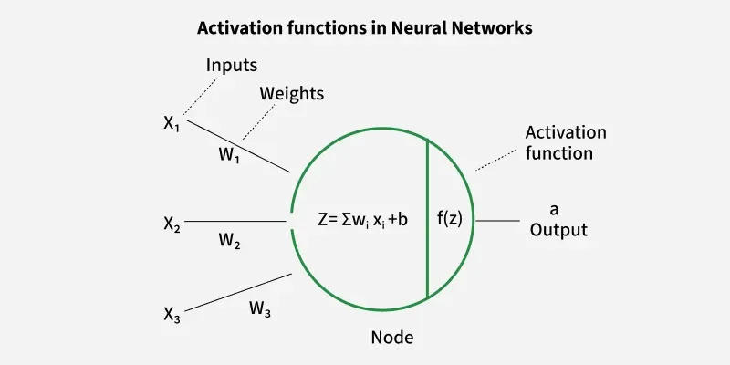

# Activation Functions

An activation function is applied to the weighted sum of inputs (before producing the final output of a neuron). It introduces non-linearity, enabling the model to learn and represent complex data patterns. Without it, even a deep neural network would behave like a simple linear regression model.

Activation functions decide whether a neuron should be activated based on the weighted sum of inputs and a bias term. They also make backpropagation possible by providing gradients for weight updates.

## Why Non-Linearity is Important

- Real-world data is rarely linearly separable.
- Non-linear functions allow neural networks to form curved decision boundaries, making them capable of handling complex patterns (e.g., classifying apples vs. bananas under varying colors and shapes).
- They ensure networks can model advanced problems like image recognition, NLP and speech processing.

## vivid way to see non-linearity

The vivid way to see non-linearity in action is through interactive "playgrounds" that let you build a neural network in your browser.  
[TensorFlow Playground](https://playground.tensorflow.org/)
