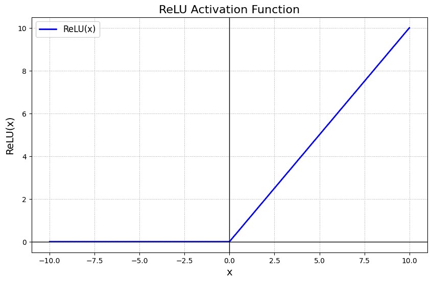

# ReLU Activation

ReLU is a widely used activation function in deep learning that outputs the input directly if it is positive and returns zero otherwise. Its simplicity and efficiency make it a default choice in many neural network architectures, helping models learn complex patterns while reducing issues like the vanishing gradient problem.

- Allows positive values to pass unchanged and sets negative values to zero.
- Simple and computationally efficient activation function.
- Helps maintain non-linearity in neural networks.
- Reduces the vanishing gradient problem compared to older functions.

    
    <figcaption>ReLU Activation Function</figcaption>

## Mathematical Form

The ReLU function can be described mathematically as follows:

$$f(x)=max(0,x)$$

Where:

- $x$ is the input to the neuron.
- The function returns x if x is greater than 0.
- If $x$ is less than or equal to 0, the function returns 0.

## Why is ReLU Popular?

- **Simplicity**: ReLU is computationally efficient as it involves only a thresholding operation. This simplicity makes it easy to implement and compute, which is important when training deep neural networks with millions of parameters.
- **Non-Linearity**: Although it seems like a piecewise linear function, ReLU is still a non-linear function. This allows the model to learn more complex data patterns and model intricate relationships between features.
- **Sparse Activation**: ReLU's ability to output zero for negative inputs introduces sparsity in the network, meaning that only a fraction of neurons activate at any given time. This can lead to more efficient and faster computation.
- **Gradient Computation**: ReLU offers computational advantages in terms of backpropagation, as its derivative is simple—either 0 (when the input is negative) or 1 (when the input is positive). This helps to avoid the vanishing gradient problem, which is a common issue with sigmoid or tanh activation functions.

## Drawbacks of ReLU

While ReLU has many advantages, it also comes with its own set of challenges:

- **Dying ReLU Problem**: One of the most significant drawbacks of ReLU is the "dying ReLU" problem, where neurons can sometimes become inactive and only output 0. This happens when large negative inputs result in zero gradient, leading to neurons that never activate and cannot learn further.
- **Unbounded Output**: Unlike other activation functions like sigmoid or tanh, the ReLU activation is unbounded on the positive side, which can sometimes result in exploding gradients when training deep networks.
- **Noisy Gradients**: The gradient of ReLU can be unstable during training, especially when weights are not properly initialized. In some cases, this can slow down learning or lead to poor performance.

## Variants of ReLU

To mitigate some of the problems associated with the ReLU function, several variants have been introduced:

1. Leaky ReLU
2. Parametric ReLU 
3. Exponential Linear Unit (ELU)

## When to Use ReLU?

- **Handling Sparse Data**: ReLU helps with sparse data by zeroing out negative values, promoting sparsity and reducing overfitting.
- **Faster Convergence**: ReLU accelerates training by preventing saturation for positive inputs, enhancing gradient flow in deep networks.

But, in cases where your model suffers from the "dying ReLU" problem or unstable gradients, trying alternative functions like Leaky ReLU, PReLU, or ELU could yield better results.
