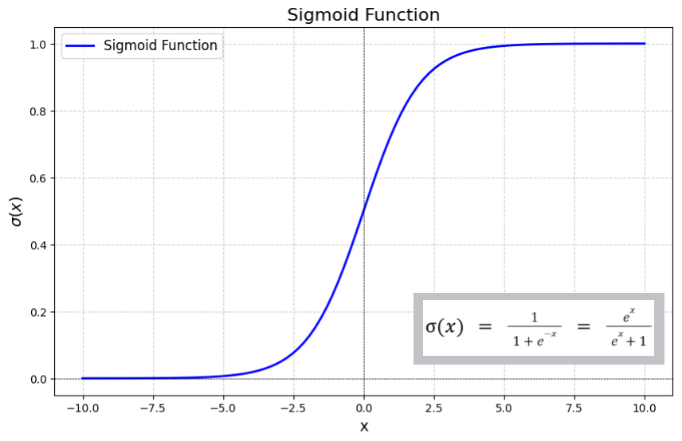
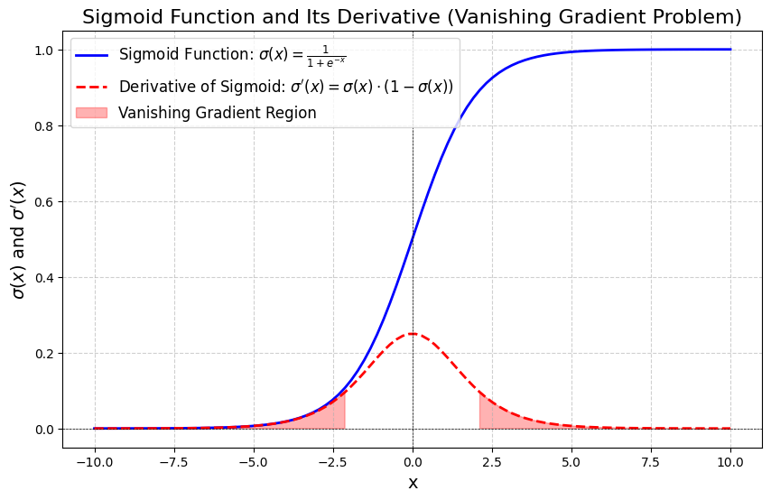

# Sigmoid

## Mathematical formula

Sigmoid is a mathematical function that maps any real-valued number into a value between 0 and 1.  
Mathematically, sigmoid is represented as:

 $$\sigma = (\frac{1}{1+e^{-x}})$$ 

where:

- $x$ is the input
- $e$ is Euler's number

**Sigmoid function** is used as an activation function in machine learning and neural networks for modeling **binary classification** problems, smoothing outputs, and introducing non-linearity into models.

    
    <figcaption>Graph of Sigmoid Activation Function</figcaption>

In this graph, the x-axis represents the input values that ranges from $-\infty$ to $\infty$ and y-axis represents the output values which always lie in $[0, 1]$.

## Sigmoid Function in Backpropagation

If we use a linear activation function in a neural network, the model will only be able to separate data linearly, which results in poor performance on non-linear datasets. However, by adding a hidden layer with a sigmoid activation function, the model gains the ability to handle non-linearity, thereby improving performance.

During the backpropagation, the model calculates and updates weights and biases by computing the derivative of the activation function. The sigmoid function is useful because:

- It is the only function that appears in its derivative.
- It is differentiable at every point, which helps in the effective computation of gradients during backpropagation.

### Derivative of Sigmoid Function

 $$\sigma^{'} = \sigma(x)(1 - \sigma(x))$$
$$
\begin{aligned}
\sigma^{'} &= \frac{e^{-x}}{(1+e^{-x})^2} \\
           &= \frac{1}{1+e^{-1}} \frac{e^{-x}}{1+e^{-x}} \\
           &= (\frac{1}{1+e^{-1}}) (1 - \frac{1}{1+e^{-x}}) \\
           &= \sigma(x)[1 - \sigma(x)]
\end{aligned}
$$

## Issue with Sigmoid Function in Backpropagation

One key issue with using the sigmoid function is the vanishing gradient problem. When updating weights and biases using gradient descent, if the gradients are too small, the updates to weights and biases become insignificant, slowing down or even stopping learning.

<figcaption>the derivative of the sigmoid function graphically</figcaption>

