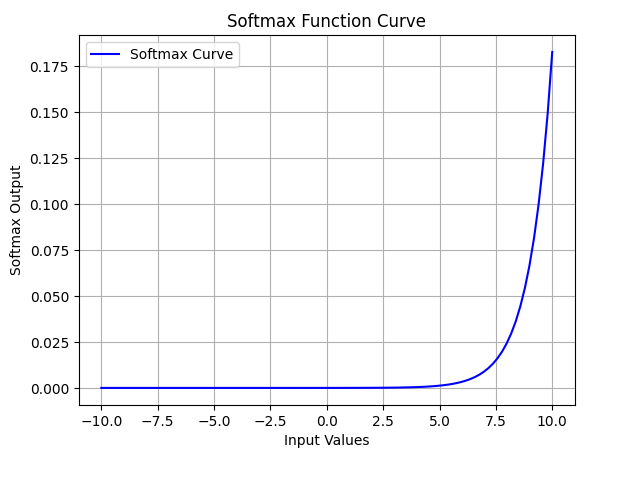

# Softmax Activation Function

In Deep Learning, activation functions are important because they introduce non-linearity into neural networks allowing them to learn complex patterns. Softmax Activation Function transforms a vector of numbers into a probability distribution, where each value represents the likelihood of a particular class. It is especially important for multi-class classification problems.

- Each output value lies between 0 and 1.
- The sum of all output values equals 1.

This property makes Softmax ideal for scenarios where each output neuron represents the probability of a distinct class.

## Softmax Function

For a given vector, $z =[z_1, z_2, ..., Z_n]$ the Softmax function is defined as:
$$\sigma(z_i) = \frac{e^{z_i}}{\sum_{j=1}^{n}{e^{z_j}}}$$

where:

- $e^{z_j}$: Exponentiation of the input value.
- $\sum_{j=1}^{n}{e^{z_j}}$: Sum of all exponentiated values to normalize outputs.

Each output $\sigma(z_i)$ represents the probability of class $j$

    
    <figcaption>Graph of Softmax Activation Function</figcaption>

## Key Characteristics

- **Normalization**: Converts logits into a probability distribution where the sum equals 1.
- **Exponentiation**: Amplifies larger values making the model’s confidence more pronounced.
- **Differentiable**: Enables gradient-based optimization during backpropagation.
- **Probabilistic Interpretation**: Makes output easier to interpret as class likelihoods.

## How Softmax Activation Function Works

Softmax converts a vector of raw scores into a probability distribution.

- **Input Scores**: Take the raw output vector from the model. These values can be any real numbers.
- **Exponentiate**: Apply $e^x$ to make every value positive and amplify differences.
- **Sum of exponentials**: Compute the normalising constant $\mathrm{Z} = \sum_{}^{} e^{x^{'}}$
- **Normalize**: Divide each exponent by $Z$ to get probabilities $p_i=\frac{e^{x_i^{'}}}{Z}$
- **Output (Probabilities)**: Final probability vector can be used with argmax to pick the predicted class.

## Why Use Softmax in the Last Layer

The Softmax Activation function is typically used in the final layer of a classification neural network because:

- It transforms the model raw output into interpretable probabilities.
- It ensures the outputs are mutually exclusive suitable for problems where each sample belongs to exactly one class.
- It works seamlessly with the Cross Entropy Loss Function which measures the difference between predicted and actual probabilities.

## Applications

- **Neural Networks**: Used in the output layer of models like CNNs or MLPs for multi-class classification.
- **Attention Mechanisms**: Assigns attention weights to different tokens or words, normalizing them to sum to 1.
- **Reinforcement Learning**: Converts Q values or action values into probabilities for stochastic action selection.
- **Model Ensembles**: Combines multiple model predictions into a single probabilistic output.

## Challenges

- **Overconfidence**: Tends to produce extremely confident predictions even for uncertain inputs.
- **Sensitivity to Outliers**: Small variations in logits can cause large shifts in probability outputs.
- **Softmax Bottleneck**: Limited ability to model complex relationships between output classes.
- **Poor Calibration**: Predicted probabilities often do not align with true likelihoods.
- **Gradient Saturation**: Can cause vanishing gradients when one class probability dominates others.

