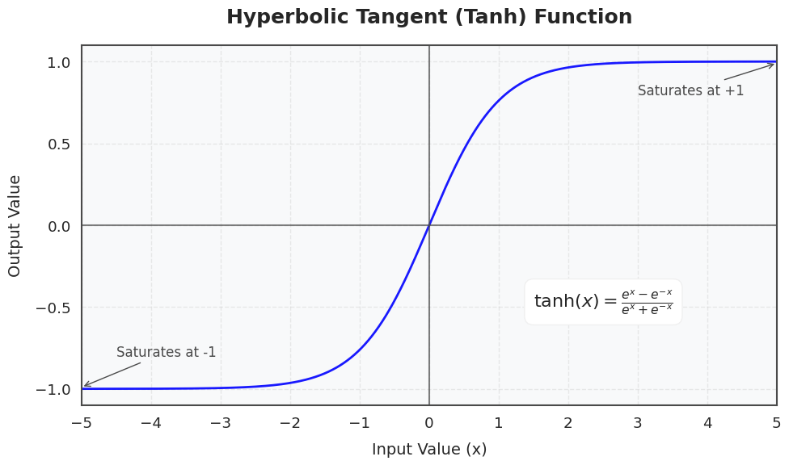
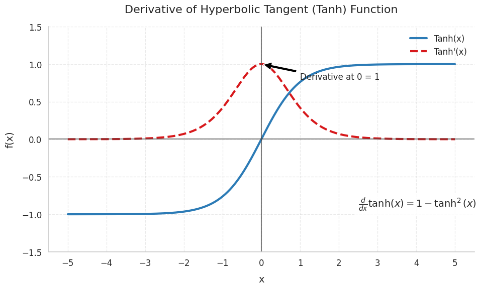

# Tanh Activation

Tanh (hyperbolic tangent) is a type of activation function that transforms its input into a value between -1 and 1.

It is mathematically defined as:

 $$f(x)=  tanh(x) = \frac{e^{x}-e^{-x}}{e^{x}+e^{-x}} = \frac{sinh(x)}{cosh(x)}$$ 

Where:
- $e$ is Euler's number (approximately 2.718). 
- $x$ is the input to the function.

## Tanh activation function graph

    
    <figcaption>Tanh activation function graph</figcaption>

- As the input becomes more positive, the output approaches 1.
- As the input becomes more negative, the output approaches -1.
- At $x=0$ the output is 0, which is the center of the function.

## Why Use Tanh in Neural Networks?

The tanh function has several advantages that make it widely used in neural networks:

1. **Non-linearity**: Tanh introduces non-linearity to the model, which allows neural networks to learn complex patterns and relationships in the data. Without non-linear activation functions, a neural network would essentially behave as a linear model, no matter how many layers it has.
2. **Centered Around Zero**: The output of the tanh function is centered around 0, unlike the sigmoid function, which outputs values between 0 and 1. This makes the tanh activation function more useful for many types of tasks, as the mean of the output is closer to zero, leading to more efficient training and faster convergence.
3. **Gradient Behavior**: Tanh helps mitigate the vanishing gradient problem (to some extent), especially when compared to sigmoid activation. This is because the gradient of the tanh function is generally higher than that of the sigmoid, enabling better weight updates during backpropagation.

## Derivative of Tanh

The **derivative** of the tanh function is also useful in the backpropagation step of training neural networks:

$$\frac{d}{dx}tanh(x) = 1 - tanh^{2}(x)$$

    
    <figcaption>Graph of Derivative of Tanh Activation Function
</figcaption>

The derivative is always positive and is maximum at 0, which helps with gradient-based optimization. However, just like the sigmoid, tanh also suffers from the vanishing gradient problem when the input values are too large or too small. This can cause gradients to become very small, leading to slower training in deeper networks.

## Advantages of Using Tanh

1. **Symmetry Around Zero**: Since the output is centered around zero, the network has a better chance of balancing the weights. This helps in ensuring that the gradients don't just keep increasing or decreasing in magnitude, making training faster and more stable.
2. **Improved Convergence**: The tanh function is differentiable, making it a good candidate for training deep networks using gradient-based optimization algorithms like stochastic gradient descent (SGD).
3. **Gradient Descent Efficiency**: Unlike the sigmoid, which is constrained between 0 and 1, the tanh function’s output between -1 and 1 helps in better weight updates during training, leading to improved convergence speed.

## Disadvantages of Tanh

1. **Vanishing Gradient Problem**: Similar to the sigmoid function, tanh suffers from the vanishing gradient problem for large values of the input (both positive and negative). When the input to the tanh function is very large or very small, the gradient approaches zero, which can slow down or halt learning during backpropagation, especially in deep networks.
2. **Not Suitable for All Tasks**: While tanh works well in many cases, it might not be the best option for all types of neural network architectures. For instance, ReLU (Rectified Linear Unit) has gained popularity for deep networks due to its simplicity and efficiency in mitigating the vanishing gradient problem.
3. **Sensitive to Outliers**: Extreme values in the input can lead to saturated regions where the gradient is close to zero, making learning slow or ineffective. This could happen if the inputs to the tanh function are not scaled properly.

## When to Use Tanh?

The tanh function is useful when:

- The data is already normalized or centered around zero.
- You are building shallow neural networks (i.e., networks with fewer layers).
- You are working with data where negative values are significant and should be retained.

However, for deeper networks, alternatives like ReLU or Leaky ReLU may be better due to their ability to avoid the vanishing gradient problem more effectively.
