# Backpropagation

[References: Ryszard Tadeusiewcz "Sieci neuronowe", Kraków 1992](https://galaxy.agh.edu.pl/~vlsi/AI/backp_t_en/backprop.html)
The project describes teaching process of multi-layer neural network employing backpropagation algorithm. To illustrate this process the three layer neural network with two inputs and one output,which is shown in the picture below, is used:

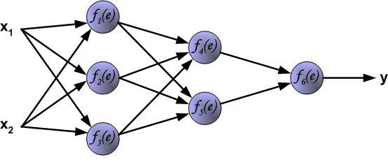

Each neuron is composed of two units. First unit adds products of weights coefficients and input signals. The second unit realise nonlinear function, called neuron activation function. Signal e is adder output signal, and y = f(e) is output signal of nonlinear element. Signal y is also output signal of neuron.

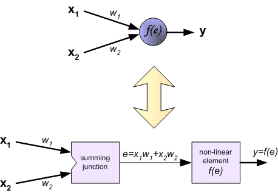

To teach the neural network we need training data set. The training data set consists of input signals (x1 and x2 ) assigned with corresponding target (desired output) z. The network training is an iterative process. In each iteration weights coefficients of nodes are modified using new data from training data set. Modification is calculated using algorithm described below: Each teaching step starts with forcing both input signals from training set. After this stage we can determine output signals values for each neuron in each network layer. Pictures below illustrate how signal is propagating through the network, Symbols w(xm)n represent weights of connections between network input xm and neuron n in input layer. Symbols yn represents output signal of neuron n.

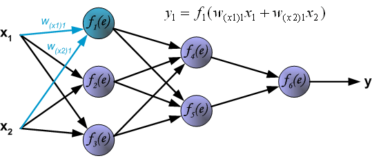

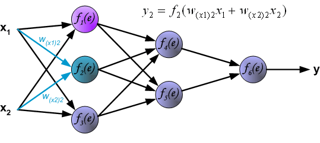

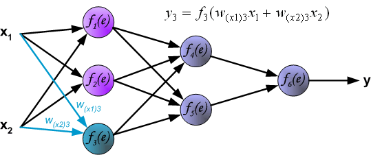

Propagation of signals through the hidden layer. Symbols wmn represent weights of connections between output of neuron m and input of neuron n in the next layer.

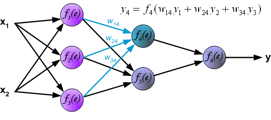
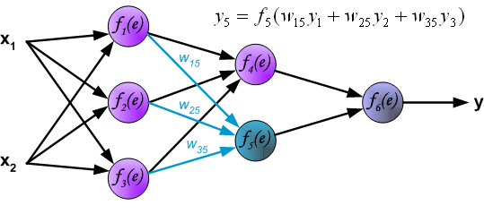

Propagation of signals through the output layer.

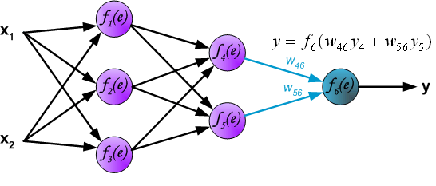

In the next algorithm step the output signal of the network y is compared with the desired output value (the target), which is found in training data set. The difference is called error signal d of output layer neuron.

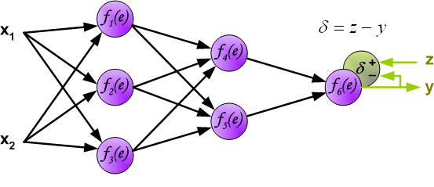

It is impossible to compute error signal for internal neurons directly, because output values of these neurons are unknown. For many years the effective method for training multiplayer networks has been unknown. Only in the middle eighties the backpropagation algorithm has been worked out. The idea is to propagate error signal d (computed in single teaching step) back to all neurons, which output signals were input for discussed neuron.

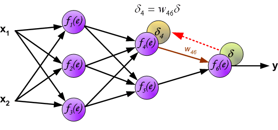
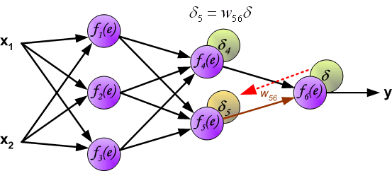

The weights' coefficients wmn used to propagate errors back are equal to this used during computing output value. Only the direction of data flow is changed (signals are propagated from output to inputs one after the other). This technique is used for all network layers. If propagated errors came from few neurons they are added. The illustration is below:

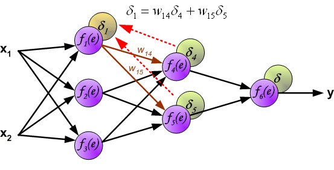
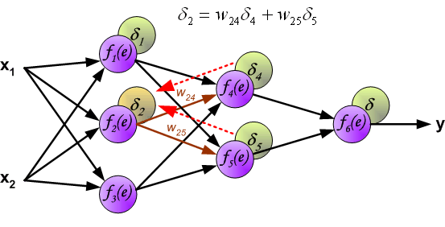
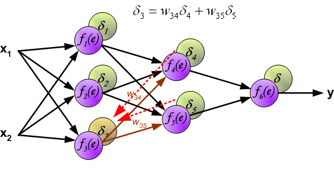

When the error signal for each neuron is computed, the weights coefficients of each neuron input node may be modified. In formulas below df(e)/de represents derivative of neuron activation function (which weights are modified).

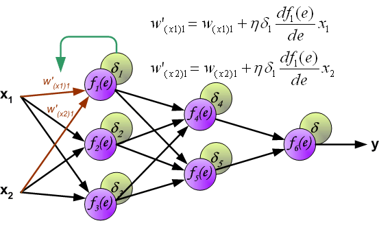
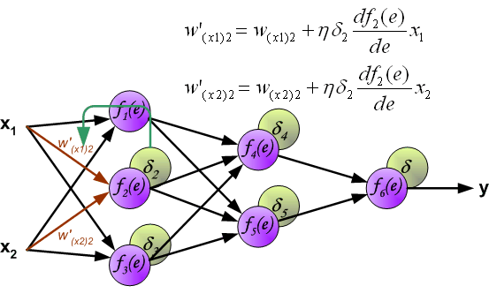
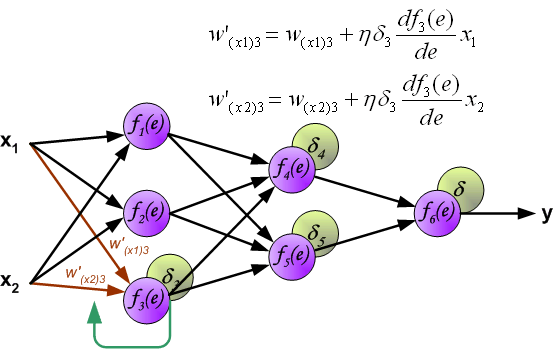
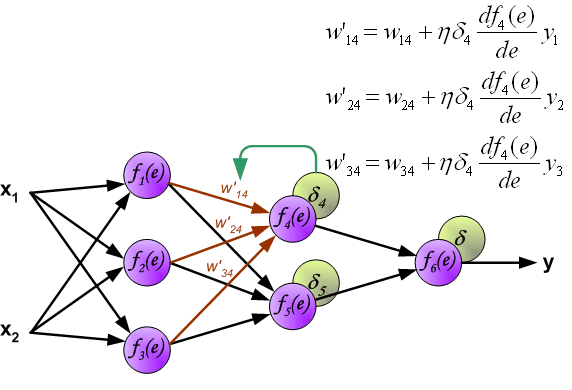
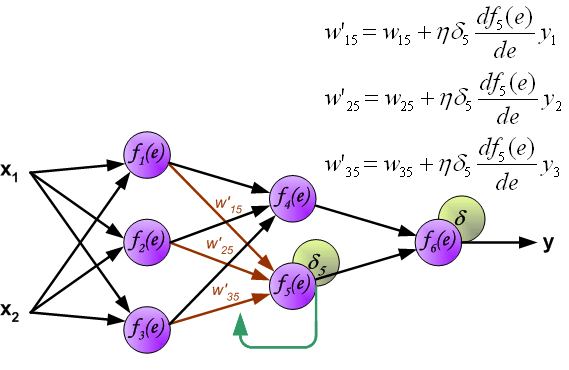
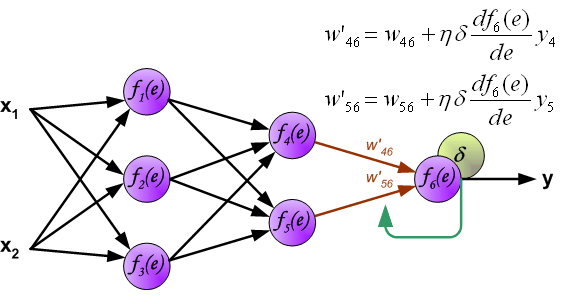

Coefficient h affects network teaching speed. There are a few techniques to select this parameter. The first method is to start teaching process with large value of the parameter. While weights coefficients are being established the parameter is being decreased gradually. The second, more complicated, method starts teaching with small parameter value. During the teaching process the parameter is being increased when the teaching is advanced and then decreased again in the final stage. Starting teaching process with low parameter value enables to determine weights coefficients signs.

References
Ryszard Tadeusiewcz "Sieci neuronowe", Kraków 1992
