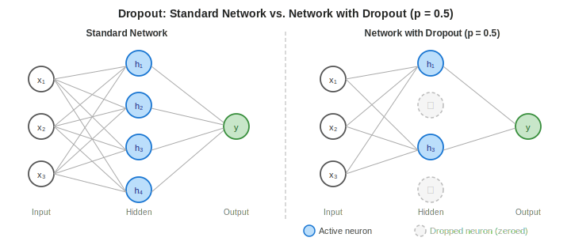
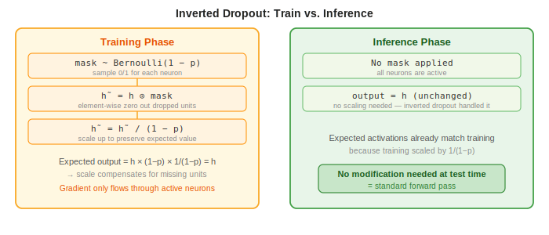

# Dropout

> **Core idea:** During training, randomly zero out a fraction $p$ of neuron activations at each forward pass, forcing the network to learn redundant, distributed representations.  
> **Why it matters:** Dropout is one of the most effective regularizers in deep learning — it significantly reduces overfitting with almost no hyperparameter tuning.  
> **Key insight:** Dropout implicitly trains an exponential ensemble of sub-networks and averages them at inference time.

---

## 1. Motivation: The Overfitting Problem

### 1.1 What Is Overfitting?

A neural network overfits when it **memorizes** the training data rather than learning generalizable patterns. Symptoms:

- Training loss continues to decrease while validation loss plateaus or rises.
- The network relies on highly specific co-adaptations between neurons.

### 1.2 Co-adaptation of Neurons

In a fully connected network, neurons can develop **co-adaptations**: neuron $i$ learns to fix the errors of neuron $j$. The network exploits these fine-tuned interactions to minimize training loss, but they generalize poorly to new data.

Dropout breaks co-adaptations by randomly removing neurons, forcing each neuron to be useful **independently** of its neighbors.

---

## 2. The Dropout Mechanism

### 2.1 Training Phase

At each training step, for each neuron in a layer, independently sample a **Bernoulli mask**:

$$
m_i \sim \text{Bernoulli}(1 - p), \quad m_i \in \{0, 1\}
$$

Where $p$ is the **drop probability** (the fraction of units to zero out). Then apply element-wise:

$$
\tilde{h}_i = m_i \cdot h_i
$$

In vector form for a full layer:

$$
\tilde{\mathbf{h}} = \mathbf{m} \odot \mathbf{h}
$$

Where $\odot$ is the Hadamard (element-wise) product.

### 2.2 Effect on Expected Value

The expected output of a dropped unit is:

$$
\mathbb{E}[\tilde{h}_i] = (1-p) \cdot h_i + p \cdot 0 = (1-p)\, h_i
$$

Without correction, the expected activation at inference time (where all units are active) is $h_i$ — a factor of $\frac{1}{1-p}$ larger than at training time. This mismatch would cause inference to behave differently from training.



---

## 3. Inverted Dropout

### 3.1 The Scaling Fix

**Inverted dropout** resolves the train/inference mismatch by scaling up activations at training time instead of scaling down at inference:

$$
\boxed{\tilde{\mathbf{h}} = \frac{\mathbf{m} \odot \mathbf{h}}{1 - p}}
$$

Now:

$$
\mathbb{E}[\tilde{h}_i] = (1-p) \cdot \frac{h_i}{1-p} + p \cdot 0 = h_i
$$

The expected training activation equals the inference activation — no modification is needed at test time.

### 3.2 Inference Phase

At test time, the network runs a **standard forward pass** with all neurons active and no scaling:

$$
\tilde{\mathbf{h}} = \mathbf{h}
$$

This is why modern frameworks (PyTorch, TensorFlow, JAX) use inverted dropout by default.



---

## 4. Backpropagation Through Dropout

### 4.1 Gradient Masking

The dropout mask $\mathbf{m}$ is fixed for the entire forward and backward pass of one training step. During backpropagation, gradients flow only through the neurons that were **not dropped**:

$$
\frac{\partial \mathcal{L}}{\partial h_i} = m_i \cdot \frac{\partial \mathcal{L}}{\partial \tilde{h}_i} \cdot \frac{1}{1-p}
$$

Dropped neurons ($m_i = 0$) receive zero gradient — their weights are not updated in that step.

### 4.2 Effect on Weight Updates

Because different subsets of neurons are active at each step, different subsets of weights are updated at each step. Over many steps, every weight receives updates from many different sub-networks, encouraging distributed representations.

---

## 5. Dropout as Ensemble Learning

### 5.1 Implicit Ensemble

For a layer with $n$ neurons, dropout with rate $p$ defines an implicit ensemble of $2^n$ possible sub-networks (one per binary mask). At each training step, one sub-network is sampled and updated.

### 5.2 Geometric Mean Approximation

Inference with full weights is an approximation of **averaging the predictions of all $2^n$ sub-networks**. Specifically, it approximates their geometric mean under certain conditions. This ensemble interpretation explains why dropout improves generalization.

### 5.3 Approximate Averaging

For deep networks, exact ensemble averaging is intractable. The weight scaling (inverted dropout) provides an efficient single forward-pass approximation:

$$
\hat{y} \approx \frac{1}{2^n} \sum_{\mathbf{m}} f_{\mathbf{m}}(\mathbf{x}) \approx f_{\mathbf{W}}(\mathbf{x}) \quad \text{(with all neurons active)}
$$

---

## 6. Dropout Rate $p$: Choosing and Tuning

### 6.1 Common Defaults

| Layer type | Typical drop rate $p$ |
|---|---|
| Fully connected (dense) layers | 0.5 |
| Input layer | 0.1–0.2 |
| Convolutional layers | 0.1–0.25 (rarely used) |
| Recurrent layers (LSTM, GRU) | 0.2–0.5 (applied to non-recurrent connections) |
| Transformer feed-forward layers | 0.1 |
| Transformer attention weights | 0.1 |

### 6.2 Effect of $p$

| Drop rate $p$ | Behavior |
|---|---|
| $p = 0$ | No dropout — standard network |
| $p = 0.5$ | Maximum regularization for dense layers (empirical optimum per Srivastava et al.) |
| $p \to 1$ | Almost all neurons zeroed — network cannot learn |

### 6.3 Tuning Strategy

- Start with $p = 0.5$ for fully connected layers.
- If the validation loss is still high (underfitting), reduce $p$.
- If training loss is much lower than validation loss (still overfitting), increase $p$.
- Use different rates for different layers — input and convolutional layers usually need lower rates.

---

## 7. Variants of Dropout

### 7.1 DropConnect

Instead of zeroing neuron outputs, zero individual **weights**:

$$
\tilde{W}_{ij} = m_{ij} \cdot W_{ij}, \quad m_{ij} \sim \text{Bernoulli}(1-p)
$$

DropConnect is a generalization of Dropout (since zeroing an output is equivalent to zeroing all outgoing weights of that neuron).

### 7.2 Spatial Dropout (for CNNs)

In convolutional networks, activations within a feature map are spatially correlated. Dropping individual pixels is ineffective. **Spatial dropout** drops entire **feature maps** (channels):

$$
\tilde{\mathbf{H}}_{:,:,c} = m_c \cdot \mathbf{H}_{:,:,c}, \quad m_c \sim \text{Bernoulli}(1-p)
$$

This forces the network not to rely on any single feature map.

### 7.3 Variational Dropout (for RNNs)

Standard dropout applied at each time step in an RNN uses a **different mask per step**, which disrupts temporal patterns. **Variational Dropout** (Gal & Ghahramani, 2016) uses the **same mask at every time step** within a sequence:

$$
\tilde{h}_t = m \odot h_t, \quad m \sim \text{Bernoulli}(1-p) \;\text{fixed for all } t
$$

This corresponds to approximate Bayesian inference and preserves the recurrent dynamics.

### 7.4 Concrete Dropout

Learns the optimal dropout rate $p$ per layer using a differentiable relaxation of the Bernoulli distribution. The dropout rate becomes a trainable parameter optimized jointly with the weights.

---

## 8. Dropout and Batch Normalization

Dropout and Batch Normalization (BN) interact in a subtle and often **problematic** way:

### 8.1 The Problem

BN normalizes using batch statistics that depend on which neurons are active. Dropout changes the variance of the distribution of activations entering BN layers. This creates a **variance shift** between training (with dropout) and inference (without dropout), which can hurt performance.

### 8.2 Practical Recommendation

- **Do not use Dropout before a Batch Normalization layer.** This is the standard advice in practice.
- If both are needed, place BN before Dropout, or use Dropout only after BN (after the last BN layer in the network).
- In practice, modern architectures (ResNets, EfficientNet) predominantly use BN without Dropout in the feature extractor, and add Dropout only in the final classification head.

---

## 9. Worked Example

**Setup:** A 2-layer network with 4 hidden units in each layer, $p = 0.5$.

**Forward pass (training):**

1. Compute $\mathbf{h}^{(1)} = \text{ReLU}(\mathbf{W}^{(1)}\mathbf{x} + \mathbf{b}^{(1)}) = [1.2,\; 0.8,\; 2.1,\; 0.3]$
2. Sample mask: $\mathbf{m}^{(1)} = [1,\; 0,\; 1,\; 0]$
3. Apply inverted dropout:

$$
\tilde{\mathbf{h}}^{(1)} = \frac{\mathbf{m}^{(1)} \odot \mathbf{h}^{(1)}}{0.5} = \frac{[1.2,\; 0,\; 2.1,\; 0]}{0.5} = [2.4,\; 0,\; 4.2,\; 0]
$$

4. Continue forward with $\tilde{\mathbf{h}}^{(1)}$ as input to the next layer.

**Inference:** Use $\mathbf{h}^{(1)} = [1.2,\; 0.8,\; 2.1,\; 0.3]$ directly — no scaling, no masking.

Note how $\mathbb{E}[\tilde{h}_1] = 0.5 \times 2.4 + 0.5 \times 0 = 1.2 = h_1$. The expected values match.

---

## 10. Dropout in Transformers

Transformers apply dropout at **four distinct locations** within each layer. The placement is standardized in the original "Attention is All You Need" (Vaswani et al., 2017) and retained in most modern variants (BERT, GPT, T5).

### 10.1 The Four Dropout Sites

```
Input Embedding + Positional Encoding
        │
        ▼
  ┌─────────────────────────────┐
  │   Multi-Head Attention      │
  │                             │
  │  softmax(QKᵀ/√dₖ) ──► [1] Attention Dropout
  │        │                    │
  │      × V                    │
  └─────────────────────────────┘
        │
       [2] Residual Dropout  ──► Add & Norm
        │
  ┌─────────────────────────────┐
  │   Feed-Forward Network      │
  │                             │
  │  Linear ──► ReLU ──► [3] FFN Dropout ──► Linear
  └─────────────────────────────┘
        │
       [4] Residual Dropout  ──► Add & Norm
```

| Location | Where applied | Typical $p$ |
|---|---|---|
| **[1] Attention dropout** | On attention weights after softmax, before multiplying by $V$ | 0.1 |
| **[2] Residual dropout (attn)** | On the attention sub-layer output, before adding the residual | 0.1 |
| **[3] FFN dropout** | Between the two linear layers of the feed-forward block | 0.1 |
| **[4] Residual dropout (ffn)** | On the feed-forward sub-layer output, before adding the residual | 0.1 |

Additionally, **embedding dropout** is often applied to the sum of token + positional embeddings before the first layer (also $p = 0.1$).

### 10.2 Attention Dropout

After computing the scaled dot-product attention scores, a softmax yields the attention weight matrix $\mathbf{A} \in \mathbb{R}^{T \times T}$:

$$
\mathbf{A} = \text{softmax}\!\left(\frac{\mathbf{Q}\mathbf{K}^\top}{\sqrt{d_k}}\right)
$$

Dropout is applied element-wise to $\mathbf{A}$ **before** it is used to weight $\mathbf{V}$:

$$
\tilde{\mathbf{A}} = \text{Dropout}(\mathbf{A}, p)
$$

$$
\text{Attention}(\mathbf{Q}, \mathbf{K}, \mathbf{V}) = \tilde{\mathbf{A}}\,\mathbf{V}
$$

**Effect:** Randomly masks out individual attention connections for the duration of one forward pass. This prevents any single attention head from becoming over-reliant on specific (query, key) pairings, encouraging each head to learn more robust attention patterns.

### 10.3 Residual Dropout

The residual (skip) connection in each Transformer block is:

$$
\mathbf{x}' = \text{LayerNorm}\!\left(\mathbf{x} + \text{Dropout}(\text{Sublayer}(\mathbf{x}),\; p)\right)
$$

Dropout is applied to the **sublayer output** before it is added back to the residual stream $\mathbf{x}$. This is applied independently for both the attention sublayer and the feed-forward sublayer.

Note: **Layer Normalization is not replaced by Batch Normalization** in Transformers, which eliminates the BN–Dropout variance-shift problem described in §8.

### 10.4 Feed-Forward Network (FFN) Dropout

The feed-forward block typically applies:

$$
\text{FFN}(\mathbf{x}) = \mathbf{W}_2\, \text{Dropout}\!\left(\text{ReLU}(\mathbf{W}_1 \mathbf{x} + \mathbf{b}_1),\; p\right) + \mathbf{b}_2
$$

Dropout sits between the activation and the second linear projection — identical to standard MLP dropout.

### 10.5 Recommended Drop Rates for Transformers

| Model / Setting | Dropout rate $p$ |
|---|---|
| Transformer base (Vaswani et al.) | 0.1 (all sites) |
| BERT-base, BERT-large | 0.1 (all sites) |
| GPT-2 | 0.1 (residual, attention, embedding) |
| Fine-tuning on small datasets | 0.1–0.3 (increase to regularize) |
| Fine-tuning on large datasets | 0.0–0.1 (reduce or disable) |

In practice, **$p = 0.1$ is the universal default for Transformers** — much lower than the $p = 0.5$ used in dense MLPs, because Transformers already have strong regularization from weight sharing, LayerNorm, and attention's inherent averaging.

### 10.6 Disabling Dropout at Inference

Like standard dropout, all Transformer dropout layers are **disabled during inference** (evaluation mode). In PyTorch this is done with `model.eval()`, which switches all `nn.Dropout` modules to pass-through mode automatically.

---

## 11. When to Use Dropout

| Situation | Use Dropout? |
|---|---|
| Large fully connected layers | Yes — $p = 0.5$ |
| Convolutional feature extractor | Sometimes — low $p$ or Spatial Dropout |
| Small datasets with risk of overfitting | Yes |
| Large datasets (millions of examples) | Less necessary; L2 regularization often sufficient |
| Before Batch Normalization layer | No |
| Recurrent layers (LSTM/GRU) | Yes — use Variational Dropout |
| Transformers | Yes — low $p$ (0.1) on attention and feed-forward |

---

## 11. Summary

| Property | Detail |
|---|---|
| Type | Stochastic regularization |
| Hyperparameter | Drop rate $p \in (0, 1)$ |
| Training cost | Negligible (element-wise multiply + scale) |
| Inference cost | Zero — no change to forward pass |
| Effect | Reduces co-adaptation; acts as ensemble of $2^n$ sub-networks |
| Interaction with BN | Problematic — avoid Dropout before BN |
| Best for | Large dense layers, moderate-size datasets |
