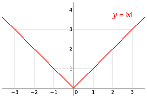

# Mean Absolute Error (MAE)

The Mean Absolute Error (MAE) is a commonly used loss function in machine learning that calculates the mean of the absolute values of the residuals for all datapoints in the dataset.

- The absolute value of the residuals is taken to convert any negative differences into positive values, ensuring that all errors are treated equally.
- Taking the mean makes the loss function independent of the number of datapoints in the training set, allowing it to provide a consistent measure of error across datasets of different sizes.

One key advantage of **MAE** is that it is robust to outliers, meaning that extreme values do not disproportionately affect the overall error calculation. However, despite this robustness, MAE is often less preferred than **Mean Squared Error (MSE)** in practice. This is because it is harder to calculate the derivative of the absolute function, as it is not differentiable at the minima. This makes **MSE** a more common choice when working with optimization algorithms that rely on gradient-based methods.

This loss function example illustrates how the choice of a loss function can significantly impact model performance and training efficiency.

    
    <figcaption>Mean Absolute Error</figcaption>

The formula:
$$MAE = \frac{1}{n}\sum_{i=1}^n|y_i - \hat{y_{i}}|$$

Where:

- $y_i$ is the actual value for the i-th data point.
- $\hat{y_{i}}$ is the predicted value for the i-th data point.
- $n$ is the total number of data points.
