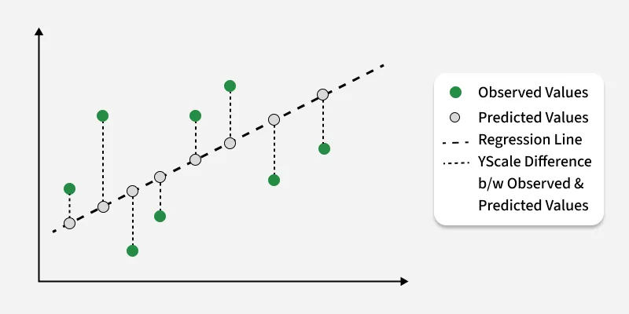

# Mean Squared Error

Mean Squared Error (MSE) is a fundamental concept in statistics and machine learning, playing a crucial role in assessing the accuracy of predictive models.

- The MSE value provides a way to analyze the accuracy of the model.
- It measures the average squared difference between predicted values and the actual values in the dataset.
- It is calculated by taking the average of the squared residuals, where the residual is the difference between the predicted value and the actual value for each data point.

    
    <figcaption>Model Error</figcaption>

## Mean Squared Error Formula

The formula for the mean squared error is:

$$Mean Squared Error = \frac{1}{n}\sum_{i=1}^n(Y_i - \hat{Y})^2$$

Where:

- $n$ is the number of observations in the dataset.
- $y_i$ is the actual value of the observation.
- $\hat{Y}_i$ is the predicted value of the $i^{th}$ observation.

## Interpretation of Mean Squared Error

The Interpreting MSE involves understanding the magnitude of the error and its implications for the model's performance.

- A lower MSE indicates that the model's predictions are closer to the actual values, signifying better accuracy.
- Conversely, a higher MSE suggests that the model's predictions deviate further from the true value, indicating poorer performance.

## Applications of Mean Squared Error

The Mean Squared Error is extensively used in various applications, including:

- **Regression analysis**: Assessing the goodness of fit of the regression models.
- **Model evaluation**: Comparing the performance of the different machine learning algorithms.
- **Optimization**: Minimizing MSE during the model training to improve predictive accuracy.
- **Predictive modeling**: Evaluating the accuracy of the regression and forecasting models.
- **Image processing**: Assessing the quality of the image reconstruction and restoration algorithms.
- **Financial modeling**: Analyzing the performance of the investment strategies and risk models.

## How to Minimize Mean Squared Error in Model Training

To minimize Mean Squared Error during the model training, several strategies can be employed, including:

- **Feature selection**: Choosing relevant features that contribute most to reducing prediction errors.
- **Model selection**: Experimenting with the different algorithms and model architectures to identify the best-performing model.
- **Hyperparameter tuning**: The Optimizing model hyperparameters such as the learning rate, regularization strength, and network depth to improve predictive accuracy.
