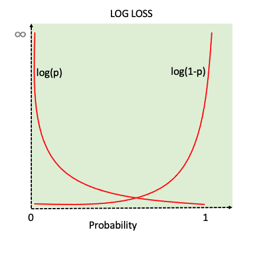

# Cross-Entropy Loss Function

In classification problems, a machine learning model predicts the probability of each class for any given input. Because each data point truly belongs to only one class (probability 1 for one class, 0 for others). Cross-entropy loss is a way to measure how close a model’s predictions are to the correct answers in classification problems.

It helps train models to make more confident and accurate predictions by rewarding correct answers and penalizing wrong ones. This makes it a key part of building reliable machine learning classifiers.

## Types of Cross-Entropy Loss Function

### 1. Binary Cross Entropy Loss

Binary Cross-Entropy Loss is a widely used loss function in binary classification problems. For a dataset with N instances, the Binary Cross-Entropy Loss is calculated as:

$$BCE = -\frac{1}{N}\sum_{i=1}^N(y_{i}log(p_{i}) + (1-y_{i})log(1-p_{i}))$$

where:

- $N$ is number of samples
- $y_{i}$ true label for sample $i$(0 or 1)
- $p_{i}$ model-predicted probability for class 1 for sample $i$.

### 2. Multiclass Cross Entropy Loss

Multiclass Cross-Entropy Loss, also known as categorical cross-entropy or softmax loss is a widely used loss function for training models in multiclass classification problems. For a dataset with N instances, Multiclass Cross-Entropy Loss is calculated as

$$CE = -\frac{1}{N}\sum_{i=1}^N \sum_{j=1}^C(y_{i,j} log(p_{i,j}))$$

where

- $N$ is number of samples,
- $C$ is the number of classes.
- $y_{i,j}$ is 1 if class $j$ is correct for sample $i$, $0$ otherwise.
-$p_{i,j}$ ​is model-predicted probability of sample i being in class j.

## How to interpret Cross Entropy Loss?

The cross-entropy loss is a scalar value that quantifies how far off the model's predictions are from the true labels. For each sample in the dataset, the cross-entropy loss reflects how well the model's prediction matches the true label. A lower loss for a sample indicates a more accurate prediction, while a higher loss suggests a larger discrepancy.

Interpretability for Binary Classification:

- In binary classification, since there are two classes (0 and 1) it is start forward to interpret the loss value,
- If the true label is 1, the loss is primarily influenced by how close the predicted probability for class 1 is to 1.0.
- If the true label is 0, the loss is influenced by how close the predicted probability for class 1 is to 0.0.

    
    <figcaption>Cross Entropy</figcaption>

Interpretability for Multiclass Classification:

- In multiclass classification, only the true label contributes towards the loss as for other labels being zero does not add anything to the loss function.
- Lower loss indicates that the model is assigning high probabilities to the correct class and low probabilities to incorrect classes.

## Key features of Cross Entropy loss

- **Probabilistic Interpretation**: Guides models to output probabilities near the true class labels.
- **Differentiable**: Supports optimization via gradient descent.
- **Standard for Neural Networks**: Especially with softmax (multiclass) or sigmoid (binary) output layers.
Strong Penalization: Assigns high penalty to confident but wrong predictions.
- **Library Support**: Implemented in all major ML libraries like PyTorch, TensorFlow, scikit-learn, etc.
