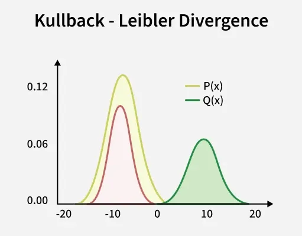
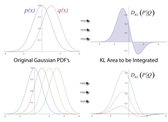

# Kullback Leibler (KL) Divergence

Kullback Leibler Divergence is a measure from information theory that quantifies the difference between two probability distributions.

1. It tells us how much information is lost when we approximate a true distribution P with another distribution Q.
2. KL divergence is also called relative entropy and is non negative and asymmetric $D_{KL}(P||Q) \neq D_{KL}(Q||P)$
3. It measures the extra number of bits needed to encode data from P if we use a code optimized for Q instead of the true distribution P.

    
    <figcaption>KL-Divergence</figcaption>

## Mathematical Implementation

Mathematical Implementation of KL Divergence for discrete and continuous distributions:

1. Discrete Distributions:
For two discrete probability distributions $P = {p_1, p_2, ... p_n} and {q_1, q_2, ..., q_n}$ over the same set:
$$D_{KL}(P||Q) = \sum_{i=1}^np_{i}log\frac{p_{i}}{q_{i}}$$

Step by step:

- For each outcome i, compute $p_{i}log(p_{i}/q_{i})$
- Sum all these terms to get the total KL divergence.

2. Continuous Distributions:
For continuous probability density functions $p(x)$ and $q(x)$:

$$D_{KL}(P||Q) = \int_{}p(x) log\frac{p(x)}{q(x)}dx$$

- Integration replaces summation for continuous variables.
- Gives the expected extra information in nats or bits required when assuming $q(x)$ instead of $p(x)$.

## Properties

Properties of KL Divergence are:

1. **Non Negativity**: KL divergence is always non negative and equals zero if and only if P=Q almost everywhere.
$$DK_{KL}(P||Q) \geq 0$$

2. **Asymmetry**: KL divergence is not symmetric so it is not a true distance metric.
$$D_{KL}(P||Q) \neq D_{KL}(Q||P)$$

3. **Additivity for Independent Distributions**: If X and Y are independent:
$$D_{KL}(P_{X,Y} || Q_{X,Y}) = D_{KL}(P_{X}||Q_{X}) + D_{KL}(P_{Y}||Q_{Y})$$

4. **Invariance under Parameter** Transformations: KL divergence remains the same under bijective transformations of the random variable.

5. **Expectation Form**: It can be interpreted as the expected logarithmic difference between probabilities under P and Q.

$$D_{KL}(P||Q) = \mathbb{E}_{x \sim P} \left[ log\frac{P(x)}{Q(x)} \right]$$

## Applications

Some of the applications of KL Divergence are:

1. **Information Theory**: Quantifies how much information is lost when one probability distribution is used to approximate another.
2. **Machine Learning**: Forms the basis of loss functions like cross entropy is used in variational autoencoders (VAEs) and improves classification accuracy.
3. **Natural Language Processing**: Supports language modeling, word embedding comparisons and topic modeling approaches such as Latent Dirichlet Allocation (LDA).
4. **Computer Vision**: Used in VAEs, GANs and recognition systems to align generated data with real world distributions.
5. **Anomaly Detection**: Identifies unusual or suspicious patterns by measuring distribution shifts, helpful in fraud detection and cybersecurity.

## Motivation (Reference: [en.wikipedia.org](https://en.wikipedia.org/wiki/Kullback%E2%80%93Leibler_divergence))

In information theory, the Kraft–McMillan theorem establishes that any directly decodable coding scheme for coding a message to identify one value $x_i$ out of a set of possibilities $X$
can be seen as representing an implicit probablity distribution $q(x_{i} = 2^{-\mathcal{l}_{i}})$ over $X$, where $\mathcal{l}_{i}$ is the length of the code $x_{i}$ in bits. Therefore, relative entropy can be interpreted as the expected extra message-length per datum that must be communicated if a code that is optimal for a given (wrong) distribution $Q$ is used, compared to using a code based on the true distribution $P$: it is the excess entropy.

$$D_{KL}(P||Q) = \sum_{x \in \mathcal{X}}p(x)log\frac{1}{q(x)} - \sum_{x \in \mathcal{X}}p(x)log \frac{1}{p(x)} = H(P, Q) - H(P)$$

where ${\displaystyle \mathrm {H} (P,Q)}$ is the cross entropy of $Q$ relative to P and ${\displaystyle \mathrm {H} (P)}$ is the entropy of $P$ (which is the same as the cross-entropy of P with itself).

The relative entropy ${\displaystyle D_{\text{KL}}(P\parallel Q)}$ can be thought of geometrically as a statistical distance, a measure of how far the distribution Q is from the distribution P. Geometrically it is a divergence: an asymmetric, generalized form of squared distance. The cross-entropy ${\displaystyle H(P,Q)}$ is itself such a measurement (formally a loss function), but it cannot be thought of as a distance, since ${\displaystyle H(P,P)=:H(P)}$ is not zero. This can be fixed by subtracting ${\displaystyle H(P)}$ to make ${\displaystyle D_{\text{KL}}(P\parallel Q)}$ agree more closely with our notion of distance, as the excess loss. The resulting function is asymmetric, and while this can be symmetrized (see § [Symmetrised divergence](https://en.wikipedia.org/wiki/Kullback%E2%80%93Leibler_divergence#Symmetrised_divergence)), the asymmetric form is more useful. See § Interpretations for more on the geometric interpretation.

    
    <figcaption>Illustration of the relative entropy for two normal distributions. The typical asymmetry is clearly visible</figcaption>

## Use of KL Divergence in AI

Some specific use cases of KL Divergence in AI are:

1. **Probabilistic Models**: Aligns learned distributions with target distributions like in Variational Autoencoders (VAEs).
2. **Reinforcement Learning**: Stabilizes policy updates in algorithms like PPO by limiting divergence from previous policies.
3. **Language Models**: Guides token probability distributions during fine-tuning and model distillation.
4. **Generative Models**: Measures how closely generated data matches real data distributions

## Limitations

Some of the limitations of KL Divergence are:

1. **Asymmetry**: KL divergence is not symmetric $(KL(P∣∣Q) \neq (KL(Q∣∣P)))$ so the “distance” from P to Q is not the same as from Q to P. This makes interpretation harder compared to true metrics.
2. **Infinite Values**: If distribution Q(x)=0 in places where P(x)>0, the divergence becomes infinite. This can cause issues in practice especially with sparse or imperfectly estimated distributions.
3. **Support Mismatch Sensitivity**: KL requires Q to have nonzero probability wherever P does. If the supports don’t overlap well, the measure breaks down or becomes unstable.
Not a True Distance Metric: KL doesn’t satisfy properties like symmetry and triangle inequality so it cannot be used directly as a “distance” in geometric sense.
4. **Mode Seeking Behavior**: Minimizing KL(P∣∣Q) tends to make Q focus only on the most likely regions of P and ignore less probable regions which can cause problems in generative modeling.
