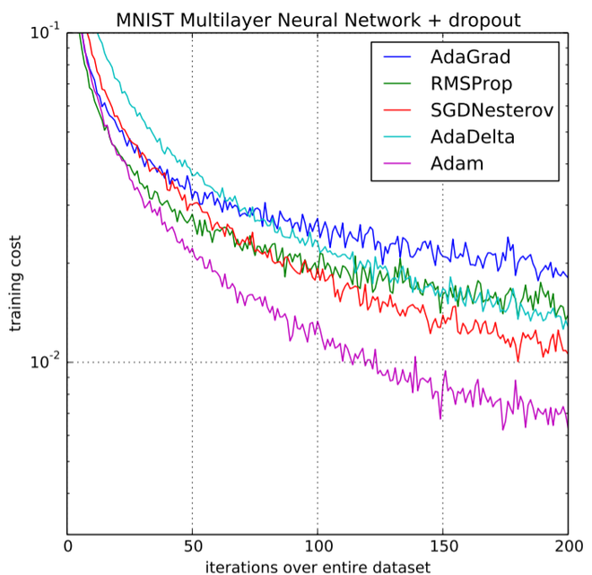

# Adam Optimizer

Adam (Adaptive Moment Estimation) optimizer combines the advantages of Momentum and RMSprop techniques to adjust learning rates during training. It works well with large datasets and complex models because it uses memory efficiently and adapts the learning rate for each parameter automatically.

## How Does Adam Work?

Adam builds upon two key concepts in optimization:

1. Momentum

Momentum is used to accelerate the gradient descent process by incorporating an exponentially weighted moving average of past gradients. This helps smooth out the trajectory of the optimization allowing the algorithm to converge faster by reducing oscillations.

The update rule with momentum is:

$$w_{t+1} = w_t - \alpha m_{t}$$
where:

- $m_{t}$ is the moving average of the gradients at time $t$
- $\alpha$ is the learning rate
- $w_{t}$ and $w_{t+1}$ are the weight and at time $t$ and $t+1$ respectively
The momentum term $m_{t}$ is updated recursively as:

$$m_{t} = \beta_{1}m_{t-1} + (1 - \beta_{1}) \frac{\partial L}{\partial w_{t}}$$

where:

- $\beta_{1}$ is the momentum parameter (typically set to 0.9)
- $\frac{\partial L}{\partial w_{t}}$​ is the gradient of the loss function with respect to the weights at time $t$

## Why Adam Works So Well?

Adam addresses several challenges of gradient descent optimization:

- **Dynamic learning rates**: Each parameter has its own adaptive learning rate based on past gradients and their magnitudes. This helps the optimizer avoid oscillations and get past local minima more effectively.
- **Bias correction**: By adjusting for the initial bias when the first and second moment estimates are close to zero helping to prevent early-stage instability.
- **Efficient performance**: Adam typically requires fewer hyperparameter tuning adjustments compared to other optimization algorithms like SGD making it a more convenient choice for most problems.

## Performance of Adam

In comparison to other optimizers like SGD (Stochastic Gradient Descent) and momentum-based SGD, Adam outperforms them significantly in terms of both training time and convergence accuracy. Its ability to adjust the learning rate per parameter combined with the bias-correction mechanism leading to faster convergence and more stable optimization. This makes Adam especially useful in complex models with large datasets as it avoids slow convergence and instability while reaching the global minimum.

    
    <figcaption>Performance Comparison on Training cost</figcaption>

In practice, Adam often achieves superior results with minimal tuning, making it a go-to optimizer for deep learning tasks.
