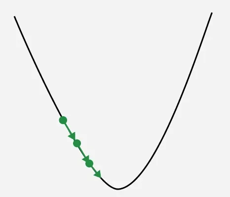
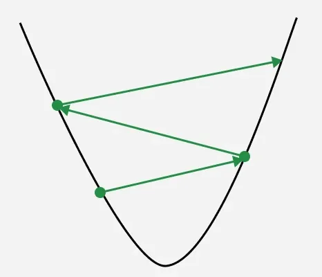

# Gradient Descent

Gradient Descent is an iterative optimization algorithm used to minimize a cost function by adjusting model parameters in the direction of the steepest descent of the function’s gradient. In simple terms, it finds the optimal values of weights and biases by gradually reducing the error between predicted and actual outputs.

<figure>
    <video controls width="400" height="400">
        <source src="./static/Gradient_Descent_in_2D.webm" type="video/webm">
        Your browser does not support the video tag.
    </video>
    <figcaption>Gradient descent in 2D</figcaption>
</figure>

For GitHub preview (where embedded local video may not render), open:
[Gradient descent in 2D video](./static/Gradient_Descent_in_2D.webm)

## Mathematics Behind Gradient Descent

Some noisy data points that comes from unkown Target function $f$. Our aim is to find an approximation $\hat f$ base on the data to recover the structure of the unkown function. To do so we often parameterize our function by some weights $\vec {w}$. We can define a loss function $L$ that measures how good our approximation performs on the given data set $D$

Define the Loss Function:
$$ L(\hat f(\vec{w}), D) $$
Target finding the set of wight w that minimizes the loss function.
$$
\min_{\vec{w}}{L(\hat{f}{\vec{w}}, D)}  \\
\mathbf{x} := \vec{w}
$$

1. Taylor Expansion: Local Linear Approximation
Suppose our objective function $f(\mathbf{x})$ is first-order differentiable at the point $\mathbf{x}_k$. To study the change in the function value after moving a small vector $\Delta \mathbf{x}$ around $\mathbf{x}_k$, we perform a first-order Taylor expansion:

$$f(\mathbf{x}_k + \Delta \mathbf{x}) \approx f(\mathbf{x}_k) + \nabla f(\mathbf{x}_k)^T \Delta \mathbf{x}$$

To make the function value decrease (i.e., $f(\mathbf{x}_k + \Delta \mathbf{x}) < f(\mathbf{x}_k)$), we need to ensure:

$$\nabla f(\mathbf{x}_k)^T \Delta \mathbf{x} < 0$$

2. Core Proof: Cauchy-Schwarz Inequality

The mathematical problem now becomes: given a fixed step size (vector length) $\|\Delta \mathbf{x}\|$, in which direction $\Delta \mathbf{x}$ will the term $\nabla f(\mathbf{x}_k)^T \Delta \mathbf{x}$ decrease the fastest (i.e., have the largest negative value)?

According to the definition of the vector dot product:

$\nabla f(\mathbf{x}_k)^T \Delta \mathbf{x} = \|\nabla f(\mathbf{x}_k)\| \cdot \|\Delta \mathbf{x}\| \cdot \cos(\theta)$

where $\theta$ is the angle between the gradient vector and the direction vector.

When $\cos(\theta) = 1$ ($\theta = 0^\circ$), the dot product is maximized, and the function increases most rapidly.

When $\cos(\theta) = -1$ ($\theta = 180^\circ$), the dot product is minimized (most negative), and the function decreases most rapidly.

Therefore, to achieve the maximum magnitude of descent, the direction of $\Delta \mathbf{x}$ must be exactly opposite to the gradient direction $\nabla f(\mathbf{x}_k)$.

3. Derivation of Conclusion
Let $\Delta \mathbf{x} = -\alpha \mathbf{u}$, where $\mathbf{u}$ is the unit direction vector. As proven above, the descent is fastest when $\mathbf{u}$ is the unit vector of the gradient:

$$\mathbf{u} = \frac{\nabla f(\mathbf{x}_k)}{\|\nabla f(\mathbf{x}_k)\|}$$
Substituting into the update formula:

$$\mathbf{x}_{k+1} = \mathbf{x}_k - \eta \nabla f(\mathbf{x}_k)$$
Here, $\eta$ (learning rate) includes the step size and the reciprocal magnitude of the gradient, simplifying the calculation.

4. Limitations: Sufficient Condition for Convergence
Mathematically, for gradient descent to converge to a local minimum, the L-Lipschitz continuous gradient condition must be satisfied. That is, there exists a constant $L$ such that:

$$\|\nabla f(\mathbf{x}) - \nabla f(\mathbf{y})\| \le L \|\mathbf{x} - \mathbf{y}\|$$ Under this condition, as long as the learning rate $\eta < \frac{2}{L}$, gradient descent guarantees that the function value is monotonically decreasing.

## What is Learning Rate?

Learning rate is a important hyperparameter in gradient descent that controls how big or small the steps should be when going downwards in gradient for updating models parameters. It is essential to determines how quickly or slowly the algorithm converges toward minimum of cost function.

1. **If Learning rate is too small**: The algorithm will take tiny steps during iteration and converge very slowly. This can significantly increases training time and computational cost especially for large datasets.

    
    <figcaption>Learning rate is too small</figcaption>

2. **If Learning rate is too big**: The algorithm may take huge steps leading overshooting the minimum of cost function without settling. It fail to converge causing the algorithm to oscillate. This process is termed as exploding gradient problem.

    
    <figcaption>Learning rate is too big</figcaption>

In image we can see point got oscillated from right to left with converging to minimum gradient value.

