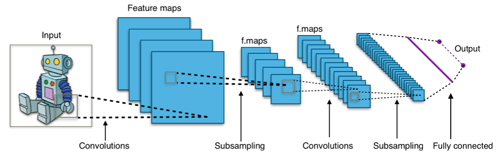
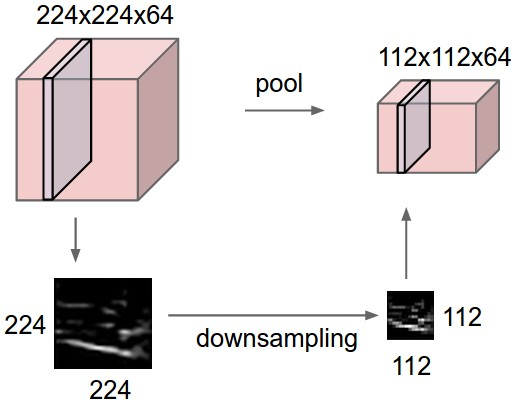

# Convolutional Neural Networks (CNN) Learning Notes

CNN is a deep learning model designed for grid-like data (especially images). Compared with fully connected networks, CNN uses local connections and weight sharing, which greatly reduces parameters and improves feature extraction efficiency.

This document focuses on four things:

1. Core ideas and architecture of CNN.
2. Important formulas and how to compute them.
3. Step-by-step calculation examples (forward + backward intuition).
4. Practical learning suggestions and resource list.

---

## 1. Why CNN

For an image with shape $H \times W \times C$, a fully connected layer quickly becomes very large:

If input is $224 \times 224 \times 3$, flattened size is $150{,}528$. Connecting it to only 1,000 hidden units needs:
$$150{,}528 \times 1{,}000 \approx 1.5 \times 10^8$$
weights (plus bias), which is huge.

CNN addresses this with:

1. Local receptive fields: each neuron only sees a local patch.
2. Weight sharing: one kernel is reused over spatial positions.
3. Spatial hierarchy: shallow layers capture edges/textures, deep layers capture semantic patterns.

---

## 2. Typical CNN Pipeline

A common architecture:

Input $\rightarrow$ Convolution $\rightarrow$ Activation (ReLU) $\rightarrow$ Pooling $\rightarrow$ ... (repeat) $\rightarrow$ Fully Connected (or Global Average Pooling) $\rightarrow$ Softmax

### 2.1 Convolution Layer

For input $X$ and kernel $K$ (single channel case), output feature map $Y$ is:
$$
Y(i,j)=\sum_{m=0}^{k_h-1}\sum_{n=0}^{k_w-1}X(i+m,j+n)K(m,n)+b
$$

For multi-channel input ($C_{in}$ channels):
$$
Y_o(i,j)=\sum_{c=1}^{C_{in}}\sum_{m=0}^{k_h-1}\sum_{n=0}^{k_w-1}X_c(i+m,j+n)K_{o,c}(m,n)+b_o
$$
where $o$ is output channel index.

### 2.2 Activation (ReLU)

$$
\text{ReLU}(x)=\max(0,x)
$$

Derivative used in backprop:
$$
\frac{d\,\text{ReLU}(x)}{dx}=\begin{cases}
1, & x>0 \\
0, & x\le 0
\end{cases}
$$

### 2.3 Pooling Layer

Max Pooling example ($2\times2$, stride $2$):
$$
Y(i,j)=\max_{(m,n)\in\{0,1\}^2}X(2i+m,2j+n)
$$

Average Pooling:
$$
Y(i,j)=\frac{1}{4}\sum_{m=0}^{1}\sum_{n=0}^{1}X(2i+m,2j+n)
$$

### 2.4 Fully Connected + Softmax

Logits:
$$
z=Wf+b
$$

Softmax probability:
$$
p_i=\frac{e^{z_i}}{\sum_j e^{z_j}}
$$

Cross-entropy (one-hot label $y$):
$$
\mathcal{L}=-\sum_i y_i\log p_i
$$

---

## 3. Output Shape and Parameter Count (Important)

### 3.1 Output Spatial Size

For convolution/pooling with input size $H_{in}\times W_{in}$, kernel $K$, padding $P$, stride $S$:
$$
H_{out}=\left\lfloor\frac{H_{in}-K+2P}{S}\right\rfloor+1,
\quad
W_{out}=\left\lfloor\frac{W_{in}-K+2P}{S}\right\rfloor+1
$$

### 3.2 Padding and Stride

Padding and stride directly control output resolution and feature extraction behavior.

1. Padding ($P$): add zeros around the input boundary.
- Main purpose: preserve border information and control output size.
- For odd kernel size $K$, using $P=\frac{K-1}{2}$ with stride $S=1$ keeps input and output size the same (often called "same" padding).

2. Stride ($S$): step size of the kernel movement.
- Larger stride reduces output resolution and computation cost.
- Smaller stride keeps more spatial detail but increases compute.

Quick example for input size $32\times32$, kernel $3\times3$:

1. $P=0, S=1$:
$$
H_{out}=W_{out}=\frac{32-3+0}{1}+1=30
$$
Output is $30\times30$.

2. $P=1, S=1$:
$$
H_{out}=W_{out}=\frac{32-3+2}{1}+1=32
$$
Output is $32\times32$ (size preserved).

3. $P=1, S=2$:
$$
H_{out}=W_{out}=\left\lfloor\frac{32-3+2}{2}\right\rfloor+1=16
$$
Output is $16\times16$ (downsampled).

### 3.3 Convolution Parameter Count

For Conv2D with $C_{in}$ input channels, $C_{out}$ output channels, kernel $K_h\times K_w$:
$$
\#\text{params}=C_{out}\times(C_{in}\times K_h\times K_w + 1)
$$
The +1 is bias per output channel.

Example:
- Input channels $C_{in}=3$
- Output channels $C_{out}=64$
- Kernel $3\times3$

$$
\#\text{params}=64\times(3\times3\times3+1)=64\times28=1792
$$

---

## 4. Step-by-Step Forward Calculation Example

Take a single-channel input $4\times4$ and a kernel $2\times2$, stride $1$, padding $0$.

Input:
$$
X=\begin{bmatrix}
1&2&0&1\\
3&1&2&2\\
0&1&3&1\\
2&2&1&0
\end{bmatrix}
$$

Kernel and bias:
$$
K=\begin{bmatrix}
1&0\\
-1&1
\end{bmatrix},\quad b=0
$$

Output size:
$$
H_{out}=W_{out}=\frac{4-2+0}{1}+1=3
$$
So output is $3\times3$.

Compute each position:

$$
Y(0,0)=1\cdot1+2\cdot0+3\cdot(-1)+1\cdot1=-1
$$

$$
Y(0,1)=2\cdot1+0\cdot0+1\cdot(-1)+2\cdot1=3
$$

$$
Y(0,2)=0\cdot1+1\cdot0+2\cdot(-1)+2\cdot1=0
$$

$$
Y(1,0)=3\cdot1+1\cdot0+0\cdot(-1)+1\cdot1=4
$$

$$
Y(1,1)=1\cdot1+2\cdot0+1\cdot(-1)+3\cdot1=3
$$

$$
Y(1,2)=2\cdot1+2\cdot0+3\cdot(-1)+1\cdot1=0
$$

$$
Y(2,0)=0\cdot1+1\cdot0+2\cdot(-1)+2\cdot1=0
$$

$$
Y(2,1)=1\cdot1+3\cdot0+2\cdot(-1)+1\cdot1=0
$$

$$
Y(2,2)=3\cdot1+1\cdot0+1\cdot(-1)+0\cdot1=2
$$

So:
$$
Y=\begin{bmatrix}
-1&3&0\\
4&3&0\\
0&0&2
\end{bmatrix}
$$

After ReLU:
$$
\text{ReLU}(Y)=\begin{bmatrix}
0&3&0\\
4&3&0\\
0&0&2
\end{bmatrix}
$$

If we apply max pooling ($2\times2$, stride $2$), output is $1\times1$:
$$
\max\{0,3,4,3\}=4
$$

---

## 5. Step-by-Step Backprop (Core Intuition + Formulas)

Suppose one conv layer computes:
$$
Y = X * K + b
$$
and loss is $\mathcal{L}$.

Given upstream gradient:
$$
\delta_Y = \frac{\partial \mathcal{L}}{\partial Y}
$$

### 5.1 Gradient w.r.t. Bias

Each bias contributes equally to all positions of one output channel:
$$
\frac{\partial \mathcal{L}}{\partial b}=\sum_{i,j}\delta_Y(i,j)
$$

### 5.2 Gradient w.r.t. Kernel

Kernel gradient is input patches weighted by upstream gradient:
$$
\frac{\partial \mathcal{L}}{\partial K}(m,n)=\sum_{i,j}\delta_Y(i,j)\,X(i+m,j+n)
$$
This is correlation between $X$ and $\delta_Y$.

### 5.3 Gradient w.r.t. Input

Input gradient is full convolution of upstream gradient with spatially flipped kernel:
$$
\frac{\partial \mathcal{L}}{\partial X}=\delta_Y * \text{rot180}(K)
$$

### 5.4 ReLU Backprop

If $A=\text{ReLU}(Z)$ and upstream gradient is $\delta_A$:
$$
\delta_Z = \delta_A \odot \mathbf{1}(Z>0)
$$
where $\odot$ is element-wise product.

### 5.5 Parameter Update (SGD)

$$
K \leftarrow K - \eta\frac{\partial \mathcal{L}}{\partial K},
\quad
b \leftarrow b - \eta\frac{\partial \mathcal{L}}{\partial b}
$$
where $\eta$ is learning rate.

---

## 6. Minimal End-to-End Example (Shape Tracking)

Input image: $32\times32\times3$

1. Conv1: $3\times3$, stride 1, padding 1, out channels 16
- Output: $32\times32\times16$
- Params: $16\times(3\times3\times3+1)=448$

2. MaxPool1: $2\times2$, stride 2
- Output: $16\times16\times16$

3. Conv2: $3\times3$, stride 1, padding 1, out channels 32
- Output: $16\times16\times32$
- Params: $32\times(16\times3\times3+1)=4{,}640$

4. MaxPool2: $2\times2$, stride 2
- Output: $8\times8\times32$

5. Flatten
- Output: $8\times8\times32=2{,}048$

6. FC: $2{,}048 \rightarrow 10$
- Params: $2{,}048\times10 + 10 = 20{,}490$

Total params:
$$
448 + 4{,}640 + 20{,}490 = 25{,}578
$$

---

## 7. Necessary Visuals (for Intuition)

These diagrams are stored locally for stable preview in VS Code and GitHub:

1. CNN architecture illustration (convolution + pooling + FC):



2. Convolution operation visualization:


3. Feature maps concept:



All image assets for this page are under `./static/`.

---

## 8. Training Suggestions (Practical)

1. Normalize inputs: e.g. scale to $[0,1]$ or standardize by dataset mean/std.
2. Start simple: small CNN first, verify it can overfit a tiny subset.
3. Monitor both train and validation curves to detect overfitting early.
4. Use data augmentation for vision tasks (flip, crop, color jitter).
5. Use learning rate scheduling (StepLR, Cosine, OneCycle).
6. Prefer BatchNorm in deeper networks for stable training.
7. Use regularization: weight decay, dropout (especially near FC layers).
8. If training is unstable, reduce learning rate first.
9. Track metrics beyond accuracy when data is imbalanced (F1, AUC, per-class recall).

---

## 9. Common Mistakes Checklist

1. Wrong tensor shape order (NCHW vs NHWC).
2. Wrong output size due to stride/padding mismatch.
3. Forgetting to switch model mode (`train()` vs `eval()`).
4. Using too large learning rate causing divergence.
5. Data leakage from validation/test into training.
6. Comparing models with different preprocessing pipelines.

---

## 10. Suggested Learning Path

1. Master shape math: compute output size and parameter counts by hand.
2. Implement a tiny conv layer in NumPy to understand forward/backward.
3. Train LeNet-like model on MNIST/CIFAR-10.
4. Study modern blocks: BatchNorm, Residual block, Depthwise separable conv.
5. Move to transfer learning with ResNet/EfficientNet on your own dataset.

---

## 11. PyTorch Sample Code for Learning

The following code trains a small CNN on CIFAR-10 and shows a standard learning workflow.

```python
import torch
import torch.nn as nn
import torch.optim as optim
from torch.utils.data import DataLoader
from torchvision import datasets, transforms


class SimpleCNN(nn.Module):
    def __init__(self, num_classes=10):
        super().__init__()
        self.features = nn.Sequential(
            nn.Conv2d(3, 16, kernel_size=3, stride=1, padding=1),
            nn.ReLU(inplace=True),
            nn.MaxPool2d(kernel_size=2, stride=2),
            nn.Conv2d(16, 32, kernel_size=3, stride=1, padding=1),
            nn.ReLU(inplace=True),
            nn.MaxPool2d(kernel_size=2, stride=2),
        )
        self.classifier = nn.Sequential(
            nn.Flatten(),
            nn.Linear(32 * 8 * 8, 128),
            nn.ReLU(inplace=True),
            nn.Dropout(p=0.3),
            nn.Linear(128, num_classes),
        )

    def forward(self, x):
        x = self.features(x)
        x = self.classifier(x)
        return x


def train_one_epoch(model, loader, criterion, optimizer, device):
    model.train()
    total_loss = 0.0
    correct = 0
    total = 0

    for images, labels in loader:
        images = images.to(device)
        labels = labels.to(device)

        optimizer.zero_grad()
        logits = model(images)
        loss = criterion(logits, labels)
        loss.backward()
        optimizer.step()

        total_loss += loss.item() * images.size(0)
        preds = logits.argmax(dim=1)
        correct += (preds == labels).sum().item()
        total += labels.size(0)

    return total_loss / total, correct / total


@torch.no_grad()
def evaluate(model, loader, criterion, device):
    model.eval()
    total_loss = 0.0
    correct = 0
    total = 0

    for images, labels in loader:
        images = images.to(device)
        labels = labels.to(device)

        logits = model(images)
        loss = criterion(logits, labels)

        total_loss += loss.item() * images.size(0)
        preds = logits.argmax(dim=1)
        correct += (preds == labels).sum().item()
        total += labels.size(0)

    return total_loss / total, correct / total


def main():
    device = torch.device("cuda" if torch.cuda.is_available() else "cpu")

    train_tfms = transforms.Compose([
        transforms.RandomHorizontalFlip(),
        transforms.RandomCrop(32, padding=4),
        transforms.ToTensor(),
        transforms.Normalize((0.4914, 0.4822, 0.4465), (0.2470, 0.2435, 0.2616)),
    ])
    test_tfms = transforms.Compose([
        transforms.ToTensor(),
        transforms.Normalize((0.4914, 0.4822, 0.4465), (0.2470, 0.2435, 0.2616)),
    ])

    train_set = datasets.CIFAR10(root="./data", train=True, download=True, transform=train_tfms)
    test_set = datasets.CIFAR10(root="./data", train=False, download=True, transform=test_tfms)

    train_loader = DataLoader(train_set, batch_size=128, shuffle=True, num_workers=2)
    test_loader = DataLoader(test_set, batch_size=256, shuffle=False, num_workers=2)

    model = SimpleCNN(num_classes=10).to(device)
    criterion = nn.CrossEntropyLoss()
    optimizer = optim.Adam(model.parameters(), lr=1e-3, weight_decay=1e-4)
    scheduler = optim.lr_scheduler.StepLR(optimizer, step_size=10, gamma=0.5)

    epochs = 20
    for epoch in range(1, epochs + 1):
        train_loss, train_acc = train_one_epoch(model, train_loader, criterion, optimizer, device)
        val_loss, val_acc = evaluate(model, test_loader, criterion, device)
        scheduler.step()

        print(
            f"Epoch {epoch:02d}/{epochs} | "
            f"train_loss={train_loss:.4f}, train_acc={train_acc:.4f} | "
            f"val_loss={val_loss:.4f}, val_acc={val_acc:.4f}"
        )

    torch.save(model.state_dict(), "simple_cnn_cifar10.pth")
    print("Saved model to simple_cnn_cifar10.pth")


if __name__ == "__main__":
    main()
```

Install dependencies:

```bash
pip install torch torchvision
```

Run training:

```bash
python train_cnn.py
```

---

## 12. Recommended Resources

1. Stanford CS231n (CNN fundamentals):
- https://cs231n.github.io/convolutional-networks/
2. Dive into Deep Learning (free textbook):
- https://d2l.ai/
3. Deep Learning Book (Goodfellow et al.):
- https://www.deeplearningbook.org/
4. PyTorch official tutorial (vision):
- https://pytorch.org/tutorials/
5. Fast.ai practical deep learning:
- https://course.fast.ai/

---

## 13. Quick Recap

1. Convolution extracts local patterns with shared kernels.
2. ReLU provides nonlinearity and sparse activation.
3. Pooling reduces spatial resolution and improves robustness.
4. Backprop through conv uses structured gradient accumulation.
5. Correct shape math and learning-rate strategy are key to successful CNN training.
