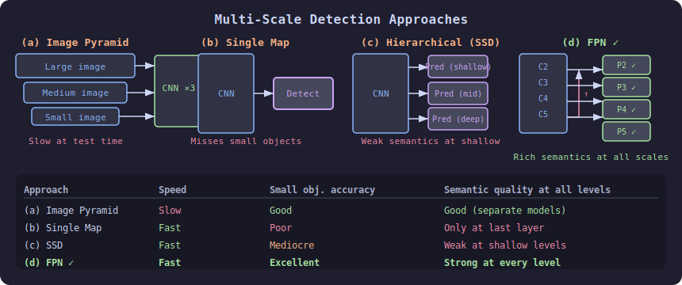
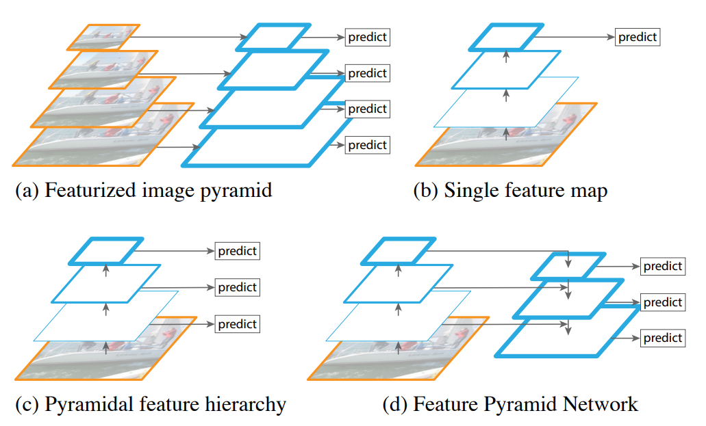
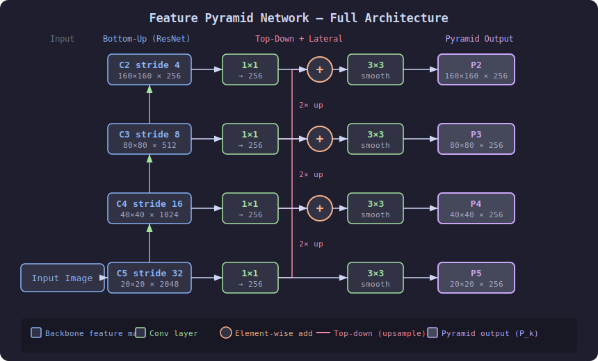
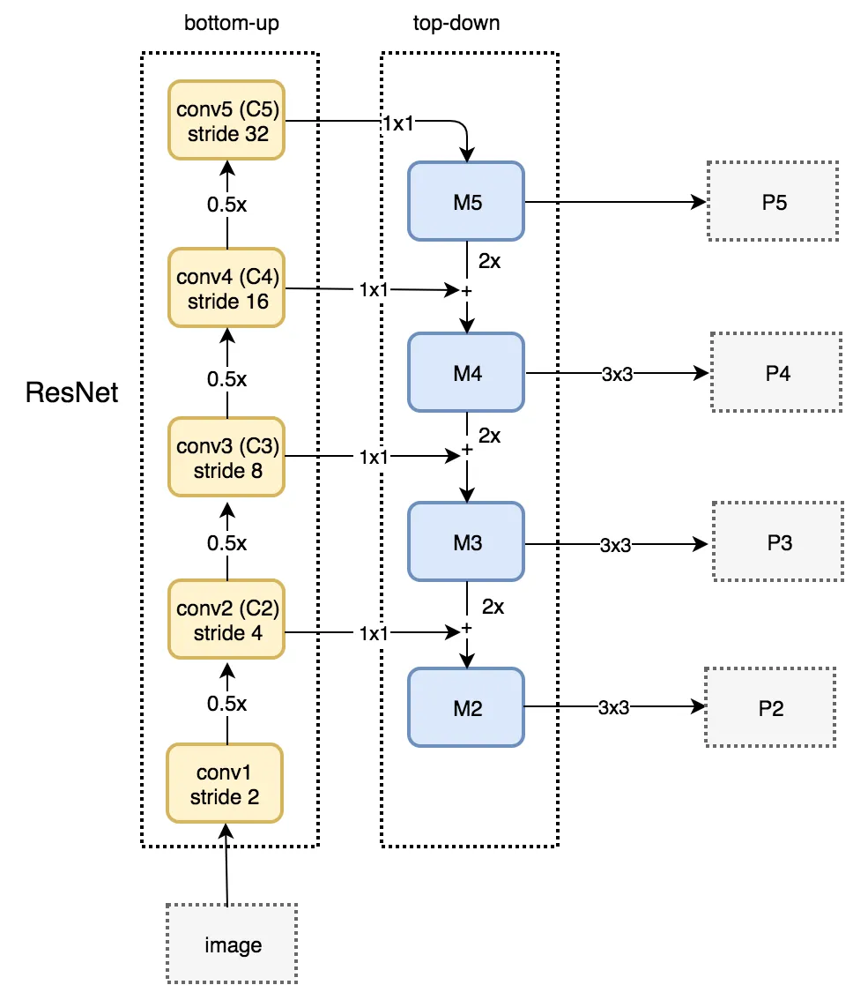
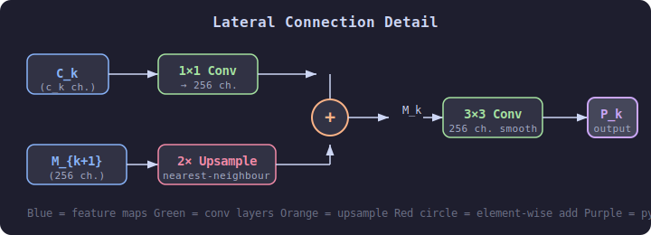
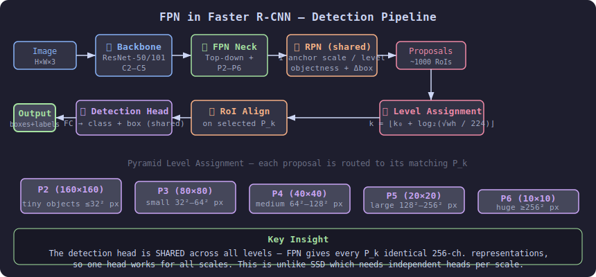

# Feature Pyramid Networks (FPN)

Feature Pyramid Networks were introduced by Lin et al. in **"Feature Pyramid Networks for Object Detection" (CVPR 2017)**. FPN solves a core problem in object detection: how to efficiently detect objects at **wildly different scales** inside a single image without sacrificing speed or accuracy.

---

## 1. The Multi-Scale Problem

A single convolutional network naturally produces a feature hierarchy — shallow layers capture fine detail (edges, textures) while deep layers capture semantics (object parts, identities). But these two properties are never in the same place at the same time:

| Layer depth | Spatial resolution | Semantic richness |
|-------------|-------------------|-------------------|
| Shallow (early) | High (large maps) | Low |
| Deep (late) | Low (small maps) | High |

Detecting a **small pedestrian** needs high resolution; detecting a **large car** needs high semantics. Prior solutions all had serious trade-offs:



| Approach | Description | Drawback |
|----------|-------------|---------|
| **(a) Image pyramid** | Run the detector at multiple rescaled input images | Slow; memory-intensive at test time |
| **(b) Single feature map** | Detect from only the last (deepest) layer | Misses small objects |
| **(c) Hierarchical predictions** | Predict at each scale independently (SSD-like) | Shallow layers lack semantics |
| **(d) FPN** | Build a top-down pyramid that merges semantics into every level | Fast, accurate, single-model |

FPN achieves approach **(d)** at essentially zero extra inference cost.



Figure 1. (a) Using an image pyramid to build a feature pyramid. Features are computed on each of the image scales independently, which is slow. (b) Recent detection systems have opted to use only single scale features for faster detection. (c) An alternative is to reuse the pyramidal feature hierarchy computed by a ConvNet as if it were a featurized image pyramid. (d) Our proposed Feature Pyramid Network (FPN) is fast like (b) and (c), but more accurate. In this figure, feature maps are indicate by blue outlines and thicker outlines denote semantically stronger features.

---

## 2. FPN Architecture

FPN consists of three components that work together:

### 2.1 Bottom-Up Pathway (Backbone)

Any standard CNN backbone (ResNet is canonical) produces feature maps at multiple scales during its forward pass. FPN names them $\{C_2, C_3, C_4, C_5\}$, one per "stage" of the backbone (each stage halves spatial resolution):

$$
C_k \in \mathbb{R}^{\frac{H}{2^k} \times \frac{W}{2^k} \times d_k}
$$

For a $640\times640$ input with ResNet-50:

| Level | Stride | Spatial size | Channels |
|-------|--------|-------------|----------|
| $C_2$ | 4 | $160\times160$ | 256 |
| $C_3$ | 8 | $80\times80$ | 512 |
| $C_4$ | 16 | $40\times40$ | 1024 |
| $C_5$ | 32 | $20\times20$ | 2048 |

### 2.2 Top-Down Pathway

Starting from the coarsest, most semantic map $C_5$, FPN upsamples step by step back toward higher resolutions. Each step doubles the spatial size using **2× nearest-neighbour upsampling**:

$$
M_k = \text{Upsample}(M_{k+1}) + \text{Lateral}(C_k)
$$

This is repeated for $k = 4, 3, 2$.

### 2.3 Lateral Connections

Each $C_k$ passes through a **1×1 convolution** that reduces its channel dimension to a fixed width $d = 256$:

$$
\text{Lateral}(C_k) = W_k * C_k, \quad W_k \in \mathbb{R}^{1\times1\times c_k\times256}
$$

The 1×1 conv acts as a channel-alignment projection so that features from different depths can be **added element-wise**.

After the element-wise addition, a **3×3 convolution** smooths out the aliasing artefacts from upsampling:

$$
P_k = \text{Conv}_{3\times3}(M_k), \quad P_k \in \mathbb{R}^{\frac{H}{2^k}\times\frac{W}{2^k}\times256}
$$

The final output pyramid is $\{P_2, P_3, P_4, P_5\}$ — all with 256 channels but at 4 different resolutions.

### 2.4 Full Architecture Diagram

```
Bottom-Up (ResNet)              Top-Down + Lateral
─────────────────               ──────────────────────────────────────
                                              1×1 conv
Input ──► C2 (stride 4)  ────────────────────────►(+)──► 3×3 conv ──► P2
          │                                         ↑
          ▼                                   2× upsample
         C3 (stride 8)  ─────────────────────►(+)──► 3×3 conv ──► P3
          │                                         ↑
          ▼                                   2× upsample
         C4 (stride 16) ─────────────────────►(+)──► 3×3 conv ──► P4
          │                                         ↑
          ▼                                   2× upsample
         C5 (stride 32) ──► 1×1 conv ──────────────►      3×3 conv ──► P5
```

The information **flows upward** through the backbone to capture semantics, then **flows downward** through the top-down pathway to re-inject those semantics into high-resolution maps.



### 2.5 Bottom-up pathway uses ResNet

The bottom-up pathway uses ResNet to construct the bottom-up pathway. It composes of many convolution modules (convi for i equals 1 to 5) each has many convolution layers. As we move up, the spatial dimension is reduced by 1/2 (i.e. double the stride). The output of each convolution module is labeled as Ci and later used in the top-down pathway.



---

## 3. Lateral Connection Detail

The lateral merge is the core innovation of FPN. Each lateral connection:

1. Takes $C_k$ (many channels, semantically weak at shallow levels)
2. Projects it to 256 channels with a $1\times1$ conv
3. **Adds** it to the upsampled $M_{k+1}$ (which already carries deep semantics)

```
C_k  ──► [1×1, 256] ──────────┐
                               (+) ──► M_k ──► [3×3, 256] ──► P_k
M_{k+1} ──► [2× upsample] ───┘
```

The element-wise sum requires that both branches have the **same spatial size and channel count** — this is exactly why the 1×1 conv reduces channels to 256 before the addition.



---

## 4. Which Pyramid Level to Use?

In practice each object is assigned to a specific pyramid level based on its size. Faster R-CNN with FPN uses the rule:

$$
k = \left\lfloor k_0 + \log_2\!\left(\frac{\sqrt{wh}}{224}\right) \right\rfloor
$$

where $w,h$ are the ground-truth box dimensions, and $k_0 = 4$ (the base level). Small objects (e.g., $32\times32$) land on $P_2$; large objects (e.g., $512\times512$) land on $P_5$.

| Object size (approx.) | Assigned level |
|----------------------|---------------|
| $\leq 32^2$ px | $P_2$ |
| $32^2$–$64^2$ px | $P_3$ |
| $64^2$–$128^2$ px | $P_4$ |
| $128^2$–$256^2$ px | $P_5$ |
| $\geq 256^2$ px | $P_6$ (extra pool of $P_5$) |

RPN anchors in Faster R-CNN with FPN use a **single anchor scale** per level (area = $32^2, 64^2, 128^2, 256^2, 512^2$), because the pyramid itself handles multi-scale — you no longer need multi-scale anchors at every level.

---

## 5. FPN in Faster R-CNN (Step-by-Step)



1. **Backbone** — ResNet-50/101 runs once on the image, producing $C_2$–$C_5$.
2. **FPN neck** — Build $P_2$–$P_6$ as described above.
3. **RPN** — A small shared head runs on every level $P_2$–$P_6$, predicting objectness + box offsets. Each level uses its own anchor scale but the head weights are **shared** across levels.
4. **RoI pooling** — For each proposal, select the pyramid level $k$ using the size formula above, then apply **RoI Align** on $P_k$.
5. **Detection head** — A shared FC head predicts final class + box.

The key insight: the **detection head is identical at every pyramid level**, because FPN ensures all $P_k$ have the same 256-channel representation. This is fundamentally different from SSD, which trains independent heads per scale.

---

## 6. Mathematical Summary

Let the backbone produce $\{C_2, C_3, C_4, C_5\}$. FPN computes:

$$
M_5 = \phi_{1\times1}(C_5)
$$

$$
M_k = \text{Up}_2(M_{k+1}) + \phi_{1\times1}(C_k), \quad k = 4, 3, 2
$$

$$
P_k = \phi_{3\times3}(M_k), \quad k = 2, 3, 4, 5
$$

$$
P_6 = \text{MaxPool}_{2\times2,s=2}(P_5) \quad \text{(optional, for large-object coverage)}
$$

where $\phi_{n\times n}$ denotes an $n\times n$ convolution with output dimension 256, and $\text{Up}_2$ denotes 2× nearest-neighbour upsampling.

---

## 7. Comparison with SSD

SSD (Single Shot Detector) also uses multi-scale feature maps but draws predictions from **different backbone stages directly** without a top-down path:

```
SSD:   C3 ──► pred_small      (weak semantics, high resolution)
       C4 ──► pred_medium
       C5 ──► pred_large       (strong semantics, low resolution)

FPN:   C5 → P5 ─────────────► pred_large   (strong semantics)
             ↓ upsample+add
       C4 → P4 ──────────────► pred_medium  (strong semantics)
             ↓ upsample+add
       C3 → P3 ──────────────► pred_small   (strong semantics ✓)
```

Because SSD's shallow feature maps have weak semantics, it struggles with small object accuracy. FPN distributes strong semantics down to all levels.

---

## 8. PyTorch Implementation Sketch

```python
import torch
import torch.nn as nn
import torch.nn.functional as F

class FPN(nn.Module):
    """Minimal Feature Pyramid Network neck."""

    def __init__(self, in_channels: list[int], out_channels: int = 256):
        """
        Args:
            in_channels: channel counts of [C2, C3, C4, C5] from backbone
            out_channels: unified channel width for all P_k
        """
        super().__init__()
        # 1×1 lateral convolutions (channel alignment)
        self.lateral_convs = nn.ModuleList([
            nn.Conv2d(c, out_channels, kernel_size=1)
            for c in in_channels
        ])
        # 3×3 output convolutions (anti-aliasing after upsample+add)
        self.output_convs = nn.ModuleList([
            nn.Conv2d(out_channels, out_channels, kernel_size=3, padding=1)
            for _ in in_channels
        ])

    def forward(self, features: list[torch.Tensor]) -> list[torch.Tensor]:
        """
        Args:
            features: [C2, C3, C4, C5] from backbone (low→high stride order)
        Returns:
            [P2, P3, P4, P5]
        """
        # Step 1 — lateral projections
        laterals = [conv(f) for conv, f in zip(self.lateral_convs, features)]

        # Step 2 — top-down merging (from deepest to shallowest)
        for i in range(len(laterals) - 2, -1, -1):
            laterals[i] = laterals[i] + F.interpolate(
                laterals[i + 1], size=laterals[i].shape[-2:], mode="nearest"
            )

        # Step 3 — 3×3 smoothing convolutions
        outputs = [conv(lat) for conv, lat in zip(self.output_convs, laterals)]
        return outputs  # [P2, P3, P4, P5]


# Example usage with ResNet-50 channel sizes
if __name__ == "__main__":
    fpn = FPN(in_channels=[256, 512, 1024, 2048], out_channels=256)

    # Simulated backbone outputs for a 640×640 input
    c2 = torch.randn(1, 256,  160, 160)
    c3 = torch.randn(1, 512,   80,  80)
    c4 = torch.randn(1, 1024,  40,  40)
    c5 = torch.randn(1, 2048,  20,  20)

    p2, p3, p4, p5 = fpn([c2, c3, c4, c5])
    print(p2.shape)  # (1, 256, 160, 160)
    print(p3.shape)  # (1, 256,  80,  80)
    print(p4.shape)  # (1, 256,  40,  40)
    print(p5.shape)  # (1, 256,  20,  20)
```

---

## 9. Variants and Extensions

| Variant | Change from FPN | Paper |
|---------|----------------|-------|
| **PANet** (Path Aggregation Network) | Adds a bottom-up path *on top of* FPN's top-down path; information flows both ways | Liu et al., 2018 |
| **NAS-FPN** | Uses neural architecture search to find optimal cross-scale connections | Ghiasi et al., 2019 |
| **BiFPN** (EfficientDet) | Replaces simple addition with weighted fusion; removes nodes with only one input | Tan et al., 2020 |
| **PAFPN** (YOLOv5/v8) | PANet-style bidirectional FPN, used in YOLO family | Redmon et al. |

### BiFPN Weighted Fusion

BiFPN replaces the unweighted sum $M_k = \text{Up}(M_{k+1}) + \text{Lat}(C_k)$ with:

$$
M_k = \frac{w_1 \cdot \text{Up}(M_{k+1}) + w_2 \cdot \text{Lat}(C_k)}{w_1 + w_2 + \epsilon}, \quad w_i = \text{ReLU}(\hat{w}_i)
$$

The weights $\hat{w}_i$ are learned scalars, letting the network decide how much to trust each input at each level.

---

## 10. Key Results (COCO)

| Model | Backbone | AP | $\text{AP}_S$ | $\text{AP}_M$ | $\text{AP}_L$ |
|-------|----------|----|-------|-------|-------|
| Faster R-CNN (no FPN) | ResNet-50 | 31.6 | 14.0 | 34.1 | 44.5 |
| Faster R-CNN + FPN | ResNet-50 | **36.2** | **20.0** | **39.3** | **48.0** |
| Mask R-CNN + FPN | ResNet-101-X | 48.3 | 30.0 | 52.6 | 62.5 |

$\text{AP}_S$ (small, area < $32^2$) improves the most — from 14.0 → 20.0, a **+43% relative** gain — confirming that the high-resolution, semantically enriched $P_2$ / $P_3$ levels are the key contribution.

---

## 11. Recommended Resources

1. **Original paper** — Lin et al., "Feature Pyramid Networks for Object Detection", CVPR 2017 — [arxiv.org/abs/1612.03144](https://arxiv.org/abs/1612.03144)
2. **Detectron2** reference implementation — [github.com/facebookresearch/detectron2](https://github.com/facebookresearch/detectron2)
3. **MMDetection** FPN module — [github.com/open-mmlab/mmdetection](https://github.com/open-mmlab/mmdetection)
4. Related: **PANet** — [arxiv.org/abs/1803.01534](https://arxiv.org/abs/1803.01534)
5. Related: **BiFPN / EfficientDet** — [arxiv.org/abs/1911.09070](https://arxiv.org/abs/1911.09070)
