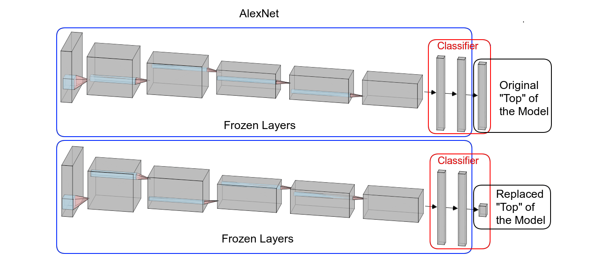
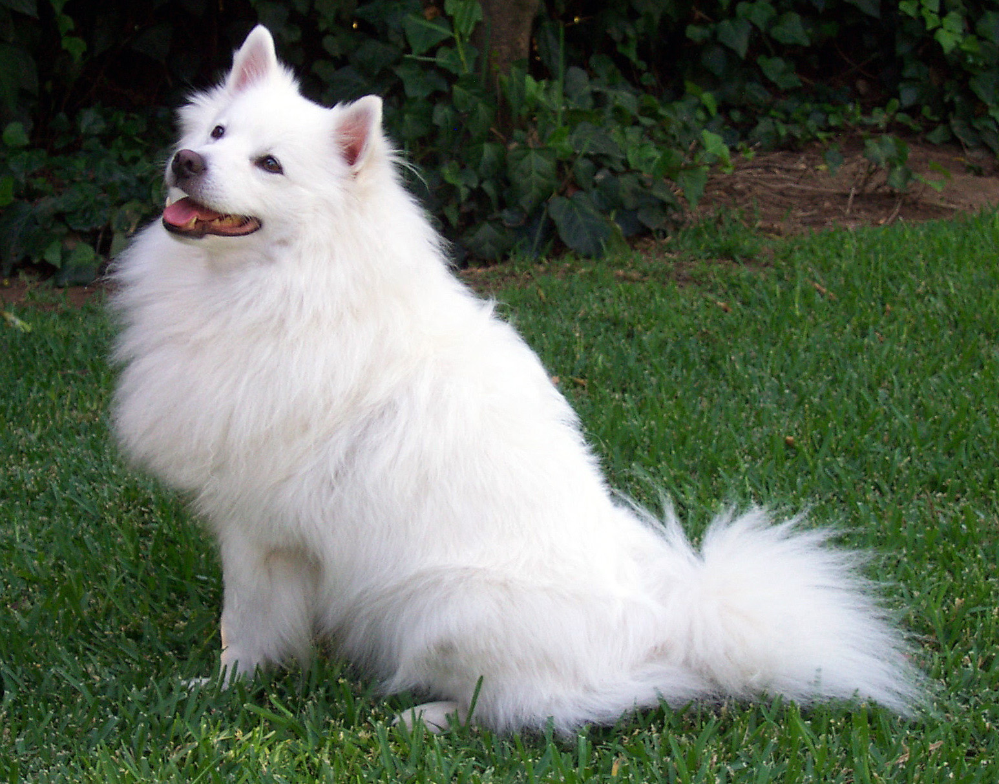

# AlexNet Learning Notes

AlexNet is a milestone CNN architecture proposed in 2012 by Alex Krizhevsky, Ilya Sutskever, and Geoffrey Hinton. It won ILSVRC 2012 and demonstrated that deep CNNs trained on GPUs can dramatically outperform traditional vision pipelines.

## 1. Why AlexNet Matters

1. It popularized deep convolutional learning at ImageNet scale.
2. It used ReLU extensively, which accelerated convergence.
3. It combined data augmentation + dropout + GPU training effectively.
4. It triggered the modern deep vision era that led to VGG, ResNet, and beyond.

## 2. AlexNet Architecture (Core)

Classic AlexNet has 5 convolution layers and 3 fully connected layers.

Typical flow:

Input $227\times227\times3$ \
$\rightarrow$ Conv1 (11x11, s=4, 96) \
$\rightarrow$ MaxPool \
$\rightarrow$ Conv2 (5x5, 256) \
$\rightarrow$ MaxPool \
$\rightarrow$ Conv3 (3x3, 384) \
$\rightarrow$ Conv4 (3x3, 384) \
$\rightarrow$ Conv5 (3x3, 256) \
$\rightarrow$ MaxPool \
$\rightarrow$ FC6 (4096) \
$\rightarrow$ FC7 (4096) \
$\rightarrow$ FC8 (1000) \
$\rightarrow$ Softmax

## 3. AlexNet Images

1. AlexNet architecture figure:



2. Block diagram comparison (LeNet vs AlexNet):


3. Example input image used in AlexNet-style demos:



## 4. Important Output-Shape Calculations

Convolution/pooling spatial output formula:

$$
H_{out}=\left\lfloor\frac{H_{in}-K+2P}{S}\right\rfloor+1,
\quad
W_{out}=\left\lfloor\frac{W_{in}-K+2P}{S}\right\rfloor+1
$$

### 4.1 Conv1 Example

Given input $227\times227$, Conv1 uses $K=11$, $S=4$, $P=0$:

$$
H_{out}=W_{out}=\left\lfloor\frac{227-11+0}{4}\right\rfloor+1=55
$$

Conv1 output is $55\times55\times96$.

### 4.2 Pool1 Example

With max pooling $K=3$, $S=2$, $P=0$ on $55\times55$:

$$
H_{out}=W_{out}=\left\lfloor\frac{55-3}{2}\right\rfloor+1=27
$$

Pool1 output is $27\times27\times96$.

## 5. Important Parameter Calculations

Conv parameter count formula:

$$
\#\text{params}=C_{out}\times(C_{in}\times K_h\times K_w + 1)
$$

### 5.1 Conv1 Parameters

For Conv1: $C_{in}=3$, $C_{out}=96$, kernel $11\times11$:

$$
\#\text{params}=96\times(3\times11\times11+1)=96\times364=34{,}944
$$

### 5.2 FC6 Parameters (Large Part of AlexNet)

If flattened feature dimension is $256\times6\times6=9{,}216$ and FC6 has 4,096 units:

$$
\#\text{params}=9{,}216\times4{,}096 + 4{,}096 = 37{,}752{,}832
$$

This explains why fully connected layers dominate AlexNet parameters.

## 6. Training Details from Original AlexNet (Useful to Know)

1. Optimizer style: SGD with momentum.
2. Momentum: about 0.9.
3. Weight decay: about 0.0005.
4. Data augmentation: random crops, flips, RGB jitter.
5. Regularization: dropout in FC layers.
6. Activation: ReLU instead of tanh/sigmoid in deep layers.

## 7. PyTorch Sample Code for Learning

The sample below fine-tunes AlexNet on CIFAR-10 (10 classes). It is practical for learning transfer learning and the standard training workflow.

```python
import torch
import torch.nn as nn
import torch.optim as optim
from torch.utils.data import DataLoader
from torchvision import datasets, models, transforms


def get_dataloaders(batch_size=64):
	train_tfms = transforms.Compose([
		transforms.Resize((224, 224)),
		transforms.RandomHorizontalFlip(),
		transforms.ToTensor(),
		transforms.Normalize((0.4914, 0.4822, 0.4465), (0.2470, 0.2435, 0.2616)),
	])
	test_tfms = transforms.Compose([
		transforms.Resize((224, 224)),
		transforms.ToTensor(),
		transforms.Normalize((0.4914, 0.4822, 0.4465), (0.2470, 0.2435, 0.2616)),
	])

	train_set = datasets.CIFAR10(root="./data", train=True, download=True, transform=train_tfms)
	test_set = datasets.CIFAR10(root="./data", train=False, download=True, transform=test_tfms)

	train_loader = DataLoader(train_set, batch_size=batch_size, shuffle=True, num_workers=2)
	test_loader = DataLoader(test_set, batch_size=batch_size * 2, shuffle=False, num_workers=2)
	return train_loader, test_loader


def build_model(num_classes=10, pretrained=True):
	if pretrained:
		model = models.alexnet(weights=models.AlexNet_Weights.IMAGENET1K_V1)
	else:
		model = models.alexnet(weights=None)

	in_features = model.classifier[6].in_features
	model.classifier[6] = nn.Linear(in_features, num_classes)
	return model


def train_one_epoch(model, loader, criterion, optimizer, device):
	model.train()
	total_loss = 0.0
	correct = 0
	total = 0

	for images, labels in loader:
		images = images.to(device)
		labels = labels.to(device)

		optimizer.zero_grad()
		logits = model(images)
		loss = criterion(logits, labels)
		loss.backward()
		optimizer.step()

		total_loss += loss.item() * images.size(0)
		pred = logits.argmax(dim=1)
		correct += (pred == labels).sum().item()
		total += labels.size(0)

	return total_loss / total, correct / total


@torch.no_grad()
def evaluate(model, loader, criterion, device):
	model.eval()
	total_loss = 0.0
	correct = 0
	total = 0

	for images, labels in loader:
		images = images.to(device)
		labels = labels.to(device)

		logits = model(images)
		loss = criterion(logits, labels)

		total_loss += loss.item() * images.size(0)
		pred = logits.argmax(dim=1)
		correct += (pred == labels).sum().item()
		total += labels.size(0)

	return total_loss / total, correct / total


def main():
	device = torch.device("cuda" if torch.cuda.is_available() else "cpu")
	train_loader, test_loader = get_dataloaders(batch_size=64)

	model = build_model(num_classes=10, pretrained=True).to(device)
	criterion = nn.CrossEntropyLoss()
	optimizer = optim.SGD(model.parameters(), lr=1e-3, momentum=0.9, weight_decay=5e-4)
	scheduler = optim.lr_scheduler.StepLR(optimizer, step_size=10, gamma=0.1)

	epochs = 15
	for epoch in range(1, epochs + 1):
		train_loss, train_acc = train_one_epoch(model, train_loader, criterion, optimizer, device)
		val_loss, val_acc = evaluate(model, test_loader, criterion, device)
		scheduler.step()

		print(
			f"Epoch {epoch:02d}/{epochs} | "
			f"train_loss={train_loss:.4f}, train_acc={train_acc:.4f} | "
			f"val_loss={val_loss:.4f}, val_acc={val_acc:.4f}"
		)

	torch.save(model.state_dict(), "alexnet_cifar10.pth")
	print("Saved model to alexnet_cifar10.pth")


if __name__ == "__main__":
	main()
```

Install dependencies:

```bash
pip install torch torchvision
```

Run training:

```bash
python train_alexnet.py
```

## 8. Learning Suggestions

1. Start with `pretrained=True` to learn transfer learning faster.
2. First freeze features (`for p in model.features.parameters(): p.requires_grad=False`) and train only classifier.
3. Then unfreeze selected conv blocks for fine-tuning.
4. Track train/val accuracy and confusion matrix, not only loss.
5. If overfitting appears, increase augmentation or dropout.

## 9. Recommended Resources

1. AlexNet original paper:
https://papers.nips.cc/paper/4824-imagenet-classification-with-deep-convolutional-neural-networks.pdf

2. D2L AlexNet chapter:
https://d2l.ai/chapter_convolutional-modern/alexnet.html

3. PyTorch AlexNet docs:
https://pytorch.org/vision/main/models/generated/torchvision.models.alexnet.html
