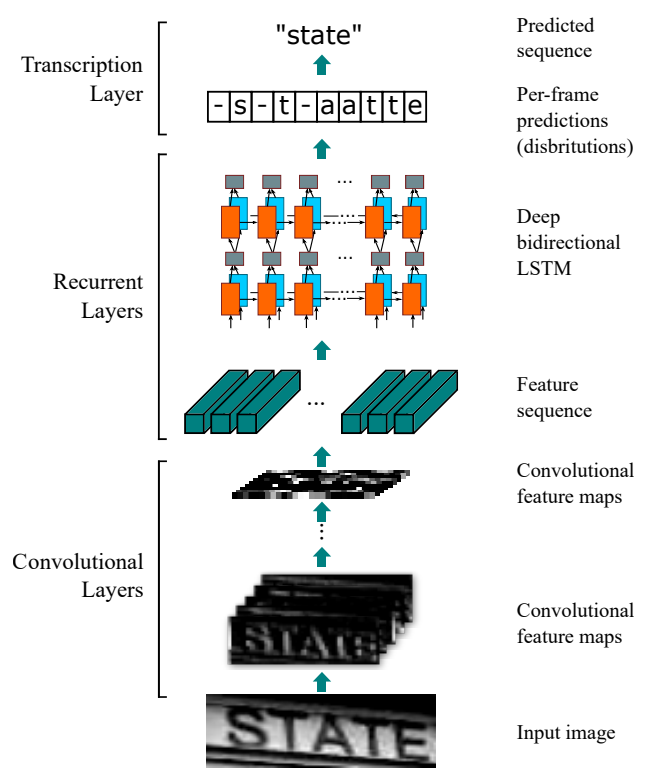
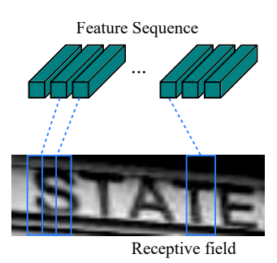
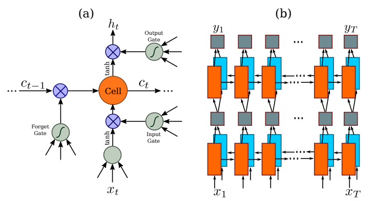

# CRNN: An End-to-End Trainable Neural Network for Scene Text Recognition

> **Paper:** An End-to-End Trainable Neural Network for Image-based Sequence Recognition and Its Application to Scene Text Recognition  
> **Authors:** Baoguang Shi, Xiang Bai, Cong Yao  
> **Venue:** IEEE TPAMI 2017  
> **arXiv:** [1507.05717](https://arxiv.org/abs/1507.05717) [1]
> **Code:** https://github.com/bgshih/crnn

---

## 1. Introduction / Overview

CRNN is a **unified end-to-end neural network** for image-based sequence recognition, specifically designed for **scene text recognition** — the task of reading text from natural images. It integrates three components into a single trainable framework:

1. **CNN** — extracts visual features from the input image
2. **BiLSTM** — models sequential dependencies across the feature columns
3. **CTC** — decodes the sequence output into a final text string without requiring character-level segmentation

Four key properties distinguish CRNN from prior work:

| Property | Description |
|---|---|
| **End-to-end trainable** | All three stages are jointly optimized in one pass |
| **Arbitrary-length sequences** | No pre-defined max length; no character segmentation needed |
| **Lexicon-free** | Works without a dictionary; also supports lexicon-constrained decoding |
| **Small model** | Compact enough for practical deployment |

---

## 2. Background / Motivation

### The Scene Text Recognition Task

Given a **word-level cropped text image**, predict the string of characters it contains.

```
Input:  [image of the word "hello"]
Output: "hello"
```

This is fundamentally a **sequence-to-sequence** problem: the input is a 2D image, and the output is a 1D sequence of characters of variable length.

### Why Existing Approaches Fall Short

**Traditional OCR pipelines** (pre-deep-learning):
- Rely on hand-crafted features (HOG, SIFT) + SVM/HMM classifiers
- Require explicit character segmentation — detecting the boundary of each individual character first
- Character segmentation in natural scenes is extremely unreliable due to noise, blur, and irregular spacing

**Early deep learning approaches** (e.g., character-level CNN classifiers):
- Treat each character as an independent classification problem
- Require a **fixed-length output** — the network must know in advance how many characters are in the image
- Cannot generalize to variable-length words without a separate segmentation stage

**The core problem:**

```
Traditional pipeline (fragile):

  [Word Image] → [Character Segmentation] → [Per-char Classifier] → "hello"
                        ↑
                   Often fails here (irregular spacing, connected letters, noise)
```

CRNN eliminates character segmentation entirely by treating the image as a **sequence of column feature vectors** and using CTC to align predictions to labels.

```
CRNN pipeline (robust):

  [Word Image] → [CNN Features] → [BiLSTM Sequence] → [CTC Decode] → "hello"
                  No segmentation required at any stage
```

### What is CTC?

**Connectionist Temporal Classification (CTC)** is a loss function and decoding algorithm for sequence prediction where the alignment between input frames and output labels is **unknown**.

The key insight: the network outputs one prediction per time step, but many time steps will output a "blank" token or duplicate characters. CTC marginalizes over all valid alignments:

$$p(\mathbf{l} | \mathbf{x}) = \sum_{\pi \in \mathcal{B}^{-1}(\mathbf{l})} p(\pi | \mathbf{x})$$

where $\mathbf{l}$ is the target label sequence, $\pi$ is a valid CTC path, and $\mathcal{B}$ is the CTC collapse function (removes blanks and consecutive duplicates).

---

## 3. Architecture

### 3.1 Overall Pipeline

```
┌─────────────────────────────────────────────────────────────────────┐
│                         Input Image                                 │
│                    (H=32, W=variable, C=1)                          │
└─────────────────────────┬───────────────────────────────────────────┘
                          │
                          ▼
┌─────────────────────────────────────────────────────────────────────┐
│                     Convolutional Layers                            │
│              (7-layer VGG-like CNN, no FC layers)                   │
│                                                                     │
│   Input        Conv→BN→ReLU→Pool  ×4    →   Feature Map             │
│  (1×32×W)  ──────────────────────────►  (512 × 1 × W/4)             │
└─────────────────────────┬───────────────────────────────────────────┘
                          │  Reshape: treat W/4 columns as T time steps
                          ▼
┌─────────────────────────────────────────────────────────────────────┐
│                     Recurrent Layers                                │
│              (2 × Bidirectional LSTM, hidden=256)                   │
│                                                                     │
│   [f₁][f₂][f₃] ... [fT]   ─►  BiLSTM  ─►  [h₁][h₂] ... [hT]         │
│                               (×2 layers)   each hᵢ ∈ ℝ⁵¹²          │
└─────────────────────────┬───────────────────────────────────────────┘
                          │
                          ▼
┌─────────────────────────────────────────────────────────────────────┐
│                     Transcription Layer (CTC)                       │
│                                                                     │
│   FC: 512 → |alphabet|+1  (softmax per time step)                   │
│   CTC decode: [_, h, _, e, e, l, l, _, o] → "hello"                 │
└─────────────────────────┬───────────────────────────────────────────┘
                          │
                          ▼
                    Output: "hello"
```

#### The network architecture [REF: 1507.05717](https://arxiv.org/abs/1507.05717)


Figure 1. The network architecture. The architecture consists of three parts: 1) convolutional layers, which extract a feature sequence from the input image; 2) recurrent layers, which predict a label distribution for each frame; 3) transcription layer, which translates the per-frame predictions into the final label sequence.

### 3.2 Convolutional Layers (Feature Extraction)

The CNN is a modified **VGGNet** — all fully-connected layers are removed, leaving only convolutional and pooling layers. The input image is **normalized to height 32** and the width is kept proportional.

A critical design choice: **asymmetric pooling** in the last two pooling layers uses a $1 \times 2$ kernel (pool only in the width direction, not height). This produces a feature map of height **1** while preserving more width resolution.

| Layer | Operation | Output Size |
|---|---|---|
| Input | — | $1 \times 32 \times W$ |
| Conv1 | 3×3, 64 filters, ReLU | $64 \times 32 \times W$ |
| Pool1 | 2×2 MaxPool | $64 \times 16 \times W/2$ |
| Conv2 | 3×3, 128 filters, ReLU | $128 \times 16 \times W/2$ |
| Pool2 | 2×2 MaxPool | $128 \times 8 \times W/4$ |
| Conv3 | 3×3, 256 filters, BN, ReLU | $256 \times 8 \times W/4$ |
| Conv4 | 3×3, 256 filters, ReLU | $256 \times 8 \times W/4$ |
| Pool3 | **1×2** MaxPool | $256 \times 4 \times W/4$ |
| Conv5 | 3×3, 512 filters, BN, ReLU | $512 \times 4 \times W/4$ |
| Conv6 | 3×3, 512 filters, ReLU | $512 \times 4 \times W/4$ |
| Pool4 | **1×2** MaxPool | $512 \times 2 \times W/4$ |
| Conv7 | 2×1, 512 filters, BN, ReLU | $512 \times 1 \times W/4$ |

The final feature map has shape $512 \times 1 \times T$ where $T = W/4$. Each of the $T$ columns becomes one **time step** fed into the RNN.

### 3.3 Feature Map → Sequence

The $512 \times 1 \times T$ feature map is reshaped into a sequence of $T$ vectors, each of dimension 512. This is the key bridge between the spatial CNN output and the temporal RNN input.

```
Feature Map (512 × 1 × T)
        │
        │  Split along width dimension
        ▼
[ f₁ ∈ ℝ⁵¹² , f₂ ∈ ℝ⁵¹² , ... , fT ∈ ℝ⁵¹² ]

Each fᵢ is a "column feature" — a vertical slice of the image
that corresponds to a receptive field spanning the full height of the image.
```

Each feature vector $f_i$ covers a **receptive field** of roughly $16 \times 16$ pixels in the original image, so adjacent vectors overlap significantly — providing context for ambiguous characters.

#### Feature sequence [REF: 1507.05717](https://arxiv.org/abs/1507.05717)



Figure 2. The receptive field. Each vector in the extracted feature sequence is associated with a receptive field on the input image, and can be considered as the feature vector of that field.

### 3.4 Recurrent Layers (Sequence Modeling)

Two stacked **Bidirectional LSTM** layers with hidden size 256 (→ 512 per direction pair).

```
         ← ← ← ← ← ← ← ← ← ← ← ← ← ←
         h̃₁  h̃₂  h̃₃  h̃₄  ...  h̃T       (backward LSTM)
          ↑    ↑    ↑    ↑         ↑
         [f₁][f₂][f₃][f₄]  ...  [fT]   (input features)
          ↓    ↓    ↓    ↓         ↓
         h₁   h₂   h₃   h₄  ...  hT    (forward LSTM)
         → → → → → → → → → → → → → →

         concat: [h̃ᵢ ; hᵢ] ∈ ℝ⁵¹²  for each i
```

The bidirectional design means each output $o_i$ sees context from **both left and right** — essential because characters often depend on their neighbors (e.g., distinguishing "rn" from "m").

#### Why BiLSTM for Text Recognition?

**The Core Problem with Unidirectional Sequence Modeling:**

In scene text recognition, predicting a character depends heavily on **context from both directions**:

```
Image:  ...  r n  ...   vs   ...  m  ...

Forward LSTM alone (left → right):
  Time step t (at "n"):
    - Has seen: ... r
    - Hasn't seen: n ...  (what comes after)
    - Must decide: "Is this 'n' or part of 'm'?"
    - Disadvantage: Limited information!

Bidirectional LSTM (both directions):
  Time step t (at "n"):
    - Has seen: ... r  (from forward LSTM)
    - Has seen: n ...  (from backward LSTM)
    - Can decide: "r" + "n" pattern = "rn" (not "m")
    - Advantage: Full context!
```

**Real-world examples:**

| Image Pattern | Ambiguity | Resolution |
|---|---|---|
| "rn" | Looks like "m" when blurred | BiLSTM sees "r" before and "n" context after → disambiguate |
| "cl" | Can look like "d" | BiLSTM sees "c" pattern from left and "l" from right |
| "1l" | Digit 1 vs letter l | BiLSTM sees both directions to distinguish based on neighbor patterns |
| "0O" | Zero vs letter O | Context from adjacent characters helps distinguish |
| "S5" | Letter S vs digit 5 | Spatial context + directional info clarifies |

#### 3.4.1 Advantages of BiLSTM

**1. Full Context for Character Disambiguation**

```
Character "n" is ambiguous standalone:

  ?
  │
  ▼
 ╱╲    ← Could be "n", "h", "u", "v", or part of "m"
  │
  
With bidirectional context:

  [Previous context: "r"]  +  [Character region]  +  [Next context: "d"]
         ↓                         ↓                       ↓
      Forward                   RNN                    Backward
      LSTM                     Hidden                   LSTM
      sees "r"                 State                   sees "d"
      
      Combined: "rnd" sequence → Character is "n" (not "h", "u", or "v")
```

**2. Eliminates Left-to-Right Bias**

A unidirectional LSTM must output predictions using only information from the left. This creates a **recency bias**: later characters get better predictions than earlier ones.

```
Unidirectional (forward only):
  [h][e][l][l][o]
   ↓  ↓  ↓  ↓  ↓
   (weak context) →→→ (increasingly better context as we move right)
   
   Early characters "h", "e" may be mispredicted due to lack of context
   Late characters "l", "o" get more support
```

BiLSTM balances this by providing equal information to all positions:

```
Bidirectional:
  [h][e][l][l][o]
   ↓  ↓  ↓  ↓  ↓
   (rich context) (rich context) (rich context) (rich context) (rich context)
   
   All positions equally supported by left and right context
```

**3. Improves Handling of Ambiguous/Degraded Characters**

In natural scene text, characters may be:
- Partially occluded
- Blurry or low-resolution
- Distorted or rotated
- Overlapping with other characters

BiLSTM can "infer" the identity using context:

```
Example: Degraded character in "happy"

Original:   h a p p y
Degraded:   h a [?] p y    ← heavily corrupted middle 'p'

Unidirectional LSTM:
  h → a → [?] → tries to decide just based on "ha" context
  
Bidirectional LSTM:
  h → a → [?] → p → y    (forward)
  ← a ← [?] ← p ← y ← h  (backward)
  
  Both directions see the valid "ppy" pattern on the right
  → Network can infer the [?] must be "p"
```

**4. Enables Multi-Level Understanding**

With **stacked BiLSTM** layers (2 layers in CRNN):

```
Layer 1 (BiLSTM):  Learns local patterns
  Input:  [pixel column features]
  Output: [low-level character fragments]
  
  Example output: detects "straight vertical line", "curved top", etc.

Layer 2 (BiLSTM):  Learns global language patterns
  Input:  [layer 1 outputs]
  Output: [high-level character identity]
  
  Example: layer 1 detected "vertical line + top curve + loop"
           layer 2 recognizes this as character "p"
```

**5. Handles Variable-Length Input Naturally**

BiLSTM processes sequences by stepping through each position. Unlike CNNs with fixed receptive fields, it scales naturally to any sequence length:

```
Short word:  "hi"
            [h][i]
            forward + backward LSTM
            handles fine, output = 2 time steps

Long word:   "extraordinary"
            [e][x][t][r][a][o][r][d][i][n][a][r][y]
            forward + backward LSTM
            handles fine, output = 13 time steps

No modification needed!
```

**6. Learns Long-Range Dependencies**

LSTM gates (input, forget, output) allow information to flow across many time steps. This helps capture dependencies like:

```
Long-range pattern: Words ending in "-ing"

[...][s][o][m][e][t][h][i][n][g]
                          ↑       ↑
                     Must remember early position "s"
                     to predict final "g" as part of "-ing"
                     
BiLSTM can learn: "if 'n' seen at current time and 'i' was recent, 
                   likely in '-ing' sequence"
```

#### 3.4.2 Comparison: BiLSTM vs Alternatives

**BiLSTM vs Unidirectional LSTM:**

| Aspect | Unidirectional LSTM | BiLSTM |
|---|---|---|
| **Context** | Left-only | Both left and right |
| **Character disambiguation** | Weak (only prior context) | Strong (full context) |
| **Early vs late bias** | Early chars worse | Uniform quality |
| **Parameters** | $P$ | $2P$ (approx) |
| **Inference latency** | Same as processing | Slightly higher (need full pass) |
| **Suitability for text** | Moderate | Excellent |

**BiLSTM vs Attention-based Models:**

| Aspect | BiLSTM | Attention |
|---|---|---|
| **Complexity** | Simple, stable | Complex, requires careful tuning |
| **Interpretability** | Hidden states less interpretable | Attention weights show what model sees |
| **Sequence length handling** | Works well even for long sequences | Quadratic complexity $O(T^2)$ |
| **Context radius** | Fixed by hidden state size | Dynamic, learns to attend anywhere |
| **Training stability** | Very stable | Can have convergence issues |
| **Inference speed** | Fast | Slower due to attention computation |
| **Typical use** | CRNN, STN | Transformer-based models, Seq2Seq |

**BiLSTM vs Pure CNN:**

| Aspect | Pure CNN | BiLSTM |
|---|---|---|
| **Receptive field** | Fixed, defined by kernel size | Dynamic, grows with layers |
| **Global context** | Need many layers to achieve | Easier to capture globally |
| **Repeated patterns** | Must learn separately at each position | Learns once, applies anywhere |
| **Efficiency** | Very fast (parallel ops) | Sequential (harder to parallelize) |
| **Text sequences** | Moderate | Excellent |

#### 3.4.3 Why Not Pure CNN for Sequence Modeling?

A natural question: why not just stack more CNN layers instead of using LSTM?

**Problem 1: Receptive Field Growth**

```
CNN with 3×3 kernels:
  Layer 1: receptive field = 3
  Layer 2: receptive field = 5
  Layer 3: receptive field = 7
  ...
  Need ~10 layers for receptive field = 21 (to see entire word)

BiLSTM:
  Layer 1: receptive field = T (entire sequence) in next pass
  Layer 2: refined global context
```

**Problem 2: Parameter Efficiency**

```
Deep CNN: O(K² · C² · D) parameters (kernel size, channels, depth)
          Explodes quickly with depth

BiLSTM: O(4 · H² + H · C) parameters per direction
        Much more modest scaling
        
For text: BiLSTM ~8M params vs CNN ~50M params for similar performance
```

**Problem 3: Natural Alignment with Sequence Structure**

Text is fundamentally **sequential** — each character follows another. BiLSTM respects this structure:

```
CNN view (treats text as 2D spatial):
  [image grid]
  ↓
  [spatial features]
  ← Wasteful: text isn't inherently 2D spatial
  
BiLSTM view (treats text as 1D sequence):
  [sequence of column vectors]
  ↓
  [sequential features]
  ← Natural fit: directly models character dependencies
```

#### 3.4.4 The Complete BiLSTM Stack in CRNN

**Layer 1 (BiLSTM):**

```
Input:  [f₁, f₂, ..., fT] each fᵢ ∈ ℝ⁵¹²

Forward LSTM:  f₁ → f₂ → f₃ → ... → fT  (accumulates left context)
Backward LSTM: f₁ ← f₂ ← f₃ ← ... ← fT  (accumulates right context)

Output: [o₁, o₂, ..., oT] each oᵢ ∈ ℝ⁵¹² (concatenated states)
```

**Layer 2 (stacked on Layer 1):**

```
Input:  [o₁, o₂, ..., oT] each oᵢ ∈ ℝ⁵¹²

Forward LSTM:  o₁ → o₂ → o₃ → ... → oT  (higher-level left context)
Backward LSTM: o₁ ← o₂ ← o₃ ← ... ← oT  (higher-level right context)

Output: [p₁, p₂, ..., pT] each pᵢ ∈ ℝ⁵¹² (final sequence representation)
```

**Why 2 layers (not 1, not 3)?**

- **1 layer:** Sufficient for simple sequences, but lacks ability to learn hierarchical patterns
- **2 layers:** Empirically found optimal in the CRNN paper — good balance of expressiveness and training stability
- **3+ layers:** Diminishing returns; harder to train; risk of vanishing gradients in BiLSTM stacks

#### 3.4.5 Practical Impact: Examples

**Example 1: Distinguishing "rn" from "m"**

```
Input image:    "rn" with certain font/blur
CNN output:     [column_r_features] [column_n_features]
                (locally ambiguous to distinguish "rn" vs "m")

BiLSTM Layer 1:
  Forward:  processes column_r → recognizes "starts like 'r'"
            processes column_n → sees "r before me" + current features
            → leans toward "n" (not "m")
  Backward: processes column_n → recognizes "ends like 'n'"
            processes column_r → sees "n after me" + current features
            → leans toward "r" (confirmed)

BiLSTM Layer 2:
  Confirms: sequence pattern "r" → "n" detected
  Output:   high confidence for "r", high confidence for "n"
  Final:    text = "rn" (not "m")
```

**Example 2: Handling blur in the middle character**

```
Input: "abc" but 'b' is very blurry

CNN output:       [a_features] [blurry_features] [c_features]
                                      ↑ ambiguous!

BiLSTM forward:   a → blurry(?) → ...
BiLSTM backward:  ... → blurry(?) → c
                  
Combined:         "a" pattern before + "c" pattern after
                  Predicts: middle char must be "b"
                  
Result:           Even with severe blur, CRNN recovers "abc"
```


### Sequence Labeling [Re f: 1507.05717](https://arxiv.org/abs/1507.05717)


Figure 3. (a) The structure of a basic LSTM unit. An LSTM consists of a cell module and three gates, namely the input gate, the output gate and the forget gate. (b) The structure of deep bidirectional LSTM we use in our paper. Combining a forward (left to right) and a backward (right to left) LSTMs results in a bidirectional LSTM. Stacking multiple bidirectional LSTM results in a deep bidirectional LSTM.

### 3.5 CTC Transcription Layer

#### 3.5.1 Overview

The transcription layer bridges the RNN output to the final text prediction. A linear layer (fully-connected) maps each RNN output $o_i \in \mathbb{R}^{512}$ to a **probability distribution over the alphabet**:

$$y_i = \text{softmax}(W o_i + b), \quad y_i \in \mathbb{R}^{|\Sigma|+1}$$

where $|\Sigma|$ is the alphabet size (typically 26 letters + 10 digits = 36, plus 1 blank token = 37 total classes).

The full output is a **matrix of size** $T \times 37$ — one probability distribution per time step for each character class plus blank.

#### 3.5.2 The Alignment Problem

The key challenge in converting a sequence of per-frame predictions into a sequence of characters is that **the alignment is unknown**:

```
Example: Recognizing "hello" with T=10 time steps

RNN outputs:     [step1: h] [step2: e] [step3: l] [step4: l] [step5: o] [6-10: ?]

But which steps correspond to which characters?

Possibility 1:   h(1-2), e(3), l(4-5), l(6), o(7), blank(8-10)
Possibility 2:   h(1), blank(2), e(3-4), l(5), l(6-7), o(8), blank(9-10)
Possibility 3:   h(1), e(2), l(3), l(4), o(5), blank(6-10)
Possibility 4:   blank(1), h(2-3), blank(4), e(5), l(6), l(7), blank(8), o(9), blank(10)

All of the above are **valid alignments** that produce "hello"!
```

Traditional sequence models require **explicit alignment** (e.g., via attention), but CTC elegantly sidesteps this by marginalizing over all valid alignments during training.

#### 3.5.3 CTC Path and Collapse Function

A **CTC path** is any sequence $\pi = [\pi_1, \pi_2, \ldots, \pi_T]$ of length $T$, where each $\pi_t \in \Sigma \cup \{\text{blank}\}$ (alphabet + blank token).

The **CTC collapse function** $\mathcal{B}$ converts a path to a label sequence by:

1. **Merge consecutive duplicates** — map [a, a, b, b, b, c] → [a, b, c]
2. **Remove all blank tokens** — map [a, blank, b, blank] → [a, b]

**Notation:** $\mathcal{B}(\pi)$ denotes the collapse of path $\pi$.

**Example:**

| Path $\pi$ | After collapse | Equals label? |
|---|---|---|
| [h, e, l, l, o] | "helo" | No (only 1 l) |
| [h, e, l, l, blank, o] | "hello" | ✓ |
| [h, blank, e, l, l, blank, o] | "hello" | ✓ |
| [h, h, e, l, l, o] | "helo" | No |
| [blank, h, e, l, l, o] | "hello" | ✓ |

**Critical insight:** The blank token enables representing **repeated characters** — without it, [h, e, l, l, o] would collapse to "helo".

#### 3.5.4 CTC Loss (Forward-Backward Algorithm)

During training, the CTC loss sums probabilities over **all valid paths** that produce the target label:

$$\mathcal{L}_{CTC} = -\log p(\mathbf{l} | \mathbf{x}) = -\log \sum_{\pi \in \mathcal{B}^{-1}(\mathbf{l})} p(\pi | \mathbf{x})$$

where $\mathcal{B}^{-1}(\mathbf{l})$ is the set of all CTC paths that collapse to label $\mathbf{l}$.

The probability of a path is the product of frame-wise probabilities:

$$p(\pi | \mathbf{x}) = \prod_{t=1}^{T} y_t^{\pi_t}$$

**The problem:** There can be exponentially many valid paths! Naively summing over all of them is intractable.

**The solution:** **Forward-backward dynamic programming** computes the sum in $O(T \cdot L^2)$ time, where $L = |\mathbf{l}|$ is the label length.

**Forward Pass:**

Define $\alpha_t(s)$ = probability of reaching label position $s$ at time step $t$.

$$\alpha_t(s) = \begin{cases}
\text{(start case)} & s=0, t=0 \\
\text{(recursive)} & \sum_{s'} \alpha_{t-1}(s') \cdot p(s' \to s) \cdot y_t^{\ell_s}
\end{cases}$$

where the transition $s' \to s$ is allowed if we can move from label position $s'$ to $s$ (accounting for blanks and repeated characters).

**Backward Pass:**

Define $\beta_t(s)$ = probability of transitioning from label position $s$ at time $t$ to the end.

$$\beta_t(s) = \sum_{s'} p(s \to s') \cdot y_{t+1}^{\ell_{s'}} \cdot \beta_{t+1}(s')$$

**Final Loss:**

$$\mathcal{L}_{CTC} = -\log \left( \alpha_T(\ell) + \alpha_T(\ell + \text{blank}) \right)$$

where $\ell = |L|-1$ (final label position) and the +1 accounts for an optional trailing blank.

#### 3.5.5 Gradient Computation

The gradient of the CTC loss with respect to each $y_t^c$ is:

$$\frac{\partial \mathcal{L}_{CTC}}{\partial y_t^c} \propto \left( y_t^c - \frac{\text{expected count of } c \text{ at time } t}{y_t^c} \right)$$

where "expected count" is computed from forward-backward probabilities. This tells the network: "you over-predicted character $c$ at time $t$" or "you under-predicted it", allowing the network to learn which frames should activate which characters.

#### 3.5.6 CTC Decoding at Inference

At inference time, we don't have forward-backward, so we use simpler decoding strategies:

**1. Greedy Decoding (fastest):**

$$\pi_t = \arg\max_c y_t^c \quad \forall t$$

Then collapse the resulting path: $\hat{\mathbf{l}} = \mathcal{B}(\pi)$.

Pros: Simple, fast
Cons: Can fail if the best character at each frame doesn't lead to the best overall sequence

**2. Beam Search (more accurate):**

Maintain $k$ best hypotheses (partial paths) at each time step. At each step, expand each hypothesis by considering all next characters, keep top-$k$ by cumulative probability, and prune others.

At the end, select the hypothesis with the highest accumulated probability:

$$\hat{\pi} = \arg\max_{\pi \in \text{Top-k}} \prod_{t=1}^{T} y_t^{\pi_t}$$

Then collapse: $\hat{\mathbf{l}} = \mathcal{B}(\hat{\pi})$.

Pros: More accurate, recovers from greedy mistakes
Cons: Slower, requires tuning beam width $k$

**3. Beam Search + Dictionary (lexicon-based):**

During beam search, only keep paths that form **valid dictionary words** after collapse. This strongly boosts accuracy when a lexicon is available but may fail on out-of-vocabulary words.

#### 3.5.7 Why CTC is Essential

| Problem | CTC Solution |
|---|---|
| **Variable length output** | Blank token + collapse function handles sequences of any length |
| **Unknown alignment** | Loss marginalizes over all valid alignments; network learns implicitly |
| **Repeated characters** | Blank token separates consecutive occurrences (e.g., "ll" in "hello") |
| **No segmentation needed** | Handles variable-width characters; no need to find exact character boundaries |
| **End-to-end trainable** | Single loss function differentiable w.r.t. all parameters |

#### 3.5.8 Detailed Collapse Example

Target label: "hello" (5 characters)

| Path $\pi$ | Length | Merge duplicates | Remove blanks | Result | ✓/✗ |
|---|---|---|---|---|---|
| h, _, e, l, l, _, o | 7 | h, e, l, o | h, e, l, o | "helo" | ✗ |
| h, _, e, l, l, _, _, o | 8 | h, e, l, o | h, e, l, o | "helo" | ✗ |
| h, _, e, l, _, l, _, o | 8 | h, e, l, l, o | h, e, l, l, o | "hello" | ✓ |
| h, h, e, l, l, o | 6 | h, e, l, o | h, e, l, o | "helo" | ✗ |
| _, h, _, e, l, l, _, o | 8 | h, e, l, o | h, e, l, o | "helo" | ✗ |
| _, h, _, e, l, _, l, _, o | 9 | h, e, l, l, o | h, e, l, l, o | "hello" | ✓ |
| _, _, h, _, e, _, l, _, l, _, _, o | 12 | h, e, l, l, o | h, e, l, l, o | "hello" | ✓ |

Only paths that have a **blank or change between the two l's** collapse correctly to "hello".

#### 3.5.9 Loss Function in CRNN

In the full CRNN training, only the CTC loss is used:

$$\mathcal{L}_{\text{total}} = \mathcal{L}_{CTC}$$

No auxiliary losses or multi-task learning. The CTC loss alone is sufficient to train the entire network end-to-end.

---

## 4. Architecture Diagram

```
                         CRNN Architecture
═══════════════════════════════════════════════════════════════════

 Input Image         ┌───────────────────────────────────┐
  (1 × 32 × 100)     │         CNN Backbone              │
                     │   (7 convolutional layers,        │
                     │    asymmetric pooling in last 2)  │
                     └────────────────┬──────────────────┘
                                      │
                     Feature Sequence │  (512 × 1 × 25)
                     ┌────────────────▼──────────────────┐
                     │         BiLSTM Layer 1            │
                     │         (hidden = 256)            │
                     └────────────────┬──────────────────┘
                                      │
                     ┌────────────────▼──────────────────┐
                     │         BiLSTM Layer 2            │
                     │         (hidden = 256)            │
                     └────────────────┬──────────────────┘
                                      │
                     ┌─────────────────▼─────────────────┐
                     │    FC + Softmax (per time step)   │
                     │    output: T × (|Σ| + 1)          │
                     └────────────────┬──────────────────┘
                                      │
                     ┌────────────────▼──────────────────┐
                     │          CTC Decoder              │
                     │  (greedy or beam search + lexicon)│
                     └────────────────┬──────────────────┘
                                      │
                               Text Output
                               "hello"

═══════════════════════════════════════════════════════════════════
```

---

## 5. Results / Performance

### 5.1 IIIT 5K-Words

50-word and 1000-word lexicons provided; "None" = lexicon-free.

| Method | None | 50 | 1000 |
|---|---|---|---|
| ABBYY (commercial) | — | 24.3 | — |
| Strokelets | — | 80.2 | 69.3 |
| DTRN | — | 93.3 | — |
| **CRNN** | **78.2** | **96.4** | **91.5** |

### 5.2 Street View Text (SVT)

| Method | None | 50 |
|---|---|---|
| ABBYY | — | 35.0 |
| Wang et al. | — | 70.0 |
| **CRNN** | **80.8** | **92.0** |

### 5.3 ICDAR 2003

| Method | Full lexicon | 50-word |
|---|---|---|
| ABBYY | 56.0 | — |
| Goel et al. | — | 89.7 |
| **CRNN** | **89.4** | **97.6** |

### 5.4 ICDAR 2013

| Method | None | Full |
|---|---|---|
| PhotoOCR | — | 90.4 |
| **CRNN** | **81.4** | **97.6** |

### 5.5 Model Size Comparison

| Model | Parameters | Accuracy (IIIT-50) |
|---|---|---|
| PhotoOCR | Very large (pipeline) | 93.2 |
| DTRN | ~40M | 93.3 |
| **CRNN** | **~8.3M** | **96.4** |

CRNN achieves competitive accuracy with **~5× fewer parameters** than comparable methods.

---

## 6. Illustration Diagrams

### 6.1 The Problem: Why Segmentation Fails

```
Image: [  h e l l o  ]   (with varying spacing and noise)

Traditional approach — must find exact cuts:
  ┌─┬─┬─┬─┬─┐
  │h│e│l│l│o│   ← Where exactly do you cut? Fails for:
  └─┴─┴─┴─┴─┘     - Connected letters (fi, fl, ck)
                   - Varying character widths
                   - Noise / blur at boundaries

CRNN approach — no cuts needed:
  ┌─────────────────┐
  │  h e l l o      │   → CNN columns → BiLSTM → CTC → "hello"
  └─────────────────┘     (implicit alignment learned during training)
```

### 6.2 Column Feature Receptive Fields

```
Original image (32 × 100):
┌────────────────────────────────────────────────────────┐
│  h    e    l    l    o                                 │
└────────────────────────────────────────────────────────┘
  ↑────↑ ↑────↑ ↑────↑ ↑────↑ ↑────↑
   f₁    f₂    f₃    f₄    f₅    ...  (overlapping receptive fields)

After CNN (height collapsed to 1):
  [f₁] [f₂] [f₃] [f₄] [f₅] ... [f₂₅]   T = 25 time steps
   ↓
  Each fᵢ is a 512-dim vector capturing a vertical strip of the image
```

### 6.3 CTC Alignment Visualization

```
Ground truth label: "AB"
Alphabet: {A, B, _}  (_ = blank)

Some valid CTC paths of length T=6:
  A A _ B B _   → collapse → "AB" ✓
  A _ _ _ B _   → collapse → "AB" ✓
  _ A _ B _ _   → collapse → "AB" ✓
  A A A B B B   → collapse → "AB" ✓
  A _ B _ _ _   → collapse → "AB" ✓

CTC loss = -log(sum of probabilities of ALL valid paths)
         = trains the network to place probability mass on valid alignments
           without needing to know WHICH alignment is correct
```

### 6.4 Bidirectional LSTM Context

```
Recognizing the letter "u" vs "n" depends on context:

  Image: "run"

  Forward LSTM sees:  r → u(?) → n
                         ↑ might see "n" and correct to "u"

  Backward LSTM sees: n → u(?) → r
                          ↑ context from right also helps

  Combined: both directions agree → high confidence "u"
```

---

## Summary

| Component | Design |
|---|---|
| Input | Grayscale image, height normalized to 32 |
| CNN | 7-layer VGGNet variant, asymmetric pooling |
| Sequence bridge | Feature map columns → T time steps |
| RNN | 2× Bidirectional LSTM (hidden 256) |
| Output head | FC + Softmax, T × (|Σ|+1) |
| Decoding | CTC greedy / beam search (+ optional lexicon) |
| Training loss | CTC loss (negative log-likelihood) |
| Parameters | ~8.3M |
| Handles | Variable-length text, no character segmentation |

##
Introduction — What CRNN is, its three-stage pipeline (CNN → BiLSTM → CTC), and its four key properties (end-to-end, arbitrary length, lexicon-free, compact).

Background/Motivation — Why character segmentation fails in natural scenes, how prior deep learning approaches were limited to fixed-length outputs, and how CTC solves the alignment problem (with the full CTC probability formula).

Architecture — Full pipeline diagram, layer-by-layer CNN table (including the asymmetric 
1
×
2
1×2 pooling trick), how columns become time steps, the bidirectional LSTM stack, CTC decoding math, and the collapse rules.

Results — Benchmark tables on IIIT 5K-Words, Street View Text, ICDAR 2003/2013, and a model size comparison showing CRNN achieves competitive accuracy with ~5× fewer parameters than alternatives.

Illustrations — Six ASCII/text diagrams covering: why segmentation fails, column receptive fields, valid CTC path examples, and bidirectional LSTM context (since static image files aren't available, all illustrations are embedded as text diagrams directly in the document).
