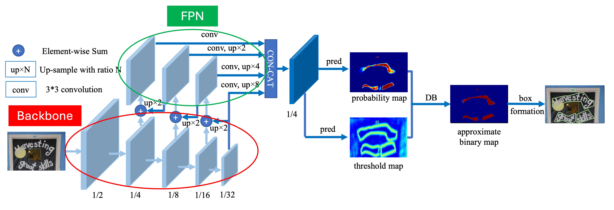
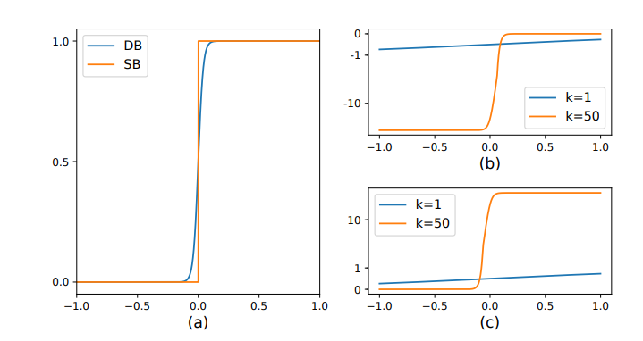

# DBNet: Real-time Scene Text Detection with Differentiable Binarization

> **Paper:** Real-time Scene Text Detection with Differentiable Binarization  
> **Authors:** Minghui Liao, Zhaoyi Wan, Cong Yao, Kai Chen, Xiang Bai  
> **Venue:** AAAI 2020  
> **arXiv:** [1911.08947](https://arxiv.org/abs/1911.08947)  
> **Code:** https://github.com/MhLiao/DB

---

## 1. Introduction / Overview

DBNet is a **segmentation-based scene text detector** that introduces a novel module called **Differentiable Binarization (DB)**. Unlike prior methods that treat post-processing (binarization) as a fixed, non-learnable step, DBNet integrates the binarization process directly into the training pipeline via a differentiable approximation — allowing the network to learn **adaptive, per-pixel thresholds**.

The result is a detector that is simultaneously:
- **Accurate** — state-of-the-art on multiple benchmarks
- **Fast** — 62 FPS with ResNet-18 on MSRA-TD500
- **Simple** — standard FPN backbone + a single lightweight head

DBNet works on arbitrary-shaped text (horizontal, multi-oriented, curved) by predicting polygon-based bounding regions.

---

## 2. Background / Motivation

### Scene Text Detection Task

Scene text detection requires locating text instances in natural images. The outputs are typically **bounding boxes** (for horizontal/rotated text) or **polygons** (for arbitrary-shaped text).

### Why Segmentation-Based Methods?

Segmentation methods generate a **probability map** where each pixel gets a score indicating whether it belongs to a text region. This approach handles arbitrary shapes naturally, unlike regression-based detectors (e.g., EAST) that are limited to quadrilaterals.

### The Binarization Bottleneck

After the network predicts a probability map $P$, a **binarization** step converts it into a binary map $B$ used for final detection:

$$B_{i,j} = \begin{cases} 1 & \text{if } P_{i,j} \geq t \\ 0 & \text{otherwise} \end{cases}$$

**Problems with this approach:**

| Problem | Description |
|---|---|
| **Fixed threshold** | A global or manually-tuned threshold `t` cannot adapt to local image variation |
| **Non-differentiable** | The step function has zero gradient everywhere — it **cannot be trained end-to-end** |
| **Complex post-processing** | Methods like PSENet and PAN require multiple progressive erosion/dilation steps to separate adjacent text instances |
| **Speed vs. accuracy tradeoff** | Heavy post-processing hurts real-time performance |

DBNet's key insight: **make the threshold itself a learnable, spatially-varying map**, and approximate the step function with a smooth, differentiable surrogate.

---

## 3. Architecture


Architecture of our proposed method, where “pred” consists of a 3×3 convolutional operator and two de-convolutional operators with stride 2. The “1/2”, “1/4”, ... and “1/32” indicate the scale ratio compared to the input image.

### 3.1 Overall Pipeline

```
Input Image
    │
    ▼
┌──────────────┐
│   Backbone   │  ResNet-18 / ResNet-50
│  (ResNet)    │  Extracts multi-scale features: C2, C3, C4, C5
└──────┬───────┘
       │
       ▼
┌──────────────┐
│     FPN      │  Feature Pyramid Network
│    Neck      │  Fuses multi-scale features → single feature map F
└──────┬───────┘
       │
       ├──────────────────┬──────────────────┐
       ▼                  ▼                  ▼
┌────────────┐   ┌────────────────┐   ┌────────────────┐
│ Prob. Map  │   │ Threshold Map  │   │  Binary Map    │
│     P      │   │      T         │   │  B̂ (DB output) │
│ (H×W×1)    │   │   (H×W×1)      │   │   (H×W×1)      │
└────────────┘   └────────────────┘   └────────────────┘
       │                  │                  │
       └──────────────────┴──────────────────┘
                          │
                          ▼
                   Post-processing
                (Box/Polygon extraction)
```

### 3.2 Backbone and Neck

- **Backbone:** ResNet-18 or ResNet-50, producing feature maps at 4 scales $\{C_2, C_3, C_4, C_5\}$ with strides $\{4, 8, 16, 32\}$.
- **FPN Neck:** Top-down pathway with lateral connections. All feature maps are upsampled and concatenated into a single fused feature map $F$ at stride 4.

### 3.3 Prediction Heads

Three lightweight convolutional heads branch off from the shared feature map $F$:

| Head | Output | Supervision |
|---|---|---|
| **Probability Map** $P$ | Per-pixel text probability | Shrunk text polygon mask |
| **Threshold Map** $T$ | Per-pixel adaptive threshold | Border of text polygon |
| **Binary Map** $\hat{B}$ | Differentiable binarization | Derived from $P$ and $T$ |

### 3.4 Differentiable Binarization (DB)

The core innovation. The standard step function is replaced with:

$$\hat{B}_{i,j} = \frac{1}{1 + e^{-k(P_{i,j} - T_{i,j})}}$$

where $k$ is an **amplification factor** (default $k = 50$).

**Intuition:**

- When $k \to \infty$, this becomes the hard step function
- At $k = 50$, it approximates a step while still having non-zero gradients
- $T_{i,j}$ is different for each pixel — the network learns **where to set higher/lower thresholds**

This means the gradient of $\hat{B}$ with respect to $P$ and $T$ is:

$$\frac{\partial \hat{B}}{\partial P} = \frac{k \cdot e^{-k(P-T)}}{(1 + e^{-k(P-T)})^2}$$

This allows the threshold map $T$ to be trained **end-to-end** via backpropagation — something impossible with a fixed threshold.

**Visual comparison:**

```
Hard binarization:             Differentiable binarization (k=50):
  B                              B̂
  1 |        ┌─────              1 |       ╭────
    |        │                     |      ╱
  0 |────────┘            →     0  |─────╯
    └────────────── P              └────────────── P
           t                              t
```


 Illustration of **differentiable binarization** and its derivative. (a) Numerical comparison of standard binarization (SB) and differentiable binarization (**DB**). (b) Derivative of $l+$. (c) Derivative of $l−$.

### 3.5 Label Generation

Text regions are encoded using **shrunk/expanded polygons** via the **Vatti clipping algorithm**:

- **Probability map labels:** Ground-truth polygons are **shrunk** by an offset $D = \frac{A(1-r^2)}{L}$, where $A$ is polygon area, $L$ is perimeter, and $r = 0.4$. This forces the network to predict high confidence only inside the text core.
- **Threshold map labels:** The **border region** between the original polygon and its shrunk version is used for threshold supervision, labeled with a smooth distance-based gradient.

### 3.6 Loss Function

The total loss is:

$$\mathcal{L} = \mathcal{L}_s + \alpha \cdot \mathcal{L}_b + \beta \cdot \mathcal{L}_t$$

| Term | Description | Weight |
|---|---|---|
| $\mathcal{L}_s$ | BCE loss on probability map $P$ (with OHEM) | 1.0 |
| $\mathcal{L}_b$ | BCE loss on binary map $\hat{B}$ (with OHEM) | $\alpha = 1.0$ |
| $\mathcal{L}_t$ | L1 loss on threshold map $T$ (only in GT border region) | $\beta = 10$ |

**OHEM (Online Hard Example Mining):** keeps 1 positive pixel for every 3 negative pixels, preventing the dominant background from overwhelming the loss.

### 3.7 Post-Processing

At inference, only the **probability map** $P$ (or binary map $\hat{B}$) is used:

1. Threshold at 0.2 to get candidate binary regions
2. Find connected components
3. **Expand** each polygon via Vatti clipping (inverse of the shrinking applied during training)
4. Compute a confidence score as the average probability inside the expanded polygon

This is significantly simpler than methods like PSENet that require iterative kernel expansion.

---

## 4. Results / Performance

### 4.1 MSRA-TD500 (Multi-oriented text)

| Method | Precision | Recall | F-measure | FPS |
|---|---|---|---|---|
| EAST (ResNet-50) | 87.3 | 67.4 | 76.1 | 13.2 |
| PAN (ResNet-18) | 84.4 | 83.8 | 84.1 | 30.2 |
| **DBNet (ResNet-18)** | **90.4** | **76.3** | **82.8** | **62** |
| **DBNet (ResNet-50)** | **91.5** | **79.2** | **84.9** | **32** |

### 4.2 ICDAR 2015 (Incidental scene text)

| Method | Precision | Recall | F-measure | FPS |
|---|---|---|---|---|
| EAST (PVANET2x) | 78.7 | 83.0 | 80.8 | 13.2 |
| PSENet (ResNet-50) | 81.5 | 79.7 | 80.6 | 1.6 |
| PAN (ResNet-18) | 84.0 | 81.9 | 82.9 | 26.1 |
| **DBNet (ResNet-18)** | **77.2** | **79.9** | **77.9** | **48** |
| **DBNet (ResNet-50)** | **91.8** | **83.2** | **87.3** | **22** |

### 4.3 Total-Text (Curved text)

| Method | Precision | Recall | F-measure |
|---|---|---|---|
| TextSnake | 82.7 | 74.5 | 78.4 |
| PSENet (ResNet-50) | 81.8 | 75.1 | 78.3 |
| **DBNet (ResNet-18)** | **88.3** | **77.9** | **82.8** |
| **DBNet (ResNet-50)** | **91.8** | **83.2** | **87.3** |

### 4.4 CTW1500 (Long curved text lines)

| Method | Precision | Recall | F-measure |
|---|---|---|---|
| CRAFT | 86.0 | 81.1 | 83.5 |
| **DBNet (ResNet-18)** | **84.8** | **77.5** | **81.0** |
| **DBNet (ResNet-50)** | **86.9** | **80.2** | **83.4** |

### Key Takeaways

- With **ResNet-18**, DBNet achieves real-time speed (>48 FPS) while remaining competitive with heavier models
- With **ResNet-50**, DBNet consistently achieves state-of-the-art F-measures
- The DB module alone (ablation) improves F-measure by **~1.5–5%** over a fixed threshold baseline

---

## 5. Code Example

### 5.1 Differentiable Binarization Module

```python
import torch
import torch.nn as nn
import torch.nn.functional as F


class DifferentiableBinarization(nn.Module):
    """
    Differentiable Binarization module.
    Combines probability map and threshold map into an approximate binary map.
    """
    def __init__(self, k: int = 50):
        super().__init__()
        self.k = k  # amplification factor

    def forward(self, prob_map: torch.Tensor, threshold_map: torch.Tensor) -> torch.Tensor:
        """
        Args:
            prob_map:      (B, 1, H, W) - probability map P, values in [0, 1]
            threshold_map: (B, 1, H, W) - threshold map T, values in [0, 1]
        Returns:
            binary_map:    (B, 1, H, W) - approximate binary map B̂
        """
        return torch.reciprocal(1.0 + torch.exp(-self.k * (prob_map - threshold_map)))
```

### 5.2 Prediction Head

```python
class DBHead(nn.Module):
    """
    DBNet prediction head: outputs probability map, threshold map, and binary map.
    """
    def __init__(self, in_channels: int = 256, k: int = 50):
        super().__init__()
        self.k = k

        # Probability map head
        self.prob_head = nn.Sequential(
            nn.Conv2d(in_channels, 64, kernel_size=3, padding=1, bias=False),
            nn.BatchNorm2d(64),
            nn.ReLU(inplace=True),
            nn.ConvTranspose2d(64, 64, kernel_size=2, stride=2),
            nn.BatchNorm2d(64),
            nn.ReLU(inplace=True),
            nn.ConvTranspose2d(64, 1, kernel_size=2, stride=2),
            nn.Sigmoid(),
        )

        # Threshold map head
        self.thresh_head = nn.Sequential(
            nn.Conv2d(in_channels, 64, kernel_size=3, padding=1, bias=False),
            nn.BatchNorm2d(64),
            nn.ReLU(inplace=True),
            nn.ConvTranspose2d(64, 64, kernel_size=2, stride=2),
            nn.BatchNorm2d(64),
            nn.ReLU(inplace=True),
            nn.ConvTranspose2d(64, 1, kernel_size=2, stride=2),
            nn.Sigmoid(),
        )

        self.db = DifferentiableBinarization(k=k)

    def forward(self, features: torch.Tensor):
        """
        Args:
            features: (B, C, H/4, W/4) — fused FPN feature map
        Returns:
            prob_map:   (B, 1, H, W)
            thresh_map: (B, 1, H, W)
            binary_map: (B, 1, H, W)  — only computed during training
        """
        prob_map = self.prob_head(features)
        thresh_map = self.thresh_head(features)
        binary_map = self.db(prob_map, thresh_map)
        return prob_map, thresh_map, binary_map
```

### 5.3 DBNet Loss

```python
class DBLoss(nn.Module):
    """
    DBNet loss: L = L_prob + alpha * L_binary + beta * L_threshold
    """
    def __init__(self, alpha: float = 1.0, beta: float = 10.0, ohem_ratio: float = 3.0):
        super().__init__()
        self.alpha = alpha
        self.beta = beta
        self.ohem_ratio = ohem_ratio

    def bce_with_ohem(
        self,
        pred: torch.Tensor,
        gt: torch.Tensor,
        mask: torch.Tensor
    ) -> torch.Tensor:
        """Binary cross-entropy with Online Hard Example Mining."""
        loss = F.binary_cross_entropy(pred, gt, reduction='none')

        pos_mask = (mask > 0.5)
        neg_mask = (mask < 0.5)

        pos_loss = loss[pos_mask]
        neg_loss = loss[neg_mask]

        n_pos = pos_loss.numel()
        n_neg = min(int(n_pos * self.ohem_ratio), neg_loss.numel())

        if n_neg > 0:
            neg_loss_sorted, _ = neg_loss.sort(descending=True)
            hard_neg_loss = neg_loss_sorted[:n_neg]
            return (pos_loss.sum() + hard_neg_loss.sum()) / (n_pos + n_neg + 1e-6)
        return pos_loss.mean()

    def forward(
        self,
        prob_map: torch.Tensor,    # (B, 1, H, W)
        thresh_map: torch.Tensor,  # (B, 1, H, W)
        binary_map: torch.Tensor,  # (B, 1, H, W)
        gt_prob: torch.Tensor,     # (B, 1, H, W) - shrunk polygon mask
        gt_thresh: torch.Tensor,   # (B, 1, H, W) - border region distance map
        thresh_mask: torch.Tensor, # (B, 1, H, W) - border region indicator
    ) -> dict:
        # Probability map loss (BCE + OHEM on all pixels)
        text_mask = gt_prob  # use gt as the hard example selector
        loss_prob = self.bce_with_ohem(prob_map.squeeze(1), gt_prob.squeeze(1), text_mask.squeeze(1))

        # Binary map loss (BCE + OHEM)
        loss_binary = self.bce_with_ohem(binary_map.squeeze(1), gt_prob.squeeze(1), text_mask.squeeze(1))

        # Threshold map loss (L1, only in border region)
        thresh_mask = thresh_mask.squeeze(1)
        loss_thresh = (
            F.l1_loss(thresh_map.squeeze(1) * thresh_mask, gt_thresh.squeeze(1) * thresh_mask, reduction='sum')
            / (thresh_mask.sum() + 1e-6)
        )

        total_loss = loss_prob + self.alpha * loss_binary + self.beta * loss_thresh

        return {
            'total': total_loss,
            'prob': loss_prob,
            'binary': loss_binary,
            'thresh': loss_thresh,
        }
```

### 5.4 Minimal Inference Example

```python
import torch
import torchvision.models as models
import cv2
import numpy as np


def run_dbnet_inference(model: nn.Module, image_path: str, prob_threshold: float = 0.2):
    """
    Minimal example of DBNet inference and post-processing.
    
    Args:
        model: trained DBNet model
        image_path: path to input image
        prob_threshold: threshold for binary map
    Returns:
        list of detected polygon coordinates
    """
    # --- Pre-processing ---
    image = cv2.imread(image_path)
    image_rgb = cv2.cvtColor(image, cv2.COLOR_BGR2RGB)
    h, w = image.shape[:2]

    # Resize to multiple of 32
    target_h = (h // 32) * 32
    target_w = (w // 32) * 32
    resized = cv2.resize(image_rgb, (target_w, target_h))

    tensor = torch.from_numpy(resized).float().permute(2, 0, 1).unsqueeze(0) / 255.0
    mean = torch.tensor([0.485, 0.456, 0.406]).view(1, 3, 1, 1)
    std  = torch.tensor([0.229, 0.224, 0.225]).view(1, 3, 1, 1)
    tensor = (tensor - mean) / std

    # --- Inference ---
    model.eval()
    with torch.no_grad():
        prob_map, _, _ = model(tensor)  # only need prob map at inference

    prob = prob_map.squeeze().cpu().numpy()  # (H, W)
    prob = cv2.resize(prob, (w, h))          # restore original size

    # --- Post-processing ---
    binary = (prob > prob_threshold).astype(np.uint8)
    contours, _ = cv2.findContours(binary, cv2.RETR_EXTERNAL, cv2.CHAIN_APPROX_SIMPLE)

    polygons = []
    for contour in contours:
        if cv2.contourArea(contour) < 10:
            continue

        # Vatti-style expansion (approximated here via dilateContour)
        rect = cv2.minAreaRect(contour)
        box = cv2.boxPoints(rect)
        box = np.int32(box)
        polygons.append(box)

    return polygons
```

---

## 6. DBNet++ (Extension)

DBNet++ (2022) extends DBNet with an **Adaptive Scale Fusion (ASF)** module inserted between the FPN neck and the prediction head. ASF learns to reweight feature maps at different scales using a spatial attention mechanism, improving detection of text at extreme scale variations.

$$F_{asf} = \sum_{i} w_i \cdot F_i, \quad w_i = \text{SpatialAttention}(F_i)$$

DBNet++ achieves further improvements of ~1–2% F-measure across benchmarks with negligible speed cost.

---

## Summary

| Component | Design Choice |
|---|---|
| Backbone | ResNet-18 / ResNet-50 |
| Neck | Feature Pyramid Network (FPN) |
| Key module | Differentiable Binarization ($k=50$ sigmoid) |
| Outputs | Probability map, Threshold map, Binary map |
| Label encoding | Vatti polygon shrinking ($r=0.4$) |
| Loss | BCE (OHEM) + L1 threshold |
| Shapes supported | Horizontal, rotated, curved |
| Speed (ResNet-18) | 48–62 FPS |
