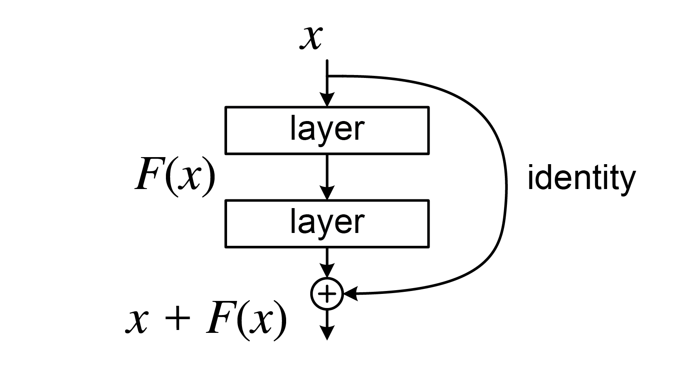
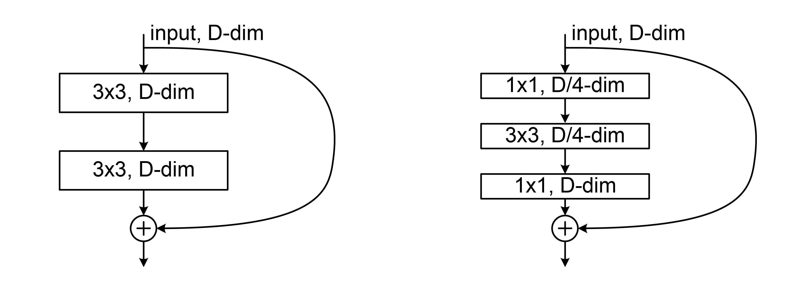

# Residual Neural Network (ResNet) Learning Notes

Residual Neural Networks (ResNets) solve the degradation problem in very deep CNNs by adding shortcut (skip) connections. Instead of directly learning a complex mapping $H(x)$, a residual block learns a residual function $F(x)$ and outputs:

$$
y = F(x) + x
$$

This simple idea makes optimization significantly easier and enables training of very deep models (e.g., 50/101/152 layers).

## 1. Why Residual Connections Work

In a plain deep network, stacking more layers can hurt optimization. ResNet reformulates mapping as:

$$
H(x) = F(x) + x
\quad\Rightarrow\quad
F(x)=H(x)-x
$$

If identity mapping is optimal, the block only needs to learn $F(x)\approx 0$, which is easier than learning $H(x)$ from scratch.

Backward signal also gets a direct path:

$$
\frac{\partial \mathcal{L}}{\partial x} =
\frac{\partial \mathcal{L}}{\partial y}
\left(1+\frac{\partial F(x)}{\partial x}\right)
$$

The additive identity term helps gradients propagate through deep stacks.

## 2. Core Block Types

1. Basic block (ResNet-18/34): two $3\times3$ convolutions.
2. Bottleneck block (ResNet-50/101/152): $1\times1 \rightarrow 3\times3 \rightarrow 1\times1$.
3. Projection shortcut: uses $1\times1$ conv on the skip branch when shape/channel mismatch happens.

## 3. Images for Intuition

1. Residual block concept:



2. ResNet block with/without projection shortcut:


3. Basic vs bottleneck block variants:



## 4. Shape and Parameter Calculation Examples

### 4.1 Convolution Output Size

For input $H_{in}\times W_{in}$, kernel $K$, padding $P$, stride $S$:

$$
H_{out}=\left\lfloor\frac{H_{in}-K+2P}{S}\right\rfloor+1,
\quad
W_{out}=\left\lfloor\frac{W_{in}-K+2P}{S}\right\rfloor+1
$$

### 4.2 Example: First 3x3 Conv in a Basic Block

Input $56\times56\times64$, Conv $3\times3$, stride $1$, padding $1$, output channels $64$:

$$
H_{out}=W_{out}=\frac{56-3+2}{1}+1=56
$$

So output shape is $56\times56\times64$.

### 4.3 Parameter Count Example

Conv params formula:

$$
\#\text{params}=C_{out}(C_{in}K_hK_w + 1)
$$

For one $3\times3$ conv with $C_{in}=64$, $C_{out}=64$:

$$
\#\text{params}=64(64\times3\times3+1)=64(576+1)=36{,}928
$$

A basic block has two such conv layers (ignoring BN params):

$$
2\times36{,}928=73{,}856
$$

## 5. Residual Block Forward Equation

For a basic block:

$$
z_1 = \text{ReLU}(\text{BN}(W_1 * x))
$$

$$
z_2 = \text{BN}(W_2 * z_1)
$$

$$
y = \text{ReLU}(z_2 + s(x))
$$

where $s(x)=x$ for identity shortcut, or $s(x)=W_s*x$ for projection shortcut.

## 6. PyTorch Sample Code for Learning

The code below builds a small ResNet-style model from scratch and trains it on CIFAR-10.

```python
import torch
import torch.nn as nn
import torch.optim as optim
from torch.utils.data import DataLoader
from torchvision import datasets, transforms


class BasicBlock(nn.Module):
	def __init__(self, in_channels, out_channels, stride=1):
		super().__init__()
		self.conv1 = nn.Conv2d(in_channels, out_channels, kernel_size=3, stride=stride, padding=1, bias=False)
		self.bn1 = nn.BatchNorm2d(out_channels)
		self.relu = nn.ReLU(inplace=True)
		self.conv2 = nn.Conv2d(out_channels, out_channels, kernel_size=3, stride=1, padding=1, bias=False)
		self.bn2 = nn.BatchNorm2d(out_channels)

		self.shortcut = nn.Sequential()
		if stride != 1 or in_channels != out_channels:
			# Projection shortcut aligns spatial size and channel count.
			self.shortcut = nn.Sequential(
				nn.Conv2d(in_channels, out_channels, kernel_size=1, stride=stride, bias=False),
				nn.BatchNorm2d(out_channels),
			)

	def forward(self, x):
		identity = self.shortcut(x)
		out = self.conv1(x)
		out = self.bn1(out)
		out = self.relu(out)
		out = self.conv2(out)
		out = self.bn2(out)
		out = out + identity
		out = self.relu(out)
		return out


class MiniResNet(nn.Module):
	def __init__(self, num_classes=10):
		super().__init__()
		self.stem = nn.Sequential(
			nn.Conv2d(3, 64, kernel_size=3, stride=1, padding=1, bias=False),
			nn.BatchNorm2d(64),
			nn.ReLU(inplace=True),
		)

		self.layer1 = nn.Sequential(
			BasicBlock(64, 64, stride=1),
			BasicBlock(64, 64, stride=1),
		)
		self.layer2 = nn.Sequential(
			BasicBlock(64, 128, stride=2),
			BasicBlock(128, 128, stride=1),
		)
		self.layer3 = nn.Sequential(
			BasicBlock(128, 256, stride=2),
			BasicBlock(256, 256, stride=1),
		)
		self.layer4 = nn.Sequential(
			BasicBlock(256, 512, stride=2),
			BasicBlock(512, 512, stride=1),
		)

		self.pool = nn.AdaptiveAvgPool2d((1, 1))
		self.fc = nn.Linear(512, num_classes)

	def forward(self, x):
		x = self.stem(x)
		x = self.layer1(x)
		x = self.layer2(x)
		x = self.layer3(x)
		x = self.layer4(x)
		x = self.pool(x)
		x = torch.flatten(x, 1)
		x = self.fc(x)
		return x


def train_one_epoch(model, loader, criterion, optimizer, device):
	model.train()
	total_loss, correct, total = 0.0, 0, 0

	for images, labels in loader:
		images = images.to(device)
		labels = labels.to(device)

		optimizer.zero_grad()
		logits = model(images)
		loss = criterion(logits, labels)
		loss.backward()
		optimizer.step()

		total_loss += loss.item() * images.size(0)
		preds = logits.argmax(dim=1)
		correct += (preds == labels).sum().item()
		total += labels.size(0)

	return total_loss / total, correct / total


@torch.no_grad()
def evaluate(model, loader, criterion, device):
	model.eval()
	total_loss, correct, total = 0.0, 0, 0

	for images, labels in loader:
		images = images.to(device)
		labels = labels.to(device)
		logits = model(images)
		loss = criterion(logits, labels)

		total_loss += loss.item() * images.size(0)
		preds = logits.argmax(dim=1)
		correct += (preds == labels).sum().item()
		total += labels.size(0)

	return total_loss / total, correct / total


def main():
	device = torch.device("cuda" if torch.cuda.is_available() else "cpu")

	train_tfms = transforms.Compose([
		transforms.RandomCrop(32, padding=4),
		transforms.RandomHorizontalFlip(),
		transforms.ToTensor(),
		transforms.Normalize((0.4914, 0.4822, 0.4465), (0.2470, 0.2435, 0.2616)),
	])
	test_tfms = transforms.Compose([
		transforms.ToTensor(),
		transforms.Normalize((0.4914, 0.4822, 0.4465), (0.2470, 0.2435, 0.2616)),
	])

	train_set = datasets.CIFAR10(root="./data", train=True, download=True, transform=train_tfms)
	test_set = datasets.CIFAR10(root="./data", train=False, download=True, transform=test_tfms)

	train_loader = DataLoader(train_set, batch_size=128, shuffle=True, num_workers=2)
	test_loader = DataLoader(test_set, batch_size=256, shuffle=False, num_workers=2)

	model = MiniResNet(num_classes=10).to(device)
	criterion = nn.CrossEntropyLoss()
	optimizer = optim.SGD(model.parameters(), lr=0.1, momentum=0.9, weight_decay=5e-4)
	scheduler = optim.lr_scheduler.MultiStepLR(optimizer, milestones=[60, 120, 160], gamma=0.2)

	epochs = 20
	for epoch in range(1, epochs + 1):
		train_loss, train_acc = train_one_epoch(model, train_loader, criterion, optimizer, device)
		val_loss, val_acc = evaluate(model, test_loader, criterion, device)
		scheduler.step()

		print(
			f"Epoch {epoch:02d}/{epochs} | "
			f"train_loss={train_loss:.4f}, train_acc={train_acc:.4f} | "
			f"val_loss={val_loss:.4f}, val_acc={val_acc:.4f}"
		)

	torch.save(model.state_dict(), "mini_resnet_cifar10.pth")
	print("Saved model to mini_resnet_cifar10.pth")


if __name__ == "__main__":
	main()
```

Install dependencies:

```bash
pip install torch torchvision
```

Run training:

```bash
python train_resnet.py
```

## 7. Practical Learning Suggestions

1. First run a tiny model and ensure it can overfit a very small subset.
2. Compare plain CNN vs residual CNN at same depth to observe optimization difference.
3. Track train/validation curves and confusion matrix together.
4. Use warmup or smaller initial LR if training is unstable.
5. For real projects, start with `torchvision.models.resnet18` pretrained weights.

## 8. Recommended Resources

1. Original ResNet paper:
https://arxiv.org/abs/1512.03385

2. Identity Mapping paper (ResNet v2):
https://arxiv.org/abs/1603.05027

3. D2L ResNet chapter:
https://d2l.ai/chapter_convolutional-modern/resnet.html

4. PyTorch ResNet docs:
https://pytorch.org/vision/main/models/resnet.html
