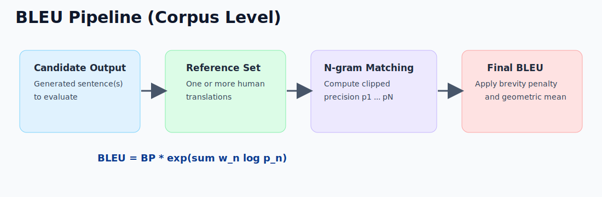
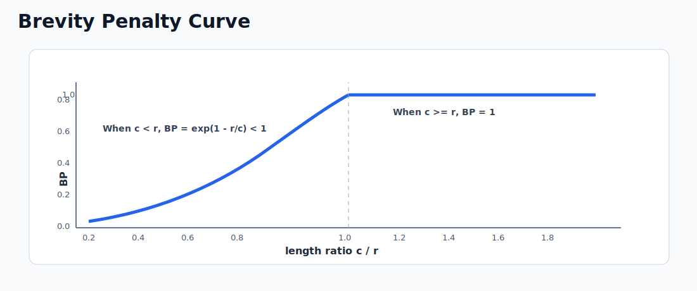
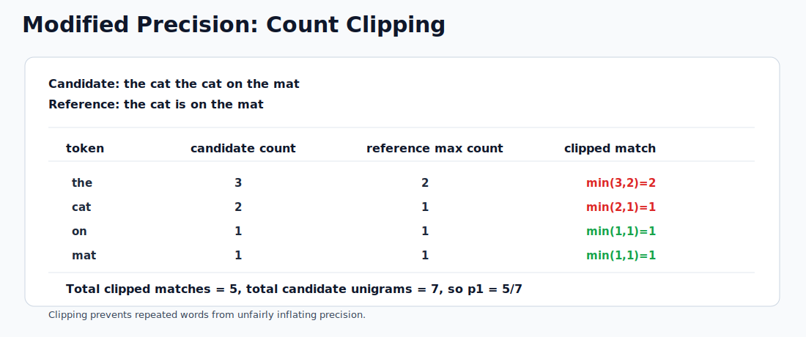

# BLEU Score in NLP

> Core idea: BLEU evaluates machine-generated text by comparing n-gram overlap with one or more human reference texts.
> Typical use: machine translation and text generation benchmarking.
> Full name: Bilingual Evaluation Understudy.

---

## 1. What BLEU Measures

BLEU is a precision-oriented metric for text generation quality.

It answers:

- How many n-grams in the candidate output also appear in reference outputs?
- Is the candidate too short compared with references?

BLEU does not directly measure meaning or fluency, but it is fast, reproducible, and useful for system-level comparison.

---

## 2. Why We Need BLEU

For tasks like translation, there are many valid outputs for the same input.

Example source meaning:

- Candidate A: The cat sits on the mat.
- Candidate B: A cat is sitting on the mat.

Both can be correct, but token-level exact-match accuracy would unfairly penalize small wording differences. BLEU allows partial credit via n-gram overlap.

---

## 3. BLEU Formula

Corpus-level BLEU is defined as:

$$
\mathrm{BLEU} = \mathrm{BP} \cdot \exp\left(\sum_{n=1}^{N} w_n \log p_n\right)
$$

Where:

- $N$: maximum n-gram order, usually $4$
- $w_n$: weights, commonly uniform ($w_n = 1/N$)
- $p_n$: modified precision for n-grams of size $n$
- $\mathrm{BP}$: brevity penalty



*Caption: BLEU combines clipped n-gram precision with a brevity penalty to produce one corpus-level score.*

### 3.1 Modified n-gram Precision

Modified precision clips candidate n-gram counts by the maximum count seen in references.

$$
p_n = \frac{\sum_{g \in G_n} \min\left(C_{\text{cand}}(g),\max_{r \in R} C_r(g)\right)}{\sum_{g \in G_n} C_{\text{cand}}(g)}
$$

Intuition:

- Repeating a frequent word many times should not inflate score.
- Clipping limits credit to what references support.

### 3.2 Brevity Penalty

Let $c$ be total candidate length and $r$ be effective reference length.

$$
\mathrm{BP} =
\begin{cases}
1, & c > r \\
\exp\left(1 - \frac{r}{c}\right), & c \le r
\end{cases}
$$

If output is too short, BLEU is penalized even when precision is high.



*Caption: When candidate length is shorter than reference length ($c<r$), BP drops below 1 and reduces BLEU.*

---

## 4. Step-by-Step Toy Example

Candidate:

The cat the cat on the mat

Reference:

The cat is on the mat

### 4.1 Unigram precision with clipping

Candidate unigram counts:

- the: 3
- cat: 2
- on: 1
- mat: 1

Reference max counts:

- the: 2
- cat: 1
- on: 1
- mat: 1

Clipped matches:

- the: min(3,2) = 2
- cat: min(2,1) = 1
- on: min(1,1) = 1
- mat: min(1,1) = 1

Total clipped matches = $5$

Total candidate unigrams = $7$

$$
p_1 = \frac{5}{7}
$$

Without clipping, repeated words would receive too much credit.



*Caption: Clipping limits repeated candidate n-grams to reference-supported counts, preventing precision inflation.*

---

## 5. Corpus BLEU vs Sentence BLEU

BLEU was designed for corpus-level evaluation.

- Corpus BLEU: stable, preferred for research reporting
- Sentence BLEU: unstable for short text because higher-order n-gram matches are often zero

For sentence-level use, smoothing is commonly applied.

---

## 6. Practical Interpretation

BLEU values are task and dataset dependent, so absolute thresholds are dangerous.

General guidance:

- Compare systems on the same test set and tokenization pipeline.
- Report BLEU with preprocessing details.
- Prefer confidence intervals or significance tests for close results.

BLEU is best for relative ranking, not absolute quality judgment.

---

## 7. Strengths

- Fast to compute
- Language-agnostic scoring framework
- Correlates reasonably with quality at system level in many MT settings
- Standardized and widely used in historical MT literature

---

## 8. Limitations and Trade-offs

### 8.1 Precision-heavy behavior

BLEU emphasizes precision, not recall. A short but safe candidate can get decent precision.

### 8.2 Surface-form matching only

Synonyms and paraphrases can be semantically correct but score low.

### 8.3 Weak sentence-level reliability

Single-sentence BLEU is noisy, especially with short outputs.

### 8.4 Tokenization sensitivity

Different tokenization, casing, or normalization can significantly change BLEU.

### 8.5 Domain and language effects

BLEU comparability across datasets, domains, or languages is limited.

Because of these issues, modern evaluation often combines BLEU with semantic metrics and human evaluation.

---

## 9. Common Variants and Related Metrics

- BLEU-1, BLEU-2, BLEU-4: different maximum n
- SacreBLEU: standardized BLEU computation for reproducibility
- chrF: character n-gram F-score, often robust for morphologically rich languages
- ROUGE: recall-oriented overlap metric, common in summarization
- METEOR, BERTScore, COMET: incorporate richer lexical or semantic information

---

## 10. Python Example

```python
from nltk.translate.bleu_score import sentence_bleu, corpus_bleu, SmoothingFunction


# Tokenized references and candidate
references = [["the", "cat", "is", "on", "the", "mat"]]
candidate = ["the", "cat", "the", "cat", "on", "the", "mat"]

# Sentence BLEU without smoothing
bleu_raw = sentence_bleu(references, candidate, weights=(0.25, 0.25, 0.25, 0.25))

# Sentence BLEU with smoothing (better for short text)
smooth_fn = SmoothingFunction().method1
bleu_smooth = sentence_bleu(
	references,
	candidate,
	weights=(0.25, 0.25, 0.25, 0.25),
	smoothing_function=smooth_fn,
)

print(f"Sentence BLEU (raw): {bleu_raw:.4f}")
print(f"Sentence BLEU (smoothed): {bleu_smooth:.4f}")


# Corpus BLEU example
list_of_references = [
	[["the", "cat", "is", "on", "the", "mat"]],
	[["there", "is", "a", "cat", "on", "the", "mat"]],
]
hypotheses = [
	["the", "cat", "is", "on", "the", "mat"],
	["a", "cat", "is", "on", "the", "mat"],
]

corpus_score = corpus_bleu(list_of_references, hypotheses)
print(f"Corpus BLEU: {corpus_score:.4f}")
```

---

## 11. Reporting Checklist

When publishing BLEU results, report at least:

1. Dataset and split used
2. Tokenization and normalization rules
3. Case-sensitive or case-insensitive scoring
4. BLEU variant and implementation (for example, SacreBLEU signature)
5. Whether sentence-level smoothing was used

This makes results reproducible and comparable.

---

## 12. Quick Summary

- BLEU scores overlap between candidate and references using modified n-gram precision.
- Brevity penalty prevents overly short outputs from scoring too high.
- BLEU is effective for fast system-level comparison, especially in MT.
- BLEU should be complemented by semantic metrics and human evaluation for robust conclusions.
