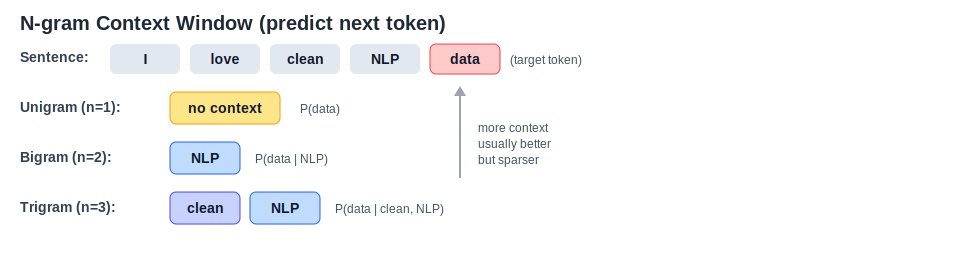
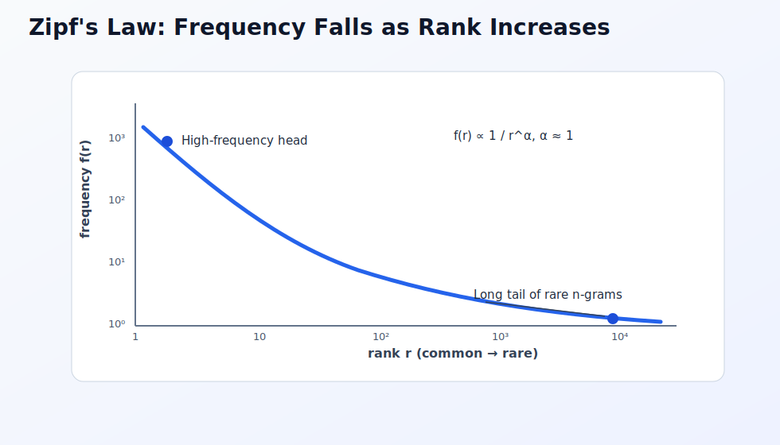
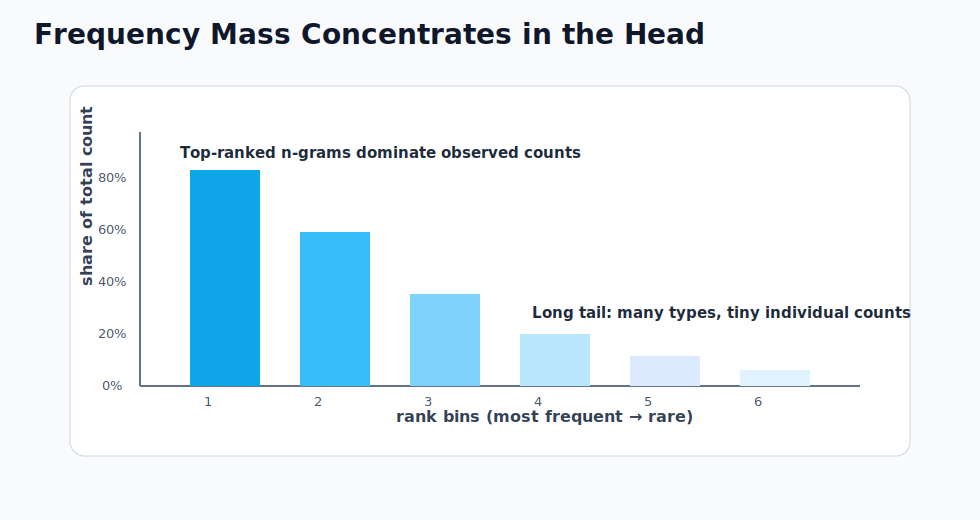
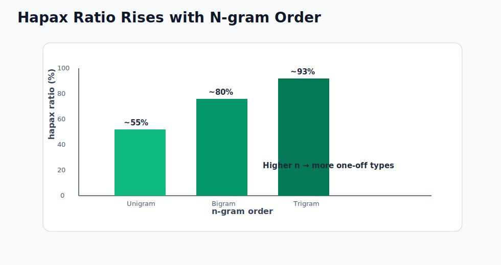
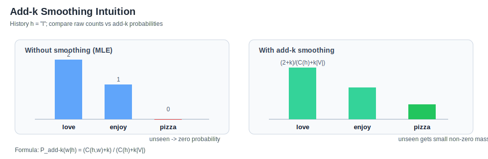
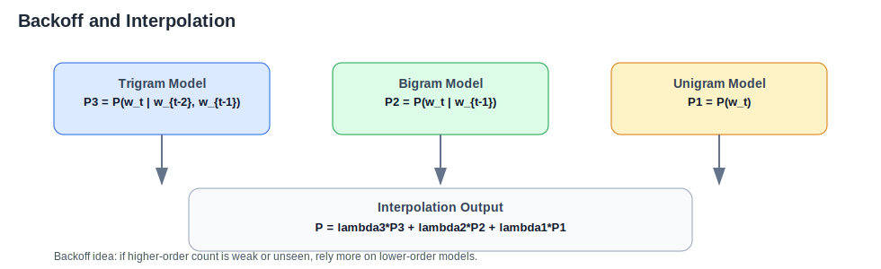
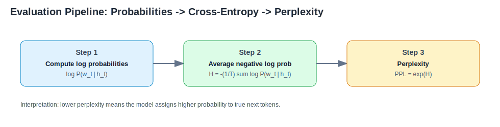
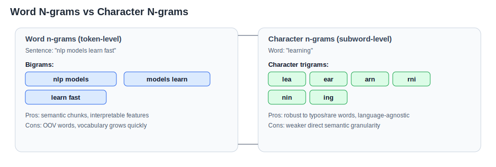

# N-grams in NLP

> **Core idea:** Model text by looking at local token context of length $n-1$.  
> **Classical use:** Statistical language modeling before neural LMs became dominant.  
> **Still useful for:** Baselines, spelling, search, ASR post-processing, lightweight systems.

---

## 1. Introduction / Overview

An **N-gram** is a contiguous sequence of $n$ tokens from text.

- Unigram: $n=1$ (single token)
- Bigram: $n=2$ (two-token sequence)
- Trigram: $n=3$ (three-token sequence)

In NLP, N-grams are often used to estimate language probability:

$$
P(w_1, w_2, \dots, w_T)
$$

The full joint probability is hard to estimate directly, so we use a Markov assumption and keep only short context.


---

## 2. Why N-grams Matter

N-gram models are important because they are:

- Easy to train and interpret
- Fast to run for small-to-medium vocabularies
- Strong as first baselines
- Useful for understanding core language modeling ideas

They also introduce core concepts used in modern NLP evaluation, such as **cross-entropy** and **perplexity**.

---

## 3. Building an N-gram Language Model

### 3.1 Chain Rule

For a token sequence $w_{1:T}$:

$$
P(w_{1:T}) = \prod_{t=1}^{T} P(w_t \mid w_{1:t-1})
$$

**Derivation from the definition of conditional probability:**

Start with two variables. The product rule of probability gives:

$$
P(A, B) = P(A) \cdot P(B \mid A)
$$

Extend to three variables by applying the same rule twice:

$$
P(w_1, w_2, w_3)
= P(w_1, w_2) \cdot P(w_3 \mid w_1, w_2)
= P(w_1) \cdot P(w_2 \mid w_1) \cdot P(w_3 \mid w_1, w_2)
$$

Applying it repeatedly to the full sequence:

$$
P(w_1, \dots, w_T)
$$

$$
= P(w_1) \cdot P(w_2, \dots, w_T \mid w_1)
$$

$$
= P(w_1) \cdot P(w_2 \mid w_1) \cdot P(w_3, \dots, w_T \mid w_1, w_2)
$$

$$
= P(w_1) \cdot P(w_2 \mid w_1) \cdot P(w_3 \mid w_1, w_2) \cdot P(w_4, \dots, w_T \mid w_1, w_2, w_3)
$$

$$
= \cdots
$$

$$
= P(w_1) \cdot P(w_2 \mid w_1) \cdot P(w_3 \mid w_1, w_2) \cdots P(w_T \mid w_1, \dots, w_{T-1})
$$

Treating $P(w_1) = P(w_1 \mid w_{1:0})$ with an empty context by convention, this compactly writes as:

$$
\boxed{P(w_{1:T}) = \prod_{t=1}^{T} P(w_t \mid w_{1:t-1})}
$$

### 3.2 Markov Approximation

For an N-gram model, approximate each factor with only the previous $n-1$ tokens:

$$
P(w_t \mid w_{1:t-1}) \approx P(w_t \mid w_{t-n+1:t-1})
$$



Examples:

- Bigram:
$$
P(w_t \mid w_{1:t-1}) \approx P(w_t \mid w_{t-1})
$$

- Trigram:
$$
P(w_t \mid w_{1:t-1}) \approx P(w_t \mid w_{t-2}, w_{t-1})
$$

### 3.3 Count-based Maximum Likelihood Estimation (MLE)

For N-gram history $h$ and next token $w$:

$$
\hat{P}_{\text{MLE}}(w\mid h)=\frac{C(h,w)}{C(h)}
$$

Where:

- $C(h,w)$: count of the full N-gram
- $C(h)$: count of the history $(n-1)$-gram

### 3.4 N-gram Frequency Distributions and Zipf's Law

In real corpora, N-gram frequencies are highly imbalanced: a small number of N-grams occur very often, while most occur rarely.

This follows **Zipf's law**, which states that frequency is approximately inversely proportional to rank:

$$
f(r) \propto \frac{1}{r^\alpha}, \quad \alpha \approx 1
$$

Where:

- $r$: rank of an N-gram when sorted by frequency (1 = most frequent)
- $f(r)$: frequency of the N-gram at rank $r$
- $\alpha$: slope parameter (often near $1$ in language)

For N-grams, this long-tail behavior is even more extreme as $n$ increases:

- Common phrases (for example, `of the`, `in the`) dominate counts.
- Most trigrams and higher-order N-grams appear once or very few times.
- The **hapax** ratio (types with count = 1) increases sharply with larger $n$.







Practical consequences:

1. MLE estimates are reliable for frequent N-grams but noisy for rare ones.
2. Zero-count events become common, so smoothing/backoff is essential.
3. Vocabulary pruning is often needed to control memory and reduce noise.

Intuitively, Zipf's law explains why N-gram language modeling is always a balance: we want richer context (higher $n$), but frequency mass concentrates in a tiny head while most of the space remains sparse.

---

## 4. Small Worked Example

Toy corpus:

1. `<s> I love NLP </s>`
2. `<s> I love pizza </s>`
3. `<s> I enjoy NLP </s>`

Bigram counts for history `I`:

- $C(I, love)=2$
- $C(I, enjoy)=1$
- $C(I)=3$

So:

$$
P(love\mid I)=\frac{2}{3},\qquad P(enjoy\mid I)=\frac{1}{3}
$$

Without smoothing, any unseen bigram gets probability $0$.

---

## 5. Smoothing (Critical in Practice)

### 5.1 Problem: Data Sparsity

Natural language is sparse. Even large corpora miss many valid N-grams.

If one factor in the product is zero, full sentence probability becomes zero.

### 5.2 Add-k (Laplace) Smoothing

$$
P_{\text{add-}k}(w\mid h)=\frac{C(h,w)+k}{C(h)+k|V|}
$$

- $k=1$ gives classic Laplace smoothing
- $|V|$ is vocabulary size

This is simple but can over-smooth frequent events.



### 5.3 Backoff and Interpolation

When high-order counts are unreliable, combine lower-order models.

Linear interpolation (trigram example):

$$
P(w_t\mid w_{t-2},w_{t-1}) = \lambda_3 P_3 + \lambda_2 P_2 + \lambda_1 P_1
$$

with:

$$
\lambda_1+\lambda_2+\lambda_3=1,\quad \lambda_i\ge 0
$$

Where $P_3, P_2, P_1$ are trigram, bigram, unigram probabilities.



### 5.4 Better Classical Smoothing

In production-grade statistical language models, methods like **Kneser-Ney** are usually much stronger than plain add-one smoothing.

---

## 6. Evaluation: Cross-Entropy and Perplexity

Given test sequence $w_{1:T}$:

$$
H = -\frac{1}{T}\sum_{t=1}^{T}\log P(w_t\mid h_t)
$$

Perplexity:

$$
\mathrm{PPL}=\exp(H)
$$



Lower perplexity usually means a better language model on that test set.

---

## 7. Applications in NLP

N-grams are used in:



- Autocomplete and next-word suggestion
- Spell checking and noisy text correction
- Search query correction and ranking features
- ASR and OCR post-processing
- Statistical machine translation (phrase and LM components)
- Text classification features (word/character N-grams)

Character N-grams are especially useful for noisy text and morphologically rich languages.

---

## 8. Limitations and Trade-offs

N-gram models are simple, fast, and surprisingly effective — but they come with fundamental limitations that arise directly from their design. Each limitation below is not just an engineering inconvenience; it reflects a core constraint baked into the count-based approach.

---

### 8.1 Fixed and Short Context Window

Every N-gram conditions on exactly $n-1$ previous tokens and discards everything before that. This is the **Markov approximation**:

$$
P(w_t \mid w_1, \dots, w_{t-1}) \approx P(w_t \mid w_{t-n+1}, \dots, w_{t-1})
$$

Language, however, carries long-range dependencies. Consider:

> *"The trophy didn't fit in the suitcase because **it** was too big."*

Resolving the pronoun *it* requires tracking the subject from many tokens back — well beyond the reach of any practical trigram or even 5-gram model. Any relationship between words separated by more than $n-1$ positions is simply invisible.

**Trade-off:** Increasing $n$ captures more context but triggers the sparsity and memory problems described next.

---

### 8.2 Vocabulary Explosion and Data Sparsity

The theoretical maximum number of distinct N-grams grows exponentially with $n$:

$$
|\text{possible } n\text{-grams}| = V^n
$$

where $V$ is the vocabulary size. For a modest $V = 50{,}000$:

| Order | Possible N-grams |
|-------|-----------------|
| Unigram ($n=1$) | $5 \times 10^4$ |
| Bigram ($n=2$) | $2.5 \times 10^9$ |
| Trigram ($n=3$) | $1.25 \times 10^{14}$ |
| 5-gram ($n=5$) | $\approx 3 \times 10^{23}$ |

In practice, only a tiny fraction of these are ever observed. Empirically, the **hapax ratio** (proportion of N-gram types appearing exactly once) rises steeply with $n$:

- Unigrams: ~50–60% hapax
- Bigrams: ~75–80% hapax
- Trigrams: ~90–95% hapax

Most N-grams in held-out text have never been seen in training, so MLE assigns them probability zero. Smoothing redistributes mass to unseen N-grams, but cannot fully compensate when the majority of types are unseen.

---

### 8.3 No Semantic Generalization

N-gram models treat every token as an opaque symbol with no connection to any other symbol. Two sentences that express identical meaning using different words produce completely different N-gram fingerprints:

| Sentence | Bigrams |
|----------|---------|
| *"excellent film"* | `(excellent, film)` |
| *"great movie"* | `(great, movie)` |

These share **zero** bigrams. A bigram LM trained on the first phrase has learned nothing applicable to the second. More broadly:

- Synonyms are invisible to N-gram overlap.
- Paraphrases produce different fingerprints.
- Cross-lingual transfer is impossible.

This is in sharp contrast to word embedding models (Word2Vec, GloVe) and neural LMs, which place semantically similar words near each other in a continuous vector space.

---

### 8.4 Data Requirements Scale Exponentially

Reliable MLE estimates require each N-gram to appear **multiple** times in training data. The data needed grows with the order:

- A solid bigram model may need millions of tokens.
- A trigram model typically needs tens of millions.
- 5-gram models used in machine translation (e.g., Google's LM circa 2006) were trained on **billions** of tokens.

This makes high-order N-gram models inaccessible for low-resource languages, specialized domains, or applications where large corpora are unavailable.

---

### 8.5 Memory and Storage Costs

Each distinct N-gram type must be stored with its count (and the prefix count for probability computation). Memory scales with the number of observed types:

$$
\text{Memory} \propto |\{w_{t-n+1:t} \text{ observed in corpus}\}|
$$

For large corpora:
- A **bigram** index over a web-scale corpus can require **gigabytes** of RAM.
- A **trigram** index can reach **tens of gigabytes**.
- **5-gram** models at Google-scale required specialized distributed infrastructure (e.g., the Stupid Backoff model served from compressed tries).

In contrast, a neural LM with fixed-size weight matrices has a memory footprint that is independent of corpus size.

---

### 8.6 Sensitivity to Tokenization

N-gram representations are highly sensitive to how text is tokenized before counting. Small changes in preprocessing can produce drastically different models:

- Is *"New York"* one token or two? If two, `(New, York)` is a bigram; if one, it's a unigram.
- Are contractions split? *"don't"* → `[do, n't]` vs. `[don't]`.
- Is punctuation attached to words or stripped?

Any mismatch between training-time and test-time tokenization propagates across every N-gram spanning a tokenization boundary, degrading model performance. This makes N-gram models brittle when deployed across text sources with different conventions.

---

### 8.7 No Compositional or Hierarchical Structure

N-grams capture **flat** sequential patterns. They cannot represent:

- Syntactic structure (*subject → verb → object* relationships).
- Morphological patterns (prefixes, suffixes, inflections).
- Nested dependencies (subordinate clauses, long-range agreement).

A phrase like *"the cat that the dog chased sat"* involves a relative clause; the subject (*cat*) and main verb (*sat*) are separated by a full embedded clause. N-grams see only a window of consecutive tokens and miss the dependency entirely.

---

### 8.8 Summary: The Core Trade-offs

| Factor | Low $n$ (unigram/bigram) | High $n$ (trigram/5-gram) |
|--------|--------------------------|---------------------------|
| **Context captured** | Minimal | Richer local context |
| **Data sparsity** | Low | Very high |
| **Memory usage** | Small | Large to very large |
| **Data required** | Moderate | Massive |
| **Zero-count problem** | Mild | Severe |
| **Semantic understanding** | None | None |

The sparsity–context tension is irreducible within the N-gram framework. Every design decision — vocabulary pruning, smoothing method, backoff strategy — is ultimately a way of managing this trade-off rather than eliminating it. Neural language models (RNN, LSTM, Transformer) escape this trap by learning dense, continuous representations that generalise across surface forms and can condition on arbitrarily long contexts.

---

## 9. Sample Python Code (Count + Smoothed Bigram)

```python
from collections import Counter
from math import exp, log


def tokenize(sentence: str):
	return sentence.strip().split()


def add_boundary_tokens(tokens):
	return ["<s>"] + tokens + ["</s>"]


class BigramLM:
	def __init__(self, k: float = 1.0):
		self.k = k  # add-k smoothing
		self.unigram = Counter()
		self.bigram = Counter()
		self.vocab = set()

	def fit(self, sentences):
		for sent in sentences:
			tokens = add_boundary_tokens(tokenize(sent))
			self.vocab.update(tokens)

			for w in tokens:
				self.unigram[w] += 1

			for i in range(1, len(tokens)):
				h = tokens[i - 1]
				w = tokens[i]
				self.bigram[(h, w)] += 1

	def prob(self, h: str, w: str) -> float:
		v = len(self.vocab)
		num = self.bigram[(h, w)] + self.k
		den = self.unigram[h] + self.k * v
		return num / den

	def sentence_logprob(self, sentence: str) -> float:
		tokens = add_boundary_tokens(tokenize(sentence))
		lp = 0.0
		for i in range(1, len(tokens)):
			lp += log(self.prob(tokens[i - 1], tokens[i]))
		return lp

	def perplexity(self, sentences) -> float:
		total_logprob = 0.0
		total_tokens = 0
		for sent in sentences:
			tokens = add_boundary_tokens(tokenize(sent))
			for i in range(1, len(tokens)):
				total_logprob += log(self.prob(tokens[i - 1], tokens[i]))
				total_tokens += 1
		cross_entropy = -total_logprob / max(total_tokens, 1)
		return exp(cross_entropy)


if __name__ == "__main__":
	train_data = [
		"I love NLP",
		"I love pizza",
		"I enjoy NLP",
		"NLP loves clean data",
	]
	test_data = [
		"I love data",
		"I enjoy pizza",
	]

	lm = BigramLM(k=1.0)
	lm.fit(train_data)

	s = "I love NLP"
	print("log P(sentence):", lm.sentence_logprob(s))
	print("P(love | I):", lm.prob("I", "love"))
	print("Perplexity:", lm.perplexity(test_data))
```

---

## 10. N-grams vs Neural Language Models

| Aspect | N-gram LM | Neural LM |
|---|---|---|
| Context length | Fixed ($n-1$) | Potentially long (architecture-dependent) |
| Generalization | Weak for unseen patterns | Better via distributed representations |
| Training cost | Usually low | Higher |
| Inference cost | Fast/simple | Heavier (model-dependent) |
| Interpretability | High (explicit counts/probabilities) | Lower |

N-grams remain valuable for education, lightweight deployment, and as sanity-check baselines.

---

## 11. Quick Summary

- N-grams approximate language with short contexts.
- Core estimate is count ratio $C(h,w)/C(h)$.
- Smoothing is necessary to avoid zero probabilities.
- Perplexity is a standard quality metric.
- Even in the neural era, N-grams are practical in many real systems.
