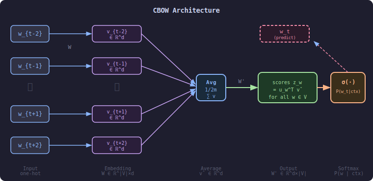
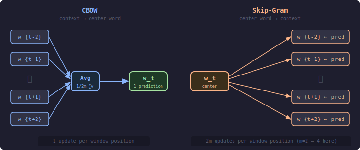

# CBOW (Continuous Bag of Words)

> **Core idea:** Given the surrounding context words in a window, predict the center word — the input embeddings learned during training become the word vectors.  
> **Why it matters:** CBOW is faster to train than Skip-Gram because it averages all context vectors into a single representation before making one prediction per window position, rather than making one prediction per context word.  
> **Key trade-off:** CBOW trains faster and works well on frequent words, but smooths over individual context signals — Skip-Gram handles rare words better.

---

## 1. Background and Motivation

### 1.1 The Word2Vec Family

CBOW is one of the two architectures introduced in **Word2Vec** (Mikolov et al., 2013):

| Architecture | Direction | Typical strength |
|---|---|---|
| **CBOW** | Context words → Center word | Frequent words, large corpora, fast training |
| **Skip-Gram** | Center word → Context words | Rare words, smaller data, richer signals |

Both learn the same kind of output — dense word embeddings — but from opposite prediction directions.

### 1.2 Distributional Hypothesis

Both architectures are grounded in the **distributional hypothesis**:

> *"A word is characterized by the company it keeps."* — Firth, 1957

CBOW exploits this by inverting the direction: if you can reconstruct a word from its neighbors, then the neighbors' vectors must carry enough information to encode meaning.

---

## 2. Model Overview

### 2.1 Task Definition

For each position $t$ in a corpus of $T$ tokens, CBOW uses the $2m$ surrounding words in a window of size $m$ as input:

$$
\text{Context}(t) = \{w_{t-m},\; \dots,\; w_{t-1},\; w_{t+1},\; \dots,\; w_{t+m}\}
$$

and predicts the **center word** $w_t$.

The model is trained to maximize the probability of the center word given its context, across the entire corpus:

$$
\mathcal{L} = \frac{1}{T} \sum_{t=1}^{T} \log P\!\left(w_t \mid w_{t-m}, \dots, w_{t-1}, w_{t+1}, \dots, w_{t+m}\right)
$$

### 2.2 Architecture

CBOW is a shallow neural network with three layers:

1. **Input layer** — $2m$ one-hot vectors, each of dimension $|V|$.
2. **Embedding (projection) layer** — each one-hot vector is mapped to a $d$-dimensional dense vector via weight matrix $\mathbf{W} \in \mathbb{R}^{|V| \times d}$; all $2m$ vectors are **averaged** into a single context vector $\hat{\mathbf{v}}$.
3. **Output layer** — $\hat{\mathbf{v}}$ is projected through weight matrix $\mathbf{W}' \in \mathbb{R}^{d \times |V|}$ and normalized with softmax to produce a probability distribution over the vocabulary.

---

## 3. Forward Pass

### 3.1 Input Encoding

Each context word $w_{t+j}$ (where $j \ne 0,\; |j| \le m$) is represented as a one-hot vector $\mathbf{x}^{(j)} \in \{0,1\}^{|V|}$.

### 3.2 Embedding Lookup and Averaging

Looking up each context word in the embedding matrix $\mathbf{W}$ selects its row vector:

$$
\mathbf{v}_{w_{t+j}} = \mathbf{W}^\top \mathbf{x}^{(j)} \in \mathbb{R}^d
$$

The $2m$ context embeddings are averaged to form the **context representation**:

$$
\hat{\mathbf{v}} = \frac{1}{2m} \sum_{\substack{-m \le j \le m \\ j \ne 0}} \mathbf{v}_{w_{t+j}}
$$

### 3.3 Output Score and Softmax

Each word $w \in V$ has an **output embedding** $\mathbf{u}_w$ (a row of $\mathbf{W}'$). The score for word $w$ is its dot product with the context vector:

$$
z_w = \mathbf{u}_w^\top \hat{\mathbf{v}}
$$

Applying softmax converts the scores into a probability distribution:

$$
P(w_t = w \mid \text{Context}(t)) = \frac{\exp(z_w)}{\displaystyle\sum_{w' \in V} \exp(z_{w'})}
$$

---

## 4. Worked Example

A small end-to-end walkthrough with a toy vocabulary and 2-dimensional embeddings.

### 4.1 Setup

**Vocabulary** ($|V| = 5$, indexed 0–4):

| Index | Word |
|---|---|
| 0 | the |
| 1 | cat |
| 2 | sat |
| 3 | on |
| 4 | mat |

**Sentence:** `the cat sat on mat`  
**Target position:** $t = 2$ → center word = **"sat"** (index 2)  
**Window size:** $m = 1$ → context = {**"cat"** (1), **"on"** (3)}

**Embedding dimension:** $d = 2$

**Input embedding matrix $\mathbf{W} \in \mathbb{R}^{5 \times 2}$** (random initialization):

$$
\mathbf{W} = \begin{pmatrix}
0.1 & 0.2 \\  % the
0.3 & 0.5 \\  % cat
0.6 & 0.1 \\  % sat
0.4 & 0.8 \\  % on
0.2 & 0.3     % mat
\end{pmatrix}
$$

**Output embedding matrix $\mathbf{W}' \in \mathbb{R}^{2 \times 5}$** (each column is $\mathbf{u}_w$):

$$
\mathbf{W}' = \begin{pmatrix}
0.1 & 0.2 & 0.5 & 0.3 & 0.1 \\
0.4 & 0.1 & 0.6 & 0.2 & 0.3
\end{pmatrix}
$$

---

### 4.2 Step 1 — Embedding Lookup

Look up each context word's row in $\mathbf{W}$:

$$
\mathbf{v}_{\text{cat}} = \mathbf{W}[1] = \begin{pmatrix} 0.3 \\ 0.5 \end{pmatrix}, \qquad
\mathbf{v}_{\text{on}}  = \mathbf{W}[3] = \begin{pmatrix} 0.4 \\ 0.8 \end{pmatrix}
$$

---

### 4.3 Step 2 — Average Pooling

With $2m = 2$ context words:

$$
\hat{\mathbf{v}} = \frac{1}{2}\left(\mathbf{v}_{\text{cat}} + \mathbf{v}_{\text{on}}\right)
= \frac{1}{2}\begin{pmatrix} 0.3 + 0.4 \\ 0.5 + 0.8 \end{pmatrix}
= \begin{pmatrix} 0.35 \\ 0.65 \end{pmatrix}
$$

---

### 4.4 Step 3 — Output Scores

Compute $z_w = \mathbf{u}_w^\top \hat{\mathbf{v}}$ for each word by multiplying each column of $\mathbf{W}'$ with $\hat{\mathbf{v}}$:

| Word | $\mathbf{u}_w^\top$ | $z_w = \mathbf{u}_w^\top \hat{\mathbf{v}}$ |
|---|---|---|
| the  | $(0.1,\ 0.4)$ | $0.1 \times 0.35 + 0.4 \times 0.65 = 0.035 + 0.260 = \mathbf{0.295}$ |
| cat  | $(0.2,\ 0.1)$ | $0.2 \times 0.35 + 0.1 \times 0.65 = 0.070 + 0.065 = \mathbf{0.135}$ |
| sat  | $(0.5,\ 0.6)$ | $0.5 \times 0.35 + 0.6 \times 0.65 = 0.175 + 0.390 = \mathbf{0.565}$ |
| on   | $(0.3,\ 0.2)$ | $0.3 \times 0.35 + 0.2 \times 0.65 = 0.105 + 0.130 = \mathbf{0.235}$ |
| mat  | $(0.1,\ 0.3)$ | $0.1 \times 0.35 + 0.3 \times 0.65 = 0.035 + 0.195 = \mathbf{0.230}$ |

---

### 4.5 Step 4 — Softmax

Exponentiate the scores:

$$
e^{0.295} \approx 1.343, \quad
e^{0.135} \approx 1.145, \quad
e^{0.565} \approx 1.759, \quad
e^{0.235} \approx 1.265, \quad
e^{0.230} \approx 1.259
$$

$$
Z = 1.343 + 1.145 + 1.759 + 1.265 + 1.259 = 6.771
$$

$$
P(\cdot \mid \text{ctx}) = \left(\frac{1.343}{6.771},\ \frac{1.145}{6.771},\ \frac{1.759}{6.771},\ \frac{1.265}{6.771},\ \frac{1.259}{6.771}\right)
\approx (0.198,\ 0.169,\ \mathbf{0.260},\ 0.187,\ 0.186)
$$

The model assigns the highest probability **0.260** to "sat" — the correct center word — even with random initialization.

---

### 4.6 Step 5 — Loss and Error Signal

The cross-entropy loss is:

$$
J = -\log P(\text{sat} \mid \text{ctx}) = -\log(0.260) \approx 1.347
$$

The prediction error vector $(\hat{\mathbf{y}} - \mathbf{y})$ for a gradient step:

| Word | $\hat{y}_w$ | $y_w$ | $\hat{y}_w - y_w$ |
|---|---|---|---|
| the  | 0.198 | 0 | +0.198 |
| cat  | 0.169 | 0 | +0.169 |
| **sat**  | **0.260** | **1** | **−0.740** |
| on   | 0.187 | 0 | +0.187 |
| mat  | 0.186 | 0 | +0.186 |

The negative error on "sat" pushes its output vector $\mathbf{u}_{\text{sat}}$ closer to $\hat{\mathbf{v}}$; the positive errors on all other words push their output vectors away. After backpropagation, the same signal is divided by $2m = 2$ and used to update $\mathbf{v}_{\text{cat}}$ and $\mathbf{v}_{\text{on}}$ in $\mathbf{W}$.

---

## 5. Training Objective and Gradients

### 5.1 Cross-Entropy Loss

For a single training instance, the loss is the negative log-probability of the true center word $w_t$:

$$
J = -\log P(w_t \mid \text{Context}(t)) = -z_{w_t} + \log \sum_{w' \in V} \exp(z_{w'})
$$

### 5.2 Gradient w.r.t. Output Embeddings

Let $\hat{y}_w = P(w \mid \text{Context}(t))$ be the predicted probability and $y_w = \mathbf{1}[w = w_t]$ be the indicator for the true word. Then:

$$
\frac{\partial J}{\partial \mathbf{u}_w} = \left(\hat{y}_w - y_w\right) \hat{\mathbf{v}}
$$

### 5.3 Gradient w.r.t. Context Embeddings

The error signal that flows back into the input embedding layer is the weighted sum of all output vectors:

$$
\frac{\partial J}{\partial \hat{\mathbf{v}}} = \sum_{w \in V} \left(\hat{y}_w - y_w\right) \mathbf{u}_w = \mathbf{W}'^{\,\top} (\hat{\mathbf{y}} - \mathbf{y})
$$

This gradient is distributed equally to each of the $2m$ context word embeddings:

$$
\frac{\partial J}{\partial \mathbf{v}_{w_{t+j}}} = \frac{1}{2m} \cdot \frac{\partial J}{\partial \hat{\mathbf{v}}}
$$

---

## 6. Softmax Bottleneck and Approximations

Full softmax requires computing $\exp(z_w)$ for every word in $V$ at every step — the same $O(|V|)$ bottleneck as in Skip-Gram. The same two approximations apply:

| Approximation | Idea | Cost | Valid distribution? |
|---|---|---|---|
| **Hierarchical Softmax** | Replace flat softmax with a binary tree; predict path decisions | $O(\log \vert V \vert)$ | Yes |
| **Negative Sampling** | Binary classifier: real center word vs. $K$ noise words | $O(K)$ | No (approximate) |

In practice, Negative Sampling with $K = 5$–$20$ is the standard choice for large-scale training.

---

## 7. CBOW vs. Skip-Gram

| Aspect | CBOW | Skip-Gram |
|---|---|---|
| Prediction direction | Context → Center | Center → Context |
| Training pairs per window | 1 (one averaged prediction) | $2m$ (one per context word) |
| Gradient updates per step | Low — average smooths signal | High — each context word is a separate update |
| Frequent-word quality | ✓ Better (more training signal per word) | ✓ Comparable |
| Rare-word quality | ✗ Weaker (averaged away) | ✓ Better |
| Training speed | Faster | Slower |
| Common use | Large corpora, speed-sensitive | Rare words, semantic tasks |

### Why CBOW is Faster

Skip-Gram generates $2m$ training pairs per window position. CBOW generates only **one** — the average of all $2m$ context vectors is computed once, and a single prediction is made. This reduces the number of softmax/gradient computations by a factor of $2m$.

---

## 8. Two Embedding Matrices

CBOW learns two separate parameter matrices:

| Matrix | Dimension | Role | What is kept |
|---|---|---|---|
| $\mathbf{W}$ | $\vert V \vert \times d$ | Input (context) embeddings | Usually used as final embeddings |
| $\mathbf{W}'$ | $d \times \vert V \vert$ | Output embeddings | Often discarded |

After training, the rows of $\mathbf{W}$ serve as the word embeddings. Some implementations average $\mathbf{W}$ and $\mathbf{W}'^{\,\top}$ for potentially richer representations.

---

## 9. Properties of Learned Embeddings

Just like Skip-Gram, CBOW embeddings exhibit the famous **linear analogy** structure:

$$
\mathbf{v}_{\text{king}} - \mathbf{v}_{\text{man}} + \mathbf{v}_{\text{woman}} \approx \mathbf{v}_{\text{queen}}
$$

This arises because the averaging objective encourages each word's vector to sit near the centroid of the vectors of all words that appear in its typical contexts.

---

## 10. References

- Mikolov, T., Chen, K., Corrado, G., & Dean, J. (2013). **Efficient Estimation of Word Representations in Vector Space**. *ICLR Workshop*. arXiv:1301.3781.
- Mikolov, T., Sutskever, I., Chen, K., Corrado, G., & Dean, J. (2013). **Distributed Representations of Words and Phrases and their Compositionality**. *NeurIPS*.
- Goldberg, Y., & Levy, O. (2014). **word2vec Explained**. arXiv:1402.3722.
