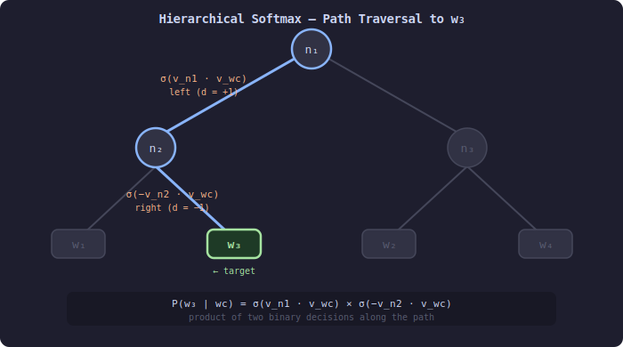
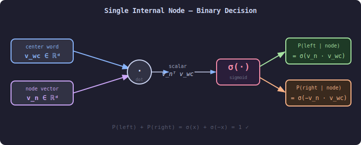
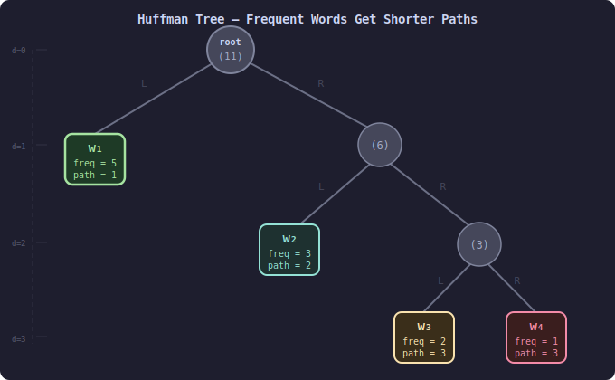

# Hierarchical Softmax

> **Core idea:** Replace the flat softmax over the entire vocabulary with a binary tree where each leaf is a word — computing the probability of a word becomes a sequence of binary decisions along a root-to-leaf path.  
> **Why it matters:** Reduces the per-step cost from $O(|V|)$ to $O(\log |V|)$, making training on large vocabularies feasible without approximation error in the probability model.  
> **Key insight:** Every word can be uniquely identified by the sequence of left/right turns taken from the root to its leaf — each turn is a sigmoid binary classification.

---

## 0. From Softmax to Hierarchical Softmax

Standard softmax guarantees two things: every output is in $[0, 1]$, and all outputs sum to exactly $1$. It achieves this by dividing each exponentiated score by the sum of **all** exponentiated scores:

$$
P(w_k) = \frac{e^{s_k}}{\sum_{j=1}^{|V|} e^{s_j}}
$$

The normalisation is the whole point — and the whole problem. Every forward and backward pass must touch all $|V|$ terms in the denominator.

Hierarchical Softmax preserves **both guarantees** but satisfies them through a completely different mechanism: a binary tree instead of a single global sum.

Think of the vocabulary $V$ as a pie. Standard softmax cuts the entire pie at once into $|V|$ slices using one global division. Hierarchical Softmax cuts the pie recursively: at the root it splits the whole probability mass into two halves using a single sigmoid; each half is then independently split again at the next level, and so on until every leaf (word) holds exactly its share. Because each split uses $\sigma(x) + \sigma(-x) = 1$, no probability is created or destroyed at any level. The total mass reaching all leaves is still $1$, and every individual leaf holds a value in $(0, 1)$ — so the two softmax guarantees hold without ever computing a sum over $|V|$ items.

The key conceptual shift is:

> **Softmax asks** *"how likely is this word compared to every other word simultaneously?"*  
> **Hierarchical Softmax asks** *"at each fork on the path to this word, should I go left or right?"*

The answers to $\log_2 |V|$ binary questions multiply together to give the final probability. This is valid because the binary tree imposes a **factorisation** of the joint probability: every possible path through the tree is mutually exclusive (no two words share a leaf), and the paths are collectively exhaustive (every word has exactly one leaf). Those two properties — mutual exclusivity and collective exhaustiveness — are precisely what any valid probability distribution requires.

---

## 1. The Problem: Softmax Is Expensive

### 1.1 Full Softmax Recap

In Skip-Gram, the probability of observing context word $w_o$ given center word $w_c$ is:

$$
P(w_o \mid w_c) = \frac{\exp\!\left(\mathbf{u}_{w_o}^\top \mathbf{v}_{w_c}\right)}{\displaystyle\sum_{w \in V} \exp\!\left(\mathbf{u}_w^\top \mathbf{v}_{w_c}\right)}
$$

The denominator — the **partition function** $Z$ — requires iterating over every word in the vocabulary at every gradient step.

### 1.2 Cost Analysis

| Quantity | Value |
|---|---|
| Vocabulary size $\vert V \vert$ | $\sim 10^5$ |
| Dot products per step (full softmax) | $\vert V \vert \approx 100{,}000$ |
| Dot products per step (Hierarchical Softmax) | $\log_2\vert V \vert \approx 17$ |
| Approximate speedup | $\sim 6{,}000\times$ |

The key difference from Negative Sampling: Hierarchical Softmax defines a **valid probability distribution** over all words and computes exact gradients — it trades computation time for tree-traversal overhead, with no sampling noise.

---

## 2. The Binary Tree Structure

### 2.1 Encoding Words as Paths

Hierarchical Softmax places every word $w \in V$ at a distinct **leaf node** of a binary tree. Each **internal node** $n$ holds a parameter vector $\mathbf{v}_n \in \mathbb{R}^d$ (the node's embedding). The root is at depth 0; a vocabulary of $|V|$ words requires $|V| - 1$ internal nodes.

For a tree of depth $L(w)$ rooted at $n_1$, the path from root to the leaf of word $w$ is:

$$
n_1,\; n_2,\; \dots,\; n_{L(w)} = w
$$

At every internal node $n_i$ along the path, the model makes a **binary left/right decision**.

### 2.2 Direction Encoding

Define the direction indicator $d_i^w$ for the $i$-th node on the path to $w$:

$$
d_i^w =
\begin{cases}
+1 & \text{if the path goes \textbf{left} at } n_i \\
-1 & \text{if the path goes \textbf{right} at } n_i
\end{cases}
$$

The exact sign convention is an implementation choice; what matters is that left and right are distinguishable and the probabilities at each node sum to 1.

### 2.3 Visualizing the Path

*To reach $w_3$: root → left (d=+1) → right (d=−1). Two binary decisions, two sigmoid evaluations. Dim nodes and edges are not on the path.*

---

## 3. Computing the Probability

### 3.1 Per-Node Sigmoid

At each internal node $n_i$ on the path to $w$, the probability of going **left** is:

$$
P(\text{left} \mid n_i,\; w_c) = \sigma\!\left(\mathbf{v}_{n_i}^\top \mathbf{v}_{w_c}\right)
$$

where $\sigma(x) = \frac{1}{1+e^{-x}}$ is the logistic sigmoid and $\mathbf{v}_{w_c}$ is the center-word embedding.

Going right is simply the complementary probability:

$$
P(\text{right} \mid n_i,\; w_c) = 1 - \sigma\!\left(\mathbf{v}_{n_i}^\top \mathbf{v}_{w_c}\right) = \sigma\!\left(-\mathbf{v}_{n_i}^\top \mathbf{v}_{w_c}\right)
$$

### 3.2 Word Probability as a Path Product

The probability of word $w_o$ is the **product of all binary decisions** along its path:

$$
\boxed{P(w_o \mid w_c) = \prod_{i=1}^{L(w_o)-1} \sigma\!\left(d_i^{w_o} \cdot \mathbf{v}_{n_i}^\top \mathbf{v}_{w_c}\right)}
$$

where $d_i^{w_o} = +1$ if the path goes left at $n_i$, and $-1$ if it goes right.

### 3.3 Why This Is a Valid Distribution

For any binary tree where each internal node splits probability with $\sigma$ and $1-\sigma$, the probabilities of all leaves sum exactly to 1:

$$
\sum_{w \in V} P(w \mid w_c) = 1
$$

*Proof sketch:* At every node, the two child sub-trees receive probability $\sigma(\cdot)$ and $1 - \sigma(\cdot)$ respectively. By induction from the root, the total mass reaching all leaves is $1 \times 1 = 1$.

---

## 4. Training Objective

### 4.1 Log-Likelihood for One Training Pair

For center word $w_c$ and positive context $w_o$, the log-probability is:

$$
\log P(w_o \mid w_c) = \sum_{i=1}^{L(w_o)-1} \log \sigma\!\left(d_i^{w_o} \cdot \mathbf{v}_{n_i}^\top \mathbf{v}_{w_c}\right)
$$

The full training objective over a corpus of $T$ tokens with window size $m$ is:

$$
\mathcal{L} = \frac{1}{T} \sum_{t=1}^{T} \sum_{\substack{-m \le j \le m \\ j \ne 0}} \log P(w_{t+j} \mid w_t)
$$

### 4.2 Gradient Updates

For a single path node $n_i$ with direction $d_i$, let $e_i = d_i \cdot \mathbf{v}_{n_i}^\top \mathbf{v}_{w_c}$.

**Gradient w.r.t. node vector $\mathbf{v}_{n_i}$:**

$$
\frac{\partial \log P(w_o \mid w_c)}{\partial \mathbf{v}_{n_i}} = \left(1 - \sigma(e_i)\right) d_i \cdot \mathbf{v}_{w_c}
$$

**Gradient w.r.t. center-word vector $\mathbf{v}_{w_c}$:**

$$
\frac{\partial \log P(w_o \mid w_c)}{\partial \mathbf{v}_{w_c}} = \sum_{i=1}^{L(w_o)-1} \left(1 - \sigma(e_i)\right) d_i \cdot \mathbf{v}_{n_i}
$$

Only $L(w_o) - 1$ node vectors need to be updated per training step — compared to $|V|$ vectors in full softmax.

---

## 5. Huffman Tree: Optimal Node Assignment

### 5.1 Motivation

The per-step cost is $O(L(w_o))$, the depth of word $w_o$'s leaf. To minimize the **expected path length** over the training corpus, we want frequent words to have short paths and rare words to accept longer paths.

### 5.2 Huffman Encoding

A **Huffman tree** is a binary tree built greedily to minimize the weighted path length:

$$
\text{Minimize} \quad \sum_{w \in V} f(w) \cdot L(w)
$$

where $f(w)$ is the frequency (unigram count) of word $w$.

**Construction algorithm:**

1. Create a leaf node for every word with weight $f(w)$.
2. Repeatedly merge the two nodes with the smallest weights into a parent node whose weight is their sum.
3. Repeat until a single root remains.

The resulting tree guarantees:

$$
\mathbb{E}[L(w)] = \sum_{w \in V} \frac{f(w)}{\sum_{w'} f(w')} \cdot L(w) \le \log_2 |V| + 1
$$

### 5.3 Worked Example

Given vocabulary frequencies: $\{w_1: 5,\; w_2: 3,\; w_3: 2,\; w_4: 1\}$

| Step | Action | Nodes remaining |
|---|---|---|
| 0 | Initial | $\{5, 3, 2, 1\}$ |
| 1 | Merge 1+2 → 3 | $\{5, 3, 3\}$ |
| 2 | Merge 3+3 → 6 | $\{5, 6\}$ |
| 3 | Merge 5+6 → 11 | $\{11\}$ = root |

Result: $w_1$ has depth 1, $w_2$ depth 2, $w_3$ and $w_4$ depth 3.

---

## 6. Complexity and Properties

### 6.1 Time Complexity

| Operation | Full Softmax | Hierarchical Softmax |
|---|---|---|
| Forward pass | $O(\vert V \vert)$ | $O(\log \vert V \vert)$ |
| Backward pass | $O(\vert V \vert \cdot d)$ | $O(\log \vert V \vert \cdot d)$ |
| Parameters updated per step | $\vert V \vert$ vectors | $\log \vert V \vert$ vectors |

With a Huffman tree and $|V| = 10^5$: roughly **6,000× fewer** operations per step.

### 6.2 Space Complexity

Each internal node requires a $d$-dimensional vector. A binary tree over $|V|$ leaves has $|V| - 1$ internal nodes, so the parameter count is effectively doubled from $|V| \cdot d$ to $2(|V|-1) \cdot d$ — negligible overhead in practice.

### 6.3 Properties Summary

| Property | Hierarchical Softmax | Negative Sampling |
|---|---|---|
| Probability model | Exact, valid distribution | Approximate (unnormalized) |
| Per-step operations | $O(\log \vert V \vert)$ | $O(K)$, $K \ll \log \vert V \vert$ typical |
| Rare-word quality | Better (shorter path via Huffman) | Depends on noise distribution |
| Implementation complexity | Higher (tree construction) | Lower |
| Common use | Smaller corpora, need exact probabilities | Large-scale training |

---

## 7. Intuition Summary

Standard softmax is like asking an exam with $|V|$ multiple-choice options — you must score every option before picking the best. Hierarchical Softmax is like a binary elimination tournament: at each round you only decide *left or right*, and you reach the answer in $\log_2 |V|$ rounds instead of $|V|$ comparisons.

The Huffman tree ensures the most popular words (frequent tokens) are in the top brackets and get eliminated in fewer rounds, while rare words descend deeper into the bracket.

---

## 8. References

- Morin, F., & Bengio, Y. (2005). **Hierarchical Probabilistic Neural Network Language Model**. *AISTATS*.
- Mikolov, T., et al. (2013). **Distributed Representations of Words and Phrases and their Compositionality**. *NeurIPS*.
- Goldberg, Y., & Levy, O. (2014). **word2vec Explained: Deriving Mikolov et al.'s Negative-Sampling Word-Embedding Method**. *arXiv:1402.3722*.
